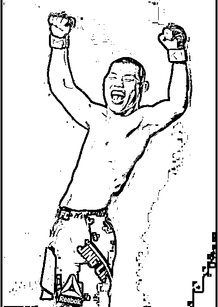
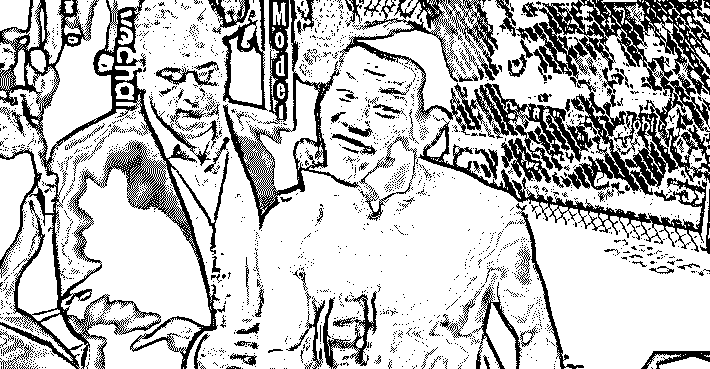

# 有黑幕？格斗选手李景亮跨量级迎战，优势下竟被判输！连 UFC 总裁都认为是李赢！

> 原文：[`mp.weixin.qq.com/s?__biz=MzIyMDYwMTk0Mw==&mid=2247543761&idx=4&sn=60a601805dcbc0fcf162916db06e284d&chksm=97cbe0e9a0bc69ff78632537437fde3e0ac6f7f82fbf766728eba5b469eab5a6f24586a78f29&scene=27#wechat_redirect`](http://mp.weixin.qq.com/s?__biz=MzIyMDYwMTk0Mw==&mid=2247543761&idx=4&sn=60a601805dcbc0fcf162916db06e284d&chksm=97cbe0e9a0bc69ff78632537437fde3e0ac6f7f82fbf766728eba5b469eab5a6f24586a78f29&scene=27#wechat_redirect)

平时有关注格斗比赛的朋友

肯定对**李景亮**这个名字不陌生吧

作为继张铁泉、居马别克·吐尔逊后

**第三位进军 UFC 的中国人**

李景亮被公认为是中国 MMA 次中量级

新一代的领军人物

立下了里程碑式的贡献

因此，9 月 11 日 10 点的这场 UFC279 的比赛

才格外受人瞩目 

李景亮将跨量级对战比自己**重 8.5 磅**的对手

丹尼尔·罗德里格兹

虽然面对的是大到足以致命的体重差距

但李景亮依旧毫无畏惧地接下了这次比赛

并且也在跨量级的情况下

交给全世界观众一个满意的答卷

多次在比赛中取得优势

然而，就在全世界的人都以为

是李景亮赢下了这场艰难的比赛时

裁判经过分歧判定罗德里格兹获胜

一时，在现场看比赛的观众炸了

国内外的拳迷炸了

就连 UFC 总裁也炸了

李景亮判定告负，视频 30 秒不到

[`mp.weixin.qq.com/mp/readtemplate?t=pages/video_player_tmpl&action=mpvideo&auto=0&vid=wxv_2573320322268217345`](https://mp.weixin.qq.com/mp/readtemplate?t=pages/video_player_tmpl&action=mpvideo&auto=0&vid=wxv_2573320322268217345)

视频来自：咪咕体育

**关于 WWA 和 UFC    **

不了解格斗的朋友

肯定对这些个名词相当陌生

这边简单为大家介绍一下

**MMA**就是 Mixed martial arts 的缩写

翻译过来就是**综合格斗**

是一种规格规则极为开放的竞技格斗运动

**它允许了不同武术流派的练习者**

**可以在统一的规则下同场竞技**

而**UFC**

就是在 MMA 下诞生的职业综合格斗赛事

中文全名为**终极格斗冠军赛**

是世界上最顶级和规模最庞大的

职业综合格斗赛事

最为出名的就是它标志性的八角笼擂台

作为世界最顶级的赛事

UFC 给出的排名的含金量也不必多说

选手们努力比赛

也是为了取得更好的名次

UFC278 赛后，截止 8 月 23 日

在次中量级选手排名上

李景亮排在了第 14 位

**关于 UFC279 的这场比赛  **

其实关于 9 月 11 号李景亮的这场比赛

不止是赛后的判罚争议

在比赛之前也存在着不少的瓜

不少人可能会好奇

丹尼尔·罗德里格兹差李景亮这么多磅

罗德里格兹从量级上本来就占据优势

为什么要安排这两人比赛呢？

其实，李景亮一开始的对手

也确实不是罗德里格兹

在原定的赛程安排中

李景亮的对手原先是“夜魔”托尼·弗格森

而罗德里格兹原本是在 180 磅的协议级别

迎战美国新星凯文·霍兰德

在 9 号的赛前称重仪式上

却发现奇马耶夫的体重为 178.5 磅

超出次中量级限制 7.5 磅

导致比赛无法按计划进行

UFC 官方不得不临时对阵容进行调整

最后变成了由马奇耶夫对战霍兰德

迪亚兹对战弗格森 

而李景亮的对手，则被迫变成了

原本在 180 磅协议级别进行比赛、

赛前称重为 179 磅的罗德里格兹

而李景亮称重为 170.5 磅

两人足足相差了 8.5 磅（约合 3.86 公斤）

而在格斗比赛中

体重直接影响了抗击打和出拳力度

这点体重差异

可以说李景亮在赛前就处于劣势了

纵使是国内支持李景亮的拳迷

也对李景亮跨量级反杀不抱太大的希望

纷纷表示，尽力就好，不要伤到身体

然而，对待 UFC 不公平安排

李景亮自己却没有多大的怨言

反而痛痛快快地接下了比赛

并霸气十足地表示：

**“干就完了！”**

而在当日的比赛中

李景亮也没有让任何人失望

打得相当漂亮

面对比自己重 8 磅的对手

状态极佳的李景亮丝毫不落下风

在比赛中多次取得优势

一场 20 分钟的比赛过后

无论是圈内人还是圈外人

在场的观众

甚至于李景亮与罗德里格兹自己

都认为是李景亮赢下了比赛

看看亮哥赛后灿烂自信的笑容

只是最后裁判的判定结果却让人大跌眼镜

全场比赛结束，裁判经过分歧判定

(28-29、28-29、29-28)

**李景亮负于丹尼尔·罗德里格兹**

这个结果出乎现场观众的预料

以至于当裁判举起罗德里格兹的手后

现场还响起了不小的嘘声

结果一出，在网上也掀起了波涛

不仅是国内拳迷纷纷为李景亮抱不平

就连国外拳迷也看不下去了

纷纷在 UFC 官方社交媒体的动态下留言

表示**李景亮被抢劫了**

有着 32.4 万粉丝的 MMA 账号 Freak mma

更是直接发文称是李景亮赢了

给各位简单科普一下

UFC 比赛胜利的判定

通常是由三个裁判进行打分

最后少数服从多数

值得一提的是，在这场比赛中

体育委员会的三位裁判

对这场比赛的看法分歧显著

也让这场比赛的最终判罚充满了争议

对手虽然赢得了比赛，但李景亮赢得了观众

就在昨日的三点半

就连 UFC 的总裁白大拿也在采访中表示

认为是李景亮赢得了比赛

判罚的争议这么大

李景亮本人却是非常乐观豁达大气

在这场比赛之后

他还安慰粉丝说没关系

视频 1 分钟不到

[`mp.weixin.qq.com/mp/readtemplate?t=pages/video_player_tmpl&action=mpvideo&auto=0&vid=wxv_2573324026996277250`](https://mp.weixin.qq.com/mp/readtemplate?t=pages/video_player_tmpl&action=mpvideo&auto=0&vid=wxv_2573324026996277250)

视频来自：李景亮

来源：脊梁 in 上海 SH

欢迎关注灰产圈社群服务号

