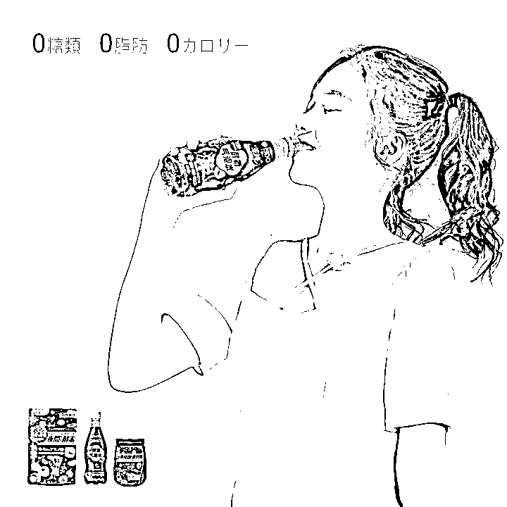
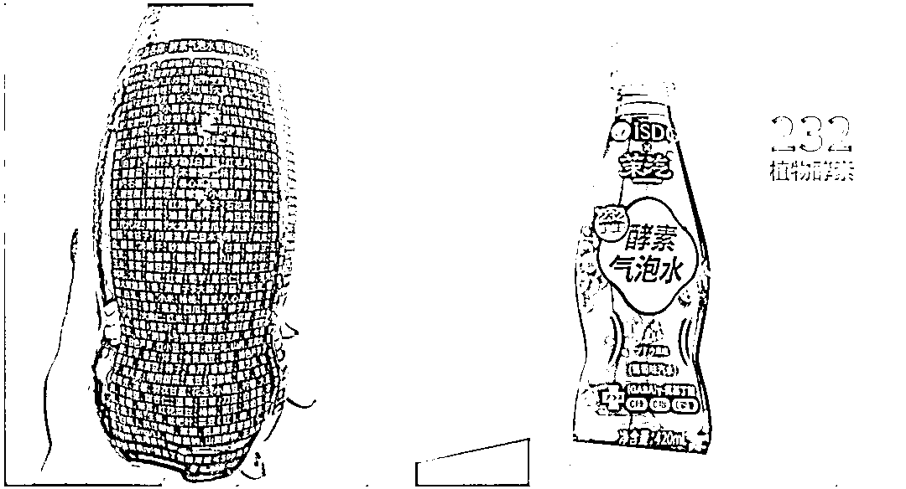
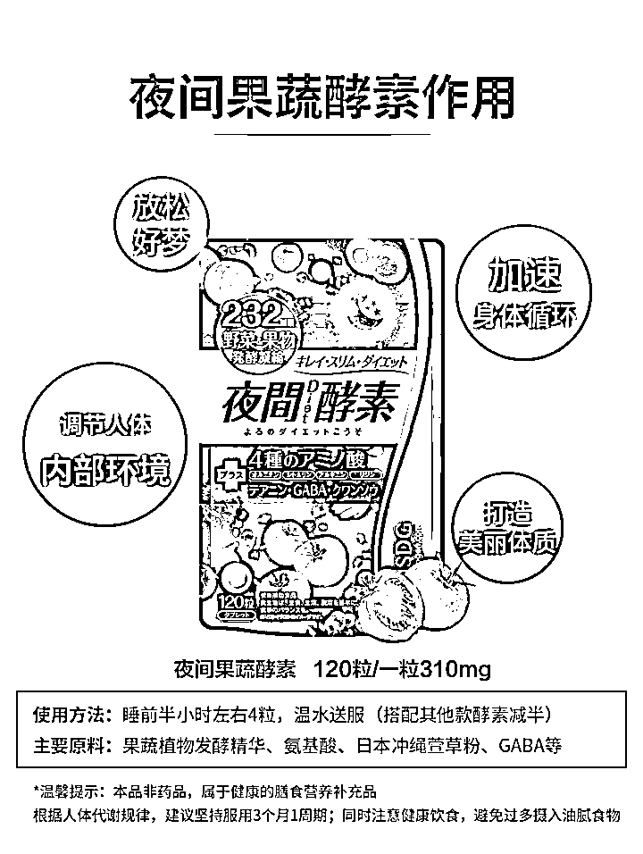
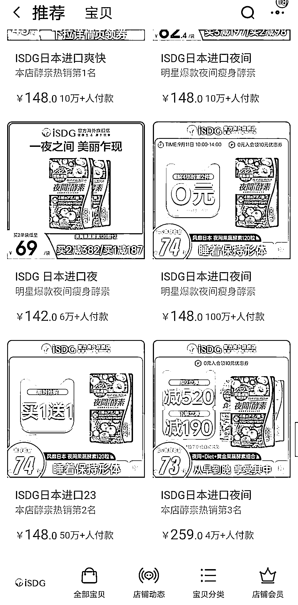
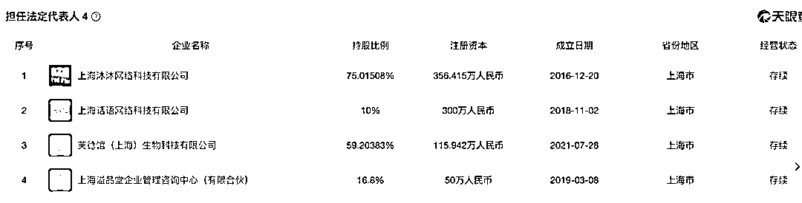
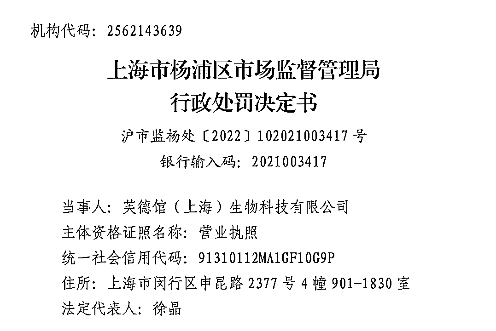

# 一瓶酵素饮料含 232 种植物配料？“妥妥的忽悠”

> 原文：[`mp.weixin.qq.com/s?__biz=MzIyMDYwMTk0Mw==&mid=2247543761&idx=5&sn=412145d9fabef592651893005eb1f163&chksm=97cbe0e9a0bc69ff50c012dd8499ab6c64ed3bbbe0edb23dac1780efe122e5d251c8dbb49ec2&scene=27#wechat_redirect`](http://mp.weixin.qq.com/s?__biz=MzIyMDYwMTk0Mw==&mid=2247543761&idx=5&sn=412145d9fabef592651893005eb1f163&chksm=97cbe0e9a0bc69ff50c012dd8499ab6c64ed3bbbe0edb23dac1780efe122e5d251c8dbb49ec2&scene=27#wechat_redirect)

近日，一款主打酵素的气泡水被明星吐槽标注有 200 多种配料，随后在网上引发热议。该款气泡水名为“ISDG✖茉汽 酵素气泡水葡萄味（汽水）”，宣传中称采用了日本 ISDG 品牌核心综合酵素粉，拥有“每晚入睡更轻松”“提升夜间能量的消耗”等功能。9 月 9 日，这款气泡水的出品公司一名工作人员向媒体表示，他们添加的是一种含有 232 种植物元素的酵素粉，并不是真的添加了 232 种植物。

茉汽酵素气泡水的产品详情页截图 

但口服酵素的作用被专家证伪，而茉汽酵素气泡水的“综合果蔬酵素粉”更是被营养专家认为是“忽悠和噱头”。值得注意的是，汽水背后公司芙德馆（上海）生物科技有限公司主业并非饮料，曾还因配料表标识问题被行政处罚。

**含 200+配料的酵素饮料**

**宣传可轻松入睡，提升夜间能量的消耗**

近日，演员冯雷发布了一段视频称，自己发现一款饮料的配料表上竟标注有 200 多种配料，配料表中有多种水果、蔬菜，甚至还有香葱、花椒、小茴香等。很快，该视频和饮料引起网友热议。

随后，这款气泡水出品公司回应，他们添加的是一种含有 232 种植物元素的酵素粉，并不是真的添加了 232 种植物。

茉汽酵素气泡水的产品详情页截图 

根据视频中的饮料包装信息，红星资本局搜索电商平台了解到，该款饮料为“ISDG✖茉汽 酵素气泡水葡萄味（汽水）”（以下简称“茉汽酵素气泡水”），配料表中的成分介绍占据了很大篇幅。瓶身正面明显标识有“酵素气泡水”“232 植物酵素”“GABA”“0 糖 0 脂 0 卡”，无一不将产品与酵素强关联。

该饮料在电商平台上价格为 15.9 元一瓶，不少都是临期产品，正常标价或许更贵，远超大部分气泡水 5 元一瓶的定价。

而在电商平台上，该产品的详情页介绍，产品里有日本进口 232 综合果蔬酵素粉，来自 ISDG 品牌核心综合酵素粉。

ISDG 为日本品牌，主要售卖以酵素为主的产品。从包装和宣传可以看出，茉汽酵素气泡水采用的是 ISDG 的夜间酵素。

据该夜间酵素产品介绍，其具有放松好梦、加速身体循环、提高基础代谢、调节人体内部环境、打造美丽体质等功效。一些销售茉汽酵素气泡水的网店也采用了类似的文案，宣传其可以让人每晚入睡更轻松、提升夜间能量的消耗。

**专家解读：**

**口服酵素无效**

**气泡水营养成分比瓶装饮用水还纯净**

酵素已不是个新鲜事物，常被商家宣传为有减肥功效。它究竟是什么？是否有具体的功效？

科信食品与健康信息交流中心科技传播部主任阮光锋曾在科普文章中表示，“酵素”是个日语词汇，在中文里就是“酶”。酶对人体健康有很大的作用，它能够催化人体内各种生化反应，以便进行新陈代谢，如食物的消化、体内能量代谢等。

ISDG 夜间酵素产品详情页截图 

但阮光锋此前也称，目前，市面上不少酵素产品和酶已经不是一回事。这些产品虽然都有“酵素”之称，但含有的酶其实极少，喝一公斤的“水果酵素”，获得的总蛋白质也是十分微量的，还不如吃一个中等大小的苹果。

江南大学罗玮副教授曾表示，酶的化学本质是蛋白质，口服蛋白质类物质会被人体降解成小分子氨基酸，酵素产品进入体内后，其酶的成分就被人体消化系统降解，失去其活性，不能起到其生物催化功能。

不过，他也认为，由于酵素产品是发酵的产物，有些产品中包含着益生菌以及众多微生物，在一定条件下，这些益生菌和微生物可以起到促进肠道蠕动的作用。酵素本身并不具有通便减肥的功能，即使酵素产品在减肥瘦身方面被证明有效，也并不是酵素在起作用，而是发酵产物中的益生菌、微生物以及其他产品添加物的功效。

口服酵素的作用已被专家证伪，而茉汽酵素气泡水的“综合果蔬酵素粉”更是被营养专家认为是“忽悠和噱头”。被认证为“南京医科大学公共卫生学院妇幼营养学教授”的用户“首席营养”发微博表示：“如果传言属实，‘232 植物酵素’‘0 糖 0 脂 0 能量’‘GABA y-氨基丁酸’、配料表中‘综合果蔬酵素粉’这一大类添加量为 5mg/L，这就是妥妥的忽悠和噱头，与以往的‘三精水’无异。配料表中‘综合果蔬酵素粉’这一大类添加量为 5mg/L，500 毫升的饮料也就 2.5 毫克。500 毫升纯净水里加入 2.5 毫克的食盐，都喝不出点味道。这个饮料里，除了那些三精水成分，所谓营养成分，比瓶装饮用水还纯净。”

**汽水背后公司主业并非饮料**

**曾因配料表标识问题被行政处罚**

茉汽酵素气泡水的商标拥有者及国内独家经销商是芙德馆（上海）生物科技有限公司（以下简称“芙徳馆生物”）此前曾向媒体表示，产品是含有酵素成分，但属于碳酸饮料类，不是药品，不含有调节人体的功效。他们还表示，酵素对于风味的影响也并不大。

值得注意的是，在 ISDG 海外旗舰店中，该夜间酵素产品显示有超过 100 万人付款。而茉汽酵素气泡水无论是 LOGO、海报还是介绍，都将自己与夜间酵素强关联。

ISDG 海外旗舰店截图 

利用酵素噱头将普通气泡水卖到 15 元以上，还吸引了一波酵素粉、爱尝鲜者前去购买，甚至登上热搜，芙徳馆生物的这一招让其在竞争白热化的气泡水市场有了名字。

有意思的是，芙德馆生物的主业并非饮料。天眼查显示，该公司成立于 2021 年, 位于上海市，是一家以从事科技推广和应用服务业为主的企业。

芙德馆生物的法定代表人、大股东、实际控制人、最终受益人为徐晶，还是上海沐沐网络科技有限公司（以下简称“沐沐科技”）的法定代表人。天眼查显示，沐沐科技是一家轻餐饮孵化平台，致力于提供轻餐饮领域的品牌策划、市场招商、供应链管理、生态搭建等服务。

茉汽酵素气泡水是他们从郑州爱诗迪生物科技有限公司（以下简称“郑州爱诗迪”）采购而来。郑州爱诗迪监事陈金旗是河南中横国际贸易有限公司的法定代表人，后者拥有“ISDG”啤酒饮料类的商标。至于其是否是 ISDG 公司的国内经销商，与 ISDG 的关系如何，9 月 11 日，河南中横国际贸易有限公司方面表示暂无法回应。

今年 8 月，芙德馆生物还因茉汽酵素气泡水的生产经营标签、说明书不符合法律法规而被行政处罚两万元。

图据国家企业信用信息公示系统 

具体事由是该产品配料表中含有新食品原料成分：黑果腺肋花楸果。使用该原料需在标签及说明书中标注“婴幼儿、孕妇及哺乳期妇女不宜食用”信息。当事人销售的 20210919JZ 批次该产品未依法标注上述信息。

来源：红星资本局 记者：俞瑶 张露曦 责编：邓旆光 编辑：张莉

欢迎关注灰产圈社群服务号

