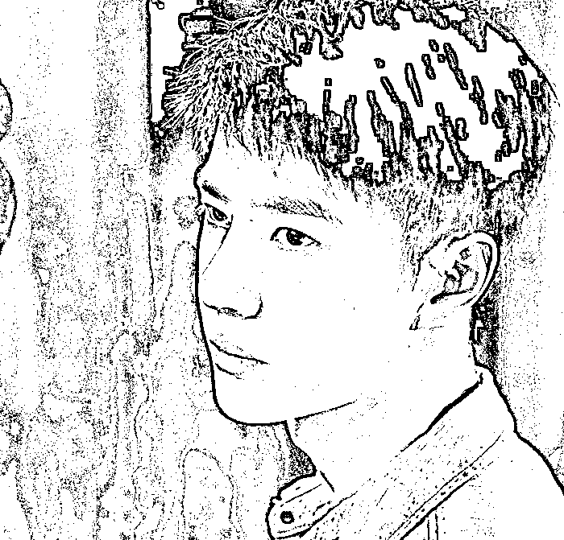
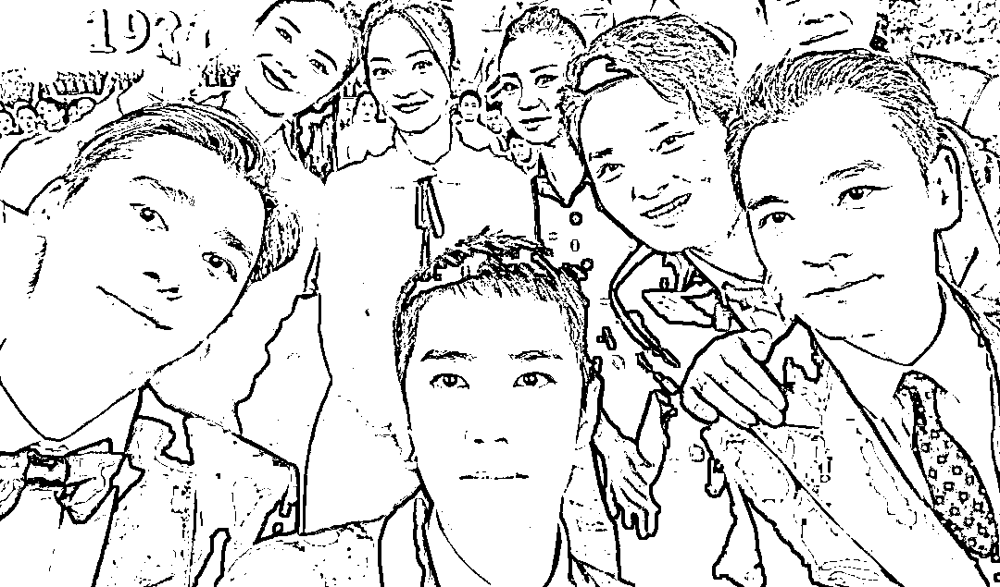
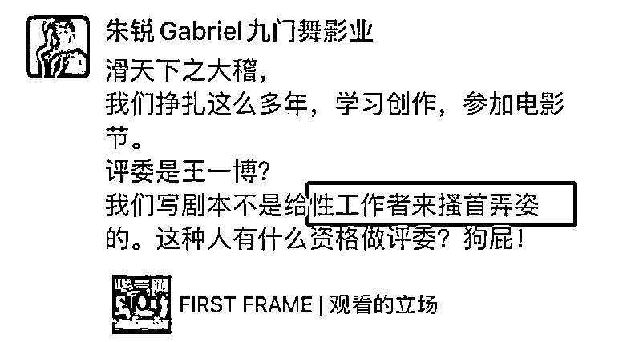
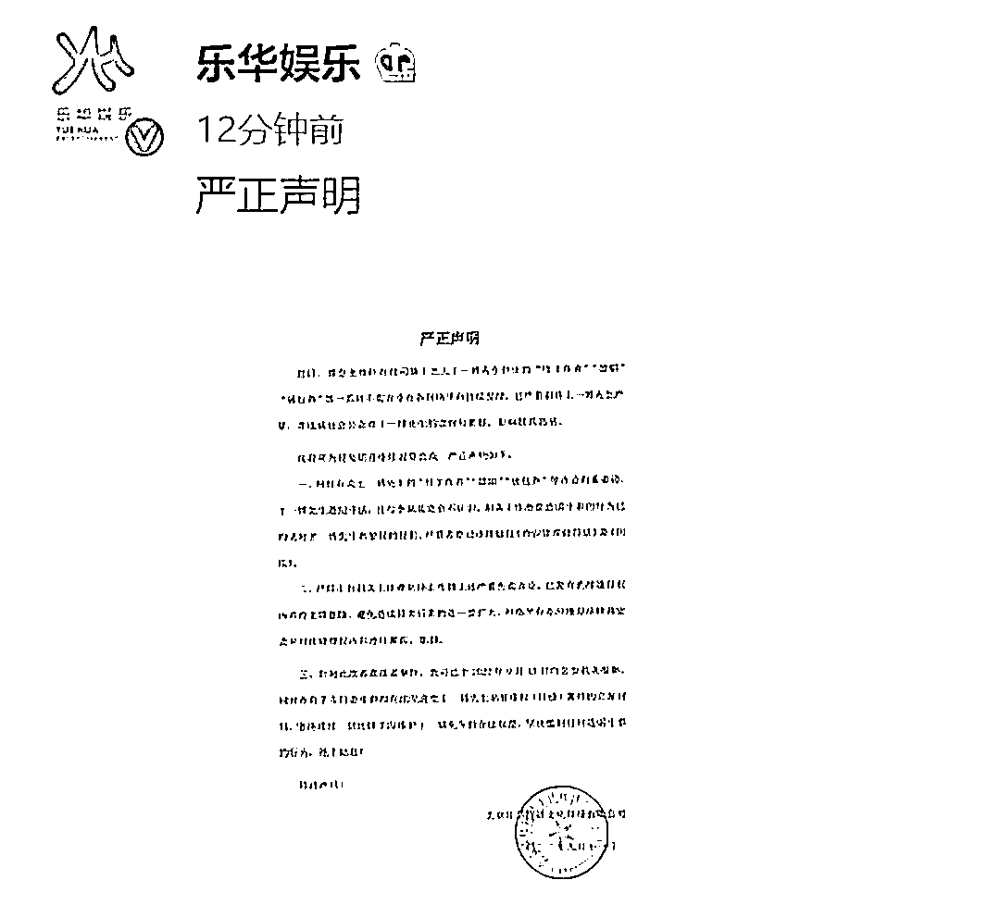
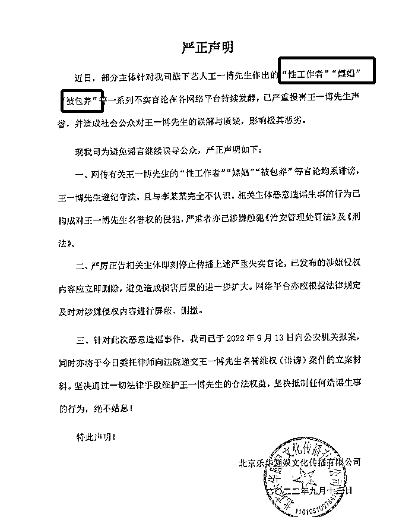
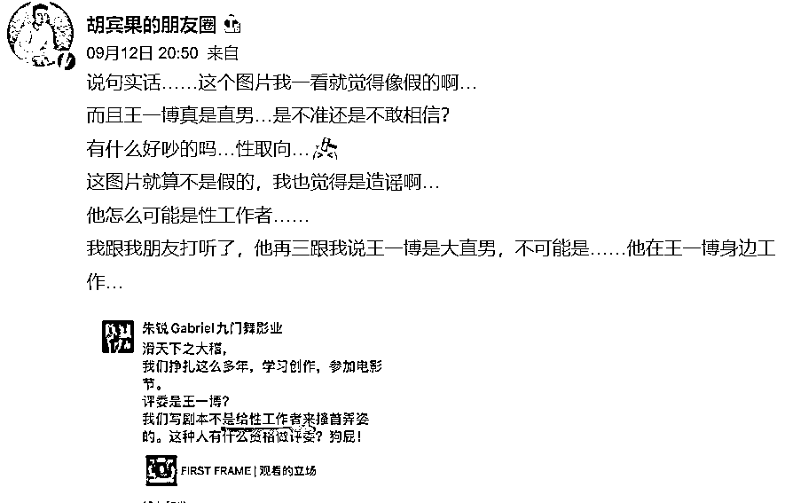

# 王一博公开否认被包养！从未参与嫖娼事件，自称完全不认识李易峰

> 原文：[`mp.weixin.qq.com/s?__biz=MzIyMDYwMTk0Mw==&mid=2247543899&idx=1&sn=a9c08b12286366aec970bcd8e57a4da1&chksm=97cbe763a0bc6e7528527111b007e71a2f0b9a722436295dde0d5f9efd74c27dd5ee4d4c12ee&scene=27#wechat_redirect`](http://mp.weixin.qq.com/s?__biz=MzIyMDYwMTk0Mw==&mid=2247543899&idx=1&sn=a9c08b12286366aec970bcd8e57a4da1&chksm=97cbe763a0bc6e7528527111b007e71a2f0b9a722436295dde0d5f9efd74c27dd5ee4d4c12ee&scene=27#wechat_redirect)

近日，因为李易峰嫖娼事件不少明星都被卷入了娱乐的漩涡，尤其是一些平时讨论度较高，比较活跃的单身男艺人。比如无辜遭受牵连的王一博。

王一博本身和李易峰从未有过任何的公开合作，之前网上流传的合照，也基本上都是在群星荟萃的大型晚会中的群体合照，并不能看出两人私下交往频繁。

但在部分有心造谣的人口中，王一博就成为了“性工作者”，甚至还被造谣参与了李易峰的嫖娼事件。因为造谣者言之凿凿，所以很多人都信以为真，开始揣测王一博是否真的曾加入这些不当活动。

在谣言漫天飞之时，王一博的公司立刻出具了一份严正申明，直接了得地表明了王一博的立场，也对一些造谣者口中的无稽之谈一一作出了正面的回应。

比如目前网上讨论最多的“性工作者”“嫖娼”“被包养”等一些非常恶性的标签，工作室也毫不含糊地在声明当中写了出来，直接给与了否认，并表示也会追究这些恶意造谣者的法律责任。同时，公司还表示王一博和李易峰完全不认识，大家现在的揣测都属于恶意造谣。

公司如此直接的声明，其实已经能够让大家看出来事情的真相。而且在公司未发布声明之前，其实知名网红胡宾果就曾在社交平台上转发了关于王一博的爆料，并否认了消息的真实性，如果说公司有可能袒护艺人，胡宾果和王一博则没有任何利益牵连，如若不是消息太假，他也不会帮忙辟谣。

最近这段时间，娱乐圈的确不算太平，明星们接连翻车，网上相关爆料传闻一波接着一波，无从辨别真假，舆论满天飞时就难免伤及一些无辜的艺人，大家吃瓜之余也要保持冷静和理智，不信谣也不传谣。

来源：呆萌影视分享，大 R 说安全

欢迎关注灰产圈社群服务号

