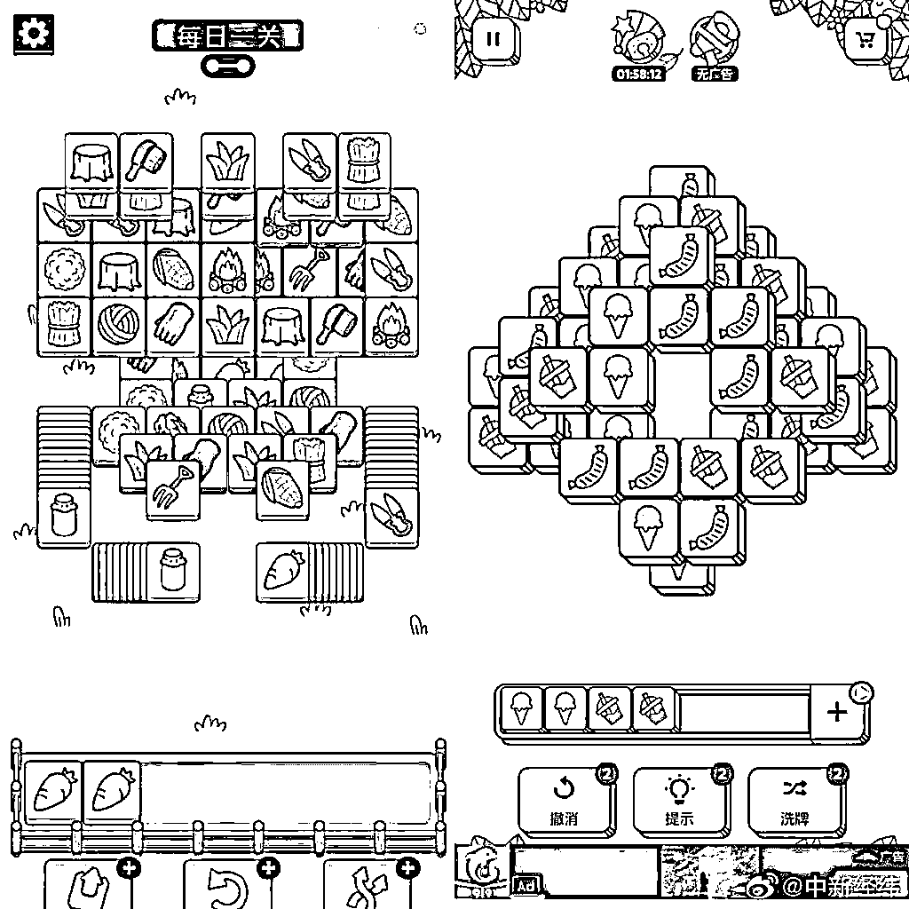

# 连上热搜、服务器 2 天崩 3 次，"羊了个羊"啥来历？

> 原文：[`mp.weixin.qq.com/s?__biz=MzIyMDYwMTk0Mw==&mid=2247543899&idx=3&sn=878af541abf937fdec2647caa57ed8cd&chksm=97cbe763a0bc6e75a8c66ee55029b8320338711cd2cc72c0d6288cd67e2b682fc33b9e84d568&scene=27#wechat_redirect`](http://mp.weixin.qq.com/s?__biz=MzIyMDYwMTk0Mw==&mid=2247543899&idx=3&sn=878af541abf937fdec2647caa57ed8cd&chksm=97cbe763a0bc6e75a8c66ee55029b8320338711cd2cc72c0d6288cd67e2b682fc33b9e84d568&scene=27#wechat_redirect)

这两天的微博热搜，都被一只羊给占据了，相关话题在两天内频频冲上热搜第一。

不少网友一脸懵，这个“羊了个羊”到底是个啥，为啥突然就热搜第一了？又跟抄袭有什么关系？

据悉，这是一款卡通背景的消除闯关游戏。简单说，就是和开心消消乐差不多。

但是，它又没那么简单。

根据官方介绍，这是一款超难的闯关消除小游戏，通关率不到 0.1%。在玩法上，游戏利用各种道具和提示来消除每一个关卡当中的障碍和陷阱。

据玩家的反馈，游戏节奏上，简单的三消带来直接的反馈，不少玩家表示非常容易上头。同时《羊了个羊》在首页设置有玩家排行榜，将不同地域的玩家分区进行排行，使玩家之间的分数直接体现在地域获得的总成绩上。

而游戏第二关的难度相当高，中秋节玩了几天都没有打通第二关。微博#羊了个羊#话题下，对于第二关的讨论也是核心话题点。

**服务器 2 天内崩了 3 次，有人一天玩 5000 次**

据潇湘晨报，9 月 14 日，“羊了个羊”的微博话题阅读量高达 8.9 亿，讨论 8.3 万。

微信指数方面，自 9 月 13 日起，“羊了个羊的”微信指数爆炸级上升，日环比搜索量增长 6022.98%。

14 日上午，据《羊了个羊》官方微博消息，由于该游戏过于火爆，出现了宕机的情况。截至目前，羊了个羊服务器 2 天内已经崩了 3 次。

由于火爆程度超预期，目前官方甚至称“急招后端服务器开发”。官方称“推荐入职的奖励五千，自荐入职的奖金五千”。

**涉嫌抄袭，公司参保人数为 7 人**

羊红是非多，在火爆的同时，“羊了个羊”也陷入了抄袭风波。

9 月 14 日，有网友发现这则小游戏疑似抄袭了游戏《3tiles》。从曝光的游戏画面来看，“羊了个羊”与《3tiles》在玩法上基本一致，不同的是二者的图标。 

目前《羊了个羊》制作方并未就该事件进行回应。

据多家媒体报道，该游戏开发商曾获吉比特（603444.SH）投资。就此，银柿财经记者以投资者身份向吉比特证券部进行咨询，吉比特方面表示：已关注到《羊了个羊》的爆火，该款游戏是由吉比特参股公司研发，投资比例不高，相关收入将体现在吉比特的投资收益部分。

启信宝数据显示，《羊了个羊》关联公司北京简游科技有限公司由张佳旭、厦门雷霆网络科技股份有限公司、北京乐闪科技有限公司共同持股。

企查查 APP 显示，羊了个羊关联公司北京简游科技有限公司成立于 2021 年，法定代表人为张佳旭，注册资本约 117 万元人民币。据 2021 年年报显示，该公司参保人数为 7 人。

其中厦门雷霆网络为吉比特旗下公司，该公司于 2022 年 6 月入股，持有简游科技 10%的股份，为第二大股东。

企查查信息显示，简游科技公司十余项游戏软件著作权已获得登记批准，包括羊了个羊、流浪宠之家、月之村、疯狂擦一擦、解救大西瓜等。公开信息显示，吉比特为《问道手游》《一念逍遥》《摩尔庄园》等多款游戏运营方。

另外，《羊了个羊》官方发布了第二关通关攻略，具体步骤如下：

下面的格子总共可以放 7 个块，也就是说可以临时存储一些暂时无法消除的块，通过这个机制以及下方的三个道具和一次复活的机会，一起配合过关，直到消除掉所有的块!每个道具每局只可使用 1 次。

第一个道具:移出，可以将前三个块移出到一个特殊位置，供你待选择

第二个道具:撤销，点错了撤销一步

第三个道具:随机，可以将场上所有的块进行打乱随机重新洗牌

来源：观察者网综合每日经济新闻、潇湘晨报等

欢迎关注灰产圈社群服务号

