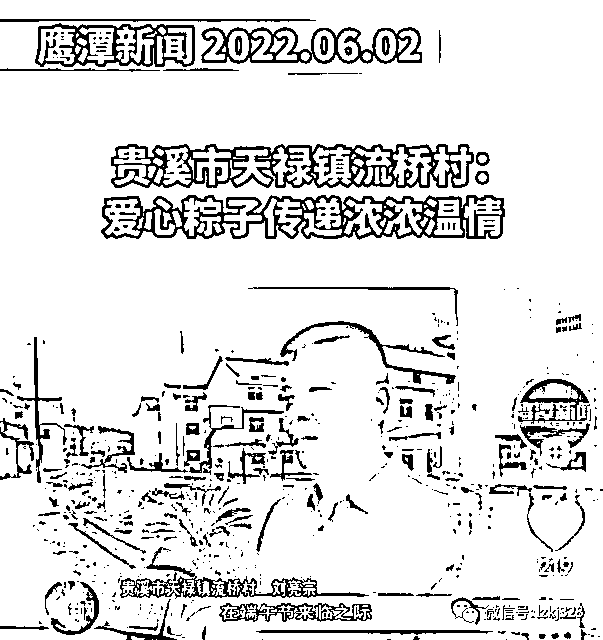
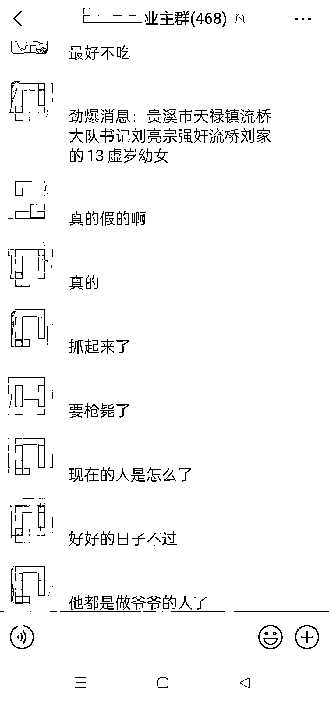
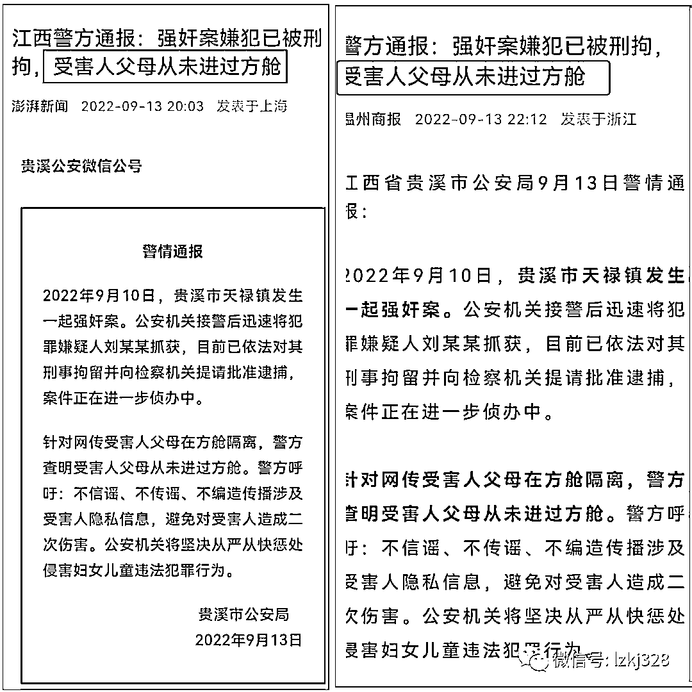
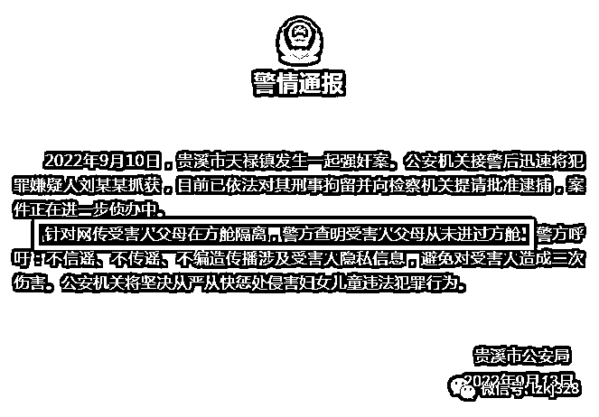
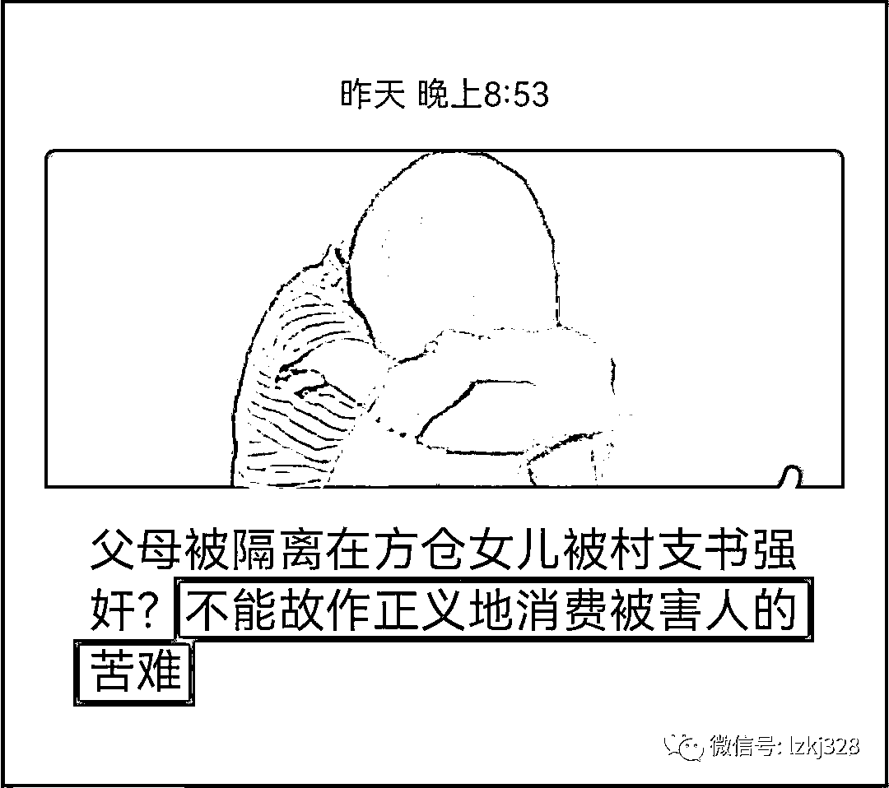

# 12 岁女童被 52 岁村支书强奸时，她的父母到底在哪里？

> 原文：[`mp.weixin.qq.com/s?__biz=MzIyMDYwMTk0Mw==&mid=2247543899&idx=4&sn=f59daf6387a3366e4994f2982eb5bc7e&chksm=97cbe763a0bc6e751dd18229fb66fe8a89323c965fa12cb16699f84215d6fdaa5e86670ef469&scene=27#wechat_redirect`](http://mp.weixin.qq.com/s?__biz=MzIyMDYwMTk0Mw==&mid=2247543899&idx=4&sn=f59daf6387a3366e4994f2982eb5bc7e&chksm=97cbe763a0bc6e751dd18229fb66fe8a89323c965fa12cb16699f84215d6fdaa5e86670ef469&scene=27#wechat_redirect)

恕我孤陋寡闻，以前只知道安徽的濉溪、屯溪、郎溪、绩溪，云南的玉溪，辽宁的本溪，浙江的慈溪、兰溪，福建省的安溪、松溪，江西的芦溪，湖北的竹溪，湖南的泸溪，重庆的巫溪，四川的苍溪，贵州省的花溪，还真没听说过江西的贵溪。

第一次知道贵溪，还是在上个月。

2022 年 8 月 16 日，贵溪市鸿塘镇基塘村村民祝某某去世后，老人家住信江新区某小区的女婿和外孙四人以出门买菜为由，前往贵溪市鸿塘镇基塘村奔丧，被信江公安分局以拒不执行人民政府在紧急状态情况下依法发布的决定、命令为由，“依法行政处罚”，并被送至集中隔离点接受隔离观察。 

时隔不到 1 个月，贵溪再次火了。

昨天，知名自媒体“陆火 Media”披露，江西鹰潭贵溪市天禄镇流桥村，一名 12 岁的女童在家中，遭该村党支部书记刘亮宗强奸。

网传的当地居民相关聊天信息显示，被刘亮宗强奸的 12 岁女童“回家后一身血”，经家人询问后得知被强奸。

今年 52 岁的刘亮宗是当地的名人：

要权有权，是天禄镇流桥村村支书；

要钱有钱，系贵溪流桥力富建筑劳务有限公司法定代表人，而这家公司由天禄镇流桥村集体经济股份合作社 100%控股。

从新闻传播学的角度来看，作为知名调查记者，陆火 Media 的文章完全符合新闻 5 个“W”和 1 个“H” 的记叙要素：

**时间   When（何时）：**中秋节（9 月 10 日）当天中午。

**地点   Where（何地）：**贵溪市天禄镇流桥村。

**人物   Who（何人）:** 受害人，12 岁的女童，犯罪嫌疑人，天禄镇流桥村村支书刘亮宗。

**事件  起因、经过  What（何事）  Why（何因）：**12 岁女童被 52 岁的村支书刘亮宗强奸。

**结果  How（如何）：**涉案村支书刘亮宗已经被抓。

陆火 Media 的文章并非单一信源。

第一，有当地居民的聊天截图。 

第二，拨打流桥村集体经济股份合作社的工商登记电话进行核实，接电话的男子自称是流桥村原主任，他介绍“刘亮宗已经被抓起来了，他强奸少女！”“案发当晚，警方将刘亮宗抓走了”。

第三，向贵溪市妇联进行了核实，证实了公安部门已经介入，被侵犯的女童目前在医院，犯罪嫌疑人刘亮宗目前已经被羁押等信息。

应当说，陆火 Media 的文章是真实、客观的。

昨晚（9 月 13 日 18:30），贵溪公安发布警情通报，坐实了陆火 Media 公号文章关于村支书强奸幼女案的真实性。

媒体纷纷给予报道：

官媒的报道为什么会强调“受害人父母从未进过方舱？”

原来，贵溪公安发布的警情通报里，特意强调了“针对网传受害人父母在方舱隔离，警方查明受害人父母从未进过方舱”，但并没告诉公众是否在隔离中。

而陆火 Media 的公号文章则引用当地居民的话说，“其父母正在方舱隔离”。于是，贵溪公安在发布的警情通报里呼吁“不信谣、不传谣”，但并没有说事发当天，受害人的父母在什么地方。有说在隔离中，当地群众以为隔离就是在方舱里，就如同把诊所说成医院一样，群众的说法确实没那么严谨，但不能就此认定这就是谣言。

**你告诉了大家“受害人父母从未进过方舱”，是否还应该告诉大家事发时，受害人父母在什么地方？**

就是警方语焉不详的“受害人父母从未进过方舱”，有的“正能量”号开始对首家披露村支书强奸女童事件的公号口诛笔伐，称“不能故作正义地消费被害人的苦难”，义正词严地质问“为什么要刻意编造受害者家人在方舱这样的谣言？”武断地得出“编造谣言的人，根本就不是为了替受害者声张正义，不客气地说，他们不过是把这一事件作为实现自己目的的工具”的结论。抡起大棍子，认为对陆火 Media 这类“造谣号”应该严厉打击：“不严厉打击而是轻轻放过，这是他们有恃无恐的重要原因。”

为民说话你不行，扣大帽子第一名，把不严谨的说法上纲上线到“有恃无恐”的高度，自己的心真的不痛吗？

检索发现，涉案村支书刘亮宗还是人大代表。9 月 4 日的“鹰潭人大发布”微信公众号刚刚发布过《人大战“疫”|人大代表抗“疫”进行时（二十）》，其中提到，“面对这场突如其来的疫情，贵溪市人大代表刘亮宗不等不靠、主动作为，第一时间组织村干部做好核酸检测、通知宣传和消毒消杀等工作，坚持‘应检尽检、应管尽管、应隔尽隔’，确保疫情防控工作有力有序进行。他每天在村组卡口带班值守，排查全村人口流动情况，做到底数清、情况明，以实际行动践行人大代表的初心使命和责任担当。”

仅仅 6 天之后，刘亮宗就做出了猪狗不如的事情。

安徽皖衡律师事务所主任曹采峰告诉宾曰语云，按照刑法第二百三十六条规定，“奸淫不满十四周岁的幼女的，以强奸论，从重处罚。强奸妇女、奸淫幼女，有下列情形之一的，**处十年以上有期徒刑、无期徒刑或者死刑**：（一）强奸妇女、奸淫幼女情节恶劣的；（二）强奸妇女、奸淫幼女多人的；（三）在公共场所当众强奸妇女、奸淫幼女的”。

我赞同判这个衣冠禽兽死刑！

作者：宾语 来源：宾曰语云（ID：Lzkj328）

欢迎关注灰产圈社群服务号

