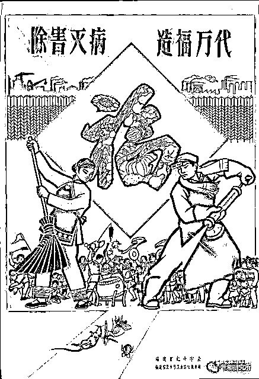

# 有人提议要对蚊子进行清零了

> 原文：[`mp.weixin.qq.com/s?__biz=MzIyMDYwMTk0Mw==&mid=2247543899&idx=7&sn=dfdab6882ada7524639d6930346d303e&chksm=97cbe763a0bc6e7500862b3f5749cd02cdcf464cdb77c66a590b8a7b8ed41e03ce0c65769d17&scene=27#wechat_redirect`](http://mp.weixin.qq.com/s?__biz=MzIyMDYwMTk0Mw==&mid=2247543899&idx=7&sn=dfdab6882ada7524639d6930346d303e&chksm=97cbe763a0bc6e7500862b3f5749cd02cdcf464cdb77c66a590b8a7b8ed41e03ce0c65769d17&scene=27#wechat_redirect)

**一**

刚刚刷到一篇被各大媒体转载的通稿型新闻——

对于全国人大代表提出的《**关于开展全面消灭蚊子的建议**》， 9 月 13 日，国家卫健委官网所公布的答复称，病媒生物防制工作是健康中国建设中一项重要的基础性工作，从源头上控制有害病媒生物，降低传染病通过媒介传播风险。

作为一个略懂新闻规范的人，首先我要对写这篇新闻稿的人提一点意见，这个或者这几个全国人大代表姓甚名谁，这么重要的信息都给遗漏了，实在不应该，既使其失去了一次青史留名的机会，也有碍于我们对其表达滔滔不绝的敬仰之情。

随着我国民众生活水平的提高，以及我国科技水平的日新月异，终于有人不失时机地提出要对蚊子进行清零了。

这令人不由得想起了上世纪五十年代那一场轰轰烈烈的除四害运动。

1955 年，有关农业发展的“十七条”意见出台，其中第十三条内容为: “除四害，即在七年内基本上消灭老鼠，麻雀( 及其他害鸟，但乌鸦是否宜于消灭，尚待研究) ，苍蝇，蚊子。”

1958 年 2 月，“除四害”的指示发出，全国各地成立了“除四害指挥部”，要求“全民动员、人人动手，让麻雀上天无路，老鼠入地无门，蚊蝇断子绝孙……”

“四害”中的其他“三害”，到底是怎么除法，相关记载并不多，但关于消灭麻雀的报道却是铺天盖地。我搞不清，到底是因为麻雀更容易消灭呢，还是因为麻雀的危害最大？

当时的报道称，以每只麻雀连吃带糟踏粮食每年按 5 公斤计算，共可节省粮食 200 多万斤。又按每年每对麻雀繁殖 15 只计算，可节省 1500 多万斤粮食。真是“不算账不知道，一算账，成果真不小”！

**二**

有一篇文章是这样描述麻雀清零战的——

全线总攻的时刻到了，围歼麻雀总指挥部在人民广播电台发出了作战命令。顿时，战旗招展、金鼓齐鸣、杀声震天，假人迎风助阵，战场江翻海沸……麻雀一出窝即被猛烈的轰赶，在气枪、弹弓、面盆、铁桶、竹竿、红旗、锣鼓、假人、毒饵、喇叭、音响等轰赶下，麻雀无处落脚，开始坠空而死，有一些被轰赶的没有逃路时，就撞墙“自杀”……

或许当时人们见面第一句话不会问“吃了吗？”，而可能会问“今天打了多少只麻雀？”

根据不完全统计，仅仅 1958 年一年，就有 2.1 亿只麻雀被清除。

全国各地也涌现出了很多灭麻雀的先进人物。

比如，山西一位 138 岁老人，计划在其寿辰前率领全家 40 口人每人捉麻雀 40 只；甘肃双目失明的儿童用弹弓打麻雀百发百中；还有“盲人王妈七十八，边哄孩儿边赶雀”的故事，都在报纸上广为传播 。

**1958 年春天，捕雀大军战斗在昆明湖畔**

当然，在宣传引导方面，知识分子也立下了大功。

周建人在《北京日报》发表题为《雀是害鸟无须怀疑》的文章，“麻雀是害鸟，害鸟应当扑灭，不必犹豫”。

郭沫若写了一首诗叫《咒麻雀》，当时流传很广：“麻雀麻雀气太官，天垮下来你不管。麻雀麻雀气太阔，吃起米来如风刮……麻雀麻雀气太骄，虽有翅膀飞不高。你真是个混蛋鸟，五气俱全到处跳……”

作家叶圣陶在日记中说: “余又谓此举之效，盖不仅在歼灭麻雀，尤重要之意义在训练人民，使浸渍于集体精神，凡有利于公众之举，人人均须参加。此种精神越来越强，我国之巩固，社会主义世界之巩固，均有最可靠之保障矣。”

有人进一步总结，“无雀”的中国，跟“鼠雀成灾”的美国、法国相比，更能体现出优越性。

只不过，这一场声势浩大的麻雀清零战后来无疾而终，政府下令“麻雀不要再打了”，是因为，打麻雀打出了一场生态灾难，不但稻田害虫增多，一些大城市周围的树木发生了虫灾，公路两旁的树木，叶子被害虫吃光。

**三**

而今，全国人大代表提出了《关于开展全面消灭蚊子的建议》，虽然，消灭蚊子比消灭麻雀难度大得多，因为蚊子家族非常庞大，多达 3600 种，而其本身繁殖能力又极强，一次就可以产下上万颗卵。但是，我们有集中力量办大事的优势，连某种来无踪去无影的病毒都可以动态清零，全面消灭蚊子应该不是一件太难的事。

仿照当年消灭麻雀的动员方式，即“组织建设—广泛宣传动员—开展突击行动—检查、汇报—评优惩差”，将消灭蚊子纳入各级考核当中，应当也能收到立竿见影之效果。

但当务之急是要解决思想认知问题。

有人称，消灭蚊子会破坏生态平衡。自然界中有很多生物是以蚊子为食的，其中囊括了大量昆虫、爬行类动物、两栖类动物以及水生动物。蚊子的消失必然导致食物短缺，所以这些以蚊子为食的动物种类也会急剧减少，甚至灭绝。

网上流传，爱因斯坦曾说过，**“如果蜜蜂从地球上消失了，人类将只剩下四年的生命。**”理由是，没有蜜蜂传授花粉，大量植物会死亡，最后会导致人类的死亡。这句话是不是爱因斯坦说的不重要，重要的是它揭示了物种与物种之间强大到可怕的关联性。

那么，全面消灭蚊子，会带来难以预料的生态后果吗？

如果是，则要按下对蚊子的清零冲动；如果不是，则要对这样的言论与观点进行批判，以便于人们统一认识。

国家卫健委在对全国人大代表的答复中，还有这样的表述——将深入开展爱国卫生运动，全面改善人居环境。强化病媒生物防制技术的研究，以创新技术推动防制工作，探索环境友好、绿色可持续、经济适用的蚊虫防控技术，降低蚊虫密度水平——这里面最有价值的一句话是“**降低蚊虫密度水平”**，体现了应有的灵活弹性空间。

来源：世相研究所

欢迎关注灰产圈社群服务号

