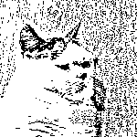

# 罪犯入狱前给家人画了张地图：把床底十几本书拿走……

> 原文：[`mp.weixin.qq.com/s?__biz=MzIyMDYwMTk0Mw==&mid=2247543962&idx=5&sn=8a9a448610a076a0a4b28e495f250b50&chksm=97cbe7a2a0bc6eb48fa65ef8ceb972fe79e01ba38a1ebb2ecdf759730d6b85a5ea7688bf02d6&scene=27#wechat_redirect`](http://mp.weixin.qq.com/s?__biz=MzIyMDYwMTk0Mw==&mid=2247543962&idx=5&sn=8a9a448610a076a0a4b28e495f250b50&chksm=97cbe7a2a0bc6eb48fa65ef8ceb972fe79e01ba38a1ebb2ecdf759730d6b85a5ea7688bf02d6&scene=27#wechat_redirect)

“床底有十几本书拿回去

床底衣柜打扫干净……”

不久前一份特别的委托书

引起了浙江省义乌市公安局

经侦大队民警的警觉

委托人莫某某因犯洗钱罪

被判处有期徒刑 2 年 6 个月

并处罚金人民币 17 万元

判决生效后

准备前往监狱服刑的莫某某

突然提交了一份委托书

交由民警委托家人处理自己的

出租屋及室内物品

委托书中，莫某某细致地画了一张草图

图上详细地标注了其在广州某出租房方位

并指引存放物品的位置

以及需要家属处理的事情

**草图里还特意提到要家人**

**把床底的十几本书拿回去**

什么样的个人物品

需要画如此详细的示意图？

民警顺藤摸瓜

果然发现了背后隐藏的秘密

其实早在侦办洗钱案过程中

警方就分析发现莫某某

有藏匿赃款的可能

但由于没有直接证据一直无法查证

而这一份委托书恰好印证了民警的判断

根据委托书上隐藏的信息

民警在莫某某的租房床底下

查获涉案人民币 43 万元

**至此**

**警方成功追回涉案赃款 507 万元。**

此后，随着洗钱案最后一名到案的团伙成员被提起公诉

以莫某某为首的洗钱犯罪团伙

4 名成员全部落入法网。

来源：平安鼎（ID：zjpinganding），长安剑

欢迎关注灰产圈社群服务号

