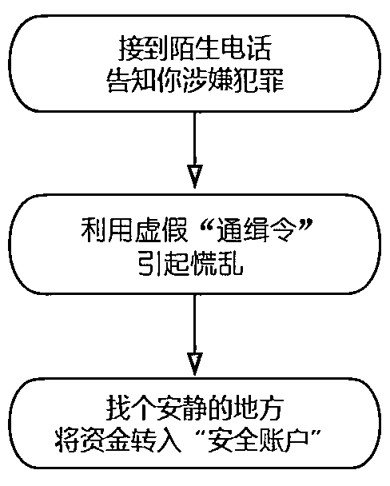
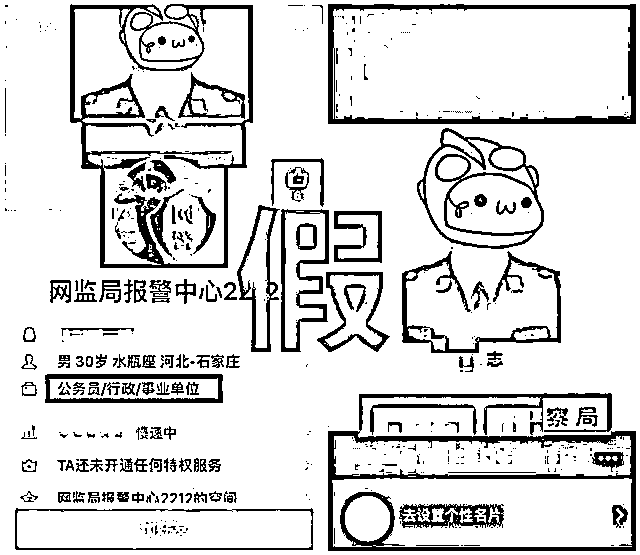
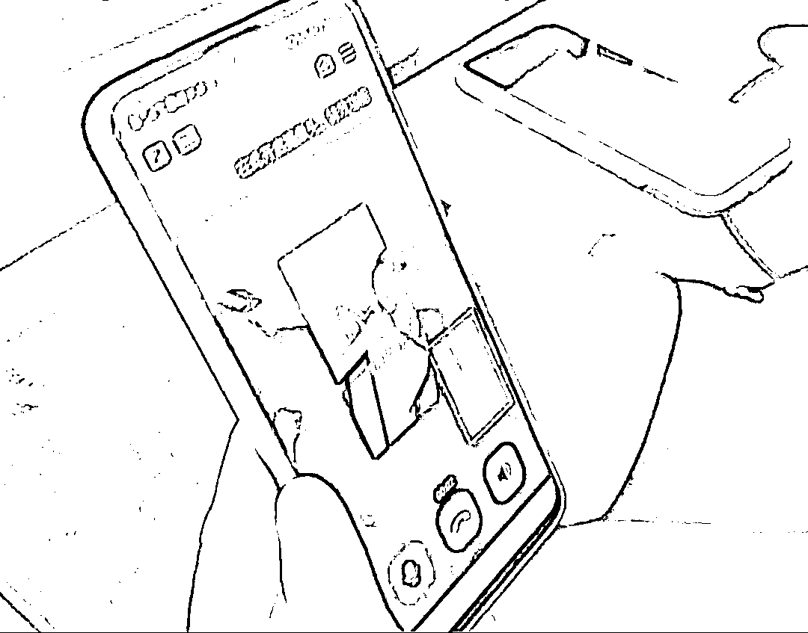
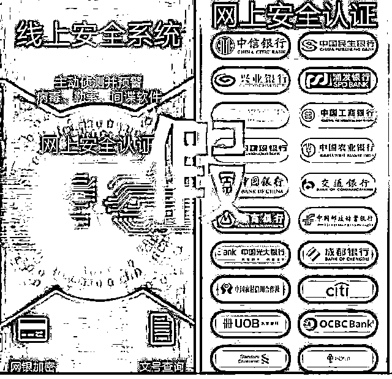
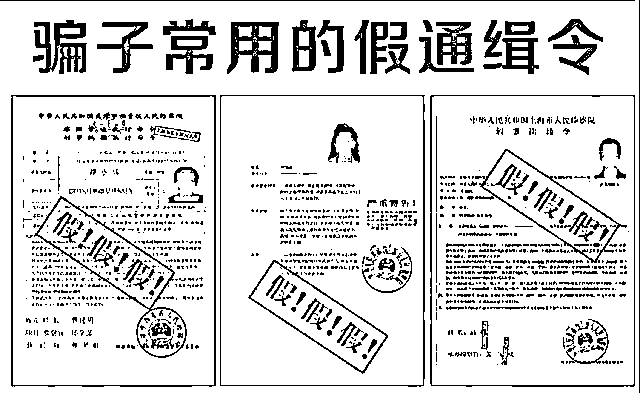

# 手段升级！警察蜀黍也曾接到这类电话……

> 原文：[`mp.weixin.qq.com/s?__biz=MzIyMDYwMTk0Mw==&mid=2247543962&idx=6&sn=ef29345ea77901d20a4f72b088b20803&chksm=97cbe7a2a0bc6eb4b5f2bb4eeac39e20882a18df2effb60c9793f4c87a214a29eb6eb6a601f1&scene=27#wechat_redirect`](http://mp.weixin.qq.com/s?__biz=MzIyMDYwMTk0Mw==&mid=2247543962&idx=6&sn=ef29345ea77901d20a4f72b088b20803&chksm=97cbe7a2a0bc6eb4b5f2bb4eeac39e20882a18df2effb60c9793f4c87a214a29eb6eb6a601f1&scene=27#wechat_redirect)

“我是某某公安局的

你已涉嫌违法犯罪

请配合我们调查”

……

你曾接到过这样的电话吗？

声色俱厉的语气、强势震慑的气势

让不少人一下子就慌了神

急于证明清白或挽回损失

迷迷糊糊交出验证码甚至直接转账

请注意！

小心假公检法背后的真陷阱！

民警也曾接到过假公安的电话！

↓↓↓

[`mp.weixin.qq.com/mp/readtemplate?t=pages/video_player_tmpl&action=mpvideo&auto=0&vid=wxv_2491730636307873793`](https://mp.weixin.qq.com/mp/readtemplate?t=pages/video_player_tmpl&action=mpvideo&auto=0&vid=wxv_2491730636307873793)

（点击右下角全屏观看效果更佳）

**典 型 案 例**

**1**

**诈骗套路逻辑不通 女子对其却深信不疑**

8 月 13 日，张某（女，46 岁）来到富顺县公安局童寺派出所报案称在网上被骗。据了解，8 月 13 日 9 时许，张某接到个自称是“自贡派出所”的电话，称张某的身份证曾经遗失过，需要配合”长沙派出所“进行调查。随后，”长沙派出所“来电称有人用她的身份证办了一张银行卡，该卡涉及一起“诈骗案”，称张某可能面临七年以下的坐牢，如果想要排除嫌疑，就要配合调查，张某想到自己的身份证确实遗失过，就信了他们。对方说要先查一下张某的银行卡余额，稀里糊涂的张某便将自己的银行卡密码提供给了对方。接着，对方问张某是否有其他银行卡，张某告知对方还有定期存折，对方便让张某‍将定期钱取出来存到银行卡里。随后对方添加了张某微信好友，向张某发了几张公安抓捕犯罪嫌疑人和伪造的警官证照片，并和张某进行视频通话，让张某对其身份更加深信不疑，张某便将取款验证码和身份证照片发给了对方。最后对方让张某去古佛派出所拿一份传真，张某发现自贡并没有古佛派出所，随即反应过来自己被骗。张某共计被骗 95100 元。

**2**

**急于证明清白上了骗子的当！**

8 月 23 日，女子宋某（51 岁）来到自贡市公安局沿滩分局沿滩派出所报案称自己在网上被骗。据了解，当天早上 8 时左右，宋某接到一个电话，对方自称是“自贡市公安局的工作人员”。对方在电话里称有一名叫周伟的男子用宋某的身份证信息在重庆邮政银行里办了业务，随后又称周伟用宋某的银行卡参与贩卖毒品，现已被公安机关抓获，称这起“案件”与宋某有关。宋某随即向对方表示不认识该男子，对方便要求宋某提供一些关于她本人的情况，证明这起“案件”与她无关。之后，又有一名男子自称是“重庆市公安局的林大队长”，询问了宋某现在收入来源等情况，并对宋某说如果不配合调查，就会对她采取强制措施，宋某听到这些话非常害怕，便将银行卡号、密码和转账验证码提供给了对方。随后宋某发现自己的银行卡向不知名账户转账了 31900 元，这才反应过来被骗。

**3**

**一听公安机关办案就慌了神**

**步步进入骗子圈套**

8 月 29 日，王某（女，47 岁）来到荣县公安局河西派出所报案称在网上被骗。据了解，当天 11 时许，王某在家里接到一个电话，对方自称是“自贡市公安局”，询问王某是否认识一个在邮政银行上班的叫周伟的男子。王某表示不认识，对方便称周伟涉嫌一桩贩毒案件，现在查到周伟用王某身份证办理了一张银行卡，卡内有一笔几十万元的资金，问王某是否知晓这笔钱，并让王某配合调查。王某一时慌了神，向对方提供了自己的银行卡账号，并告诉对方卡里面有 36260 元。对方谎称需要查询卡里面的流水情况，让王某注意接收验证码，王某收到验证码后立即发送给了对方，随后王某手机收到了 36200 元的转账成功信息。这时的王某还没意识到被骗，对方又让王某提供其他银行卡，王某称自己还有一个存折里有一万多块钱，要等她老公回来处理，对方称如果不一起操作，钱就会被冻结，王某坚持要等老公，对方立即把电话挂断了。王某被骗 36200 元。

**4**

**电话设置“勿扰模式”**

**96110 预警专线无法接听**

9 月 1 日，宜宾兴文辖区熊某某接到一个“00”开头的陌生电话，对方自称宜宾市公安局民警，称熊某某在北京市海淀区办理的一张银行卡涉嫌洗钱，需要联系北京市海淀区警方进行申诉。随后将电话转到北京市海淀区紧急报案专线，对方告知熊某某需要更改手机的一些设置，并通过所谓的办案 QQ 发来“拘捕令”，熊某某看着“拘捕令”上自己的照片和身份信息，陷入恐慌并对骗子的话深信不疑‍。在聊天中对方强调通话要录音备案，要求熊某某找一个安静的地方接听电话，而且因案件涉及层面广泛、实行“案件不公开”，要求熊某某严格“保密”，不可以对亲戚朋友、爱人同事讲。随后骗子让熊某某点击链接，通过申请额度的方式验证其银行账户是否被盗用，并以验证资金实力、缴纳保释金为由要求熊某某将资金转到“安全账户”。熊某某为自证清白，分 20 余次将 47 万元转到对方账户后，才意识到自己被诈骗。熊女士被骗期间，公安机关预警专线 96110 通过电话、短信多次对熊女士开展紧急预警，但因为熊女士将电话设置“勿扰模式”，熊女士均未接听。

[`mp.weixin.qq.com/mp/readtemplate?t=pages/video_player_tmpl&action=mpvideo&auto=0&vid=wxv_2496337582562394116`](https://mp.weixin.qq.com/mp/readtemplate?t=pages/video_player_tmpl&action=mpvideo&auto=0&vid=wxv_2496337582562394116)

熊某某与骗子的通话录音视频

****传统冒充公检法诈骗的“套路”
一般是****

****

****升级换代后的新招数****

****01****

****视频笔录****

**为使骗局更为逼真，不惜真人上演。骗子让受害人添加“民警”的 QQ、微信后，会要求你前往异地公安局接受调查，或者“做个视频笔录”。对忙于工作的人来说，“视频笔录”当然是首选。视频连线后，对方会有身着“警服”的男子一边向你出示“通缉令”，一边听你诉说冤情。**

****

**（所谓“民警”的 QQ 号以及出示的假“警察证”）**

****

**（诈骗分子身着“警服”开启视频聊天，出示“通缉令”）**

****02****

****账户加密****

**也许是“公检法不存在安全账户”已深入人心，骗子见招拆招，又弄出了一个“账户加密”。既然你没有洗黑钱，那你的银行账户一定是被盗了，要马上安装一款名为 “安全防护”的 App（或英文名“protect”，专为高知人群打造），在 App 内填入手机号、银行账户、验证码，就可以“对银行账户加密”。泄露了银行验证码等相关信息后，你的账户便能任由骗子任意支配。**

****

**（假“安全防护”APP 界面）**

****03****

****网贷冻结****

**传统骗术，能让你倾家荡产；全新骗术，还能让你身负巨债。对方表示涉案资金清查时，网贷平台中的额度同样需要冻结，所以要你把京东、美团、微信、支付宝等平台中的贷款额度全部提现，一并转至对方提供的“安全账户”。一旦信了，骗子就会从网贷平台中完成贷款提现，瞬间你就成为了大额负债人。**

****

****套 路 识 破****

****

****第一步：****取得受害者信任****

****骗子通过非法手段获取受害人个人信息，如身份证号码、住址、电话等个人隐私信息，从而获取受害人初步信任。****

 ******第二步：****震慑**

**骗子会通过严厉的语气，强势震慑并控制受害人的思想，使受害人一步一步进入骗子的层层圈套。**

 ****第三步：恐吓**

**骗子通过出示伪造的“通缉令、拘捕令”，增加骗局“真实性”和受害人的负罪心理，让受害人彻底相信自己卷入违法犯罪，可能将要身陷囹圄，结果就会对骗子们深信不疑。******** ****************

********（骗子常用的经查证“假”通缉令图片）********

**********第四步：转账**********

********骗子声称要“资金调查”，诱骗受害人入局。他们利用受害人想尽快自证清白、洗脱罪责的心理，受到威逼、恐吓之后往往就对骗子们言听计从。等受害人转账甚至贷款转现到所谓的“国家安全账号”后，他们的骗局便能“大功告成”。********

****************

********不听、不信、不转账********

********防止被骗！********

********快转发分享给你的家人朋友********

******** 多一次转发就会少一人被骗！********

********来源：自贡市反诈中心，宜宾市反诈中心，熊猫反诈 编辑：袁广 责任编辑： 罗彦加********

****************

********欢迎关注灰产圈社群服务号********

****************

****************