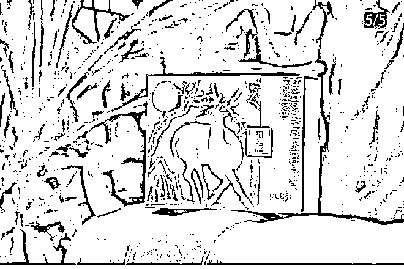
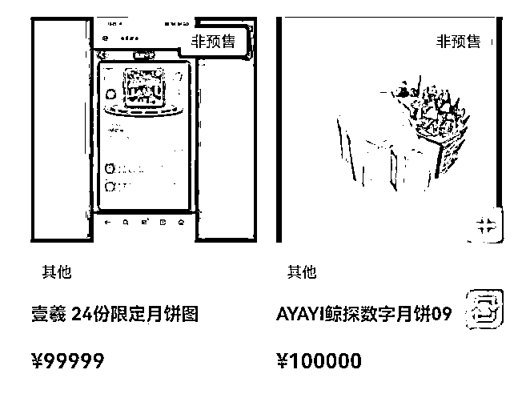
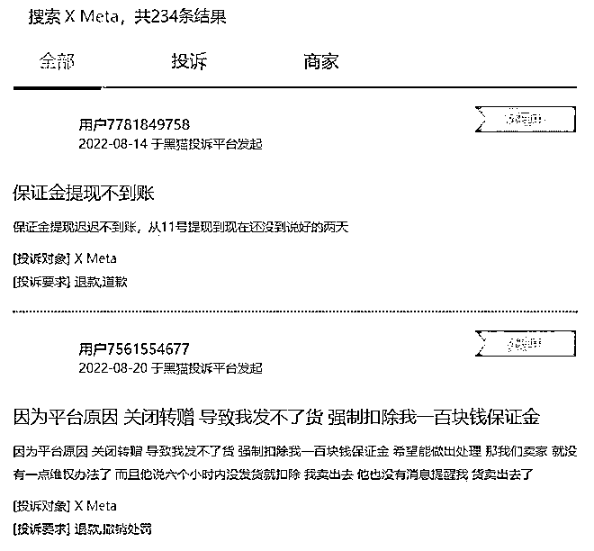
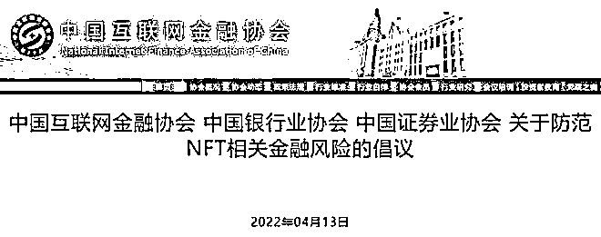

# 数字月饼炒至数万元 是营销手段还是"割韭菜"？

> 原文：[`mp.weixin.qq.com/s?__biz=MzIyMDYwMTk0Mw==&mid=2247543962&idx=7&sn=358d3f635cff3a541f9997d4868e2435&chksm=97cbe7a2a0bc6eb4d40fb5dbb78f3e857cdd4f5c891be8cb64813efd92aa80f36a4cf26f0002&scene=27#wechat_redirect`](http://mp.weixin.qq.com/s?__biz=MzIyMDYwMTk0Mw==&mid=2247543962&idx=7&sn=358d3f635cff3a541f9997d4868e2435&chksm=97cbe7a2a0bc6eb4d40fb5dbb78f3e857cdd4f5c891be8cb64813efd92aa80f36a4cf26f0002&scene=27#wechat_redirect)

今年中秋节，由于监管趋严，市面上“天价月饼”少了许多。不过，在“元宇宙”里，不少上市公司、食品老字号纷纷推出“数字月饼”，这些月饼摸不着、吃不了，价格却从几元到数千元不等。在一数字收藏二手交易平台，一个数字月饼的价格甚至高达数万元。

那么，究竟什么是"数字月饼"？从记者调查到的情况来看，目前"数字月饼"主要有两种形式，一种是与实体月饼捆绑出售。消费者购买实物产品后，能够获得一个二维码，用手机扫码即可获得拥有专属区块链编码的数字藏品。例如北京某酒店推出的 NFT 月饼礼盒，由一盒月饼和一份数字藏品组成，单盒售价 348 元。

北京邮电大学交互技术与体验系统文化和旅游部重点实验室副主任陈洪表示，这种模式下，商家主要把数字月饼作为一种营销手段，是用数字衍生品的方式来促进实物商品的销售。不过，也有人质疑，这是企业为避开月饼限额新规，而以元宇宙、区块链为噱头来炒作月饼价格。

而另一种数字月饼则纯粹是虚拟的月饼。例如，在“X Mate”元宇宙收藏品交易平台上，有一款名为 AYAYI 鲸探数字月饼 09 的数字月饼，售价高达 10 万元。

这枚月饼的制作人为超写实数字人 AYAYI，这款月饼有专属的序列号，不可篡改、不可分割。目前，国内多个数字藏品平台都发行了这种"月饼"，发行价格从几元到数百元不等。但由于发行量稀少，再加上一些大平台的加持，许多玩家在平台抢购"数字月饼"之后又在二手平台挂出转卖，这些"数字月饼"在几次转手后被炒到了天价。

这样的"数字月饼"，本质是一种数字权证，与月饼已经没有什么关系，只要有热度，它甚至可以替换为任何一种食品，比如粽子、饺子等。而中秋节过后，一些数字月饼的价格已经开始下跌。

那么，各大商家推出的"数字月饼"究竟是"创新"，还是"割韭菜"？对此，上海交通大学上海高级金融学院教授胡捷表示，数字化是一种趋势，月饼这样的传统佳节食品搭载上一些数字化的概念做营销，可以看做是一种跨界创新，不仅满足了消费者对时尚的追求，也能提出更加个性化的表达方式。但目前，有些"数字月饼"在二手市场上炒作、甚至炒出天价，这种借月饼搞金融产品炒作的行为，就要谨防风险了。

事实上，这两年来像"数字月饼""数字艺术品"等数字藏品以前所未有的热度引发广泛关注，但随之而来问题也不少。记者在某投诉平台上搜索"数字月饼"或"数字藏品"发现，相关投诉多达 234 条。其中，有用户投诉平台不退保证金或恶意扣除保证金；还有用户投诉卖家钱收了，但就是不发货，或者货不对版，一直不退款等情形。此外，还有玩家认为，一些商家和平台采用限量发售的方式，强制赋予数字月饼其稀缺性，人为创造了炒作空间。

针对数字藏品平台上出现的一些乱象，今年 4 月，中国互联网金融协会、中国银行业协会、中国证券业协会联合发布了《关于防范 NFT 相关金融风险的倡议》，明确提出要杜绝 NFT 金融化风险。要求不得为 NFT 交易提供集中交易，持续挂牌交易等服务，变相违规设立交易场所等。并呼吁广大消费者，增强自我保护意识，自觉抵制 NFT 投机炒作行为。

上海交通大学上海高级金融学院教授胡捷表示，"数字月饼"等数字藏品属于新鲜事物，一些有猎奇心理的人会盲目跟风去买。此外，还有一些人虽然自己不一定喜欢，但从中看到商机，也回去购买甚至形成频繁的二级交易。而这种连续交易高频地炒、倒手可能会导致出现价格泡沫，而价格泡沫破灭之后，参与其中的消费者会承受经济损失。

胡捷说，随着时代的发展，像"数字月饼"这类数字藏品作为区块链技术催生的新事物，他的存在确实有相当的合理性，企业拥抱新事物只要不违反法律也都应该鼓励。但相关监管部门也要尽快出台相关政策，完善藏品的发行数量、定价机制等，督促相关平台打造公平公正的投资环境，让国内数字藏品市场回归理性。

来源：钱途网，利箭在行动

欢迎关注灰产圈社群服务号

