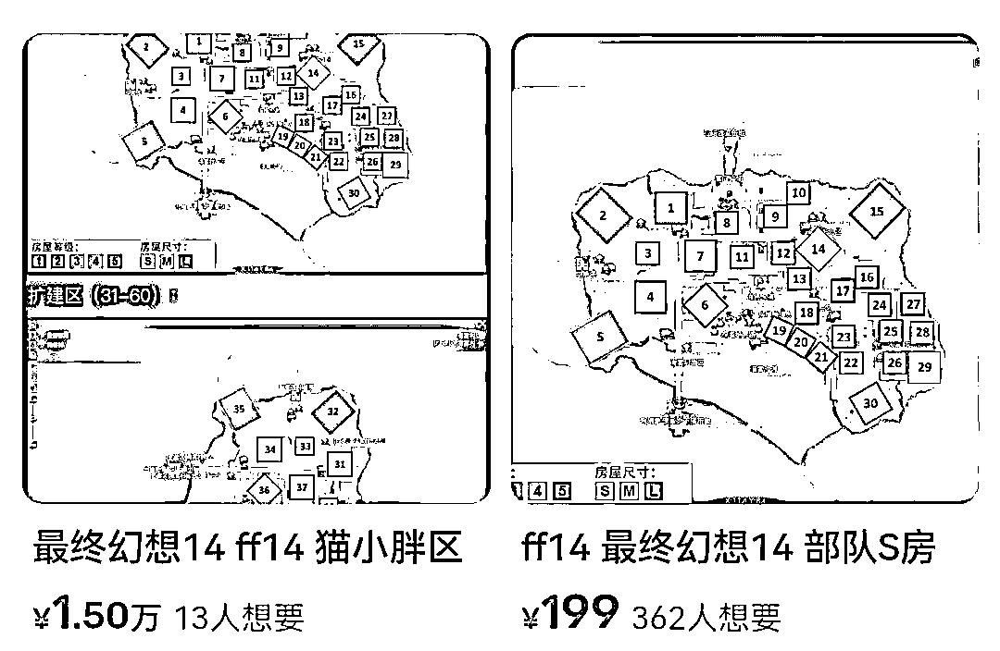

# 元宇宙“炒房”来了？专家提醒：别被虚拟地产投资坑了！

> 原文：[`mp.weixin.qq.com/s?__biz=MzIyMDYwMTk0Mw==&mid=2247543962&idx=8&sn=3ff146fd575a61dbdfb4fa352ec36979&chksm=97cbe7a2a0bc6eb40b31a15e8e2065f8ca252815ba8b4c79950c121cfce19ae4103b6aad4002&scene=27#wechat_redirect`](http://mp.weixin.qq.com/s?__biz=MzIyMDYwMTk0Mw==&mid=2247543962&idx=8&sn=3ff146fd575a61dbdfb4fa352ec36979&chksm=97cbe7a2a0bc6eb40b31a15e8e2065f8ca252815ba8b4c79950c121cfce19ae4103b6aad4002&scene=27#wechat_redirect)

不到一年时间

元宇宙“炒房”热度直线下降

曾经高达万元一套的虚拟房产

如今已不到千元

还无人问津

业内专家表示

我国早已明令禁止虚拟货币炒作交易

坚决遏制 NFT 金融化、证券化倾向

一些投资者贸然参与其中

不但损失真金白银

而且还会面临法律风险

**0****1**

**元宇宙中的“虚拟地产”
实为仿真场景**

在看了多款虚拟地产后，记者发现，目前的虚拟地产可以理解为一种关于地产的游戏。根据不同开发者的要求，玩家可以使用现实世界的货币直接够买虚拟社区中搭建好的虚拟地产，有的则是通过现实世界的货币购买游戏装备、完成游戏任务，攒积分，然后购买虚拟土地、房屋。

据了解，目前对于虚拟地产概念还没有一个严格的定义，通常是把虚拟房产解释为**“基于区块链、NFT 等技术所创造出来的有产权标识的房产”**。这种房产利用虚拟图像科技、虚拟现实技术将城市、小区的实景呈现在系统中。

事实上，在虚拟世界中炒房的玩法，并非元宇宙房地产平台首创，早在许多年前，《梦幻西游》《天涯明月刀》等游戏就为房产或家园系统赋予了交易属性。然而与这一轮元宇宙炒房热不太一样的是，网络游戏中的炒房往往是因为房屋本身捆绑虚拟数值，玩家买的不是“房”，而是这些数值，但元宇宙里的“房”则更接近现实中的土地。 

▲虚拟海景房**0****2**

**“炒房”热度直线下降
市场价格全线暴跌**

一位网名为“灵力”的玩家对《中国消费者报》记者说：“我去年在**虹宇宙 APP**里通过摇号花 88 元买了一套 SSS 等级的房产，没几天房子的价格涨到 1000 多元，就又花了 2 万多元买了套超级稀缺的半海景别墅。到了 12 月，我发现二手平台上的虹宇宙房产的挂牌价从几百元到几十万元不等，价格最高的一套达到 99.99 万元。当时想再等等房价或许会更高，能赚更多钱。**结果今年房价一直下跌，后来所有的交易平台都禁止交易虚拟地产**，全亏了。”

媒体还曾报道，2021 年 11 月，某知名歌手宣布自己在 Decentraland 平台上购买了三块虚拟地皮，总共花费 7 万余美元（约 50 万元人民币）。然而，近期根据 WeMeta 平台数据显示，这三块虚拟地皮，当前估值仅 9.75 万元人民币，暴跌超过 80%。

一位网名为“TTF11”的玩家对《中国消费者报》记者说：“我在国内、国外的平台上都买了虚拟地产，现在总体损失了 85%，而且交易量非常小。”

中国艺术研究院副研究员孙佳山对《中国消费者报》记者分析说：“首先，虚拟地产本身不是地产，市场上多数的虚拟地产是金融产品或者说是金融衍生品。这个仿真场景在 2016 年时就能做到，并不是最新技术，和一些人所标榜的元宇宙没有任何关系。它只是套用了元宇宙概念。即便从旧技术角度看，很多场景做的并不仿真，只是糊弄，虚拟地产的高价格就是一个金融泡沫，甚至可以说是一个骗局。”

**0****3**

**违规交易存在风险
多数平台已屏蔽虚拟房产交易**

据了解，我国早已明令禁止虚拟货币炒作交易，坚决遏制 NFT 金融化、证券化倾向，防范非法金融活动风险。在这样的政策背景下，投资者贸然参与其中，很容易面临多重风险。   

记者在二手交易平台上搜索“虚拟地产”“虹宇宙”“元宇宙房产”几个关键词发现，该平台已经检索不到任何信息。但记者也发现，平台屏蔽并没有阻挡住交易的继续，一些交易开始转战到 QQ 群里。

在一个名叫“红宇宙”的 QQ 群里，一位网友对询价的记者说：“咱们的交易不要在 QQ 或是微信里，骗子太多。以其他物品的名义到二手平台交易，这样双方都保险。”

孙佳山分析说：“我们现在见到的大多数所谓虚拟地产其实不具备数字资产的基本属性，私下进行交易风险很大。首先，不具备稀缺性，在网络世界中可以做很多所谓的仿真场景。其次，现在很多所谓的虚拟地产是和诸如以太坊、空气币等加密货币绑定的，而且存在多次交易，不可追溯。在交易中还会涉及金融诈骗等问题，现有的法律体系不允许交易虚拟地产。” 

**0****4**

**虚拟地产“钱景”渺茫
不适合个人盲目投资**

中国金融学会金融科技专业委员会专家卫剑钒在接受《中国消费者报》记者采访时指出：

“虚拟地产本质上并不像现实世界中的地产那样具有稀缺性、唯一性，只要发行者愿意，虚拟地产完全可以扩容，即便在一个游戏（或元宇宙）中是固定面积的，但在另外成百上千的游戏中也会有大量的虚拟地产。最终，只有最热门、最繁荣的游戏中的虚拟地产可能会卖得比较好，但即便是这样的游戏，也有可能因为失去热度和玩家，而导致其地产价格大幅跌落。所以投资虚拟地产的风险极高，不建议投入。”

▲虚拟地产在线下销售

中国人民大学智能社会治理中心副教授王鹏在接受记者采访时表示，元宇宙虚拟土地的交易因为没有合规的监管，也没有涨跌幅的限制，因此具有金融衍生品属性，在政策环境、社会需求发生变化的时候，价格很容易暴涨暴跌。很多投资者购买虚拟地产的初衷也并不是为了持有，而是希望可以从中获利，这就加大了炒作虚拟地产的风险。

业内专家提醒消费者，虽然虚拟地产在元宇宙的包装下，吸引了不少想从中获利的玩家，但任何一个新鲜事物出现时都会伴随各种不规范行为。在有关法律法规严令禁止的时候，远离是最明智的选择。

来源：中国消费者报，巴蜀反诈

欢迎关注灰产圈社群服务号

