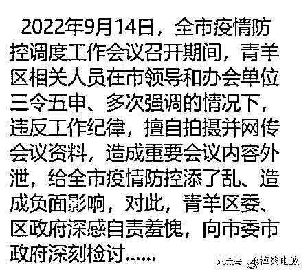
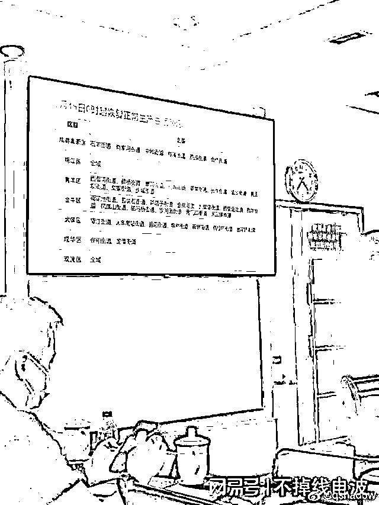
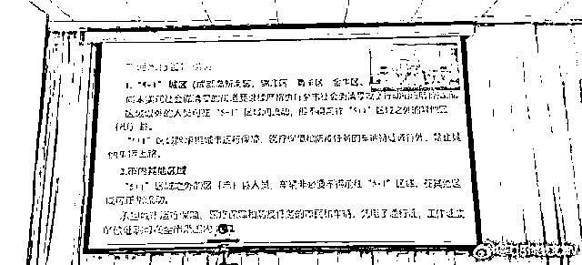
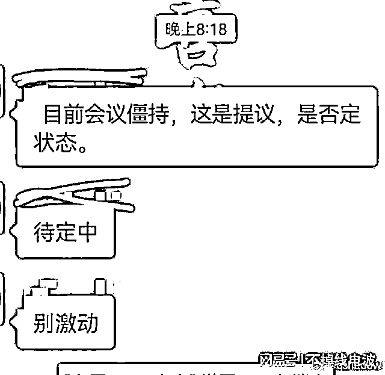
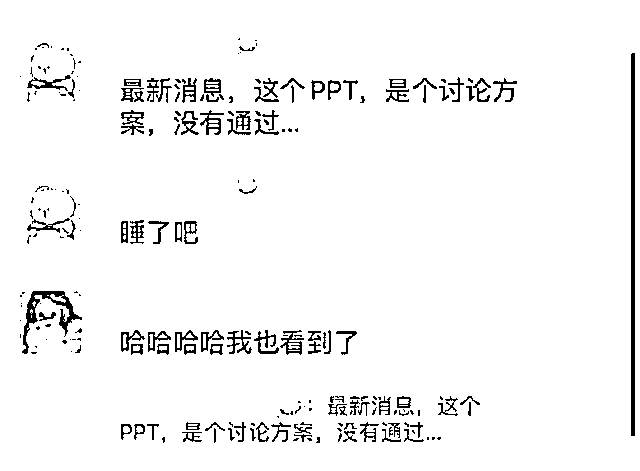
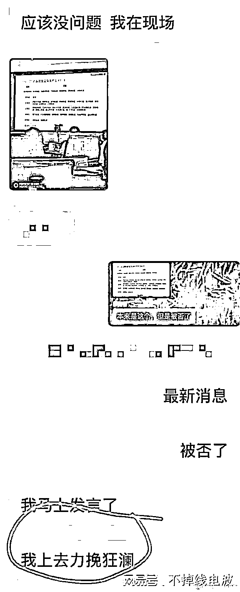
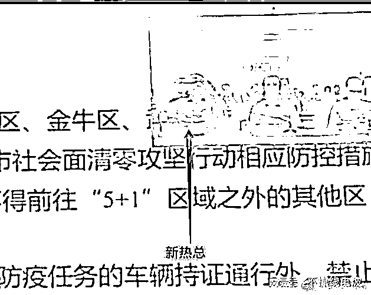
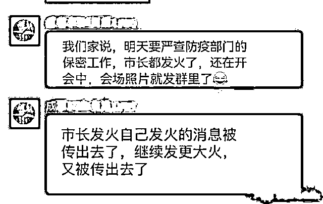
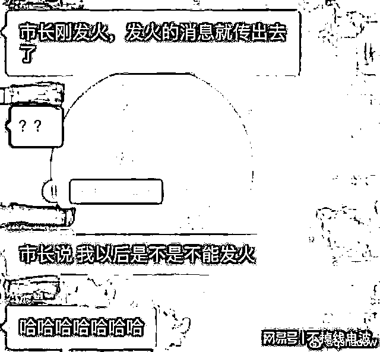
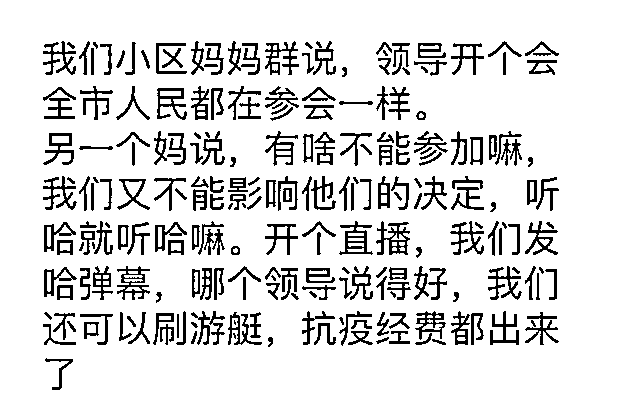

# 传成都防控会议遭泄露，领导发火，随后发火的消息也被泄露

> 原文：[`mp.weixin.qq.com/s?__biz=MzIyMDYwMTk0Mw==&mid=2247544026&idx=2&sn=6078fb686fa26b42c6668d12416ccebd&chksm=97cbe7e2a0bc6ef4c6145825bdedeb4ff66fd6589df87be44759a8caa61e1c25bc87880e59ea&scene=27#wechat_redirect`](http://mp.weixin.qq.com/s?__biz=MzIyMDYwMTk0Mw==&mid=2247544026&idx=2&sn=6078fb686fa26b42c6668d12416ccebd&chksm=97cbe7e2a0bc6ef4c6145825bdedeb4ff66fd6589df87be44759a8caa61e1c25bc87880e59ea&scene=27#wechat_redirect)

近期，成都疫情持续牵动着全国的心，疫情防控本是一件严肃的事，这当中却有一条消息让人哭笑不得。

网传 9 月 14 日，成都市召开全市疫情防控调度工作会议，会议召开期间，一些会议现场展示的内容方案却已经开始在网上流传……

从遭到泄漏的一些会议 PPT 照片上看，成都拟从 9 月 15 日 0 时起，恢复正常生产生活秩序。包括各区一些具体的交通出行管制措施。

此消息一传出来，成都网友一片欢腾，终于要解禁恢复正常生活了？然而，没高兴多久，一盆冷水泼来：“目前会议僵持，这是提议，是否定状态。待定中，别激动。”得，只是提议，还没被通过，白高兴一场。

从泄露的图片能够看出，当时边开会边拍照外传上网的人就在会议现场。甚至有一张聊天截图中，有个人表示：“马上我发言了，我上去力挽狂澜”（指前文提到的 9 月 15 日 0 时解封被否）。

事情到了这里，已经很离谱了，但是更离谱的还在后面。会议现场播放 PPT 的时候，对着参会人员的镜头画面出现在投影幕布上，而画面上，一个人正举着手机在拍……这下把自己都拍上去了。

据悉，本次会议，相关领导三令五申的强调纪律，结果会议进行时，会议图片就传了出去，领导很生气！结果领导发火自己发火的消息被传出去了，继续发更大火，又被传出去了……

对于此事，有些看到外泄图片的居民发表了看法，更是将离谱刷出心高度：“领导开个会，全市人民都在参会一样”、“有啥不能参加嘛，我们又不能影响他们的决定，听哈就听哈嘛。开个直播，我们发哈弹幕，哪个领导说得好，我们还可以刷游艇，抗疫经费都出来了”。我直接好家伙，连抗疫经费都想到了，不知道领导如果知道了这个建议，能不能消消气。

  来源：网易号“不掉线电波”，宾曰语云，江郎材尽

欢迎关注灰产圈社群服务号

