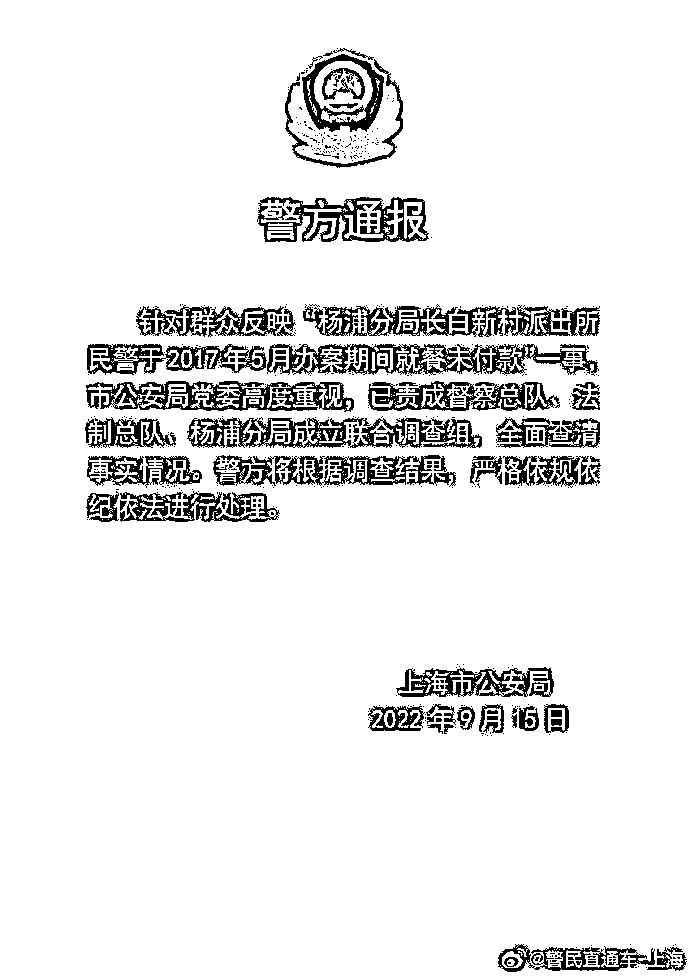
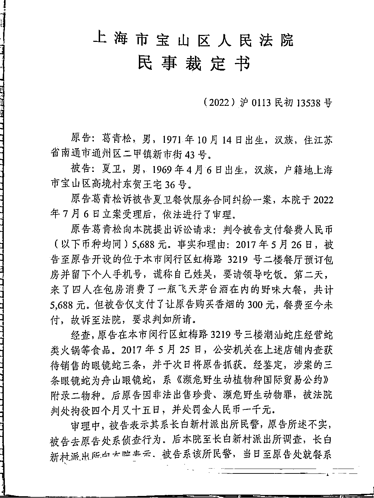
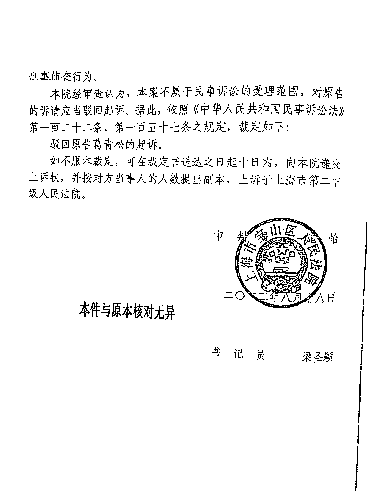
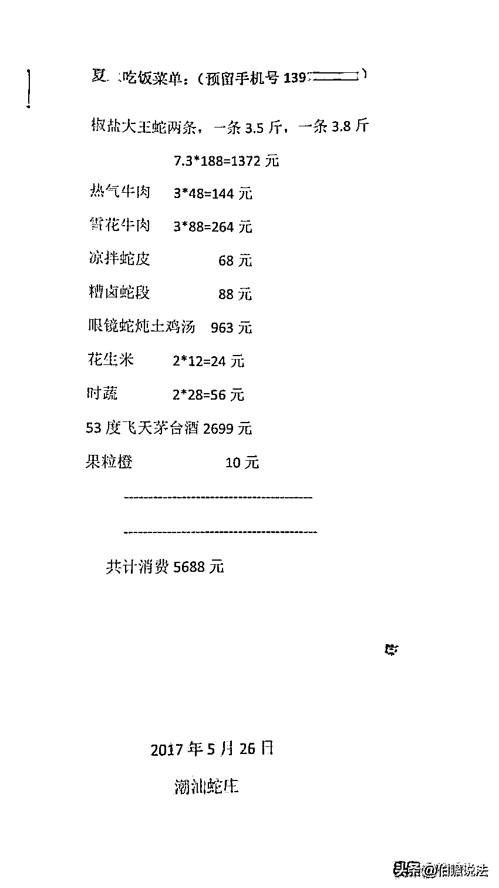
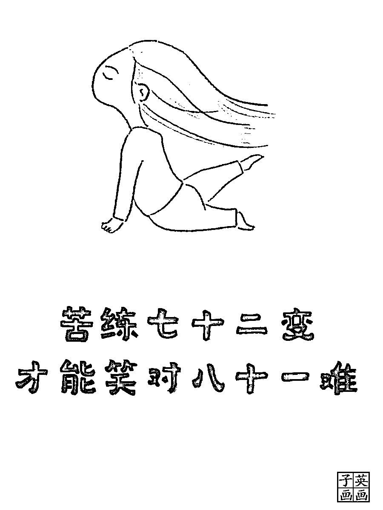

# 去当事人店里吃野味、喝茅台，不管是否属于刑事侦查行为，民警都应该付款！

> 原文：[`mp.weixin.qq.com/s?__biz=MzIyMDYwMTk0Mw==&mid=2247544026&idx=3&sn=e6651a7fdb75fae48372b8b7aa0f7993&chksm=97cbe7e2a0bc6ef4d77d89ed3e2407377f93c6aaea38dd2d3518ce69f46978652b722789b027&scene=27#wechat_redirect`](http://mp.weixin.qq.com/s?__biz=MzIyMDYwMTk0Mw==&mid=2247544026&idx=3&sn=e6651a7fdb75fae48372b8b7aa0f7993&chksm=97cbe7e2a0bc6ef4d77d89ed3e2407377f93c6aaea38dd2d3518ce69f46978652b722789b027&scene=27#wechat_redirect)

1

2022 年 9 月 15 日上海市公安局发布通报：

针对群众反映“杨浦分局长白新村派出所民警于 2017 年 5 月办案期间就餐未付款”一事，市公安局党委高度重视，已责成督察总队、法制总队、杨浦分局成立联合调查组，全面查清事实情况。警方将根据调查结果，严格依规依纪依法进行处理。

至此，说明网上流传的“杨浦分局长白新村派出所民警于 2017 年 5 月办案期间就餐未付款”确实是真实存在。

2

说来，引发这次舆情的是上海市宝山区人民法院（2022）沪 0113 民初 13538 号民事裁定书。

原告葛某某是名餐饮业主。

被告夏某是名在职警察。

原告葛某某请求判令被告支付餐费人民币 5688 元。理由是：**2017 年 5 月 26 日**，被告至原告开设的位于本市闵行区虹梅路 3219 号二楼餐厅预订包房并留下个人手机号，谎称自己姓吴，要请领导吃饭。第二天，来了四人在包房消费了一瓶飞天茅台酒在内的野味大餐，共计 5688 元。但被告仅支付了让原告购买香烟的 300 元，餐费至 2022 年 7 月 16 日未付。

3

法院查明：

原告在本市闵行区虹梅路 3219 号三楼潮汕蛇庄经营蛇类火锅等食品。**2017 年 5 月 25 日**，公安机关在上述店铺内查获待销售的眼镜蛇三条，并于次日将原告抓获。经鉴定，涉案的三条眼镜蛇为舟山眼镜蛇，系《濒危野生动植物种国际贸易公约》附录二物种。后原告因非法出售珍贵、濒危野生动物罪，被**法院判处拘役四个月又十五日，并处罚金人民币一千元**。

4

这里有个疑问：25 日警方已经查获了野生动物，那 26 日去吃饭和案件有什么关系？

再说，明知该业主涉嫌犯罪，还要去人家的饭店用餐，**学过回避这个法律概念没有？**

**5**

审理中，被告表示其系长白新村派出所民警，原告所述不实，被告去原告处系**侦查行为**。

后本院至长白新村派出所调查，长白新村派出所向本院表示，被告系该所民警，当日至原告处就餐系**刑事侦查行为**。

被告的民警说是刑事侦查行为，派出所也表示是刑事侦查行为，这好像没毛病。

法院经审查认为，本案不属于民事诉讼的受理范围，对原告的诉请应当驳回起诉。

6

这份裁决在法律人圈子形成轩然大波，到饭店吃饭也是侦查行为？即便是侦查行为，你吃饭也得给钱啊！

《食品安全法》第八十七条　县级以上人民政府食品安全监督管理部门应当对食品进行定期或者不定期的抽样检验，并依据有关规定公布检验结果，不得免检。**进行抽样检验，应当购买抽取的样品，委托符合本法规定的食品检验机构进行检验，并支付相关费用；不得向食品生产经营者收取检验费和其他费用**。

7

本案中被告吃的野味大餐不知是不是违法野生动物，如果是，作为办案警察就不应该食用，如果不是，就与案件无关，自然就当付钱。

8

本案还有个问题，那就是到底是刑事侦查行为还是民事消费行为。

我们知道，公安机关是行政机关，同时依法具有一定的刑事司法职能。判断公安机关没收行为的性质，是行政行为还是刑事行为，应以法律及司法解释的规定为准。

最高人民法院行政庭 2000 年 4 月 28 日《**关于如何界定公安机关的行为是刑事侦查行为还是具体行政行为请示的答复意见**》内容为：“**公安机关不举证或所举的证据不能证明其实施的行为系刑事诉讼法明确授权的行为，法院不宜认定其是刑事司法行为**”。

最高人民法院赔偿委员会 2003 年 7 月 18 日《关于公安机关作出没收决定应视为具体行政行为不属于刑事赔偿范围的批复》内容为：“**公安机关在刑事案件中作出的没收决定应视为具体行政行为，不属于刑事赔偿调整范围**”。

最高人民法院《关于适用〈中华人民共和国行政诉讼法〉的解释》第一条规定：“公民、法人或者其他组织对行政机关及其工作人员的行政行为不服，依法提起诉讼的，属于人民法院行政诉讼的受案范围。下列行为不属于人民法院行政诉讼的受案范围：**（一）公安、国家安全等机关依照刑事诉讼法的明确授权实施的行为**”。

据此，公安机关刑事行为与行政行为之区分标准，取决于该行为是否属刑事诉讼法明确授权的行为。

尽管事后原告因非法出售珍贵、濒危野生动物罪，被**法院判处拘役四个月又十五日，并处罚金人民币一千元****。**

**但这与这次吃饭有关系吗？如果有，当事警察是不是也是违法食用？**

**9**

这些年，确实有些案例让人看了不知是想哭还是想笑。

河南省高级人民法院（2018）豫行再 106 号行政判决书：

扶沟县公安局行政新区办公大楼由焦作三建建设工程有限公司承建，杨普荣系焦作三建该工程项目部财务负责人。2016 年 7 月 7 日，扶沟县公安局从老办公区向新办公大楼搬迁。因工程款纠纷，杨普荣阻止其搬迁。2016 年 7 月 7 日，扶沟县公安局作出扶公（城）行罚决字〔2016〕0322 号行政处罚决定书，认定其行为扰乱了扶沟县公安局正常的工作秩序，对杨普荣作出行政拘留 7 日的行政处罚。杨普荣不服，提起本案诉讼，结果一审二审均败诉。

在河南省高级法院再审中，法院认为：

（一）被诉行政处罚决定认定事实的主要证据不足。

1、扶沟县公安局与焦作三建公司、杨普荣因工程欠款和工程交付发生纠纷，在该事件中，扶沟县公安局与杨普荣之间的法律关系属于平等民事主体之间的经济纠纷。

2、杨普荣行使工程交付抗辩权具有正当理由。本案中，焦作三建承建了扶沟县公安局新办公大楼的建设施工项目，工程完工后，双方存在工程款结算争议，工程款未支付完毕，且尚未验收合格，不具备交付使用的条件。杨普荣作为该项目负责人向扶沟县公安局主张欠付的工程款未果并发生争议，在此情景下，双方应当依法通过平等协商或提起民事诉讼的途径解决，避免矛盾的激化而妥善处理。在争议未解决之前，建设项目不具有交付的条件下，对扶沟县公安局实施搬迁和使用的行为，**杨普荣进行阻止具有一定的正当事由与合理性。**

3、扶沟县公安局向新办公楼搬迁时的状态属于非办公状态和非执行公务状态。搬迁过程中，扶沟县公安局实施的是将办公家具及物品搬运到新办公楼，该办公楼办公设施尚未具备齐全，扶沟县公安局也未提交证据证明搬迁当天新办公楼已经启用对外办公，或其已在新办公楼开始进行公务活动，**应认定扶沟县公安局当时不属于办公和执行公务的状态，故杨普荣阻止扶沟县公安局搬运家具及物品的行为不构成扰乱行政机关办公秩序的法定要件**。

4、被诉行政处罚决定认定杨普荣违法情节的事实不清。扶沟县公安局作出的行政处罚决定书中，认定杨普荣违法情节为“一般”，但适用的法律条款是违法情节“较重”的情形，行政处罚决定书认定的违法情节和使用的条款在文字表现和字面内容上明显不属于同一概念。扶沟县公安局辩称根据其内部解释，治安管理处罚条例第二十三条中的“较重”在处罚决定书上书规范为“一般”，该书写形式不影响事实认定和法律适用的理由，没有事实和法律依据，本院不予采信。

10

我们看到，这些年由于法律法规出台越来越多，一些本来简单的问题却越来越复杂化。

说到上海这事，其实倒也简单：**即便是刑事侦查到人家饭店吃饭，可以不给钱吗？另外，如果知道饭店涉嫌犯罪，作为侦查机关还去吃饭，这可以吗？**

这么简单的问题，难道还用什么高深的法学理论来解释？

来源：法律学堂， 宾曰语云 作者：王学堂 

欢迎关注灰产圈社群服务号

