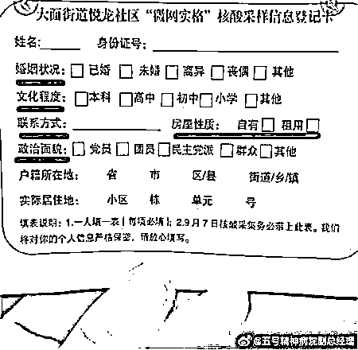
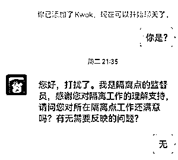
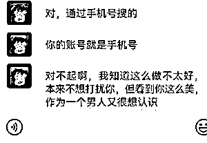
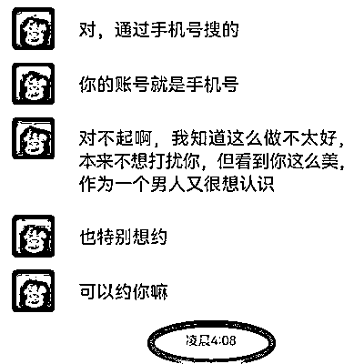
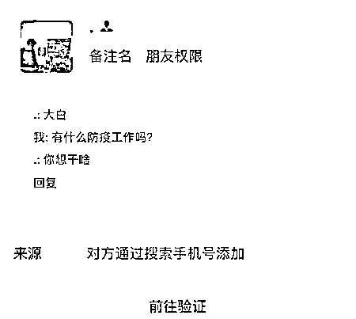
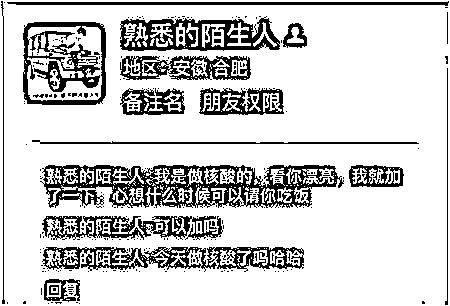

# 做个核酸而已，为何非要搞得像政审？

> 原文：[`mp.weixin.qq.com/s?__biz=MzIyMDYwMTk0Mw==&mid=2247544026&idx=4&sn=0068406ad8436876d2fb4df8b0f5dc00&chksm=97cbe7e2a0bc6ef4240c65e54e67bcd0fc8b44f97114461922076d6cd9bda4efff91e83b00e1&scene=27#wechat_redirect`](http://mp.weixin.qq.com/s?__biz=MzIyMDYwMTk0Mw==&mid=2247544026&idx=4&sn=0068406ad8436876d2fb4df8b0f5dc00&chksm=97cbe7e2a0bc6ef4240c65e54e67bcd0fc8b44f97114461922076d6cd9bda4efff91e83b00e1&scene=27#wechat_redirect)

有些人，有些事，一天天越来越不正常了。

网传一份某社区核酸采样信息登记卡，让小伙伴们惊呆了，这是做核酸呢还是查户口搞政 审？

这张登记卡上，列有姓名、身份证号、婚姻状况、文化程度、联系方式、房屋性质、政治面貌、户籍所在地、实际居住地等要求填写的信息，且在填表说明中标明：**每项必填。**

就想问问你们这些大白：**老资的婚姻状况关你屁事，文化程度关你屁事，住房性质关你屁事，政治面貌关你屁事……**

问了这么多，你们包着介绍婚姻呢，包着提升学历呢，包着介绍房源呢，还是包着入 党呢？

凭什么，你们要获得我们这么详尽的信息，谁授予你们的权力，可以如此胡作非为？

虽说你们承诺“我们将对你的个人信息严格保密，请放心填写”，我还是特么一百个不放心，这种承诺有个卵用？

记得前些日子，曾在微博上看到过好几起大白利用职务之便添加微信骚扰女孩的，把信息填写这么完整，岂不更让某些动机不纯者有了可乘之机？ 

大疫三年，每到一个地方，都要提供个人的详细信息，包括联系方式、身份证号、详细住址等，没有最细，只有更细。

每每在填写的时候，都暗捏一把汗，要是这其中有人心存不良，自己的信息岂不传得到处都是？只能祈祷，你遇上的都是好人。

国人饱受信息泄漏之苦，比如买个车，车还没开回家，返还补贴的诈骗电话就来了；保险到期前两个月，几乎每天都要接到各保险公司的推销电话。

特别是今年，经常还会接到一些这样的诈骗短信，前面写着你的名字，后面则是“操 13”、“抠 妹”一类的链接，一看来源，居然也有歪国号……

首先声明，老资从没用手机号注册去看那些不可描述网站，我的信息到底是怎么泄露的？可惜第一时间就把短信删掉了，不然让你们也开开眼。

当下，我们的口罩越戴越紧，信息却越来越透明，好有一比：**光着身子，戴着严密的 N95，在大街上一路果奔……**

这是一种怎样的屈辱、恐慌与无助？

问题是，当他们向你索要这些信息时，你敢不提供吗？多说两句就是不配合，声音大点就是妨碍抗 疫，问个为什么就走在了被带走训诫乃至行拘的道路上。

就像这份信息卡，你们收集了以后，会不会录入电脑，电子文档存储安全吗，具体上传了哪个系统，哪些工作人员能看到这些信息，原始信息是否按涉密保存，一旦出现泄密如何补救……

如果半点保密意识也没有，收集回去往社区办公室随意一丢，随便什么人都能看到，会不会被卖给有些动机不纯之人？

最关键的问题是，你们收集了这些信息根本没用，只需要个人身份证号、手机号上传核酸检测信息足矣，何必要增加人力物力干这些让人天怒人怨的事呢？

一言以蔽之：**吃饱了撑的，一群混蛋！**

来源：疾风忍法帖 作者：风中劲草 one2

欢迎关注灰产圈社群服务号

