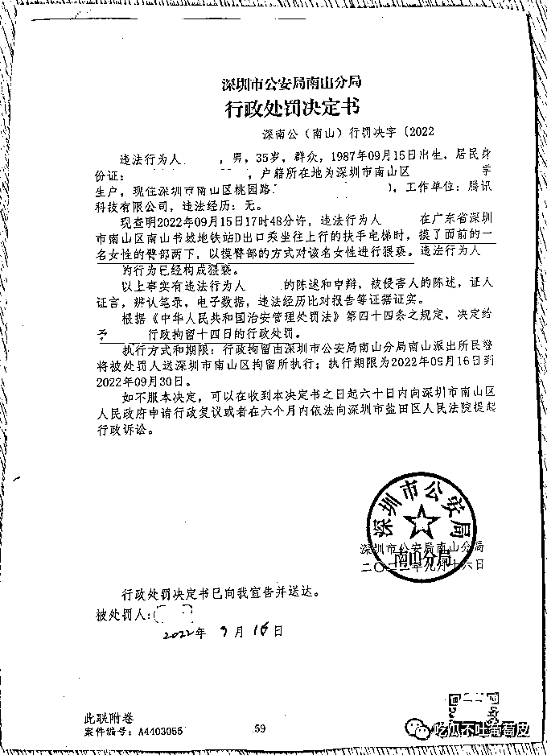

# 鹅厂工程师上演“电梯痴汉”，在手扶电梯上摸未成年女生下体被当场抓获！

> 原文：[`mp.weixin.qq.com/s?__biz=MzIyMDYwMTk0Mw==&mid=2247544026&idx=5&sn=379a9519b9c9bbe1dd9b7e5ffd844a55&chksm=97cbe7e2a0bc6ef4a4b5f51d8d13d45048b8105aec72fe629278f491370370c9510aaae40969&scene=27#wechat_redirect`](http://mp.weixin.qq.com/s?__biz=MzIyMDYwMTk0Mw==&mid=2247544026&idx=5&sn=379a9519b9c9bbe1dd9b7e5ffd844a55&chksm=97cbe7e2a0bc6ef4a4b5f51d8d13d45048b8105aec72fe629278f491370370c9510aaae40969&scene=27#wechat_redirect)

腾讯一直以来信奉正直的价值观，要求每位腾讯人坚守底线，以德为先，坦诚公正不唯上。为共同守护腾讯的企业文化，构建健康和安全的工作环境传递正能量。但偏偏就有员工顶风作案，现 TEG 研发管理部应用开发工程师吕某于 2022 年 9 月 15 日晚 18 点 45 分，**在南山书城地铁站 D 出口扶手电梯上猥亵未成年初中女生，用手触摸女生下体**，当事女学生勇敢面对，现场抓住该腾讯员工，并大喊路人协助帮忙，报警处理。

[`mp.weixin.qq.com/mp/readtemplate?t=pages/video_player_tmpl&action=mpvideo&auto=0&vid=wxv_2579382042447314947`](https://mp.weixin.qq.com/mp/readtemplate?t=pages/video_player_tmpl&action=mpvideo&auto=0&vid=wxv_2579382042447314947)

经过南山公安局的调查取证及证人证言，以及辨认笔录，电子监控数据等证据证实。腾讯该员工违反中华人民共和国治安管理处罚法，第四十四条规定，**公安机关决定给予吕某行政拘留十四天的行政处罚。执行期为 2022 年 9 月 16 日到 2022 年 9 月 30 日。**

腾讯是互联网行业内的榜样，腾讯员工阳光正直是最基本的标准。该部门员工触犯法律，对未成年女学生伸出魔爪，残害祖国花朵，让受害人心理产生严重阴影。

当事女生的母亲恳请腾讯公司对该员工的违法行为高度重视，以保证与正直价值观相悖的行为得到严肃地处理。该员工违法行为证据确凿，吕某供认不讳。现已触犯腾讯高压线，请求腾讯公司给予该涉案员工吕某辞退处理，还女孩子公道，让其他青少年远离人渣败类、远离危害，保护腾讯员工能在一个正直阳光健康的环境下工作。

来源：吃瓜不吐葡萄皮

我们小分队在滇西北找矿。小分队一共 8 人，其中 4 名警卫战士每人配备一支冲锋枪。一天，出发前，一位纳西族老乡搭我们的车去维西。那天路上积雪很大，雪下的路面坑洼不平，车子行驶一段就会被雪坞住。我们不得不经常下来推车。就在我们又一次下车推车的时候，一群褐黄色的东西慢慢向我们靠近。我们正惊疑、猜测时，纳西族老乡急喊：“快、快赶紧上车，是一群狼。”司机小王赶紧发动车，加大油门……但是很不幸，车轮只是在原地空转，根本无法前进。这时狼群已靠近汽车……大家看得清清楚楚——8 只狼，个个都象小牛犊似的，肚子吊得老高。战士小吴抄起冲锋枪，纳西族老乡一手夺下小吴的抢。比较沉着地高声道：“不能开枪，枪一响，它们或钻到车底下或钻进树林，狼群会把车胎咬坏，把我们围起来，然后狼会嚎叫召集来更多的狼和我们拼命。”他接着说：“狼饿疯了，它们是在找吃的，车上可有吃的？”我们几乎同声回答：“有。”“那就扔下去给它们吃。”老乡像是下达命令。从来没有经历过这样的事，当时脑子里一片空白，除了紧张，大脑似乎已经不会思考问题。听老乡这样说，我们毫不犹豫，七手八脚把从丽江买的腊肉、火腿还有十分珍贵的鹿子干巴往下丢了一部分。狼群眼都红了，兴奋地大吼着扑向食物，大口的撕咬吞咽着，刚丢下去的东西一眨眼就被吃光了。老乡继续命令道：“再丢下去一些！”第二批大约 50 斤肉品又飞出了后车门，也就一袋烟的工夫，又被 8 只狼分食的干干净净。吃完后 8 只狼整齐地坐下，盯着后车门。这时，我们几人各个屏气息声，紧张的手心里都是冷汗，甚至能够清晰的听到自己心跳的声音……我们不知道能有什么办法令我们从狼群中突围出去。看到这样的情形，老乡又发话道：“还有吗？一点不留地丢下，想保命就别心疼这些东西了！”此时，除了紧张、害怕还有羞愤……！作为战士，我们是有责任保护好这些物资的，哪怕牺牲自己。但是现实情况是我们的车被坞到雪地里出不来，只能被困在车里。我们的子弹是极有限的，一旦有狼群被召唤来，我们会更加束手无策。我们几人相互看了一眼，迟疑片刻，谁也没有说什么，忍痛将车上所有的肉品，还有十几包饼干全都甩下车去！8 只狼又是一顿大嚼。吃完了肉，它们还试探性的嗅了嗅那十几包饼干，但没有吃。这时我清楚地看到狼的肚子已经滚圆，先前暴戾凶恶的目光变得温顺。其中一只狼围着汽车转了两圈，其余 7 只狼没动。片刻，那只狼带着狼群朝树林钻去......不可思议的事情发生了……不一会儿，8 只狼钻出松林，嘴里叼着树枝，分别放到汽车两个后轮下面。我们简直不敢相信自己的眼睛……这些狼的意思是想用树枝帮我们垫起轮胎，让我们的车开出雪窝。我激动地大笑起来……哈……哈……刚笑了两声，另外一个战士忙用手捂住了我的嘴，他怕这突兀的笑声惊毛了狼。接着，8 只狼一齐钻到车底，但见汽车两侧积雪飞扬。我眼里滚动着泪花，大呼小王：“狼帮我们扒雪呢，赶快发动车，”车启动了，但是没走两步，又打滑了。狼再次重复刚才的动作：“先往车轮下垫树枝，然后扒雪……”。就这样，每重复一次，汽车就前进一段，大约重复了十来次。最后一次，汽车顺利地向前行了一里多地，接近了山顶。再向前就是下坡路了。这时，8 只狼在车后一字排开坐着，其中一只比其他 7 只狼稍稍向前。老乡说：“靠前面的那只是头狼，主意都是他出的。”我们激动极了，一起给狼鼓掌，并用力地向它们挥手致意。但是这 8 只可爱的狼对我们的举动并没有什么反应，只是定定地望了望我们，然后，头狼在前，其余随后，缓缓朝山上走去，消失在松林中......看完不忍思考：连凶猛的狼都懂得报恩，我们是否应该反思自身？自诩为“万物灵长”的人类，我们是不是应当让这个世界充满爱

欢迎关注灰产圈社群服务号

