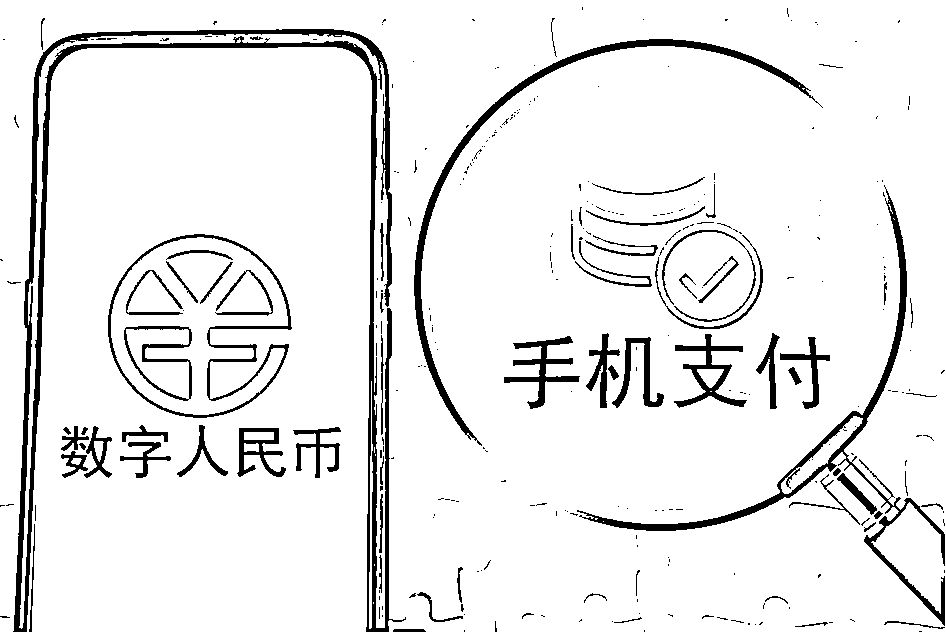
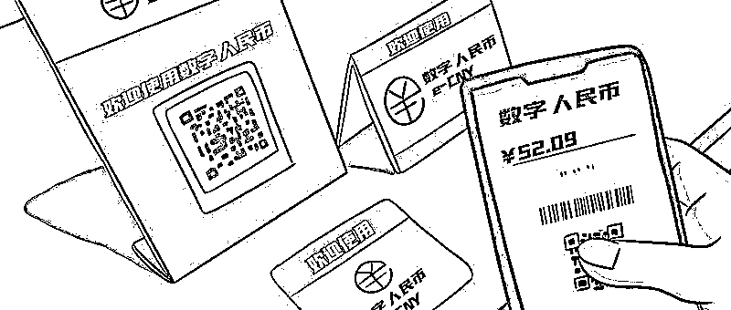

# 数字人民币也被骗局“蹭热点”！谨防打着“数字人民币”旗号的新型诈骗！

> 原文：[`mp.weixin.qq.com/s?__biz=MzIyMDYwMTk0Mw==&mid=2247544026&idx=8&sn=2bd580aa1b629d77010af936a88070b7&chksm=97cbe7e2a0bc6ef44fd27e4919237130e440f3121dcc25aa7bcbceb7e02f099bb61f639e9208&scene=27#wechat_redirect`](http://mp.weixin.qq.com/s?__biz=MzIyMDYwMTk0Mw==&mid=2247544026&idx=8&sn=2bd580aa1b629d77010af936a88070b7&chksm=97cbe7e2a0bc6ef44fd27e4919237130e440f3121dcc25aa7bcbceb7e02f099bb61f639e9208&scene=27#wechat_redirect)

**近几年，随着国家数字经济战略的推进，以及微信支付、支付宝、银联云闪付等非传统货币支付方式的兴起和推广，加速了数字人民币（DC/EP）的问世。截至目前，数字人民币试点已拓展至全国 15 个省市的 23 个地区。**

**但是，随着数字人民币的推广普及，部分不法分子也瞄准了这一新鲜事物，各类打着数字人民币旗号的骗局和犯罪活动开始冒头。今天我们就一起来看看都有哪些数字人民币骗局。**

**什么是数字人民币？**

部分不法分子之所以能打着数字人民币的旗号实施诈骗等犯罪活动，**很大的一个原因就是大众对数字人民币相对缺乏了解。**所以，在分享数字人民币骗局前，我们先来了解下什么是数字人民币。

**①什么是数字人民币？**

数字人民币，是由中国人民银行发行的数字形式的法定货币，由指定运营机构参与运营并向公众兑换，以广义账户体系为基础，支持银行账户松耦合功能，与纸钞硬币等价，具有价值特征和法偿性，支持可控匿名。字母缩写按照国际惯例暂定为“e-CNY”

也就是说，**数字人民币是数字形式的法定货币；和纸质人民币以及硬币等价。**

**②数字人民币≠虚拟货币**

有部分人会问：数字人民币是不是就是虚拟货币？它和虚拟货币有什么区别？

**数字人民币与虚拟货币有本质上的不同，最大的区别就是：**

数字人民币是有国家信用背书、有法偿能力的法定货币，其效力和安全是最高的，更加稳定可靠，可以追踪到每一笔钱的去向，可有效起到反洗钱的作用；

虚拟货币是一种虚拟资产，没有实际价值支撑。在我国，虚拟货币不具有法偿性和强制性等货币属性，不具有与货币等同的法律地位，不能且不应作为货币在市场上流通使用，公民投资和交易虚拟货币不受法律保护。

**③数字人民币与微信支付/支付宝的区别**

**本质上的不同**：通俗来讲，数字人民币是法币，是钱本身；而微信支付、支付宝是支付工具；

**经营主体不同**：数字人民币是由中国人民银行发行的，有国家信用背书；而微信支付、支付宝是公司经营，商业化运作；

**隐私性不同**：数字人民币具有可控匿名性，商户和第三方平台均无法获取消费者的身份信息和支付数据；而微信支付和支付宝都需要用户实名认证，才能进行支付活动；

**对网络的依赖不同**：数字人民币在收付款双方都没有网络的情况下依然可以完成支付；而微信支付、支付宝需依赖网络完成支付； 

**目前数字人民币已经可以与微信支付、支付宝相互兼容**。微信支付、支付宝已经开通了关联数字人民币功能，在支付页面可选择使用零钱账户的钱，或关联的某一家银行，或数字人民币；而数字人民币也可以关联微信支付、支付宝，通过后两者，充值到数字人民币 APP。

******数字人民币常见骗局******

不法分子利用数字人民币交易的隐蔽性，以及群众对数字人民币缺乏了解等特点实施诈骗，并利用数字人民币钱包转移诈骗资金，达成洗钱目的。 

1.**数字人民币洗钱**

数字人民币具有可控匿名性，这是一种对数字人民币交易的隐私保护。而正是这“匿名性”被部分不法分子盯上，用其来进行赃款转移，进行赃款洗白。

2021 年 11 月 2 日，河南省新密市公安部门就破获了全国首例利用数字人民币进行洗钱的案件，当地公安在侦破一起电信网络诈骗案件时，发现诈骗团伙利用数字人民币进行洗钱，以逃避公安机关的打击查处。

**数字人民币洗钱手法**

****

** 租用或者购买数字人民币账户进行洗钱 **

跟利用银行卡进行赃款转移手法一样，只不过将洗钱工具换成了数字人民币。不法分子通过发布兼职广告，收购或者租用普通民众的数字人民币账户，然后将赃款转移到这些数字人民币账户中，再进行转出，企图以此躲避追查； 

** 通过数字人民币跑分洗钱 **

不少跑分平台已经开通了数字人民币接口，召集普通民众使用数字人民币跑分转移赃款尤其是赌博平台的赌资。

**七星锤提醒**

普通民众千万不要轻易租售自己的银行卡、数字人民币账户，一旦被不法分子利用进行洗钱，可能会成为犯罪分子的“背锅侠”，并承受相关的法律惩罚。

不要轻信“高额回报”、“轻松赚外快”的诱惑而参与跑分活动，成为不法分子洗钱的“帮凶”。

据公安民警透露，利用数字人民币洗钱是一种新型犯罪活动，洗钱案件涉及的数字人民币钱包虽然是实名制认证的，但警方并无权直接获取相关信息，需要和金融机构、第三方支付清算公司等多方沟通确认，才可以调取相关信息，这给不法分子提供了可乘之机。

2.**数字人民币骗局**

数字人民币作为一种新鲜事物，尤其还跟金钱有关，很难不被不法分子盯上。目前全国各地警方已经破获了多起数字人民币相关的诈骗案件，而采用数字人民币实施诈骗的手段还在不断翻新。

**常见的数字人民币诈骗套路**

** “冒充公检法”诈骗 **

这种骗局不法分子一般会冒充国家公职人员，以“违反疫情防控政策”、“银行账户涉嫌洗钱/诈骗等犯罪”、“社保卡被冒用”、“通过手机发布过违法信息”等借口增加受害者的恐慌心理，以需要调查为由诱导受害者提供个人身份、银行卡、手机号、验证码、视频录制的正面照片等信息，开启屏幕共享，神不知鬼不觉的给受害者开通数字人民币账户，然后转走受害者的资产。或者直接诱导受害者开通数字人民币账户，并绑定银行卡，然后以需要转账进行“资金核查”，引导受害者转账到不法分子的数字人民币账户。

为了获取受害者的信任，增加其恐慌感，不法分子还会向受害者展示假的公检法工作证件、假的通缉令等文件和手续。

** 数字人民币预约登记诈骗 **

发布虚假的“数字人民币试点发行预约登记”诈骗活动，吸引受害者关注。一旦受害者误入活动，就会被被告知预约登记成功，需要点击某个链接完善个人信息，并充值一定金额才能体验数字人民币。

殊不知，这个链接地址可能就是个钓鱼链接，一旦充值，受害者的资产就被不法分子转走了。

** 冒用数字人民币名义的投资诈骗 **

不法分子冒用人民银行名义，将相关数字产品或者投资项目冠以“央行数字币”、“DCEP”等跟数字人民币相关的名称，误导受害者进行投资，或者发展下线，最后卷走受害者的投资跑路。

** 仿冒数字人民币 APP **

诱导受害者在非官方渠道下载虚假、仿冒的数字人民币 APP。一旦受害者下载了这些软件，轻则个人信息被盗取，重则个人资产被盗取。

另外在一些购物诈骗、资金盘诈骗、养老项目诈骗中，不法分子也会诱导受害者开通数字人民币账户，以方便不法分子转移诈骗赃款。

**七星锤提醒**

不要随意提供自己的个人身份信息、银行卡、手机验证码、共享屏幕、视频录制的正面照片等； 

数字人民币处于试点阶段，除数字人民币官方活动中签通知的链接外，不要相信和下载安装其它来源的所谓的“数字人民币 App”。

不要参与任何借数字人民币名义开展的炒股、理财、推广、经营活动，也不要加入任何以入会、入股、福利为诱饵邀请加入数字人民币讨论群组；

一旦遇到相关的诈骗活动，请第一时间报警，数字人民币采取“小额匿名、大额可溯”的设计，可有效对相关犯罪活动进行打击和资金追溯，避免财产损失。

从以上骗局，我们可以看出不法分子利用数字人民币实施骗局成功的关键点有：**1）诱导受害者提供个人身份信息、银行卡、手机号、验证码、正面照片等隐私资料；2）诱导受害者开通数字人民币账户；3）诱导受害者充值转账。**所以，任何时候，我们都一定不要被贪图小利、想要投资致富、盲目相信权威等心理蒙蔽，一旦涉及到提供个人隐私信息、金钱、转账，就要提高警惕，多方核实，不要误入骗子的陷阱。

随着数字人民币的普及，相关的骗局越来越多，并且结合当下热点不断翻新诈骗手法，已有不少民众中招，遭受财产损失。

为了更便捷、更安全的使用数字人民币，作为普通民众要多普及相关知识，避免因为对数字人民币缺乏了解而掉入骗子的陷阱。同时，还要提高防骗意识，避免被骗。

来源：七星实验室

欢迎关注灰产圈社群服务号

