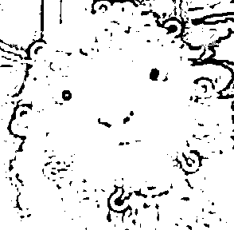

# 警方提醒：《羊了个羊》爆火！小心，背后套路满满！网友：该叫“诈了个骗”

> 原文：[`mp.weixin.qq.com/s?__biz=MzIyMDYwMTk0Mw==&mid=2247544063&idx=1&sn=e311942ced9573c80eb238bb09e25439&chksm=97cbe7c7a0bc6ed17c56751fe9e467e86da2a9a72543454e30d3ee79cee246330580837de666&scene=27#wechat_redirect`](http://mp.weixin.qq.com/s?__biz=MzIyMDYwMTk0Mw==&mid=2247544063&idx=1&sn=e311942ced9573c80eb238bb09e25439&chksm=97cbe7c7a0bc6ed17c56751fe9e467e86da2a9a72543454e30d3ee79cee246330580837de666&scene=27#wechat_redirect)

****

因为玩法简单，但难度系数高 

大家都热衷于挑战冲关

所以马上成为新的一个休闲（摸鱼）“神器”

这个疯狂的小游戏上线不久

一款名为《羊了个羊》的小游戏

一度冲上微博热搜第一

这款号称通关率不到 0.1%的小游戏

让不少网友发声求“通关秘籍”

## 为什么《羊了个羊》这么难？

还这么火？ 

背后是否存在什么套路？

**小程序游戏走红**

《羊了个羊》是一款卡通背景

消除闯关微信小游戏

**玩法****：**游戏以麻将消除为玩法原型。下方共有 7 个空位，从上方拿 3 个同样图案的方块后即可消除，拿完所有方块即胜利通关，而 7 个空位被填满则失败。

但从第二关开始就飙升的难度

让游戏一下成为社交圈热门话题

**“本来不知道是啥**

**看到热搜好奇点开**

**结果玩了一下午**

**第二关是故意卡人的吧？”**

**“有人能过第二关吗？”**

类似的疑惑在社交平台上并不少见

不服气的网友一拨又一拨地

点开微信小游戏

推高了相关话题的热度

截至目前

已有**超 100 万人**玩过了这款游戏

自 9 月 13 日午间起

《羊了个羊》**在****24 小时内服务器三次崩溃**

为什么网友对它如此“上头”？ 

分析发现，游戏的背后利用了

这些营销套路

**套路一：以高难度进行反向营销**

《羊了个羊》设置了 3 个道具帮助通关，玩家可以通过**社****交分享**获取。

“以往的游戏规则，难度小幅度提升，而这款游戏刺激性太强，第二关几乎只有 0.1%玩家才能通过。”游戏产业分析师张书乐认为，从游戏心理上看，**始终无法过关会带来强烈的胜负欲**，为了获得更多游戏机会和道具，**又通过社交网络进行分享，就形成滚雪球效应****。**

玩家反馈游戏难度。

**套路二：植入广告，实现变现**

《羊了个羊》目前收入主要依靠广告。玩家在闯关中失败，**可通过观看广告获得道具**。游戏难度极高意味着玩家会频繁失败，观看广告次数也会直线攀升。

虽然不少玩家越玩越“上头”，但也忍不住评论称：**“他就是想让你看广告，你以为真想让你过关啊。”“ 它明明可以直接让你看广告赚钱，却还是让你玩了个游戏”**

有网友估算，按一局使用 3 个道具估算，**玩 50 盘游戏大概要看 75 分钟的广告****。**

（数据来源：人民众云）

（数据来源：人民众云）

****背后研发团队仅 3 人**** 

# **这家上市公司间接持股**

据天眼查 APP，《羊了个羊》的运营公司为**北京简游科技有限公司**，成立于 2021 年 1 月，注册资本约 117 万元。法人代表为张佳旭，持股比例为 85.5%，**厦门雷霆网络科技股份有限公司**持股比例为 10%，**北京乐闪科技有限公司**持股比例为 4.4%。

厦门雷霆网络科技股份有限公司的大股东是**厦门雷霆互动网络有限公司**，持股比例 60%，该公司为**吉比特**（A 股主板上市游戏公司，旗下研运《问道》《摩尔庄园》等多款热门产品）100%持股的全资子公司。

吉比特也在投资者互动平台回复中表示，其**间接持有北京简游科技有限公司 10%的股权**。

《羊了个羊》运营公司信息。

尽管有重量级游戏公司参股，但具体到《羊了个羊》项目本身，其研发团队规模并不大。据小犀财经报道，张佳旭在接受其采访中表示，**“整个小游戏的研发团队只有 3 个人，总共开发了 3 个月，进行版本更迭。”**

除了《羊了个羊》以外，这家公司还研发了如《开局托儿所》《疯狂擦一擦》《消灭屎壳郎》《解救大西瓜》等。从 2021 年年报上看，这家公司的参保人数仅 7 人。

**否认抄袭，将上线独立 APP**

根据网友反馈，“《羊了个羊》抄袭《3tiles》，玩法一模一样”。但也有网友认为，多层连连看游戏玩法均相似，不构成抄袭。 

左：《羊了个羊》，右：《3 tiles》

据中新经纬微博消息，针对此事，《羊了个羊》关联公司相关负责人**否认《羊了个羊》抄袭《3tiles》**。该负责人表示，《羊了个羊》游戏使用的是**最基础的游戏玩法**，如果“连成三个”的玩法就算抄袭，那这样的游戏也太多了，并表示公司不会对此理会，用户自然有自己的判断。

该负责人还透露，**《羊了个羊》的独立 APP 正在苹果商店审核阶段**，具体上线日期还不清楚，游戏内容方面下一步将有一大波内容更新，包括游戏周边内容都会陆续加入其中。

**更多小游戏套路**

*   **中奖诱惑玩家付费**

以去年爆火的小程序游戏《合成大西瓜》为例，就是凭借诱导性的广告，让玩家在玩游戏时，领取游戏界面弹出的带有“100 手机话费券”。

大量网友在社交媒体上反馈称，领取了所谓的“100 手机话费券”，但在按网站指示支付了 9.9 元或 19.9 元后却发现**话费无法兑现，也不能退款****。**

*   **提现环节连环挖坑**

除中奖的诱惑外，还有不少小游戏直接给钱，但提现的过程几乎让人崩溃。

如近几年流行的《阳光金币屋》《欢乐养猪场》《欢乐摇钱树》等小游戏，其中《阳光金币屋》明确设置了 75 元的提现门槛，让很多玩家升级动力十足。

有玩家反馈，一开始很容易就升级到三四十元，可是此后每日任务给的金币也开始变少，但距离提现额度还差 15 元的时候，可能需要持续玩半年。当用户辛苦积攒够提现门槛的 75 万金币时，**又弹出新要求，需要拉五个人头**，每个人头玩够 30 万金币才可以提现，**这也让用户几乎不可能真的提现成功****。**

*   **99% 误点广告几率**

还有部分小游戏在界面设计中，很容易就点到广告链接。此类小游戏一般玩法简单粗暴，很容易满足用户的虚拟成就感，以《我的逆袭人生》小游戏为例，广告误点率为 99%，甚至动不动就会自动下载个 APP。以现在 APP 的获客成本看，通过小游戏的方式获客无疑是一种低成本且效率很高的方式。

就拿《羊了个羊》这款小程序游戏来说，玩家进入游戏界面时需要授权个人信息。如果购买了代玩服务，则需要将自己的**微信账号和密码**交给卖家，相当于将自己微信中所有私人信息全部交给一个陌生人，而这些信息关乎着你的家庭、工作、生活……试想一下，如果这些信息泄露在互联网中，又会造成怎样的后果呢？

此前，就有诈骗团伙借代练的名义骗取了玩家微信账号和密码，并向其亲朋好友群发信息进行诈骗，也有不少游戏曝出过被代练者盗取信息随意兜售造成信息泄露的新闻。代练服务**屡屡暴雷**，除了需要平台加强相应管控外，也值得我们每个人提高防范意识。

大数据时代，隐私泄露离我们并不遥远，个人信息和隐私安全需要我们每个人都加以重视。同时，大 R 在此提醒大家，日常生活中要提高警惕，注意保护个人隐私，防范隐私泄露！

**你玩过这些小游戏吗？**

**对于《羊了个羊》的爆火**

**网友：明明可以直接让我看广告**

**却给了我个游戏玩**

**小编：用句流行的话做总结吧！**

**自古深情留不住，****最是套路得人心。**

**你怎么看？**

来源：昆明反电信网络诈骗中心，大 R 说安全

欢迎关注灰产圈社群服务号

