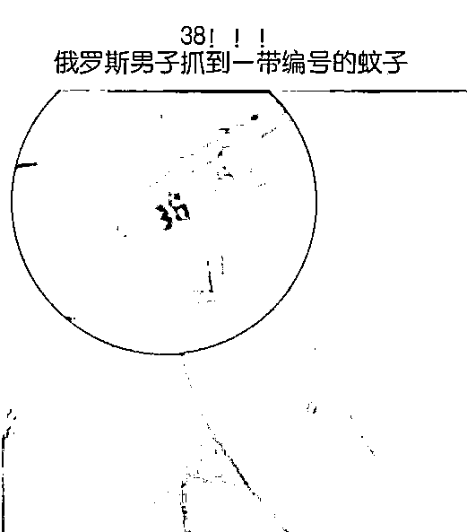
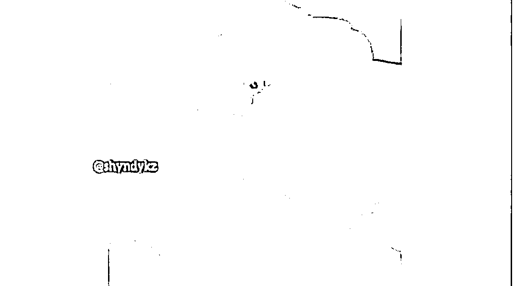
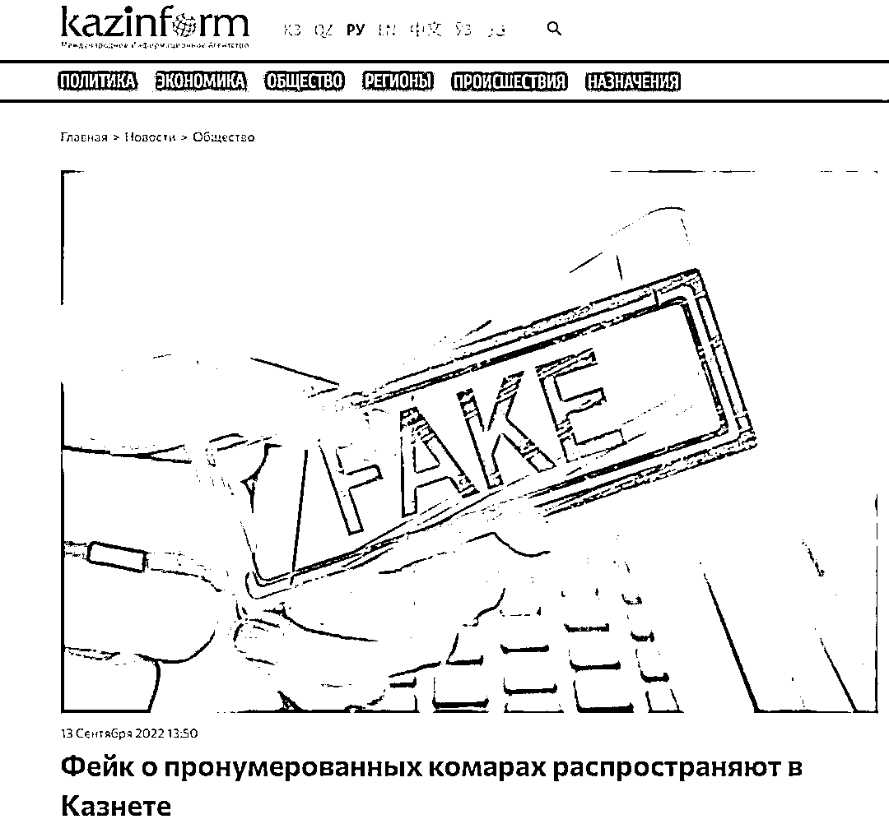
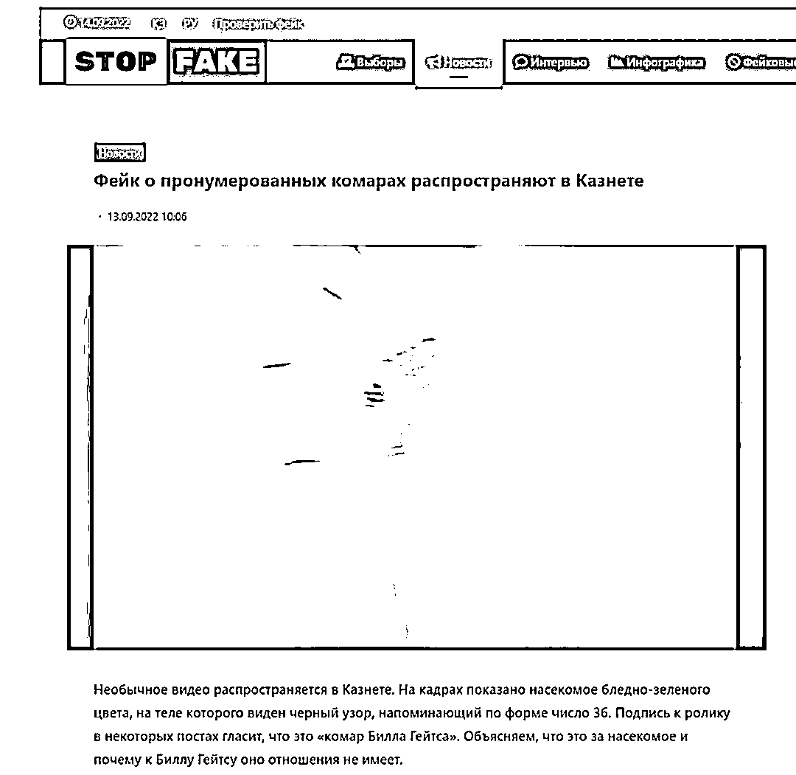

# 蚊子身上写有编号 38，疑似生化武器？官方辟谣：是银桦蚜

> 原文：[`mp.weixin.qq.com/s?__biz=MzIyMDYwMTk0Mw==&mid=2247544063&idx=2&sn=2b4bcf207e39b7cc331066092826ba0e&chksm=97cbe7c7a0bc6ed13298084d5777683c39260e78384463bca7e809d76290979bea8d2a1212a0&scene=27#wechat_redirect`](http://mp.weixin.qq.com/s?__biz=MzIyMDYwMTk0Mw==&mid=2247544063&idx=2&sn=2b4bcf207e39b7cc331066092826ba0e&chksm=97cbe7c7a0bc6ed13298084d5777683c39260e78384463bca7e809d76290979bea8d2a1212a0&scene=27#wechat_redirect)

2022 年 9 月 13 日，有媒体称，俄罗斯男子在室外抓到一只腹部有编号的蚊子。联系到美国研究无人机投放毒蚊的项目，更是细思极恐！

**一则关于蚊子带有 38 号数字的**

视频在网络上疯传。

由于视频中的男子使用的是俄语，

不少人认为，

**俄罗斯出现了****编号为 38 的蚊子，**

**有人为痕迹，**让人浮想联翩……

视频截图

极目新闻记者找到原始视频发现，该视频共有两段，分别为 10 秒和 12 秒。视频中，一名男子手上有一只淡绿色的飞虫，他抬起飞虫的翅膀，下面出现了像是“38”或是“36”的数字。

极目新闻记者将两段视频发给在乌克兰的留学生李乐涛求证。李乐涛证实，视频的语言为俄语，第一段视频中男子说：“你看这个蚊子上有一个非常小的数字。”第二段视频中该男子说：“这个数字是 38。”

这则视频在社交媒体上疯传，**有不少人认为这个蚊子带有人为编辑痕迹，是美国生化武器的编号，还有人说这是一只“比尔盖茨蚊子”。**

“比尔盖茨蚊子”来源于世界前首富比尔·盖茨对转基因工程的研发。

2018 年，比尔和梅琳达·盖茨基金会资助生物技术公司 Oxitec 开发一种转基因蚊子。这种转基因蚊子携带沃尔巴克氏菌，与野生蚊子种群交配后，可以阻断病毒的传播，防止蚊子成为黄热病、登革热、寨卡病毒等危险疾病的携带者。人们也因此称为“比尔盖茨蚊子”。

“比尔盖茨蚊子”虽然存在，但并没有编号，且只在登革热、寨卡病毒和黄热病流行的地区放生。

**事实上，视频中的飞虫，并不是蚊子。**

极目新闻记者发现，**哈萨克国际通讯社和哈萨克斯坦辟谣网站均在 9 月 13 日作出回应，指出视频中的飞虫应为银桦蚜。**

哈萨克国际通讯社报道截图

哈萨克国际通讯社（KAZINFORM) 引用哈萨克斯坦辟谣网站“stopfake.kz”的论述报道称，在反向图像搜索工具的帮助下，可以确定视频中的昆虫根本不是蚊子，而是银桦蚜。

哈萨克斯坦辟谣网站报道截图

通常，银桦蚜为淡绿色或淡黄色，带有黑色横纹，这些横纹是断续的，从而会形成像是图案和数字一样的符号。这种带有“数字”的银桦蚜，在网上可以搜索到。

维基百科资料显示，银桦蚜是半翅目蚜虫的一种。它是一种绿色的小昆虫，身体柔软，有翅膀。它生活在欧洲白桦树上，通过吸吮汁液、以芽和叶为食。

报道称，**人们在动物的颜色、奇异的云彩、甚至在奶酪吐司上看到数字或符号的情况并不少见。这是人类心理特性与昆虫奇异颜色的结合，人类心理往往会在完全随机且不相关的事物中找到意义。**

**细思后不用“恐极”**

**极目新闻评论员 吴双建** 

近日，一则关于蚊子带有 38 号数字的视频在网络上疯传。由于视频中的男子使用的是俄语，**不少人认为，俄罗斯出现了编号为 38 的蚊子，是美国生化武器的编号，还有人说这是一只“比尔盖茨蚊子”。**极目新闻记者发现，哈萨克国际通讯社和哈萨克斯坦辟谣网站均在 9 月 13 日作出回应，指出视频中的飞虫应为银桦蚜。

还真是巧到家了，今天有两则关于“蚊子”的消息上了热搜。一条是全国人大代表提议全面消灭蚊子，还有就是“俄罗斯发现编号 38 的蚊子”这一条。

“蚊子”腹部有编号？观看视频，还真是，38 的图案清晰可见。于是，就有不少网友“细思恐极”（指仔细想想，觉得恐怖到了极点），联想到了生物战争。难道是某西方大国投放带病毒或细菌的蚊子危害别国安全？这只带编号的“蚊子”，是不是代表“实锤”了？

某西方大国隐秘从事生物病毒研究，危害人类安全，的确欠世界一个解释和交代。但这则消息里，还真与他们谈不上有实质性的联系。其一，这件事并不确定发生在俄罗斯，哈萨克斯坦的媒体也进行了辟谣。其二，这不是一只蚊子，经过确认，这是一只银桦蚜。

银桦蚜有什么特点呢？有科普作者称，它们的背上会随机出现黑色的小点，有些小点排列组合巧合了，就会形成人类眼中的“数字”。另外，也有网友发出了一张银桦蚜腹部带有数字“11”的图片。也就是说，对这个小视频根本不用“细思恐极”，因为蚜虫不是给人类传播病菌的媒介。

这件事可能就是个“阴谋论”。因为想一想，如果某西方大国要投放有病菌的蚊子，也根本用不着去给蚊子编个号码，先不说编号有没有意义，但这不相当于是“自首”吗？

其实，生物界的奇妙之处多的是。有一种蜘蛛叫横纹金蛛，它编织的蛛网上，会留下很多“W N Y”等字母，被称为会写字母的蜘蛛。还有一种蝽，生活在亚热带地区，身上的确有着一张“人脸”，被人们俗称为“人脸蝽”。还有长得像枯叶的蝴蝶，像兰花的螳螂……奇奇怪怪的事多着呢。

所以，“俄罗斯发现编号 38 的蚊子”的消息，在没有权威媒体报道核实之前，先别急着“细思恐极”，不妨让子弹飞一会儿，这种事一般都会有合理的解释。

来源：大 R 说安全

欢迎关注灰产圈社群服务号

