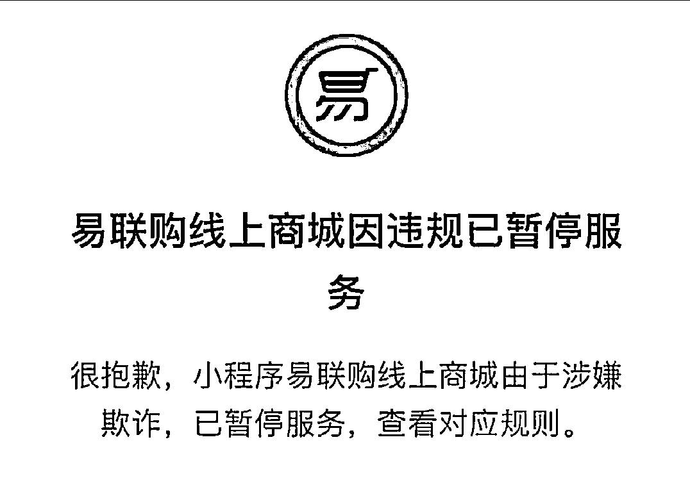

# 易联购低价预售 iPhone14 两个月后疑携千万款跑路，单机优惠近 500 块多人受骗...

> 原文：[`mp.weixin.qq.com/s?__biz=MzIyMDYwMTk0Mw==&mid=2247544063&idx=4&sn=a68fb9f336aa7f27751ecccdbf3b3dd7&chksm=97cbe7c7a0bc6ed1f2aafae12cce785abad6803559a5961fb8faddd8a1eefbfabebdad2b8b68&scene=27#wechat_redirect`](http://mp.weixin.qq.com/s?__biz=MzIyMDYwMTk0Mw==&mid=2247544063&idx=4&sn=a68fb9f336aa7f27751ecccdbf3b3dd7&chksm=97cbe7c7a0bc6ed1f2aafae12cce785abad6803559a5961fb8faddd8a1eefbfabebdad2b8b68&scene=27#wechat_redirect)

这两天看到一则**疑似卷钱跑路新闻**，惊得反复看了好几遍，真假？诈骗圈现在已经发展成这样了吗？？

如果骗了人还诛心……这一操作堪比**韭菜地里打除草剂**了吧！

近日有网友发现，易联购以低于官网 500 元的价格（据说是设置优惠券，1588 当 2000 用），预售 iPhone 14 两个月，然后携数千万巨款跑路了……

网传出一份很嚣张的跑路声明... 

**“我们也需要钱过日子，也许这次会让你感受到打击，但是不要失望，钱没了可以再赚，没什么的。”**

****“对不起！”****

********

****他竟然还道歉了，他真的，我哭死。**** 

****？？？？？话说回来这骑脸嘲讽的声明，绝对是滑稽的段子吧！！……太匪夷所思了，不论看好几眼都以为是假新闻的程度。****

********

****网友：我发现，他甚至还有错别字，以及还有吃字、语病等等问题。****

********

****有一说一，这个段子是蛮成功的，错字漏字说明确实跑得很**急。****** 

****以及…他们本来可以用假货骗你，但是他们选择了明抢，抢完还不忘嘲讽你一番。****

********

****网友发现，16 号网上又流出一篇最新公告，看上去更嚣张了，现在的段子也挺会的啊。****

********

****积极的角度：这算有良心的了，跑路还通知你一声。****

****************

****路过的网友后怕：一个月前还看到过打的广告，还好当时及时发现不对劲了。****

********

****大胆猜想：可能上线之初就想好怎么跑路了。****

****小心求证：7 月 28 日成立上线的……****

****陷入沉思：可能跑路是这个项目的最重要一部分吧。****

****************

****好奇，搞诈骗的是不是人手一本《有良心才能挣钱，但没良心能赚的更多（不要学）》**** 

********

****这事已经上新闻了。****

****9 月 14 日，一名男子小康求助@小莉帮忙。****

****称自己是做手机销售的，前几天，在易联购线上商城，抢购了 15 台苹果手机，一共支付了 158000 元。****

************************

****因为他用了平台给的优惠券（1588 抵 2000 用），所以比苹果官网要便宜一些。****

************************

****但付钱后，易联购一直不发货，客服也不回复了，和他同样情况的还有很多朋友。****

********

****根据注册地址记者查到这家公司在重庆，小康也托朋友去现场核实，发现该公司已经人去楼空。**** 

********

****目前，小康已报警，市监局正在调查易联购预售捐款跑路事件。**** 

********

****“……”****

****关于两份嚣张声明是真是假，文中提到的另一家优乐购机表示，公告是假的。**** 

****“易联购跑没跑我们不知道”、“我们没有跑路，请大家理智判断。” ****

********

****一家山西易联购躺枪，都是名字惹的祸……****

********

****以前也发生过类似平台不发货的新闻，为了 1000 块的优惠，男子在其他平台上购买 iPhone13，结果手机没收到……****

********

****……****

****网友总结教训：****

****1、贵重物品就别为了省几百块冒风险了。****

****2、好人寸步难行的时候发现坏人是滑行的，何止滑行，是坐飞机走的……****

********

****来源：上海全知道**** 

********

****欢迎关注灰产圈社群服务号****

********

********