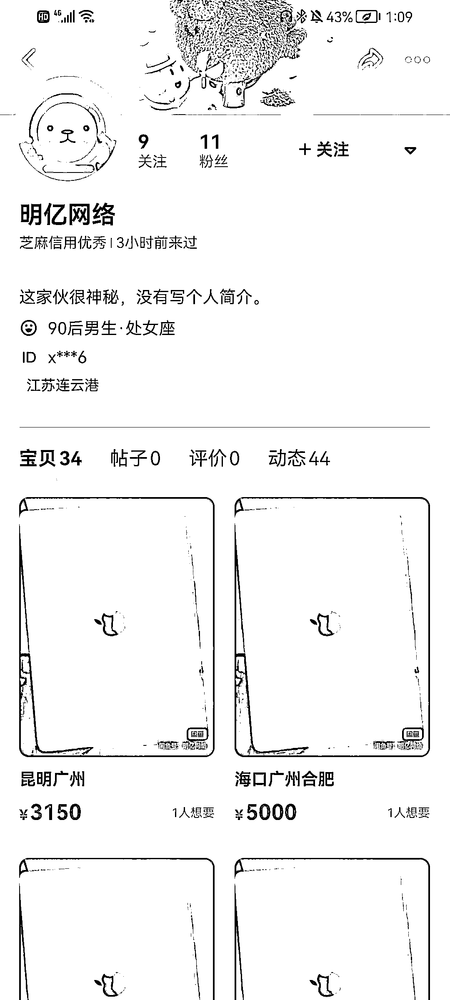
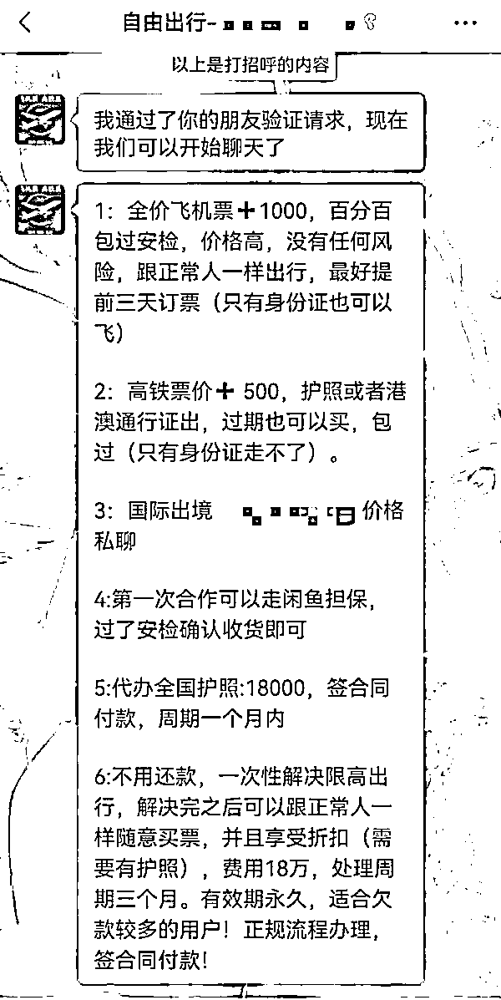
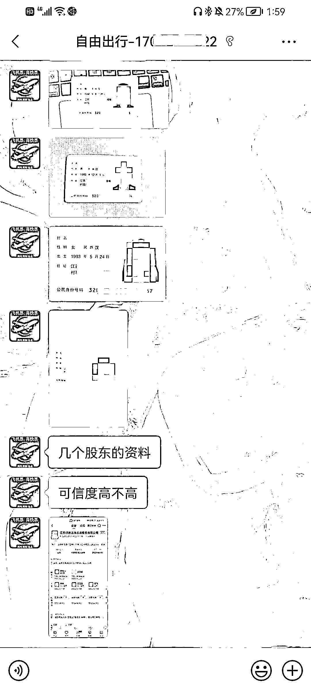

# 18 万就能为老赖取消限高影响？律师：或涉罪

> 原文：[`mp.weixin.qq.com/s?__biz=MzIyMDYwMTk0Mw==&mid=2247544063&idx=5&sn=3f7fd4dd034d2487b6c1e93221a28d6c&chksm=97cbe7c7a0bc6ed11417f4e0364cf118f2d746e2ea674a233378b8b919cc8902a1ca699e9c45&scene=27#wechat_redirect`](http://mp.weixin.qq.com/s?__biz=MzIyMDYwMTk0Mw==&mid=2247544063&idx=5&sn=3f7fd4dd034d2487b6c1e93221a28d6c&chksm=97cbe7c7a0bc6ed11417f4e0364cf118f2d746e2ea674a233378b8b919cc8902a1ca699e9c45&scene=27#wechat_redirect)

被限制高消费的“老赖”也能订机票、高铁票？日前，有江苏连云港的市民向澎湃新闻反映称，当地的江苏修启法律咨询服务有限公司，在视频平台开账号直播、发短视频，声称被限高的失信被执行人也可买飞机票和高铁票，突破法院的限制消费令。澎湃新闻从平台方面获悉，平台已经对所涉账号进行了封禁。

涉事闲鱼账号，对方称机票、高铁票最终通过闲鱼平台交易。截图

澎湃新闻记者调查了解到，涉事人员声称可为失信被执行人“境外购买全价机票”，在全价票的基础上再收取机票 1000 元、高铁票价 500 元的手续费，并称可保证顺利过安检，若另外花 18 万元，可解决限高带来的出行不便问题。

对此，律师赵良善认为，此举涉嫌非法经营罪等，且涉嫌构成拒不执行判决、裁定罪的共犯。

**给“老赖”买票**

被法院限制高消费的失信被执行人，也被称为“老赖”，根据相关规定，他们被禁止乘飞机、高铁等，通过正常渠道无法购票。然而，一个认证主体为江苏修启法律咨询服务有限公司的视频账号声称， “限高也可以坐飞机高铁出行。”

对方发来的订票价格等信息。截图

澎湃新闻记者调查了解到，通过上述视频账号可加对方微信，在双方达成购买意愿后，买家需要出示身份证照片和电话、地址等以登记机票信息。然后对方会确认乘机时间，称以境外购买的方式买票，需在原票价的基础上，加上机建燃油费和 1000 元办理手续费。记者发现，通过该渠道订票的费用比正常渠道高出不少，如正常渠道 720 元的机票，通过该渠道订购需花费 3150 元。

对方声称，购票后，手机无法收到短信提示，在办理登机牌时只有用身份证才能正常出票过安检。

在买家只有身份证的情况下，对方会建议乘坐飞机，而如果需要购买高铁票，则需要额外出示护照或港澳通行证。若没有两证，对方会提出帮忙办理，即 18000 元代办全国各地的护照（签合同付款，周期 1 个月），以保证在境外购票。

交易时，对方会在闲鱼平台发起同价的“闲置物品”出售帖，和买家沟通后让买家从闲鱼平台购买并付款，最后让买家正常到柜台以身份证或护照取票。对方称，买家需在起飞前一个半小时确认收货，若过了安检而不点击确认收货，会将机票改签。

为取得买家信任，对方还会展示此前的订票信息。对方提供一份订票信息称，曾为一“老赖”订购 9 月 7 日广州飞济南的南航机票。记者通过全国法院失信被执行人名单信息公布与查询平台查询，发现其中显示的购票人正是被法院列入失信被执行人名单的“老赖”。

**律师：帮“老赖”突破限制或涉罪**

为取得信任，上述称可为“老赖”购机票的人员还发来了江苏修启法律咨询服务有限公司股东的身份证照片。

为取得买家信任，对方发来公司股东高管的身份证照片。截图

天眼查信息显示，江苏修启法律咨询服务有限公司于 2022 年 4 月 1 日在连云港市灌云县注册成立，其业务范围主要是法律咨询（不包括律师事务所业务）、信息技术咨询服务、商务代办服务、数据处理和存储支持服务等。3 名股东高管名下的另一家公司江苏修融网络信息科技有限公司，其简介是：全国两百多家分公司，免费提供征信咨询服务，量身设计信用恢复方案。

前述人员声称，他们的票源主要是通过江苏修启法律咨询服务有限公司向香港一家航空公司购买。同时，他们还提供“一次性解决限高出行”的服务方案，价格 18 万元，在三个月内处理完毕，通过签订合同来付款，“可以取消限高，不影响出行，跟正常人一样，但是失信名单没办法消除。”

9 月 16 日，澎湃新闻记者联系到江苏修启法律咨询服务有限公司，对方声称可为“老赖”订票，且承诺一次性花费 18 万元可解决限高影响出行的问题。

对方称这是此前的“老赖”订票信息。截图

对此，陕西恒达律师事务所高级合伙人、知名公益律师赵良善分析指出，为老赖购买机票、高铁票的行为触犯了多项法律。

他认为，帮助“老赖”购买机票、高铁票，也是在帮助老赖不履行判决和裁定，或构成拒不执行判决、裁定罪的共犯，可追究其拒不执行判决、裁定罪的刑事责任。如果行为人长期以此为业，以此作为经营手段，则涉嫌非法经营罪。如果行为人通过修改、篡改计算机系统当中的数据为老赖购买机票、高铁票，则涉嫌非法侵入计算机信息系统罪。

据新华社报道，法律界人士分析，失信被执行人通过“黄牛”订票，属拒不履行人民法院已经发生法律效力的判决、裁定的行为，经查证属实，可依照民事诉讼法规定，予以拘留、罚款；情节严重，构成犯罪的，追究其刑事责任。

来源：澎湃新闻

欢迎关注灰产圈社群服务号

