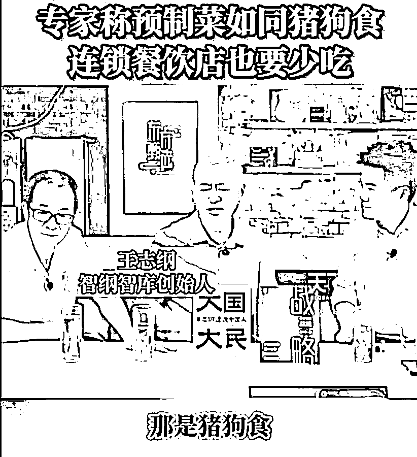
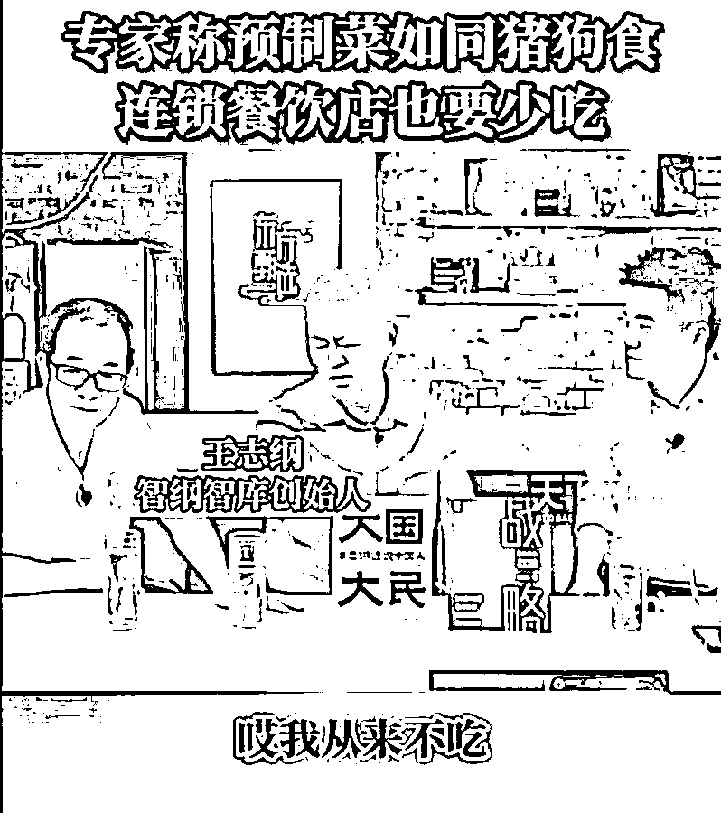
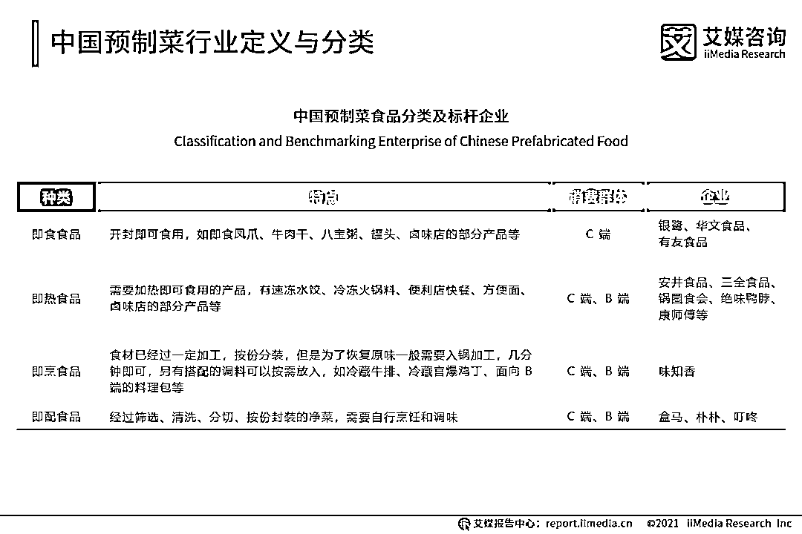

# "猪狗食"！著名智库创始人在俞敏洪直播间批预制菜

> 原文：[`mp.weixin.qq.com/s?__biz=MzIyMDYwMTk0Mw==&mid=2247544063&idx=6&sn=d9915585c66837804290de59410ba78c&chksm=97cbe7c7a0bc6ed15eed820ef21a181039c54c2d5dec3ed53a732adb5bdcdddb1a302597c987&scene=27#wechat_redirect`](http://mp.weixin.qq.com/s?__biz=MzIyMDYwMTk0Mw==&mid=2247544063&idx=6&sn=d9915585c66837804290de59410ba78c&chksm=97cbe7c7a0bc6ed15eed820ef21a181039c54c2d5dec3ed53a732adb5bdcdddb1a302597c987&scene=27#wechat_redirect)

近日，智纲智库（王志纲工作室）创始人王志纲在东方甄选直播间与俞敏洪、董宇辉聊天时表示，预制菜是猪狗食，此事引发网友热议。

据极目新闻报道，9 月 17 日，智纲智库工作人员回应记者，**上述言论属于心直口快的个人发言，不针对某一个行业或某一个个体。**

王志纲与俞敏洪、董宇辉两人同框就座。来源：直播截图

值得注意的是，据财联社此前报道，国联水产（300094，股价 5.11 元，市值 46.62 亿）从 5 月中下旬开始与**新东方在线**开展合作，已合作产品有冬笋、原味虾饺和虾仁，即将合作的产品有小龙虾、烤鱼、塔可饼等，均以预制菜产品为主。

**预制菜是猪狗食？** 

**公司回应：是创始人心直口快**

据了解，9 月 14 日，智纲智库创始人王志纲在直播间谈到预制菜时表示：“**那是猪狗食，不要吃预制菜。**生活一定要懂得‘独此一家，别无分号’，我在中国吃东西，从来不吃连锁店。一旦连锁，就没有意义了。”

王志纲此语引发网友激烈讨论，有常买预制菜的网友感觉“被冒犯”，认为专家不该如此贬低预制菜，预制菜方便快捷，省时省力，也有自己的相关食品安全标准，并不像专家说得如此不堪。

也有网友认为，预制菜虽然方便，但因为添加了防腐剂，长期食用对身体不好，现在许多餐饮店大量使用预制菜，专家发声是敢说真话。

公开资料显示，**王志纲**毕业于兰州大学经济系，是著名战略咨询专家，系智纲智库（王志纲工作室）创始人。

9 月 17 日上午，智纲智库相关工作人员告诉极目新闻记者，这是直播上一个心直口快的发言，他是作为一个美食家身份来说自己的感受，而不是针对某一个行业或某一个个体，**“因为他平时确实不吃这类食品。”**

****预制菜现状如何？****

****预制菜，**顾名思义，是指以农、畜、禽、水产品为原料，配以各种辅料，经预加工而成的成品或半成品。通过需要加工的程度多少分为**即食食品、即热食品、即烹食品、即配食品。****

********

****图片来源：艾媒咨询****

****据新京报，预制菜并不是一个新概念，早在上世纪 90 年代就随着麦当劳、肯德基等快餐店进入中国，国内出现净菜配送加工厂。2000 年前后中国陆续出现半成品菜生产企业，2002 年好得睐成立，2008 年味知香成立。2014 年前后外卖行业快速发展，预制菜行业在 B 端步入放量期。2020 年至今，预制菜在普通消费者市场获得较大发展。****

****据银柿财经，德勤消费行业洞察《2022 预制菜行业展望》称，2021 年中国预制菜市场规模约为人民币 5500 亿元。****

******“2022 年，47.5%的中国预制菜消费者认为预制菜口味还原度低，食品体验不及预期。”**艾媒咨询发布的《2022 年预制菜产业品质升级专题研究报告》指出，超过五成的消费者都遇到了产品质量问题。****

****兴业证券研报显示，为提高存活率，规模餐饮需要持续开源节流。一方面，外卖订单的增加补充堂食订单的减少，也可提升门店坪效；另一方面，预制菜/中央厨房能够有效降低 B 端餐饮店的成本，并提高出餐效率。中国连锁经营协会的数据显示，国内已有超过 74%的连锁餐饮企业自建了中央厨房，配送预制菜至门店制作，其中头部连锁餐饮企业预制菜使用比例较高，**真功夫、吉野家、西贝、小南国等知名企业预制菜使用占比高达 80%以上。******

******虽然预制菜行业方兴未艾，但低门槛的特点决定了这也是一个竞争激励的行业。比如，趣店（QD.US,股价 0.835 美元，市值 2.11 亿美元）集团创始人、CEO 罗敏在 7 月 17 日的“趣店预制菜”品牌战略发布会上高调喊出 All in 口号；9 月 6 日，趣店在二季报中表示，在评估了当前的市场状况后，公司决定精简趣店预制菜业务，将进行裁员、同供应商终止合作、清库存等一系列措施。******

******来源：每日经济新闻******

************

******欢迎关注灰产圈社群服务号******

************

************