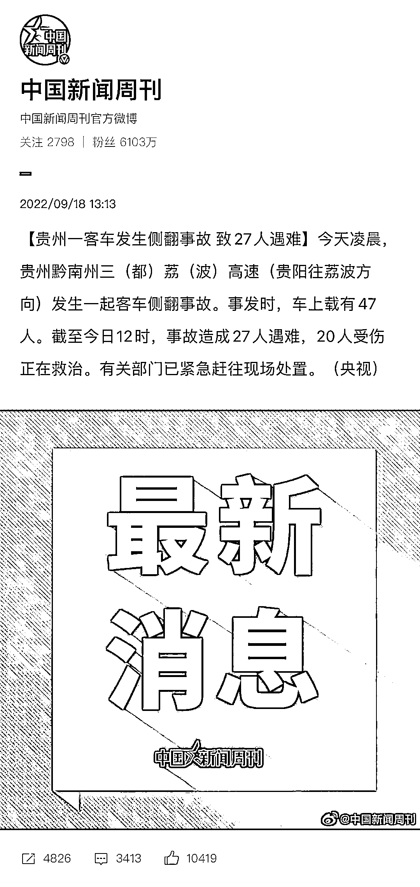
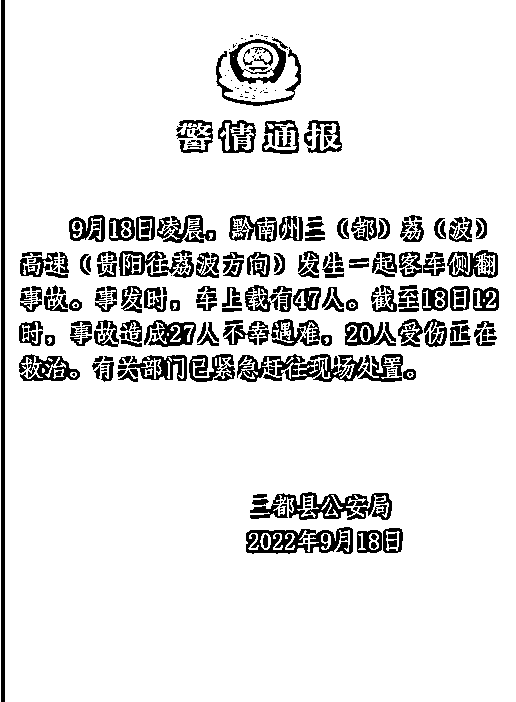
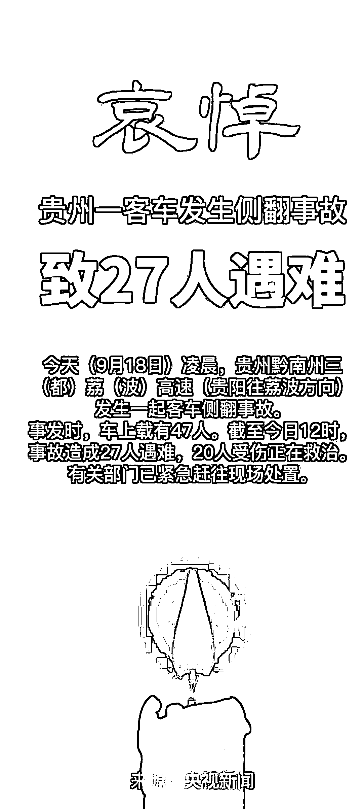
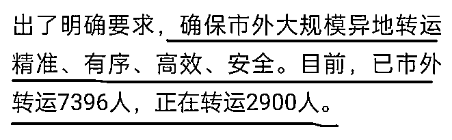
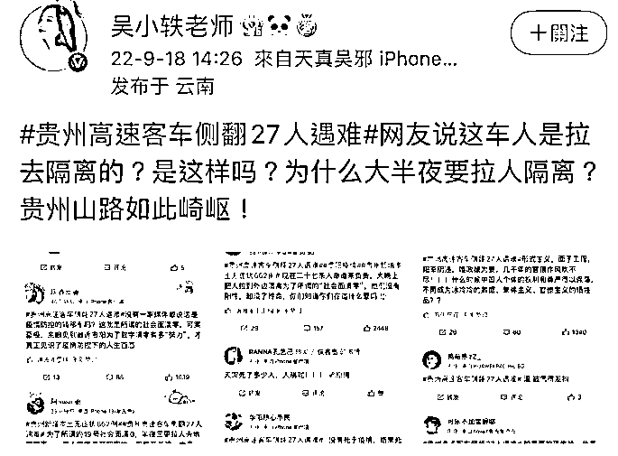
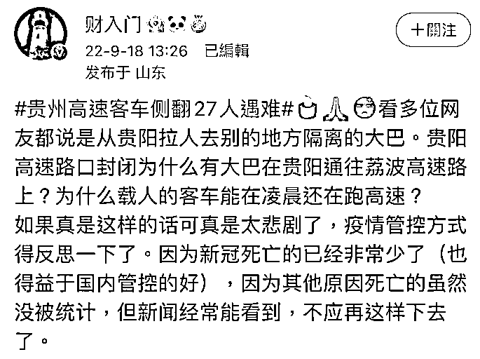
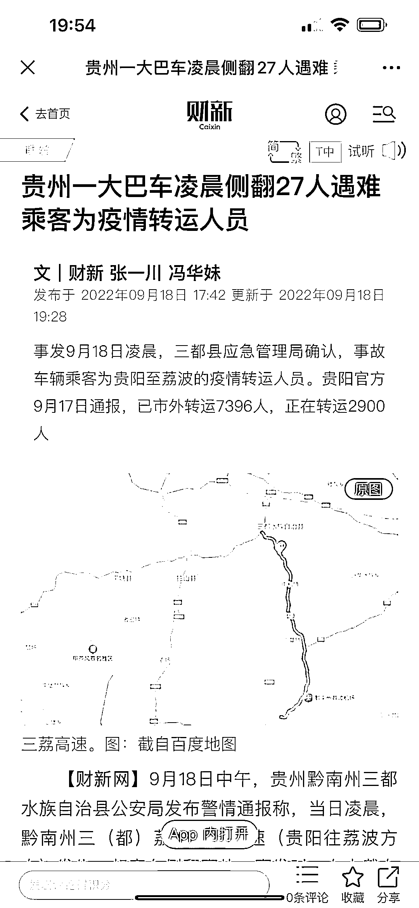

# 凌晨的大巴车

> 原文：[`mp.weixin.qq.com/s?__biz=MzIyMDYwMTk0Mw==&mid=2247544091&idx=1&sn=b12e9a3cd249477c479e98fae8219acd&chksm=97cbe623a0bc6f35e35b84c51c359fc8076259cc66192ad379a0b228d67b4a92e8f6a4fe2f1d&scene=27#wechat_redirect`](http://mp.weixin.qq.com/s?__biz=MzIyMDYwMTk0Mw==&mid=2247544091&idx=1&sn=b12e9a3cd249477c479e98fae8219acd&chksm=97cbe623a0bc6f35e35b84c51c359fc8076259cc66192ad379a0b228d67b4a92e8f6a4fe2f1d&scene=27#wechat_redirect)

9·18，除**铭记历史**外（很重要），

这天，又成为了众多家庭亲人的忌日。

今日凌晨，2:40 分许，贵州发生一起车祸。 

当地警方最终确认，27 人不幸遇难，20 人受伤。

[`v.qq.com/iframe/preview.html?width=500&height=375&auto=0&vid=g0044ip99uu`](https://v.qq.com/iframe/preview.html?width=500&height=375&auto=0&vid=g0044ip99uu)

[`v.qq.com/iframe/preview.html?width=500&height=375&auto=0&vid=d3356m0p3yx`](https://v.qq.com/iframe/preview.html?width=500&height=375&auto=0&vid=d3356m0p3yx)

根据《道路旅客运输企业安全管理规范》 第三十八条，客运企业在制定运输计划时应当严格遵守客运驾驶员驾驶时间和休息时间等规定：

**长途客运车辆，凌晨 2 时至 5 时停止运行或实行接驳运输。**

这样要求，是出于安全考虑。

因为**客运车**一旦发生事故，后果不堪设想。

大家在哀悼逝者的同时，生出疑问： 

**既然有规定，那这辆大巴是怎么会在这个时候，可以凌晨在高速上行驶的？**

有人配合新闻猜测，这或是疫情转运车辆。

车辆发生事故的时间，刚好处于客运车停止运输期间。

真的是疫情转运车辆？

又为何在深夜转运？

后有媒体确认，侧翻大巴车确为疫情转运车辆。 

里面的乘客，也都是疫情转运人员。

希望有关部门可以通报一下，

该大巴为何违反规定，凌晨时间段在高速上行驶？

**当悲剧发生的时候，我们除了沉痛之外，一定要对沉痛做出反思，这是为了避免下一个悲剧。**

**勿忘国耻，逝者安息。** 

来源：不惑先生

欢迎关注灰产圈社群服务号

