# 刀尖上的“试药者”：我们每一天都在赌命

> 原文：[`mp.weixin.qq.com/s?__biz=MzIyMDYwMTk0Mw==&mid=2247544091&idx=2&sn=712ad8cd0d2c2cba501659f841076a52&chksm=97cbe623a0bc6f35acf7dd705f797baef8056c31970c00f64455f3d302c875c710ea8871bfed&scene=27#wechat_redirect`](http://mp.weixin.qq.com/s?__biz=MzIyMDYwMTk0Mw==&mid=2247544091&idx=2&sn=712ad8cd0d2c2cba501659f841076a52&chksm=97cbe623a0bc6f35acf7dd705f797baef8056c31970c00f64455f3d302c875c710ea8871bfed&scene=27#wechat_redirect)

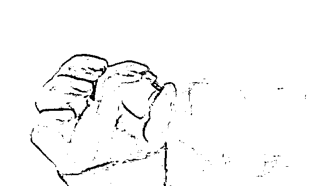

**刀尖上的“试药者”**

**我们每一天都在赌命**

**01**

“补贴费 7500 元，住院 2 次，每次 3-4 天。”

小茹就是因为这句话，走进了采血室。

她 31 岁，半个月前的这次经历，让她成为一名试药人。

试药人，顾名思义，需要在某种新药批准生产、推向市场之前，以身试药，通过临床试验，供医院记录药物的安全性、代谢过程，以及有效程度。

小茹身体很健康，冒险试药，是为了高昂的“补贴费”。

她太需要钱了。

出身贫寒，丈夫早亡，就在一个月前，小茹 4 岁的儿子，被确诊为白血病。

她不敢再跟朋友借钱，也没有人愿意再借她钱。

体检通过后，小茹抱着儿子大哭一场。

她何尝不知道，试药，就是赌命？

赌试验的药物，不会与身体产生剧烈的排斥反应；

赌药物代谢之后，不会在体内留下潜藏的祸根。

可是眼下，小茹没有时间等待下一个机会了。

自己的命，可以交给造化，儿子还小，她没办法放弃。

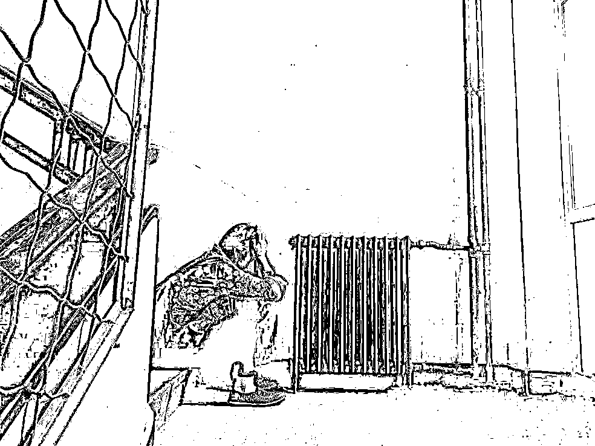

**02**

小茹的故事，让我第一次试图了解试药人，这个鲜被提及的边缘群体。

在我们国家，仅 2011 年，就有 800 多种新药进行了人体试验，涉及人群 50 万人。

这 50 万人又分两种：

一种为求生，比如癌症患者；

一种为过活，比如急用钱者。

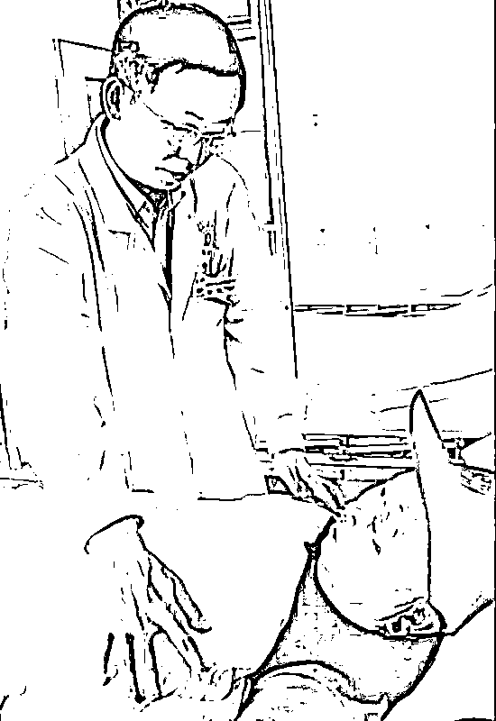

来自重庆的李老伯，是一名恶性血管瘤患者。

漫长的治疗期，并没有抑制他体内猖獗的癌细胞。

余生越来越短，费用越来越高。

得知有一种专治血管瘤的新药，可以免费给志愿试药的患者使用，尽管一切药物反应未知，李老伯还是毫不犹豫地报名了。 

试药过后，李老伯由于原本肺部就有损伤，出现了呼吸困难等一系列不良反应。

可是他不敢说。

他怕说了，就停药了。那会使他体内的肿瘤加速生长。

就好比饮鸩止渴，一边是毒药，一边是肿瘤，两股力量互相伤害，彼此消磨。

当然，医院还是发现了李老伯身上的问题。

停药几天，他就跪在医生的面前，渴求让自己继续试药。

像李老伯这样的情况，在肿瘤患者的试药组里，几乎每天都在发生。

尊严、脾气、底线、耐受力……没有人会去考虑这些。

有医生感叹：

> 他们太渴望活着了，每天都担心自己被试药小组淘汰。生怕哪天吃不上药，肿瘤就把他们吃了。

疾病面前，命如蝼蚁。钱花光了，就只能等死。

对他们来说，与其坐以待毙，不如铤而走险，等待奇迹降临。

曾经百万保命，如今拿命试药。

绝症是一口无底洞。

无论你有多少财富，只要花上足够的时间，终有被掏空的一天。

而真相如此残酷，说来说去，这世上的病只有一种——穷病。

《我不是药神》里，那个向警察求情的老婆婆，说出了多少患者的心声：

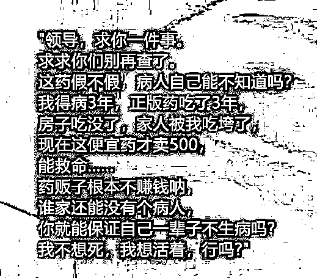

**03**

许多人都想不到，在试药者的队伍中，90 后大学生，占据着相当数量的“参与份额”。

他们大多是医学院校的学生，有些是因为家中贫寒，还有一些，是为了偿还黑洞一般的校园贷款。

像小茹那样，迫于生活而试药的人，比比皆是。

退伍军人小赵，曾远赴亚丁湾护航。

退伍后，他用所有积蓄开了一家餐厅，没想到时运不济，餐厅倒闭，还欠下一屁股外债。

连续几年，他都用试药的方式还钱。

债台高筑，急需用钱，许多人走投无路，在“5 天 5000 块”的高额回报下，交出了对自己生命的控制权。

试药族中，流传着一个公式：

报酬÷天数=药物危险性

也就是说，“补贴”越高，风险越高。

可风险低，并不代表绝对安全。  

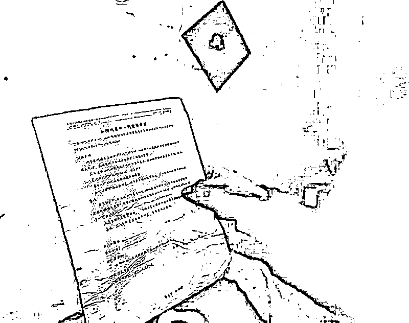

翻看这些新闻，不过只字片言，依旧触目惊心：

> 《腾讯新闻》报道，北京肿瘤医院，一名叫王丽英的女士，在服用试用药物 36 天后，因脑出血死亡。
> 
> 《新京报》报道，一名 20 岁的男性试药者，由于反复测试抗炎药物，导致出现严重的抗药性。也就是说，一旦他生病，这些药物就不再起作用了。

医院通常都会规定，每次每人的试药时间，必须间隔三个月以上，给身体足够的代谢时间。

可是即便如此，依然有太多人以命换钱，成为药物说明书中【不良反应】的真实案例。

我始终相信，一件事情有多少人见证，就可能存在多少真相。

而对于试药人来说，也许那些难以启齿的困窘，才是真相。

他们囿于现实的枷锁，走投无路，用死亡，去搏一线生机。

就像电影《这个杀手不太冷》里，小女孩问的那句话：

“人生总是如此痛苦吗？还是只有小时候是这样？”

“总是如此。”

况且，生活不是电影，生活比电影苦多了。

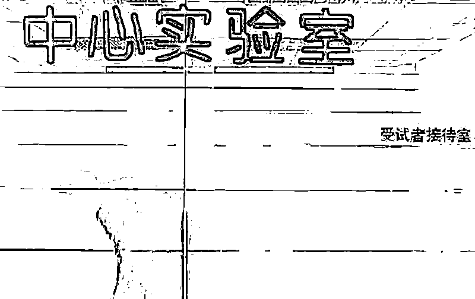

**04**

还记得 2017 年，突然晕倒在郑州街头的那名男子吗？

身材枯瘦，两颊凹陷，长期营养不良，并且严重贫血。

堂堂七尺男儿，体重只有 103 斤。

他经历了什么？

卖血。

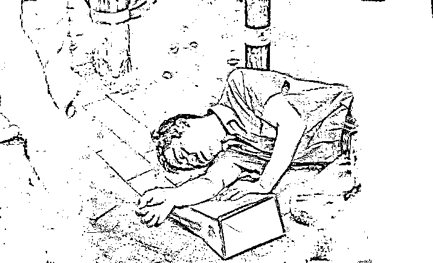

为了给换上急性髓系白血病的儿子治病，他和妻子两人轮流卖血。

病房里，小男孩哭得撕心裂肺：

> 爸爸不要再献血了，我不治了，不治了！

怎么可能不治？

儿子 11 岁，还未看过几番人世的风景，身为父亲，他不甘心。

短短半年，夫妻俩换回 30 多本捐血证。

即便如此，这个家庭依然背负着 30 多万的治疗费用。

世界就是这么不公平。

30 万，不过是有些人刷卡买下的一个包，

可是对于这对夫妻，就算双双把血抽干，也凑不出这么多钱。

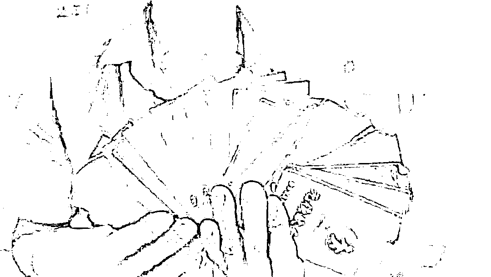

曾经看过一条新闻。

一个着急赶火车的小姑娘，不小心碰到了一辆私家车。

她沟通不成，竟然当街下跪祈求原谅。

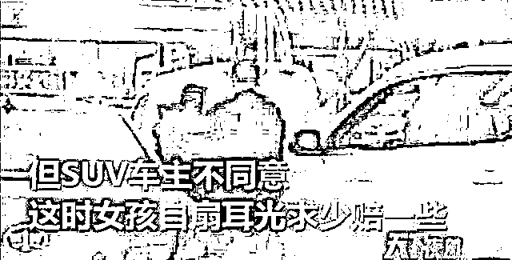

她只能拿出 200 块钱，然而车主还是不满意。

最终，她跪在冰冷的水泥地上哭泣，打肿了脸颊，看着愤怒的车主拿钱之后扬长而去。

有好事者说她矫情，为 200 元丢掉自尊，值得么？

你说，如果贫穷会说话，它会给出怎样的回答？

有人被骗 3000 元，从天桥一跃而下；

有人把借来的 500 块投进传销，识破骗局后，拼死也要要回来；

有人因为 5 块钱的地铁票，当众哭着训斥孩子……     

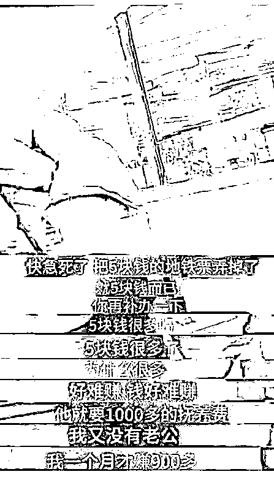

在重庆，有无数棒棒军穿梭在大街小巷，用汗水撑起背后的家庭。

收入不高，甚至不会增长，可是面对生活的索取，他们能给出的，只有一身苦力。

哪怕随着年岁增长，他们越来越扛不动了。

只要活着，就必须步履不停。

他们是穿行在城市与山林中的棒棒，是儿子，是丈夫，也是父亲。

压在肩头的重量，叫责任。

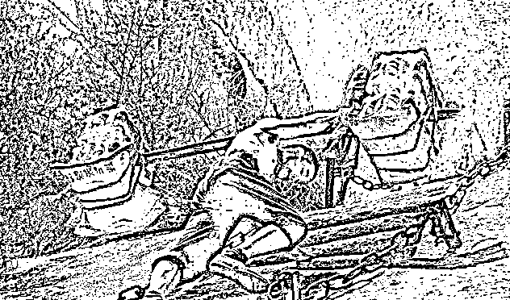

**05**

《一代宗师》里，有一句著名的台词：

*见自己，见天地，见众生。*

这是习武之人的三境界，也是每个人一生注定的修行。

知乎上有人提问：

*一个人，怎样才算见过世面？*

点赞最高的回答写道：

> 第一层，知道天有多高；第二层，知道坑有多深；第三层，知道我在哪里；第四层，知道世界还有左右。

其实说的是同一个道理。

正如歌词里唱：

> 他说羡你行过万里，平添人太多妒忌。却不知这风雪一程，有太多不容易。

世间百态，多是苦难。

哪怕尊荣无上如叶问，也曾含着万般无奈，苍凉叹息：

*我见过了高山，才发现原来最难过的，是生活。*

生活里，我们都曾一腔孤勇，也都曾不堪一击。

可是很少有人选择离去。

哪怕艰辛，也要和着血泪，披荆斩棘地走，用尽全力地活。

那些以身试药的人，为什么赌上性命也要搏一搏？

来源：商业潮流

欢迎关注灰产圈社群服务号

