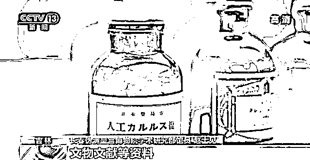
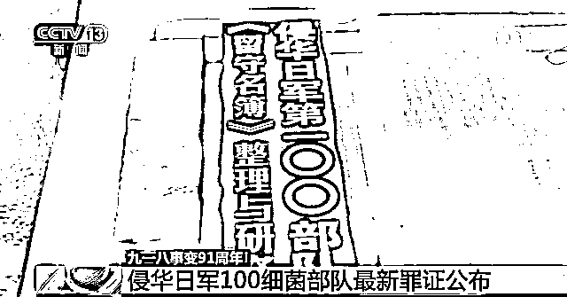
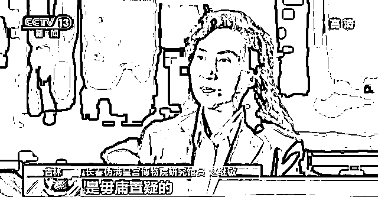
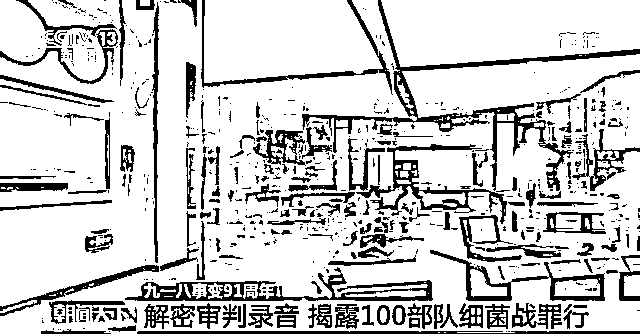
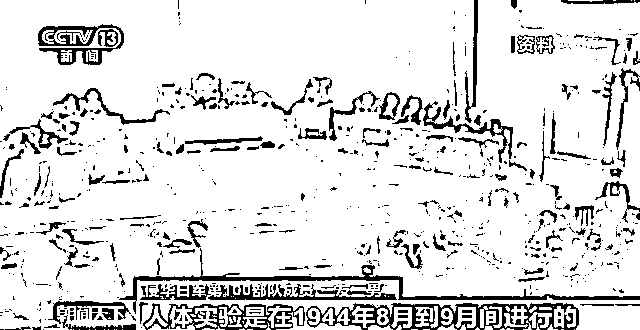
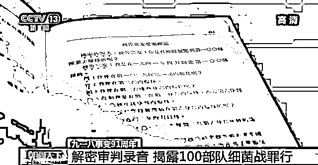
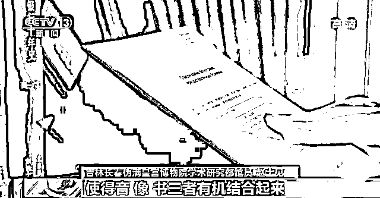

# 录音曝光！臭名昭著的 731 部队有个“恶魔兄弟”

> 原文：[`mp.weixin.qq.com/s?__biz=MzIyMDYwMTk0Mw==&mid=2247544091&idx=3&sn=20132063d79a774421936dcde051bf5a&chksm=97cbe623a0bc6f357a12080d52077117542255de534aab20e0e9a8ffee8f1db5ad3b5c2a03b3&scene=27#wechat_redirect`](http://mp.weixin.qq.com/s?__biz=MzIyMDYwMTk0Mw==&mid=2247544091&idx=3&sn=20132063d79a774421936dcde051bf5a&chksm=97cbe623a0bc6f357a12080d52077117542255de534aab20e0e9a8ffee8f1db5ad3b5c2a03b3&scene=27#wechat_redirect)

最新披露的成果主要有：100 部队是遵照日本陆军省和参谋本部的命令，自上而下改编而成的细菌部队，该部队曾进行过人体活体实验、野外毒性试验和野外演习，进攻对象为整个生态系统。

 **[`mp.weixin.qq.com/mp/readtemplate?t=pages/video_player_tmpl&action=mpvideo&auto=0&vid=wxv_2581600304488660993`](https://mp.weixin.qq.com/mp/readtemplate?t=pages/video_player_tmpl&action=mpvideo&auto=0&vid=wxv_2581600304488660993)** 

**据央视新闻消息，侵华日军 731 部队的罪行众所皆知，但很多人不知道的是，当年的东北还有另一支神秘的部队，那就是侵华日军 100 细菌部队**。这支部队被称作隐藏在 731 部队身后的“恶魔兄弟”。**日军投降前，该部队销毁了大部分资料，其罪行至今鲜为人知。作为国家社科课题，伪满皇宫博物院课题组经过四年研究整理，于近日公布了阶段性最新研究成果，侵华日军 100 细菌部队的罪行也随之公诸于世。** 

****100 部队与臭名昭著的 731 部队均为日本关东军司令部直属的秘密部队**，相关活动信息均为当年的机密，人们对它的认知很少。日本战败前夕，100 部队根据日本陆军省的命令，提前撤退人员，并销毁了相应的实验设施、记录资料，妄图擦去历史血痕。**该部队的罪恶隐藏几十年后，长春伪满皇宫博物院课题组于 2018 年开始搜集 100 细菌部队的相关罪证。****

****

****长春伪满皇宫博物院学术研究部馆员 赵士见**：经过四年多努力，我们从中、日、美、俄四国搜集到了关于这支部队的组织、人员、机构以及细菌战步骤的相关的档案、历史见证人的口述、文物文献等资料，同时我们在丰富资料的基础上也出了相应学术成果。**

****

**通过对多国留存相关资料的相互比对、互证研究，侵华日军 100 细菌部队隐藏的罪恶由模糊到清晰，最终大白于天下。最新披露的成果主要有：**100 部队是遵照日本陆军省和参谋本部的命令，自上而下改编而成的细菌部队，该部队曾进行过人体活体实验、野外毒性试验和野外演习，进攻对象为整个生态系统。****

****━━━━━****

****解密审判录音 揭露 100 部队细菌战罪行****

****伯力审判是 1949 年 12 月 25 日至 30 日，由苏联政府在伯力城对前日本陆军军人在战争期间实施的细菌战罪行进行的审判，是二战后也是人类历史上第一次针对细菌战罪行的正义审判。****

****今年，长春伪满皇宫博物院完整解密了伯力审判录音档案，其中有关侵华日军 100 部队有预谋地准备和实施细菌战，用战俘开展活体解剖实验的罪恶行径，令人震惊。****

****伯力审判庭审录音共有 22 小时 5 分 57 秒，是 2018 年 5 月长春伪满皇宫博物院赴俄罗斯，从俄罗斯国立录音档案馆征集到的，也是国内首家收藏伯力审判的完整录音档案。****

********

******吉林长春伪满皇宫博物院研究馆员 赵继敏：**（伯力审判）它主要是对细菌（犯罪）这一块，弥补了东京审判的一个漏罪，这个是有声证言，有不可篡改性，所以它的真实性、可靠性、权威性是毋庸置疑的。****

********

****侵华日军在长春建立的第 100 部队和第 731 部队是一对“孪生恶魔”，不同之处在于，731 部队进行的是人体实验，100 部队是以家畜和植物为主要研究对象，同时也拿活人当作实验品，进行细菌传染实验。三友一男是 1941 年 4 月进入第 100 部队的技术人员，**他在庭审中承认自己主要任务是研究炭疽菌等细菌。这是人畜共患的一种疾病，致死率高。并承认曾亲自进行人体的活体解剖实验，为细菌战作准备。******

********

******侵华日军第 100 部队成员 三友一男：**人体实验是在 1944 年 8 月到 9 月间进行的。实验目的是如何在本人不知道的情况下给他们使用麻醉药，重点是将细菌也用到被实验者身上，被用于实验的有 7 到 8 名中国人和苏联人，是把这些药物混在香烟、菜汤、点心、鸡蛋、酒等这些食物中给被实验者的，这些被实验者在实验两周后会十分瘦弱，再也无法被用于实验。****

********

****这些被当作实验品的活体，之后会得到怎样的处置？三友一男在供述中说，为了保持秘密，一般会对这些活人用注射氰化钾、枪毙等手段害死，他们的尸体和牲畜尸体被一起掩埋。这段庭审供述，也被俄罗斯 1950 年出版的《前日本陆军军人因准备和使用细菌武器被控案审判材料》详细收录。目前，伯力审判录音已全部翻译完毕，其中一部分将于今天（9 月 18 日）在东北沦陷史陈列馆的侵华日军第 100 部队展览中正式展出。****

********

******吉林长春伪满皇宫博物院学术研究部馆员 赵士见**：伯力审判的录音和视频是分开进行保藏的，我们已经征集到它的录音，接下来我们通过相应的机构去征集它的录像，再结合伯力审判录音的书籍，使得音、像、书有机结合起来，这样对伯力审判当中相关的细菌战的史实，能够更好地去展示。****

****来源：央视新闻****

********

****欢迎关注灰产圈社群服务号****

********

********