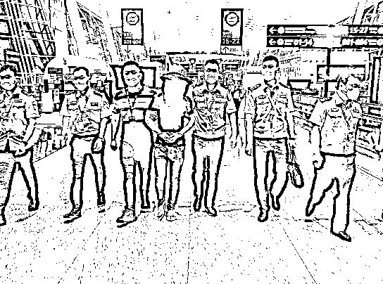

# 涉黑逃犯自述缅北遭遇：完不成业绩，罚做 2000 个深蹲

> 原文：[`mp.weixin.qq.com/s?__biz=MzIyMDYwMTk0Mw==&mid=2247544091&idx=4&sn=c578d5c400ddc1af19a2ea64eb776da4&chksm=97cbe623a0bc6f3599f7278b2d69431e936d24ea167ec79abedd57c0f82d05b3a785dc441936&scene=27#wechat_redirect`](http://mp.weixin.qq.com/s?__biz=MzIyMDYwMTk0Mw==&mid=2247544091&idx=4&sn=c578d5c400ddc1af19a2ea64eb776da4&chksm=97cbe623a0bc6f3599f7278b2d69431e936d24ea167ec79abedd57c0f82d05b3a785dc441936&scene=27#wechat_redirect)

李某（中）被押送回国 通讯员供图

9 月 13 日，涉黑逃犯李某被天门市公安局抓捕归案。**面对民警，李某感慨道：“回国服刑也心安。”**

原来，李某曾逃亡缅北逃避抓捕。就在他准备回国投案前，当地一私人武装将他控制，并以 9 万元卖给电诈公司。在那里，他受尽折磨，生不如死。

[`mp.weixin.qq.com/mp/readtemplate?t=pages/video_player_tmpl&action=mpvideo&auto=0&vid=wxv_2581691130564804612`](https://mp.weixin.qq.com/mp/readtemplate?t=pages/video_player_tmpl&action=mpvideo&auto=0&vid=wxv_2581691130564804612)

**1**

* * *

**涉黑逃犯拟回国投案** 

2019 年 12 月，以熊飞为首的 22 人组织、领导、参加黑社会性质组织、聚众斗殴、开设赌场、非法持有枪支、寻衅滋事、非法拘禁一案，在天门市人民法院公开宣判，团伙成员分别被判处 1 年 2 个月至 15 年不等的刑期。

今年 26 岁的李某，也是该涉黑组织的成员。他幼年丧母、生父失踪，他跟着外婆、姨妈在广东生活、长大。

2019 年 9 月，公安机关侦办该案期间，李某跟随他人偷渡到了缅北，一直没有回国。2021 年 5 月，天门市公安局对李某上网追逃。

2021 年 8 月，为了敦促李某尽快归案，天门市公安局民警赶赴广东，找到李某的亲属，请他们劝说李某回国投案。

经过大量劝返工作，李某答应回国投案。去年 9 月 6 日，他主动到边境领号排队，等待入境。

**2**

* * *

**等候入境时突然失联**

**正当天门民警静候李某回国时，意外发生了：李某失去联系。**

**警方和家属不断尝试联系李某，但都未得到回应。**

**2021 年 9 月中旬，天门民警再次前往广东，与李某亲属见面。交谈间，李某亲属收到他发来的信息：“在缅北遇到大麻烦，几个月内无法回国。”**

**正当民警想深入了解时，李某再次断了联系。民警随即再次展开调查工作，得知李某在境外的密切联系人鲁某，于 2021 年 10 月回到重庆。**

**民警立即前往重庆，见到了鲁某。**

**鲁某告诉民警，李某确实准备回国投案。在边境排队入境期间，李某邀约鲁某再去一次赌场，“他说想在回国前赚一笔钱。”**

**李某没想到的是，去赌场时，他被当地私人武装控制带走。之后他遭遇了什么，鲁某也不清楚。**

**唯一的线索再次断掉，对李某的追逃工作再次陷入僵局。**

****3****

* * *

****在电诈公司受尽折磨**** 

**今年 6 月，湖北省公安厅攻坚专班进驻天门市公安局，对李某的相关信息进行全面梳理，深度分析。**

**8 月，专班民警发现，孝感籍回流人员汪某曾与李某联系。民警找到汪某，并经进一步核实，确定李某被缅北某电诈公司控制。**

**在省公安厅及相关部门支持下，专班赶赴缅北开展工作。8 月 21 日，经过各方不懈努力，李某获救，被送至边境疫情隔离点。**

**9 月 13 日，李某结束隔离，被押回天门。**

**在审讯室，李某向民警讲述了他在缅北的悲惨遭遇。原来，当地私人武装将他控制后，以 9 万元的价格卖给一家专做海外“杀猪盘”的电诈公司。**

**在那里，李某等人动辄遭到打骂，身心受尽折磨。**“他们完全没有把我们当人看。刚开始完不成业绩，会被罚做深蹲，我最多一次做了 2000 个。2 个月后变成用橡胶棒打，之后又升级成用电棒电。他们还找各种理由要我们签合同、赔损失，我越欠越多，最后欠了他们 30 多万元……”**李某说。**

**在缅北的遭遇，让李某心有余悸。他告诉民警：“回国服刑也心安。我宁愿在国内坐牢，也不想在缅北当‘猪仔’。”**

****法网恢恢，****

****疏而不漏！****

**来源：楚天都市报极目新闻（记者：陈勇、通讯员：黄略，@人民网中国青年网微信（ID：youthzqw）**

****

**欢迎关注灰产圈社群服务号**

****

****