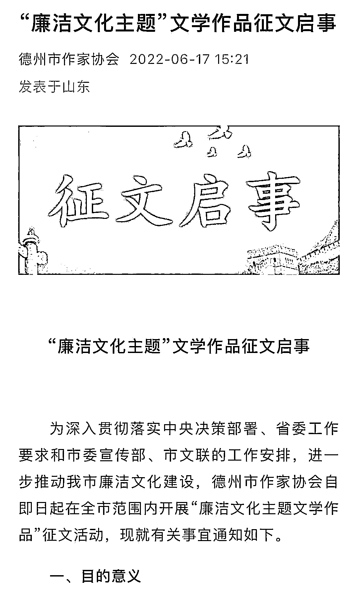

# 《我的县长父亲》获奖后火速被删，网友：凭什么...

> 原文：[`mp.weixin.qq.com/s?__biz=MzIyMDYwMTk0Mw==&mid=2247544169&idx=2&sn=d97c441cb5d6ebdbafb8cf0841a7e3f8&chksm=97cbe651a0bc6f47fe81ea9f14a74ae2badfec061a26f457459ec538ab7e4750e36dd6d37401&scene=27#wechat_redirect`](http://mp.weixin.qq.com/s?__biz=MzIyMDYwMTk0Mw==&mid=2247544169&idx=2&sn=d97c441cb5d6ebdbafb8cf0841a7e3f8&chksm=97cbe651a0bc6f47fe81ea9f14a74ae2badfec061a26f457459ec538ab7e4750e36dd6d37401&scene=27#wechat_redirect)

9 月 18 日，山东省德州市作家协会在其官方微信公众号上发布了一份廉洁文化主题文学作品征文获奖名单，在获得一等奖的作品名单中，有一篇文章引发关注，它的标题是《我的县长父亲》，作者名为于忠东。

[`v.qq.com/iframe/preview.html?width=500&height=375&auto=0&vid=k3356yofvm9`](https://v.qq.com/iframe/preview.html?width=500&height=375&auto=0&vid=k3356yofvm9)

有网友将其视为喜剧电影《夏洛特烦恼》中，“我的区长父亲”桥段的再现，质疑此次评选的公正性，也有网友认为，作者的标题容易给人造成歧义，是在“拼爹”而不是比拼文学功底。一时间，关于“我的县长父亲”等关键词冲上热搜，作者的文学功底以及作协评选过程受到质疑。当天晚上，该协会删除了这条动态。

记者梳理发现，此次征文比赛开始于今年 6 月，主题作品创作以正风肃纪反腐、弘扬廉洁文化、讴歌本土先模人物和事迹为主要内容，要求提炼优秀传统文化中的廉洁理念，以及汲取社会主义先进文化中的廉洁营养等。而于忠东的个人介绍为中共党员，山东禹城人，某银行禹城市支行退休干部，其爱好写作，敲打文字，并喜欢通过笔墨，去抒发自己的内心情感。

9 月 19 日，封面新闻记者分别与德州市文联以及德州市作家协会相关负责人取得联系，对方告知，关于“我的县长父亲”引发热议一事暂时还不知情，至于后续的问题，应该会由网信部门来回应。

**网友质疑“拿父亲头衔刷名次”**

**这篇名为《我的县长父亲》的文章，最初发表在德州市作家协会的微信公众号上。记者梳理原文内容发现，这篇文章是一篇回忆录，作者的父亲是禹城县的首任县长于志明，作者用第一人称视角，讲述了父辈的情怀与奉献。**

**在这篇文章中，作者描述了父亲几十年来的人生经历和对整个家庭的影响：早年是一名党政机关的干部，一生起起伏伏，从描写中，能够浮现出一位为人民办实事，俯首甘为孺子牛的“老干部”形象。**

**作者的父亲还被贴上了 3 个标签：“无情”“抠门”和“一根筋”，但是从作者对父亲日记本的阅读来看，在当地百姓们心中，县长父亲却是一个“清官”和“好官”。比如，作者在文中说，珍宝岛事件发生后，参军的新兵很可能会被派上战场，但即便如此，作者父亲依然把年仅 16 岁的大哥送入军营，过了几年又将作者二哥送去入伍，从抗日战争时期到和平年代，作者的家族中参军入伍多达 27 人。**

**她还记录了一些细节：作者的堂哥从山东水利厅回到禹城发展时，刚开始是一名临时工，水利局党组多次向时任县长的作者父亲打报告，希望能让作者堂哥转正，但是作者的父亲硬是没批，理由就是上级没有相关政策。**

**但是，当这篇《我的县长父亲》被当作获奖名单发上网后，网友们出现了不同的观点：有人认为，作者有利用父亲官职刷名次的嫌疑；也有网友质疑，作者是“拼爹”而不是比拼文学才情。一时间，关于“我的县长父亲”引发热议。**

****

****作协回应，后续会有相关部门回应**** 

**记者梳理发现，这篇文章的作者于忠东为山东禹城人，是当地某银行的退休干部，平时爱好写作，在当地多家媒体和文学平台都发表过作品。**

**比如，2020 年 10 月，《齐鲁晚班》曾刊发一篇署名为于忠东的《裹着小脚的母亲，成了父亲的贤内助，撑起家庭半边天》的文章，其中写着禹城的故事，其父亲于 1988 年病逝，里面提到了悼文，悼文上的称呼是于志明。**

**同时，在禹城市党史研究中心的官方平台上，也发布过热心市民捐助的 91 本工作日记，而捐助人为于忠东，日记的作者正是她的父亲于志明。**

**目前，网上关于“我的县长父亲”等话题引发热议，而也有网友指出，作者在文中并没有卖弄父亲的“县长”身份，反而让大家了解到，身为曾经的县长子女，并没有因此享受到“特殊待遇”，网友们称赞作者的文章能获奖是名副其实。**

**在文章被删后，也有网友表示不能理解。**

****

****

****

**9 月 19 日，记者与德州市作家协会相关负责人电话取得联系，对方告知，关于“我的县长父亲”一文在网上引发热议一事，其个人暂时并不知情，至于后续的相关问题，可能会有官方进行回应。与此同时，记者也与德州市文学艺术界联合会取得联系，一名工作人员称，暂时没有关注到这件事，相关事宜可找作协对接。**

****附：《我的县长父亲》原文  ****

****

**图源：德州市作家协会公号**

**来源：封面新闻，观察者网**

****

**欢迎关注灰产圈社群服务号**

****

****