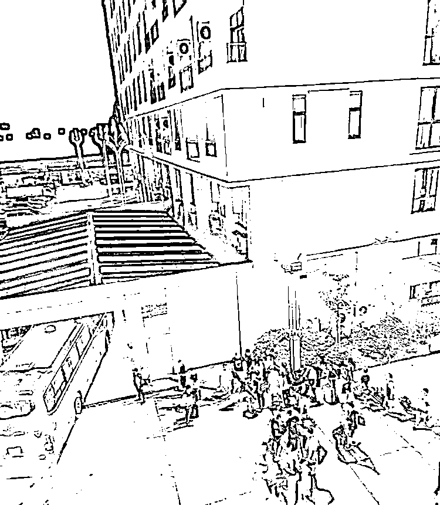
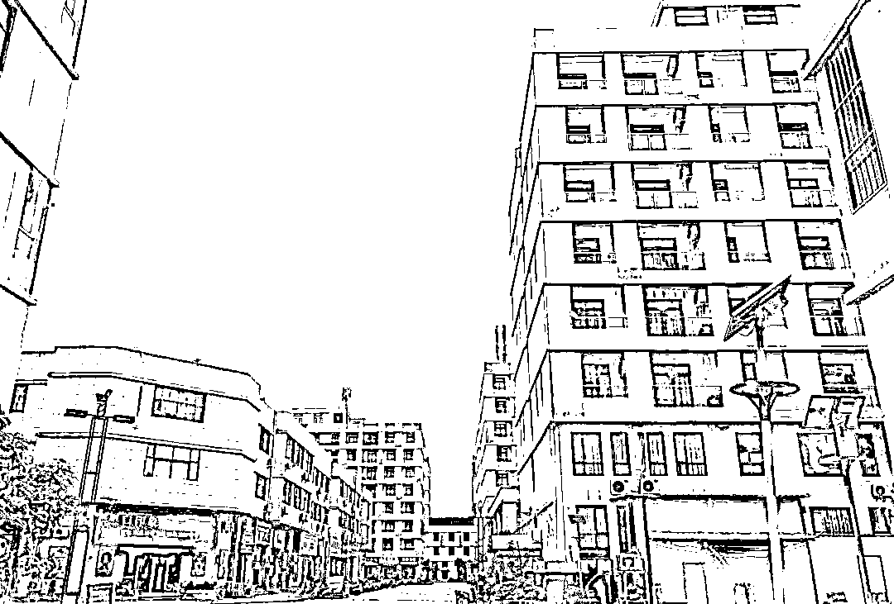
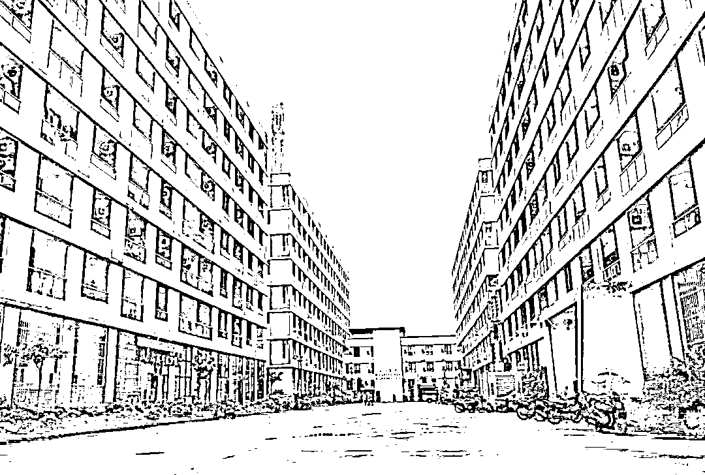
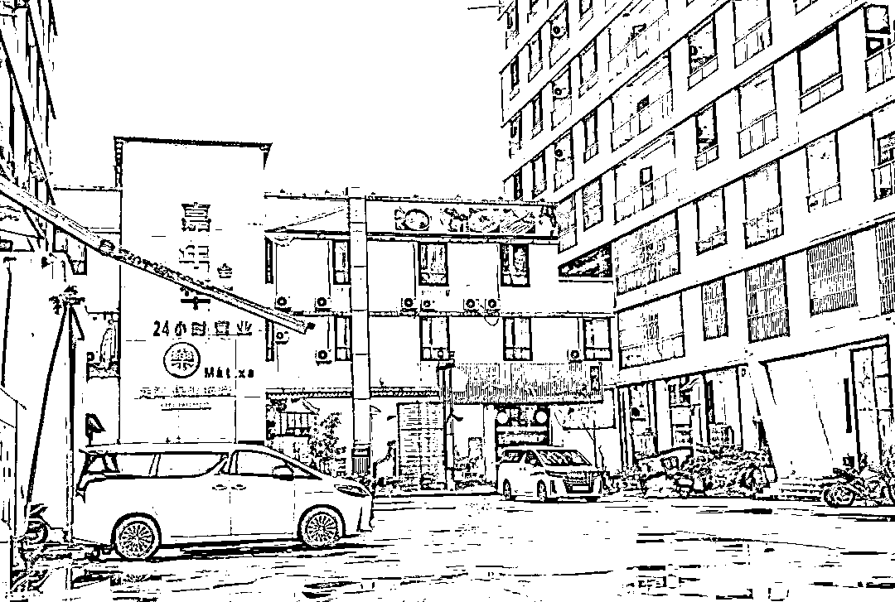
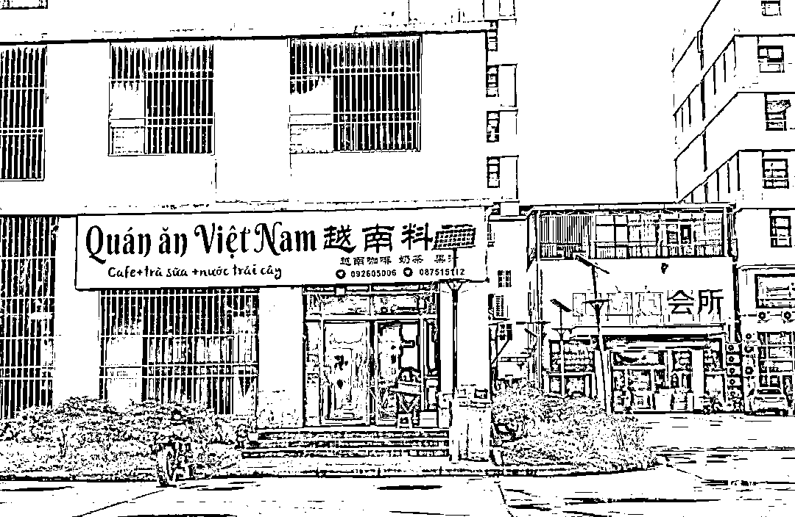
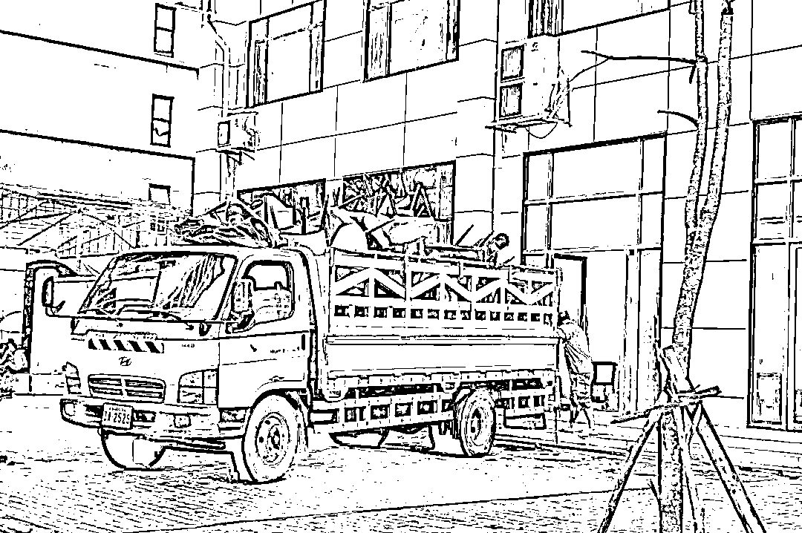
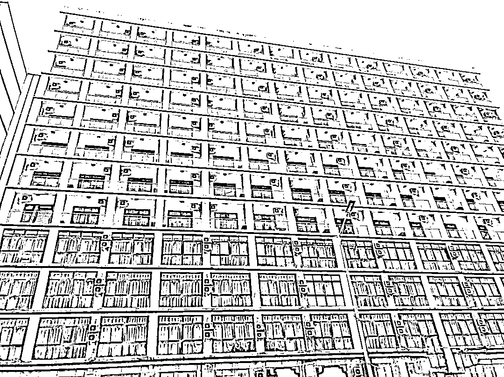
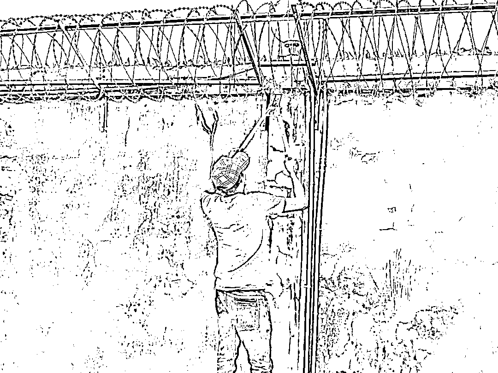
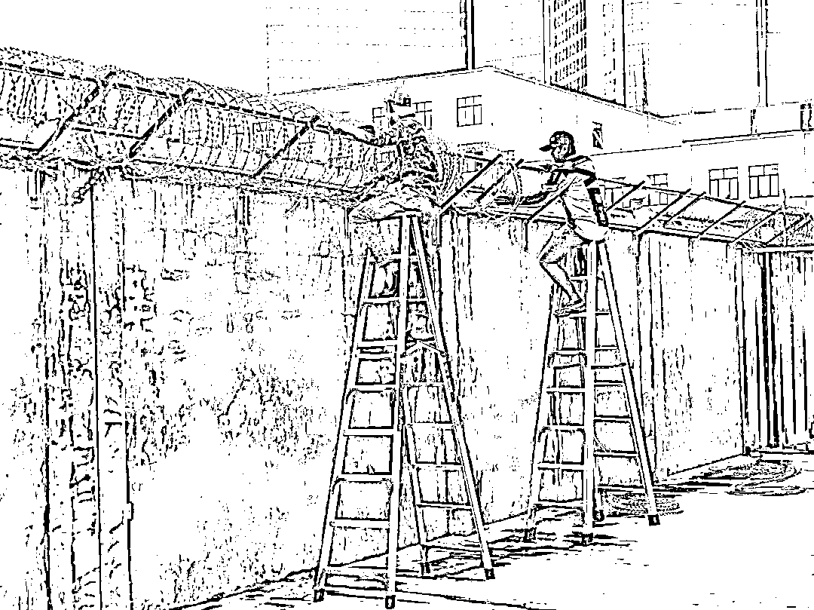

# 视频：臭名昭著的西港中国城诈骗园区全部开放，昨夜诈骗人员大撤离？

> 原文：[`mp.weixin.qq.com/s?__biz=MzIyMDYwMTk0Mw==&mid=2247544169&idx=3&sn=2141d06335f23a53d15006bbcb13b12a&chksm=97cbe651a0bc6f4708924284fee3287829da9f07f35ef00447be740bf5a72980496b01506ba9&scene=27#wechat_redirect`](http://mp.weixin.qq.com/s?__biz=MzIyMDYwMTk0Mw==&mid=2247544169&idx=3&sn=2141d06335f23a53d15006bbcb13b12a&chksm=97cbe651a0bc6f4708924284fee3287829da9f07f35ef00447be740bf5a72980496b01506ba9&scene=27#wechat_redirect)

昨天晚上很多群里都在转发西港中国城网投人员大转移的视频，从视频中我们能给看出来，网投公司的大巴车前来接应这些诈骗人员，一直以来中国城都是西港诈骗园区里的标志性园区，就如前几天严打开始查园区的时候，很多小园区被端掉了，就有很多粉丝在后台问，中国城为什么没有人查？是不是中国城的背景太强大了？所以没有人敢来查中国城？ 

[`mp.weixin.qq.com/mp/readtemplate?t=pages/video_player_tmpl&action=mpvideo&auto=0&vid=wxv_2583072379849916417`](https://mp.weixin.qq.com/mp/readtemplate?t=pages/video_player_tmpl&action=mpvideo&auto=0&vid=wxv_2583072379849916417)

之前你可以有这样的质疑，但是，昨天晚上，随着凯博诈骗园区一车一车往出来这些诈骗员工，我们可以看得出来，他们都是提前接到了消息，应该要查中国城诈骗园区了，所以这些人才会紧急撤离。

不了解东南亚诈骗园区的人一定会很好奇，从视频中看，这些诈骗从业人员貌似很配合公司安排的转移，是的，绝大部分人都是愿意配合的。 

其实东南亚诈骗园区里并不都是被骗过来的人，不都是被绑架卖进来的人，东南亚有几十万诈骗从业人员，谁有能力绑架囚禁这么多人呢？其实在东南亚的诈骗园区里，有百分之八十以上的人都是自愿干诈骗的，百分之八十可能都说少了，可能要说百分之九十的人。 

比如一个诈骗园区里有 10000 人从事诈骗，那么至少有 8000 人，甚至有 9000 人，他们都是自愿来做诈骗的，剩下的百分之十可能说是被人骗来的，或者被贩卖进来的。大家都知道，偷渡来的人百分之九十都知道自己来东南亚干灰产，虽然很多人嘴上不承认，他们只说自己被骗来的，其实也只能忽悠忽悠那些不懂的人而已，都不是傻子，哪有那么好骗呢？别忘了，那可是偷渡出境，偷渡违法谁不知道呢？国内边境管控的非常严格，现在想要偷渡也是非常有难度，如果不是当事人全力配合，蛇头也不能把人带到境外，所以，能偷渡来到这里的人，从他出境那一刻，百分之九十的人都知道干诈骗，仅仅有一小部分人不了解诈骗，是奔着赚取高薪才来的。

[`mp.weixin.qq.com/mp/readtemplate?t=pages/video_player_tmpl&action=mpvideo&auto=0&vid=wxv_2583246655798362113`](https://mp.weixin.qq.com/mp/readtemplate?t=pages/video_player_tmpl&action=mpvideo&auto=0&vid=wxv_2583246655798362113)

之前我们的文章里就写过很多这样的案例，诈骗园区里没有业绩的人，才会被殴打，电击，贩卖，那些真正努力搞诈骗的人一般不会受到虐待的。 

所以我们就能看到这样的场景，一批又一批的诈骗从业者配合着诈骗公司的大规模搬迁，比如视频中就是如此，如果这些人一起抱团冲出去，你们说，诈骗园区的保安能拦得住吗？肯定拦不住，那么为什么不跑呢？ 

两个原因，第一，可能他们不抱团。他们相互不信任，在长期的高压生活下，谁也不敢轻易相信谁，所以即便有人身上有赔付，是被贩卖进来的，也没有人敢挑头硬闯，在这一点上，越南人做的比较狠，他们已经在柬埔寨三次硬闯诈骗园区，而且每次都是几十人一起闯。 

第二，他们自己本身就愿意干诈骗，因为他们干诈骗赚到钱了，所以不想离开，听说警方要来查园区，他们害怕被警方带走，影响了自己的收入，所以选择配合公司转移躲避检查。

[`mp.weixin.qq.com/mp/readtemplate?t=pages/video_player_tmpl&action=mpvideo&auto=0&vid=wxv_2583071697956749313`](https://mp.weixin.qq.com/mp/readtemplate?t=pages/video_player_tmpl&action=mpvideo&auto=0&vid=wxv_2583071697956749313)

那么很多人看到现在西港诈骗产业大转移，是不是好奇这些诈骗从业者都搬去了哪里呢？简单点说，就是先逃离西港，因为柬埔寨目前来说，重点打击的就是西港，打击的目标就是人口贩卖。

那么这些诈骗集团暂时搬迁到了哪里呢？据知情人透露，西港的诈骗公司有一部分连夜搬迁到了菩萨省诈骗园区，菩萨省位于柬埔寨和泰国交界处，诈骗园区距离泰国只有几百米，属于山高皇帝远的一地方。还有些诈骗公司搬迁到了波贝，也是柬泰边境，还有一些诈骗公司搬迁到了金边。

短期看柬埔寨的诈骗产业开始集中在柬泰，柬越边境一带，未来这些地区很快将会变成黑金地带，大家都知道，只要有诈骗园区的地方，就一定离不开人口贩卖，这是毋庸置疑的，迪拜有人口贩卖，因为迪拜有诈骗园区，菲律宾有人口贩卖，缅甸有人口贩卖，老挝有人口贩卖，柬埔寨有人口贩卖，这一切都是因为当地的诈骗园区的存在，如果真要打击人口贩卖，那只有打击诈骗园区，不过效果会如何，只能看这一阵风过后，死灰是否复原了。 

图片来源今日 柬闻 

据金日柬闻记者黄岩独家报道，今天白天西港最大的诈骗园区，所谓背景势力最强的，东南亚知名的西港中国城全部对外界开放，凯博，金水园区所有人员可以自由进出。 

图片来源今日柬闻 

听闻中国城园区可以自由出入之后，记者尝试进入凯博园区，过程很顺利，并没有受到任何阻拦。 

记者进入中国城，这个被无数人千夫所指臭名昭著的罪恶之城浮现在眼前，这个曾经神秘而又恐怖的诈骗园区到底发生过多少让世人惊骇的人间惨剧？

图片来源：今日柬闻 

正所谓是一日天，一日地，昨天还热闹非凡的诈骗园区此刻已经成了一座空城，而且还能看到柬埔寨工人正在剪掉高墙上的铁丝电网，这个曾经囚禁了无数人的罪恶园区终于安静了。 

但是，最重要的问题值得我们深思，打击电信诈骗，打击人口贩卖，难道就是把这个那个诈骗园区打击掉？这里曾经的几千名诈骗人员，坐着昨夜的大巴车，早就已经进入柬埔寨别的诈骗园区里继续从事着诈骗了，如此看来，未来还会持续打击，否则，这些人无非就是换了一个地方而已，该有的罪恶会一切依旧。

希望这是一个真正的开始，希望人间减少诈骗，希望人间减少人口贩卖，希望...........

来源:阿龙闯荡记

欢迎关注灰产圈社群服务号

