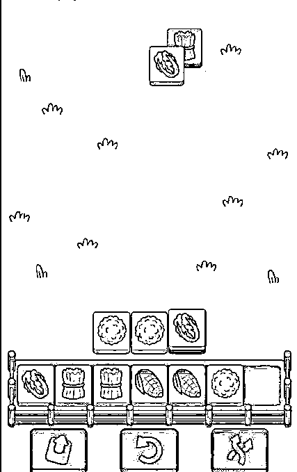
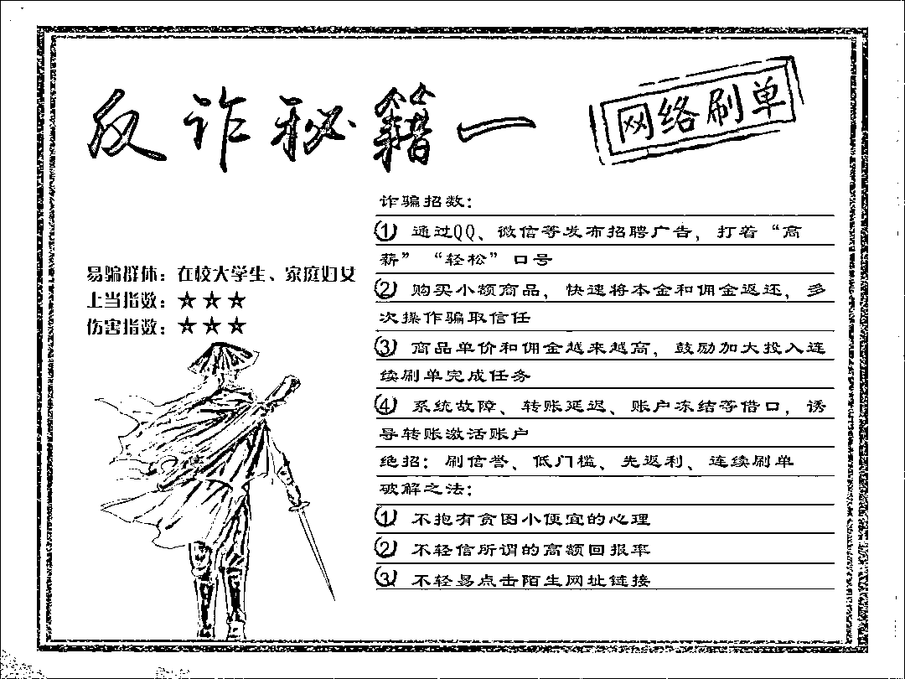
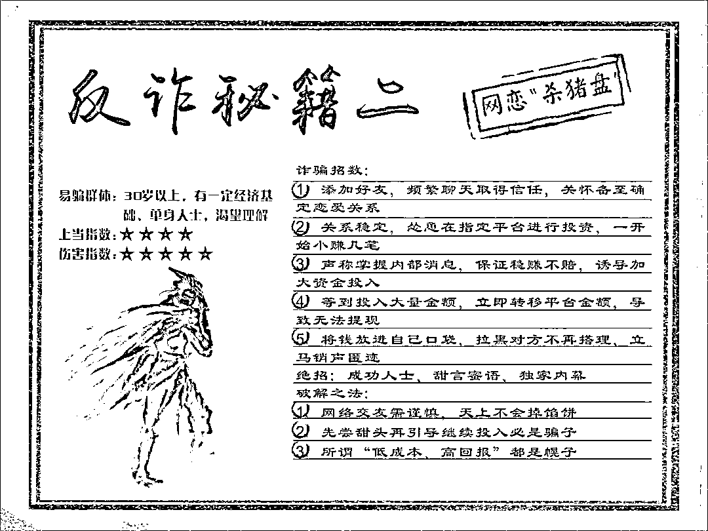
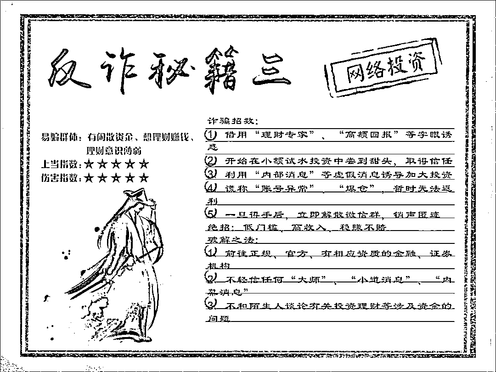
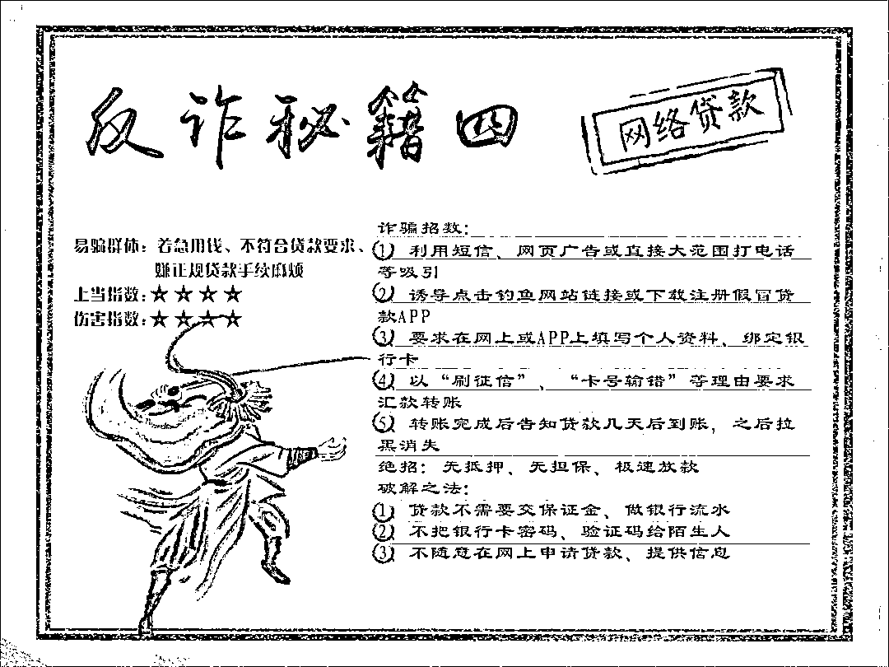

# 从《羊了个羊》到“骗了个遍”，原来都是利用人们的这些心理！

> 原文：[`mp.weixin.qq.com/s?__biz=MzIyMDYwMTk0Mw==&mid=2247544169&idx=4&sn=2a462e2f1bb8cfd253fb740ee8de3e56&chksm=97cbe651a0bc6f4794e292053457d48b16ad8160467db3506ebfd3a451cd4173ac601e35d742&scene=27#wechat_redirect`](http://mp.weixin.qq.com/s?__biz=MzIyMDYwMTk0Mw==&mid=2247544169&idx=4&sn=2a462e2f1bb8cfd253fb740ee8de3e56&chksm=97cbe651a0bc6f4794e292053457d48b16ad8160467db3506ebfd3a451cd4173ac601e35d742&scene=27#wechat_redirect)

**“我离成功只差一点点”**

**往往是一个人上当受骗后**

**产生的心理幻觉。**

这两天，有几百万人夜不能寐，

疯狂玩一款名为《羊了个羊》

的小程序游戏。 

沉沦于通关游戏为省争光 

****

因为玩法简单，但难度系数高
（像不像刷单诈骗动动手指就赚钱）

大家都热衷于挑战冲关

所以马上成为新的一个

休闲（摸鱼）“神器”

这个疯狂的小游戏上线不久

一款名为《羊了个羊》的小游戏

一度冲上微博热搜第一

却，通不了关，白看一夜广告。

空留下一对对深沉的黑眼圈。

根据小程序数据，

9 月 14 日超过 2600 万人参与了游戏，

通关数仅为 6 万人，

通关率为 0.2%，比某夕夕还过分。

以至于出现了朋友圈奇观，

人人在骂人人在玩。可是……

**越骂越火。**

其实，人真像羊，羊群效应明显，

无理由的

看着别人都在玩，自己也就想玩。 

这一玩，就着了魔，陷入

**“我离成功只差一点点”**的怪圈。

这款游戏，画面不算精致（粗糙）；

玩法也不新颖（就是消消乐）

**但它却对人性有十足的把握！**

玩法特别简单，

玩家们前期进度势如破竹！

心想不过如此！

然后到最后几层卡住了，过不了。

“玩都玩了（沉没成本都付出了），

离通关就差一点点，

怎么可能放弃呢”？

**“再来一次吧，**

**又差一点点！可恶啊！”**

**妙就妙在每次都让你感觉差一点点！**

**“我离成功只差一点点”**

**往往就是一个人上当后的心理幻觉。**

这背后的逻辑是恐怖的，

**有******沉没成本******，有**多巴胺分泌预期**，**

**有******损失厌恶******，**

某夕夕的砍一刀是这个原理，

刷单诈骗也是这个原理。

警方常常会科普刷单诈骗骗局，

但很多人想不明白。 

**“怎么会信呢？**

**怎么会去贷款投入呢？**

**怎么会被骗这么多钱呢？”**

**拒绝沉没成本心理**

有少量的受骗者不只遭受了一次诈骗损失，而是遭受了多次同样的诈骗损失。之所以出现连续受骗行为，是**因为受骗者期望能挽回之前的损失**。如个案 1 和个案 8 都提到，为了拿回之前刷单支付的钱，她们都选择了再次交钱，结果再次被骗。这种连续受骗行为的出现，是诈骗者利用了受骗者的拒绝沉没成本心理。沉没成本一般指人们已为某种商品或劳务支付过的成本。关于决策心理的研究发现，由于沉没成本的存在，人们会产生尽快弥补损失的强烈动机，这种动机会导致后续的决策更加冒险。在电信诈骗中，受骗者正是**由于拒绝沉没成本的心理，而选择了继续相信诈骗者。**

****

****“登门槛”效应****

**为了确保后续诈骗行为的成功，诈骗者往往先给予受骗者一些**“小恩小惠”**，然后再提出更高的要求，这时候受骗者会继续选择相信对方，从而导致更大损失。例如，有的受骗者提到:“我抱着一种好奇的心理去试了一下，诈骗者往往通过谈情说爱诱导受骗者进行网络投资或者网络赌博，第一单果然赚（赢）了钱;“我试着投资 1000 块钱，平台确实返了 1100 块给我”(个案 3)。之所以诈骗者在实施正式的诈骗之前，会首先给予**“小恩小惠”（“****诱金****”）**，正是利用了人际互动中的“登门槛”效应。“**登门槛”效应是指一个人一旦接受了他人的一个微不足道的要求，为了避免认知上的不协调，或想给他人以前后一致的印象，就有可能接受更大的要求**[18]。受骗者正是出于避免认知不协调、保持前后一致的动机，才会选择继续相信对方，从而形成对诈骗者的信任。**

****

****从众心理****

**诈骗者在后续的沟通交流中还会不定时投放各种“信息”，营造他人也在参与的情境，**利用受骗者的从众心理，让受骗者误以为真**。如有的受骗者提到:“当时在一个培训群里，那个所谓的培训老师一直说开通会员的可以退群，以及马上就可以做任务了，那个人还开着语音一直在说×××微信或者支付宝已经完成转账。我当时就觉得是真的”(个案 1);“会有很多和别人聊天的记录和各种交易记录”(个案 3);“有他给我发的那些数据啊，就是上面有很多人的名字，我也是其中一个，还说这些人都是任务完成了，所以我要抓紧完成啊，才能把钱退给我”(个案 8)。从众效应，一般指个人的观念与行为由于群体直接或隐含的引导或压力向与多数人相一致的方向变化的现象[19]。在电信诈骗中，受骗者为了保持与群体的意见一致，摆脱脱离群体的心理压力，而选择继续相信诈骗者所提供的信息。**

****

****紧急事件导致决策避险化****

****诈骗者在与受骗者首次沟通时，往往会制造一些紧急情境或事件，如“账户异常”“行为违规”“发生事故”等。**通过虚构紧急事件或情境，受骗者往往就被激发出“避免损失或危险”的强烈动机，导致无法做出理性决策，出现决策的避险化**。如有的受骗者提到，“中午吃完饭，回宿舍拿手机出来玩，看到很多未读消息，让我尽快回复，有急事”(个案 7);“我没有想太多，我担心真的出事了，就打了电话” (个案 5)。在紧急事件或情境中，个体能够利用的认知资源变少，因此更加依赖直觉和本能来进行决策。而规避风险是人进化来的本能，因此，在电信诈骗的紧急情境中**，****受骗者为了规避风险而产生了决策偏差。******

************

******来源：终结诈骗,昆明反电信网络诈骗中心,沈阳公安反电信网络犯罪查控中心******

************

******欢迎关注灰产圈社群服务号******

************

************