# 网红日料店翻车了，人均 2 千！被举报卖核辐射地区食品，一查发现，菜是青岛菜市场买的

> 原文：[`mp.weixin.qq.com/s?__biz=MzIyMDYwMTk0Mw==&mid=2247544169&idx=5&sn=dbbee461b61e5702cd530a163c115a3c&chksm=97cbe651a0bc6f47c481ec4eb9998558dde8c213b177b41b16cdf1269ba5f620764a056a970a&scene=27#wechat_redirect`](http://mp.weixin.qq.com/s?__biz=MzIyMDYwMTk0Mw==&mid=2247544169&idx=5&sn=dbbee461b61e5702cd530a163c115a3c&chksm=97cbe651a0bc6f47c481ec4eb9998558dde8c213b177b41b16cdf1269ba5f620764a056a970a&scene=27#wechat_redirect)

近日，一家高档的日料店翻车了 

大众点评显示这家日料店人均 2004，妥妥的高档餐厅。

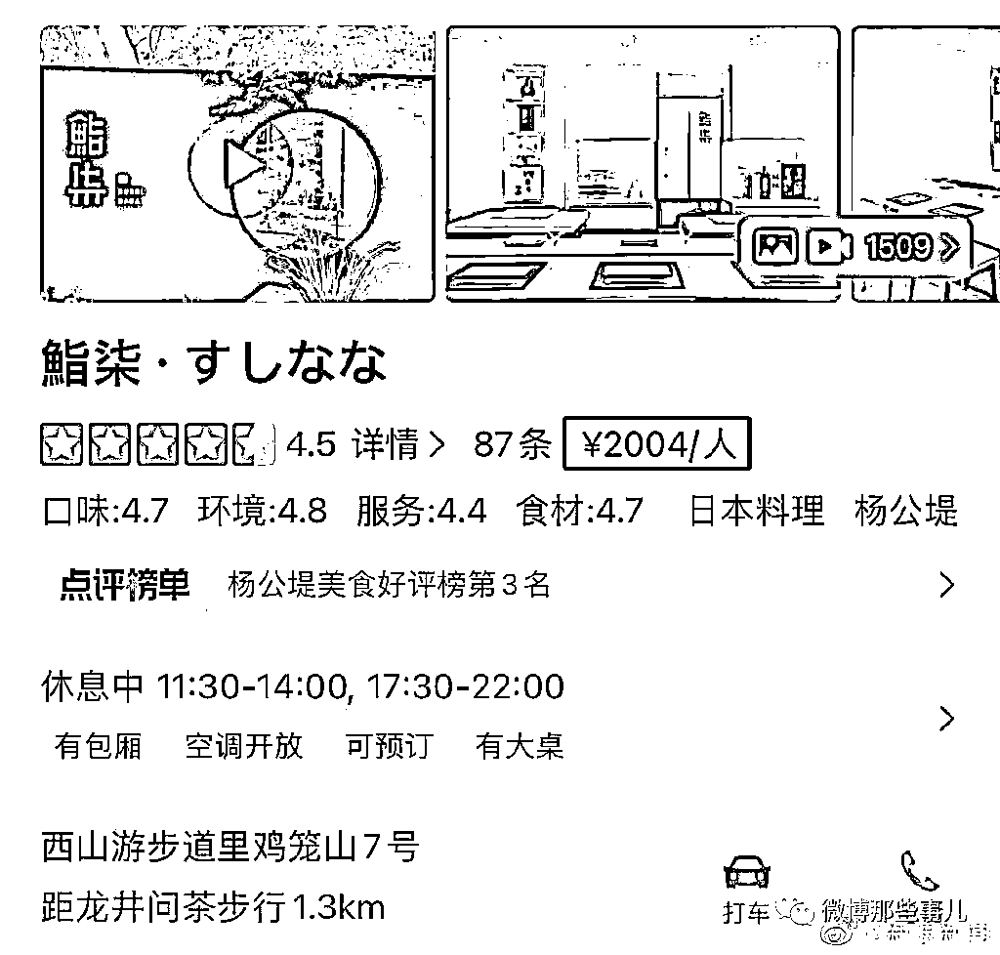

但是，今年 3 月杭州执法人员接到举报人反映，其于 2022 年 2 月 26 日在该餐厅就餐,店内推荐的两瓶清酒和食品均产自日本核辐射地区,且两瓶清酒无中文标签,消费金额 18760 元。  

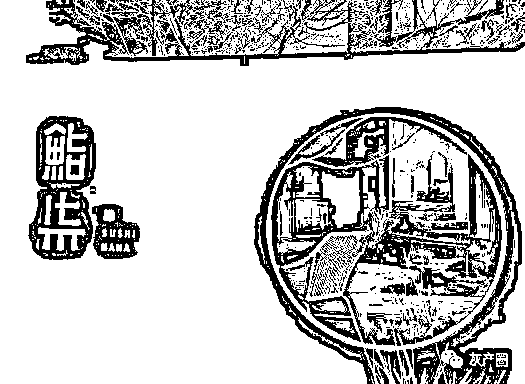

经查,该餐厅确有销售无中文标签的酒水,且无法出示酒水进口食品合法来源的证明，但菜单标示的日本菜品食材原料产地并非日本，根据进一步调查，执法人员查证涉案餐厅为吸引顾客,在餐厅菜单内标注了日本相关地名,实际菜品主料并不来源于日本，而是在杭州、青岛等地农贸市场采购，例如在该餐厅售价 58 元/份的爱知县星鳗苗（产地青岛）,成本仅 6.8 元/份,销量 68 份 ,经营额 3944 元,利润 3481.6 元。最终这家杭州柒七餐饮管理有限公司因销售无标签的预包装食品被杭州市市场监督管理局西湖风景名胜区分局罚款 38944 元。

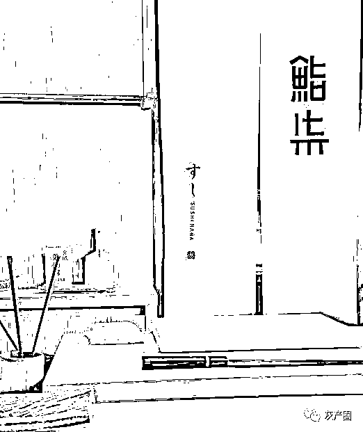

大众点评看了下这家店，还是网红打卡店喽，这下完了，以后小姐姐们都不愿意来了，花了钱还要被笑不聪明

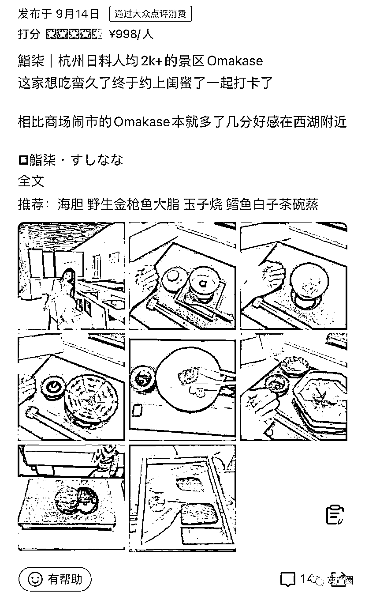

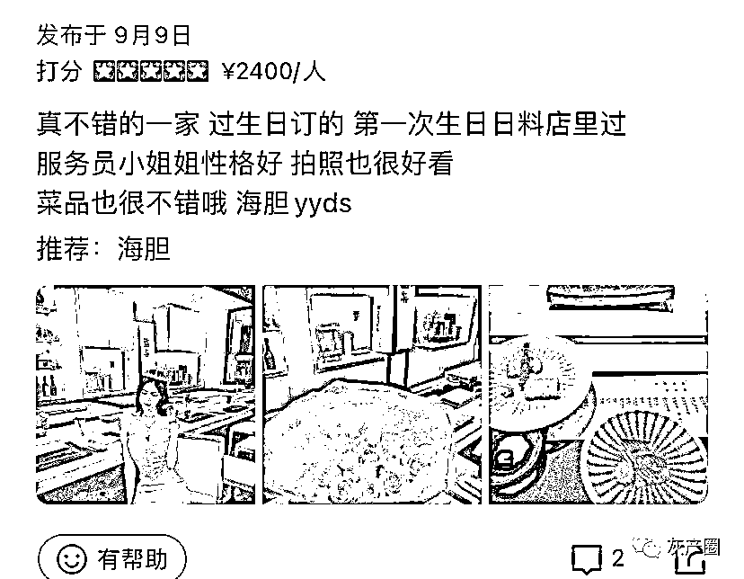

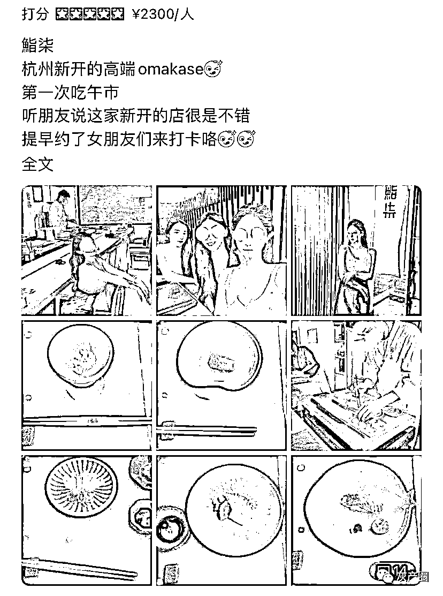

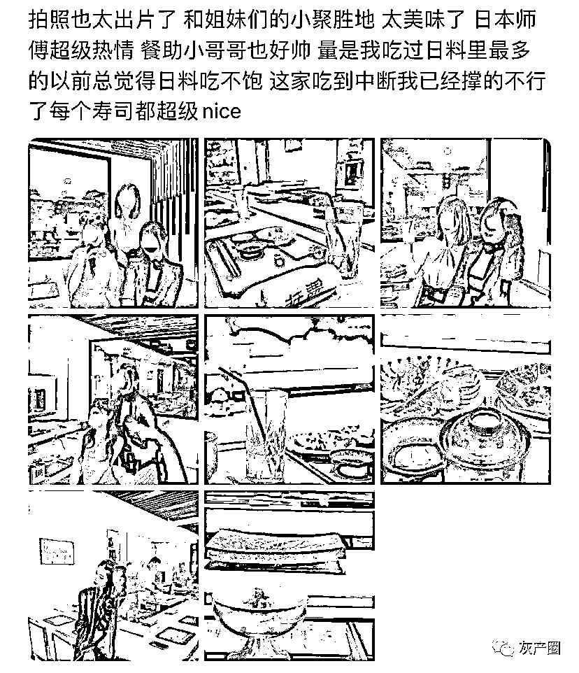

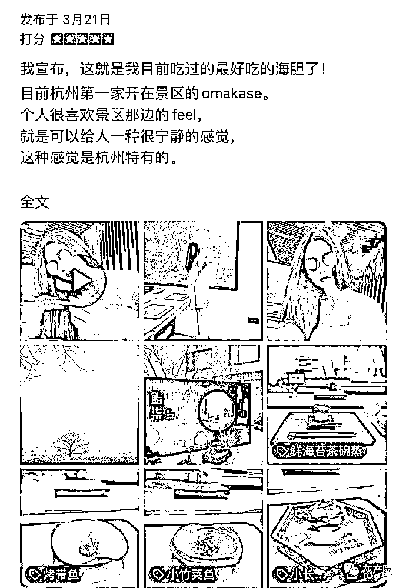

网友觉得这些受害者要集体向这家店求偿，人家那么高兴觉得自己吃的进口的，又拍照又写字，全是菜市场的东西，人家因为虚假广告都吃出了国内没有的味道，现在肿么办！！  

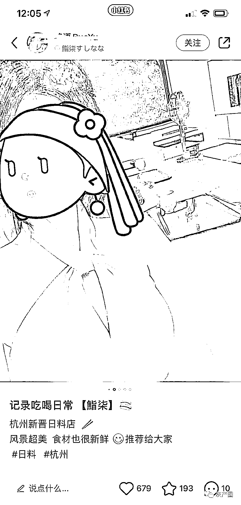

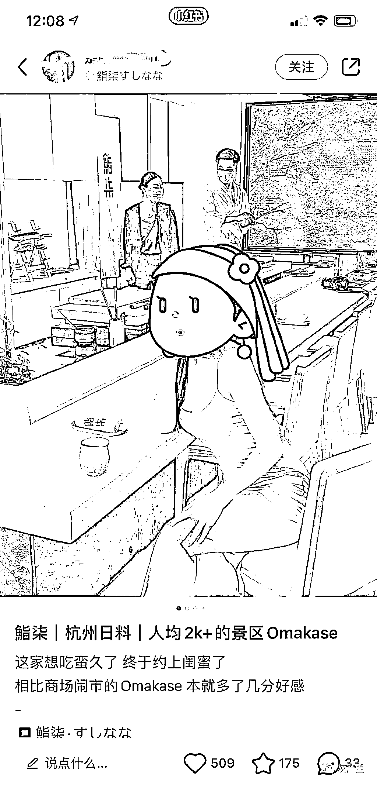

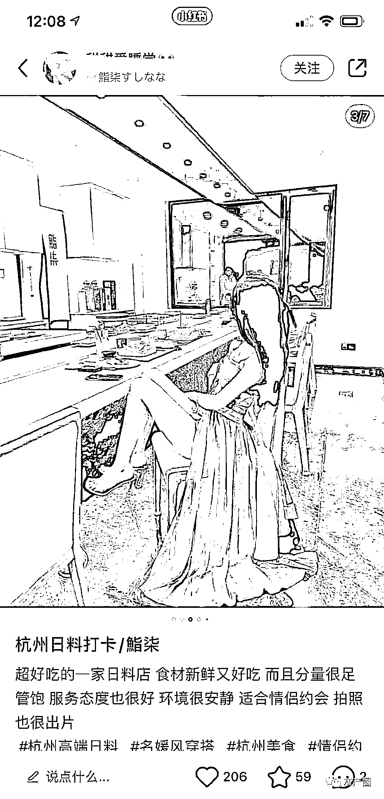

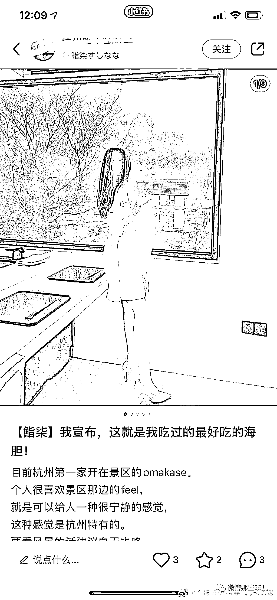

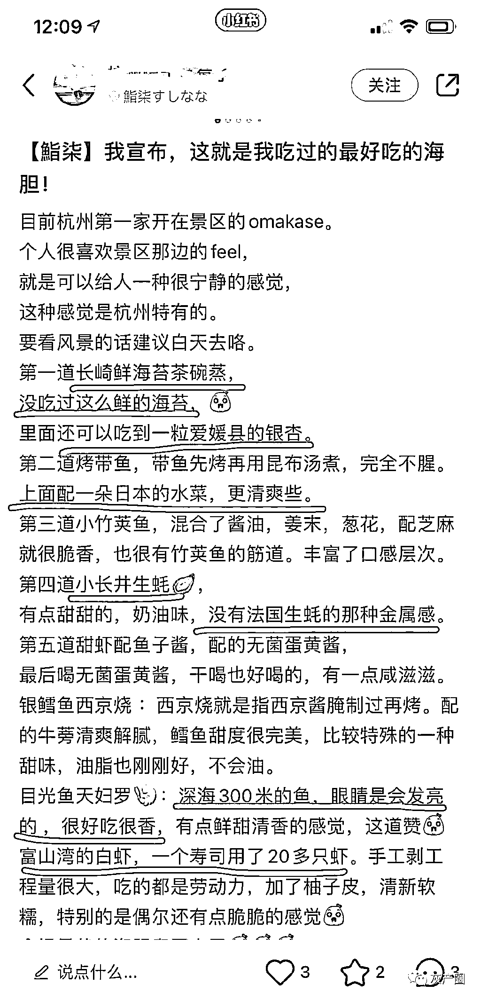

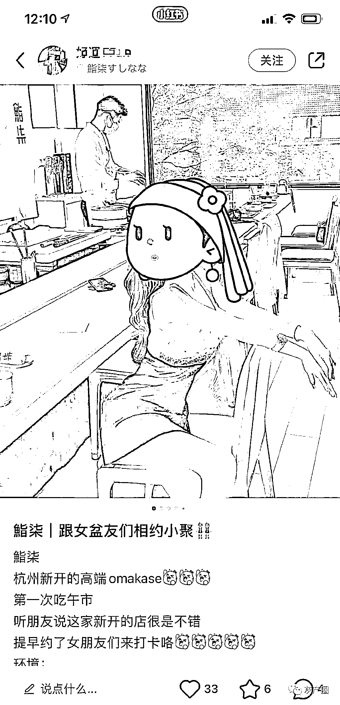

仲玖:6.8 的成本，卖 68，我一直以为餐饮利润只有百分之 60，看来是我年轻了

大家你好:别说在杭州就算是在日本吃的鳗鱼也是山东的

天华乱醉:日本因为地少人多，所以靠营销走的是高品质高价位的产品。但是这些东西在中国根本谈不上稀少，1 元的寿司🍣都可以挣到钱，这种日料店简直就是劫富

来源：微博那些事儿

欢迎关注灰产圈社群服务号

