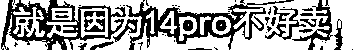
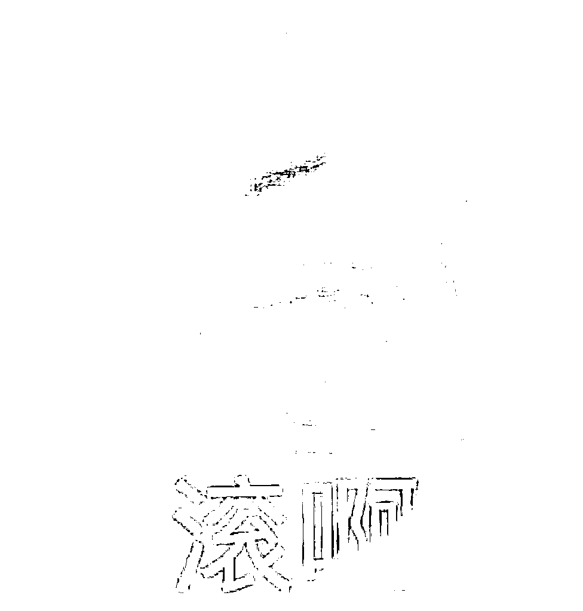

# iPhone14 破发？黄牛焦头烂额，诉苦一天亏几万！网友：还想让我们同情？？

> 原文：[`mp.weixin.qq.com/s?__biz=MzIyMDYwMTk0Mw==&mid=2247544169&idx=6&sn=dace651b4c500284d38dee7a4edbee8b&chksm=97cbe651a0bc6f4711802767f0c494e65b8b5b0b958c4be6e7313a30bbb7997efa58637bb35d&scene=27#wechat_redirect`](http://mp.weixin.qq.com/s?__biz=MzIyMDYwMTk0Mw==&mid=2247544169&idx=6&sn=dace651b4c500284d38dee7a4edbee8b&chksm=97cbe651a0bc6f4711802767f0c494e65b8b5b0b958c4be6e7313a30bbb7997efa58637bb35d&scene=27#wechat_redirect)

iPhone14 终于发售了呀

然而，据说今年苹果把黄牛搞得

那叫一个焦头烂额

看看这一个个**切污面孔**

不禁有点子想笑…

之后就看到这么一个微博热搜

#黄牛诉苦苹果 14 倒贴 100 元出#

？？？？

**黄牛诉苦：一天亏几万**

iPhone 14 正式发售了

没错，黄牛们开始踊跃辽

其中暗紫色的 iPhone14 Pro Max 最为抢手

发售日，512G 版本的要加价 2800 元出手

黄牛回收一台同颜色同配置 Pro Max

要加价 1500 左右

转手一卖就是赚 1000 多…

如果黄牛自己拿货

一台手机就能净赚 3000 元

开售首日 14Pro 和 Pro Max

溢价估计在 2000-3000 左右

然而，牛牛们没想到

iPhone 14 系列

发售没几天已经破发了

Pro 系列的加价也在持续下跌

有黄牛拿 Pro Max 1T 版加价 1000 都无人问津

“现在 iPhone 卖得不好

前几年一部手机赚五六千

现在你敢留过夜就等着亏本”

还有黄牛在苹果店门口诉苦

16 号加价一千八百元收的 iPhone 14 Pro Max

17 日只加价 600 元卖出去了

黄牛纷纷诉苦，苹果 14 倒贴

今年“血亏”啊

只能吃馒头小笼包了

……

蛤？？？这很苦吗？

还有黄牛说自己倒腾了六七台手机

都没有把坑填起来

卖出去六七台，还没有 16 日一台赔得多

亏钱的大有人在

哈哈哈 不难理解啊

现在大家赚钱都不容易，渠道又很多

愿意加价买手机的人越来越少

尤其今年很多人本身并没有购买需求

所以都化身黄牛了

这位网友，买了 iPhone14 一到就转手卖给黄牛了

走黄牛的路

让黄牛无路可走

买 14 的人不多，供过于求

卖手机的比买手机的还多了

**网友：不会是想让我们同情吧？**

不过面对黄牛诉苦

网友们并不买账

（这还买账怕不是傻子）

“黄牛扰乱市场秩序，不是可怜人

黄牛不值得同情！”

自从当了黄牛就要想到有这一天啊

可以看出来

大家对黄牛也是积怨已久

买盲盒、买鞋、买迪士尼周边…

啥地方都有他们

其实我也不太理解加价买手机的人

既不是什么贵重奢饰品

也不是艺术成分很高或者很有意义的物品

有必要加价买吗…

“一个手机还加价买？

和那些加价买车的一样，都是吃太饱了”...

欲戴“黄”冠，必承其重

这就是活该呀

叫你们扰乱市场！

来源：上海全知道

欢迎关注灰产圈社群服务号

