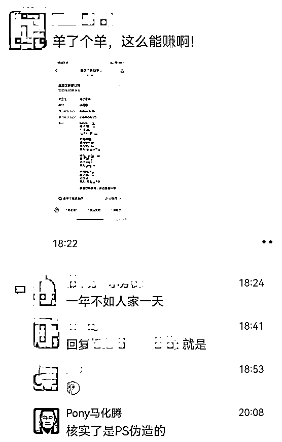
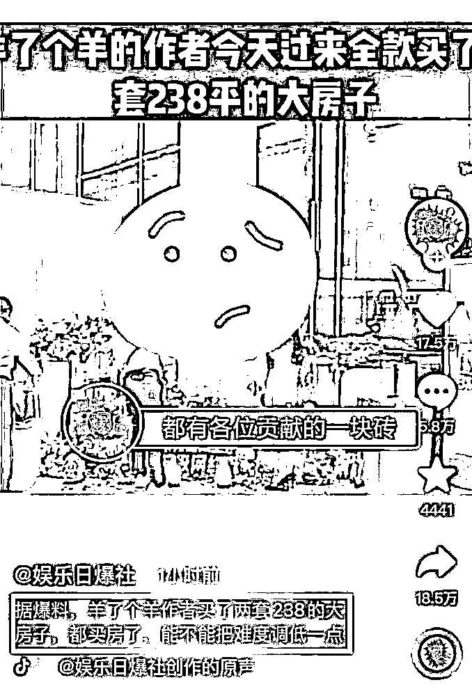
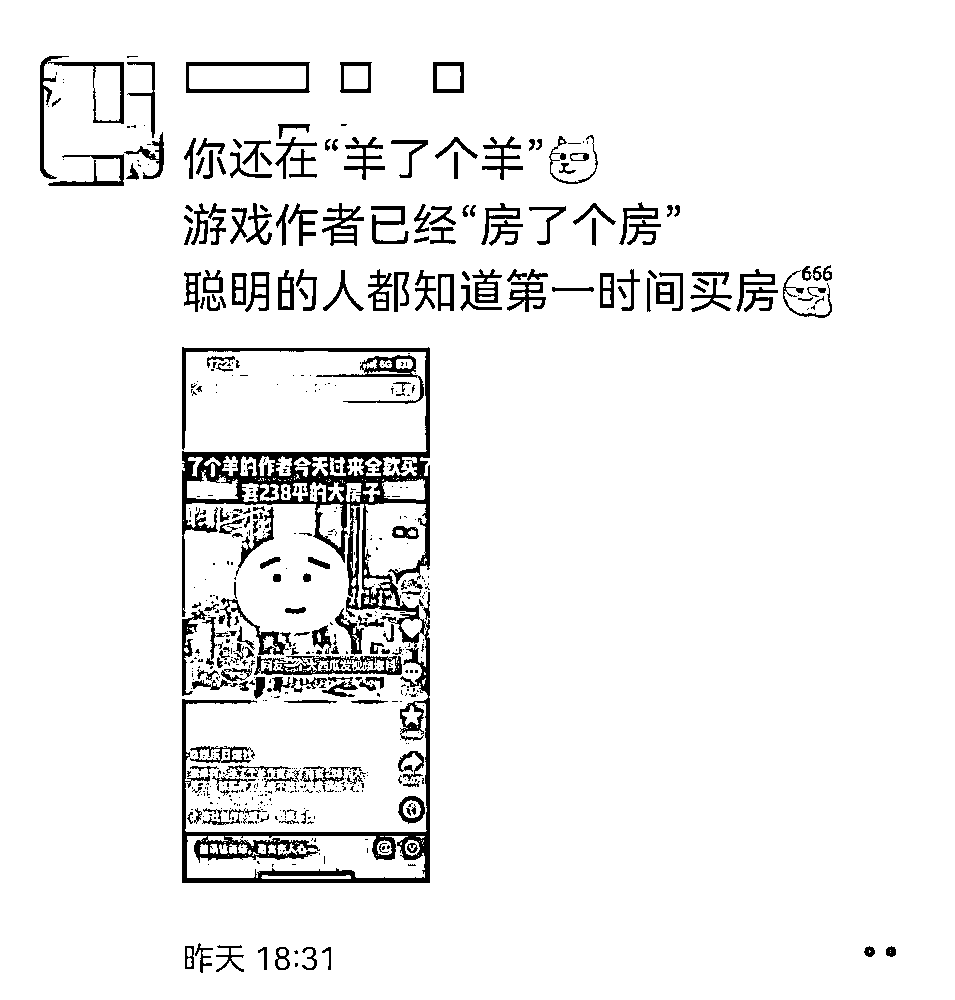
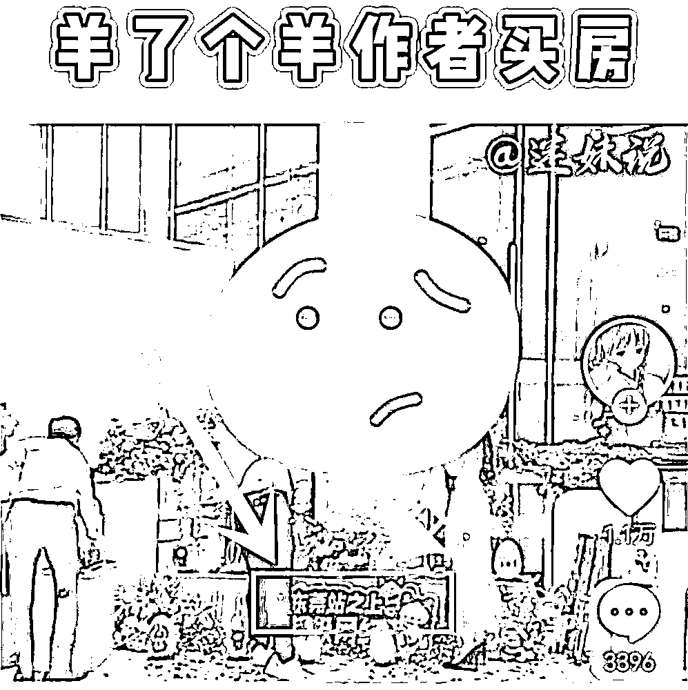
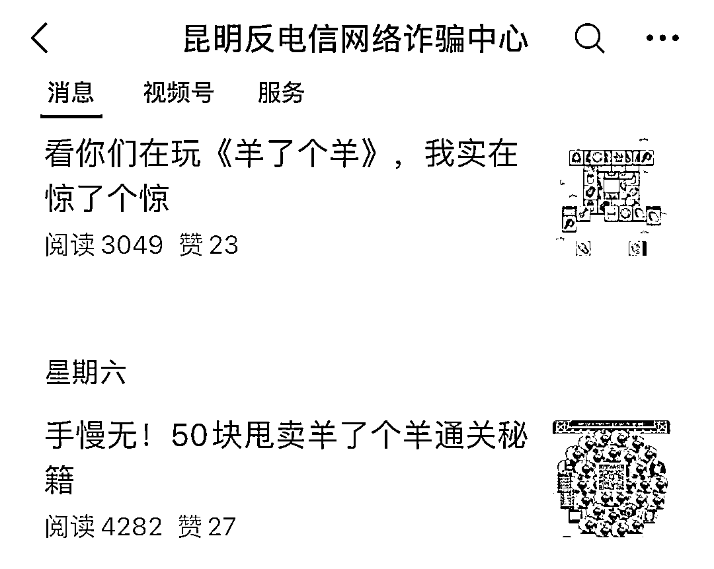
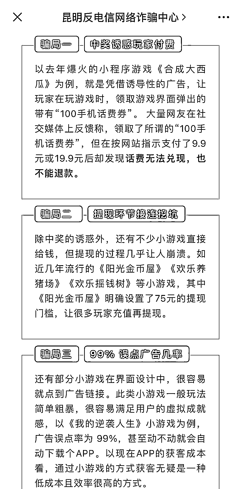
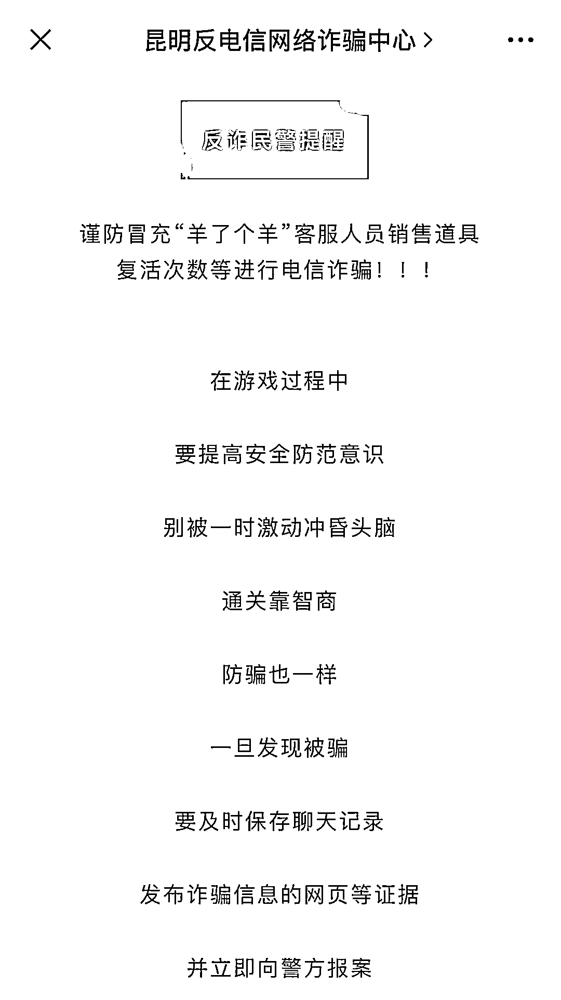

# “羊了个羊”作者全款买下 2 套豪宅？假的！

> 原文：[`mp.weixin.qq.com/s?__biz=MzIyMDYwMTk0Mw==&mid=2247544169&idx=7&sn=e9e419774d965a084eaa3d7140883c0a&chksm=97cbe651a0bc6f47a116c8b447c6bf0bc0e3e0c1a3ff5b4dfabe8ede71e81f78a090642f8463&scene=27#wechat_redirect`](http://mp.weixin.qq.com/s?__biz=MzIyMDYwMTk0Mw==&mid=2247544169&idx=7&sn=e9e419774d965a084eaa3d7140883c0a&chksm=97cbe651a0bc6f47a116c8b447c6bf0bc0e3e0c1a3ff5b4dfabe8ede71e81f78a090642f8463&scene=27#wechat_redirect)

“羊了个羊”这么火，到底挣了多少钱呢？ 

具体数字我也不知道，但是在不少网友眼里，这个游戏确实是赚麻了……

先是有人 PS 微信小程序收入截图，声称“羊了个羊”日赚 468 万，结果被马化腾火速辟谣； 

这两天，又有一条所谓的“买房视频”在全网各大社交平台上疯传。

爆料者称，“羊了个羊”的作者在某个楼盘全款买了两套 238 平的大平层……

图片来源：娱乐日报社、东莞好房

这消息一出可就炸了锅了，朋友圈的中介那是第一时间跟进宣传；

图片来源：东莞好房

还有网友吐槽称：

人家房子里的每一块砖，都是咱们这些熬夜肝游戏的人贡献的……

等等等等！ 

这消息咱乍一听，确实是有些“酸”，但是事件本身的真实性嘛，确实是有待核实。

根据东莞本地的房产媒体透露，视频中所显示的位于东莞站的楼盘，目前仅有一家。

但是这家楼盘目前在售的户型是 98-120㎡，压根就没有 238㎡的户型……

根据楼盘证实，视频里出现的确实是他们的项目，但是“羊了个羊”的所谓作者，根本就没有过来全款买下 2 套大平层。网传视频是被他人“盗用”了……

图片来源：迷妹说、东莞好房

所以说，咱也就别以讹传讹了……

不过话又说回来，之所以最近会有这么多不靠谱的消息传出来，确实还是因为游戏本身太火，甚至还引起了警方的注意。

昆明市公安局下属公众号【昆明反电信网络诈骗中心】，近日连续发布了两篇有关“羊了个羊”的防诈攻略。 

警察叔叔友情提醒： 

玩游戏时，一定要提防以下三大骗局。 

就算一直通不了关，也不要轻信冒充“游戏客服”的骗子，更别去买什么“复活道具”！

毕竟不能为自己的家乡“争光”事儿小，钱包被骗空了事儿大呀！

来源：躺倒鸭

欢迎关注灰产圈社群服务号

# 原文：[`mp.weixin.qq.com/s?__biz=MzIyMDYwMTk0Mw==&mid=2247544169&idx=8&sn=29734fcff6d8e74dbb0d01c4b50222f1&chksm=97cbe651a0bc6f47fb884e8c7cf361cf2cc24e627ef96060693548adc094d0b22030e18d4e9e&scene=27#wechat_redirect`](http://mp.weixin.qq.com/s?__biz=MzIyMDYwMTk0Mw==&mid=2247544169&idx=8&sn=29734fcff6d8e74dbb0d01c4b50222f1&chksm=97cbe651a0bc6f47fb884e8c7cf361cf2cc24e627ef96060693548adc094d0b22030e18d4e9e&scene=27#wechat_redirect)