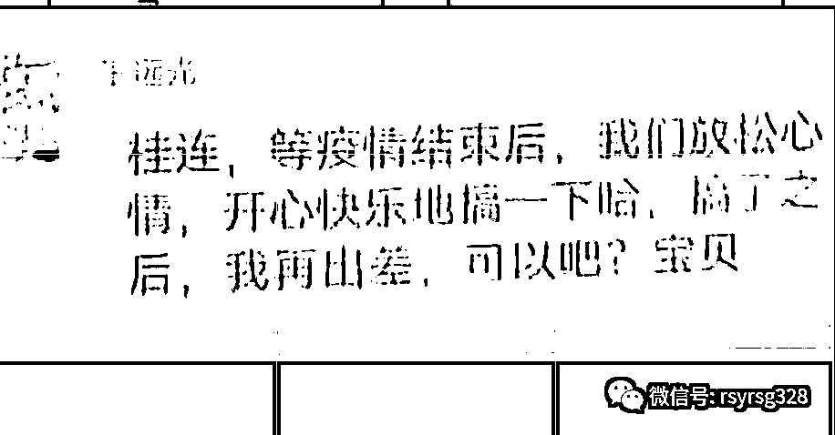
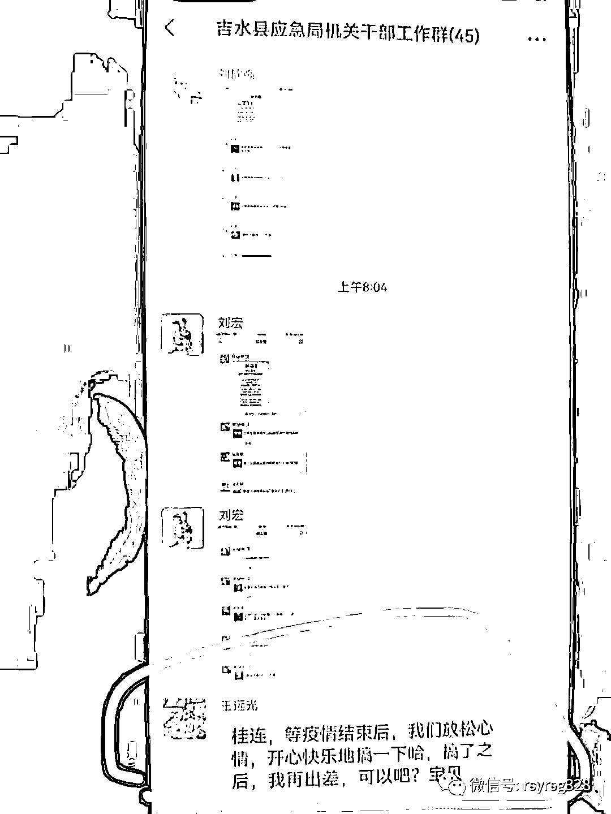
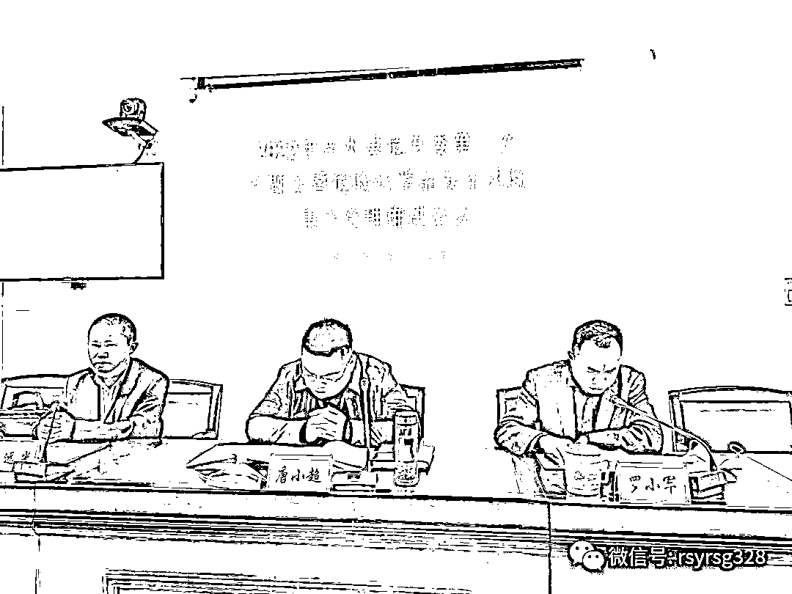
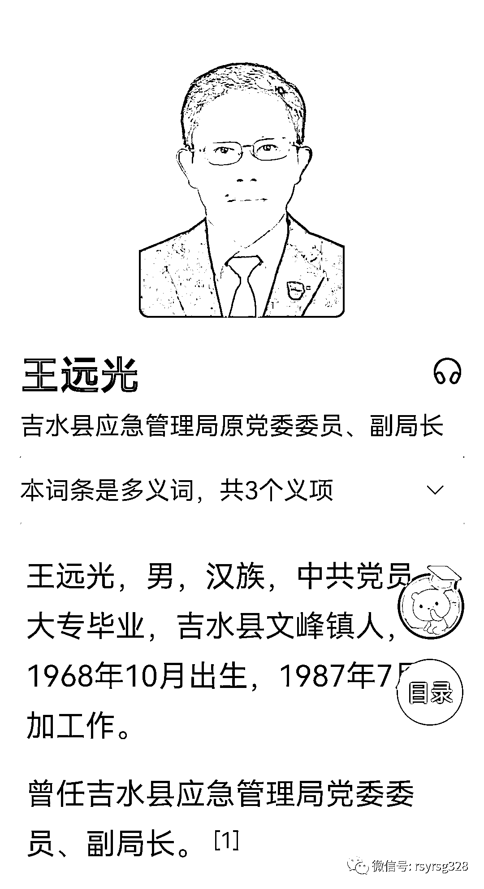
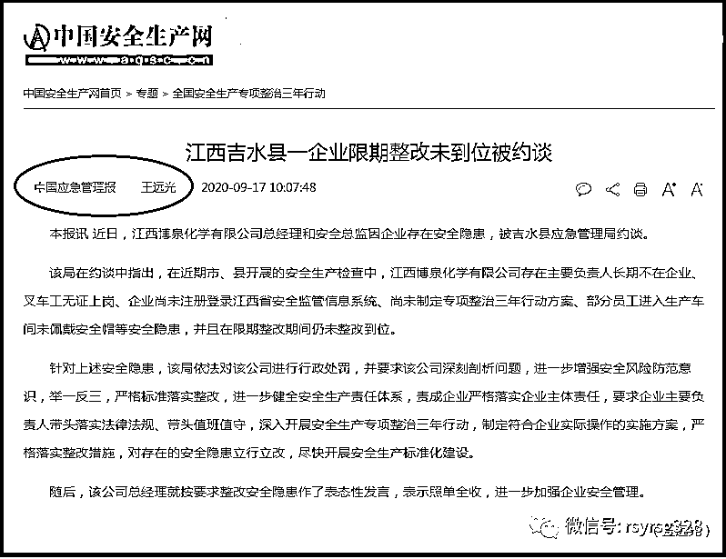
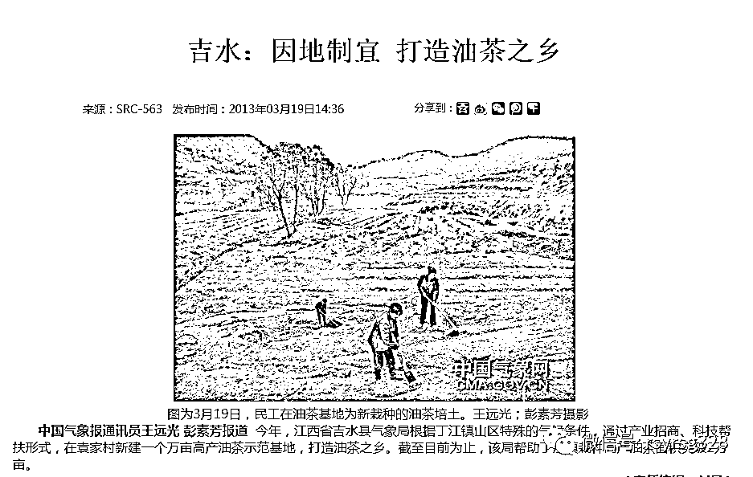
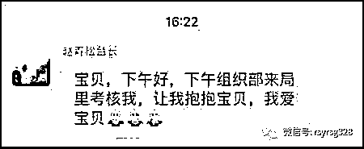
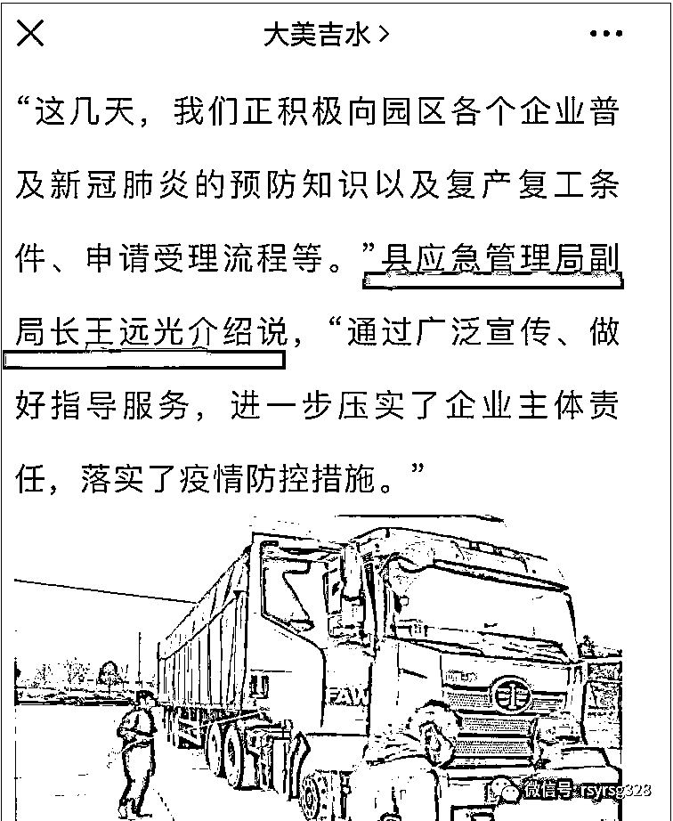

# 又有官员工作群里撩骚“宝贝”，这次“王远光”副局长火了！

> 原文：[`mp.weixin.qq.com/s?__biz=MzIyMDYwMTk0Mw==&mid=2247544279&idx=3&sn=34057453d8543b361a4298e2e15d8622&chksm=97cbe6efa0bc6ff9668d556bd42171e848bfddb46ac6e0dc1389527a38e0d51c1e22597c9893&scene=27#wechat_redirect`](http://mp.weixin.qq.com/s?__biz=MzIyMDYwMTk0Mw==&mid=2247544279&idx=3&sn=34057453d8543b361a4298e2e15d8622&chksm=97cbe6efa0bc6ff9668d556bd42171e848bfddb46ac6e0dc1389527a38e0d51c1e22597c9893&scene=27#wechat_redirect)

又有官员在工作群里撩骚“宝贝”了。

朋友圈疯传的截图显示，在吉水县应急局机关干部工作群里，上午八点多，正是上班时间，一个叫“王远光”的群友，突然就发了一个香艳的信息： 

桂连，等疫情结束后，我们放松心情，开心快乐地搞一下哈，搞了之后，我再出差，可以吧？宝贝。 

查询吉水县政府网站首页 > 政府信息公开 >  部门信息公开  >  县应急管理局  >  工作动态发现，确实有个叫“王远光”的领导，具体职务是吉水县应急管理局党委委员、副局长，今年 3 月 25 日，吉水县危专委召开 2022 年第一次专题会暨危险化学品安全风险集中治理推进会议。县危专委第一主任、县委常委、常务副县长唐小超等出席会议并讲话，县应急管理局党委委员、副局长王远光主持会议，县工业园区管理委员会、县生态环境局、县交通运输局、县工信局、县发改委、县城管局、县教体局等成员单位分管领导参加了此次会议。

教师出身的王远光曾在县委宣传部工作，在当地是个小有名气的笔杆子，多次在《江西日报》、《中国应急管理报》、《中国气象报》等媒体发表过多篇报道。

同样是县应急管理局副局长，同样在工作群里喊宝贝，上次发生在去年 4 月，生于 1965 年 3 月的浙江文成县（隶属温州市）应急管理局党委委员、副局长赵青松，在一个有着 160 名成员的“文成广电工作群”里，情到深处难自禁，爱到浓时宝贝亲，与融媒体中心的一位妹子当众秀恩爱，互称“宝贝”，玩起了“抱抱”游戏。

 宝贝，下午好，下午组织部来局里考核我，让我抱抱宝贝，我爱宝贝。

谁是赵青松副局长的宝贝呢？

还真有。群成员“陈碎芳”接词儿了：

亲爱的，下午好。你棒棒哒，宝贝也爱你，抱抱我的最爱。

时隔一年后，生于 1968 年 10 月，比赵青松小 3 岁的吉水县（隶属吉安市）应急管理局党委委员、副局长王远光，与赵青松掉进了同一条河里。

不能不说，赵青松和王远光两位副局长还真是接地气。赵副局长，下午组织部门就要对他进行考察了，人家还淡定地在群里与“宝贝”亲亲抱抱的；王副局长在目前吉水县疫情防控形势依然严峻的情况下，勇敢地把对美好明天的向往当众说出来，做到了疫情防控与“开心快乐地搞一下”两不误哈。

为了“宝贝”，再苦再累，照样开心沉醉。 

有网友不理解：难道没发现这是个工作群，前有赵青松喊“宝贝”，现在王远光自带“远光”，都没发现这是个工作群？

但这“基本上不可能发生的事儿”就是发生了。

有“好事群众”揭开了其中之谜：前者女主是文成电视台办公室的，俩人是情人关系，把群聊当成私聊了，于是曝出了大瓜。

后者有网友分析，应该是王副局长提前编好了信息，正准备用“文件传输助手”私发，却因为刘宏连着在群里发了两张截图，让正在选择发送对象的王副局长手一抖，把私聊信息给抖进了 45 人的工作群里。

赵青松和王远光，一个出身广电，一个做过宣传，按说不应该犯这样的低级错误。但他们毕竟都是 50 多岁年纪的人了，一直不花眼，显然是不可能的。 

去年 5 月 7 日，文成县政府官网发布“文政干【2021】10 号”文件：《关于赵青松免职的通知》，文成县政府于 4 月 29 日决定免去赵青松的县应急管理局副局长职务。

王远光副局长，离成为“原副局长”，时间应该也不会太长了。 

**还是要提醒各位：**

**1：连微信的基本功能都不熟悉，还是打电话或者发短信吧。**

**2：工作群一定要设置个背景色，标注：这是个工作群。**

**3：发微信一定要看准目标，发错群的话，基本上就没有再“玩”的机会了。**

来源：法眼法语（ID：rsyrsg328），宾曰语云

欢迎关注灰产圈社群服务号

