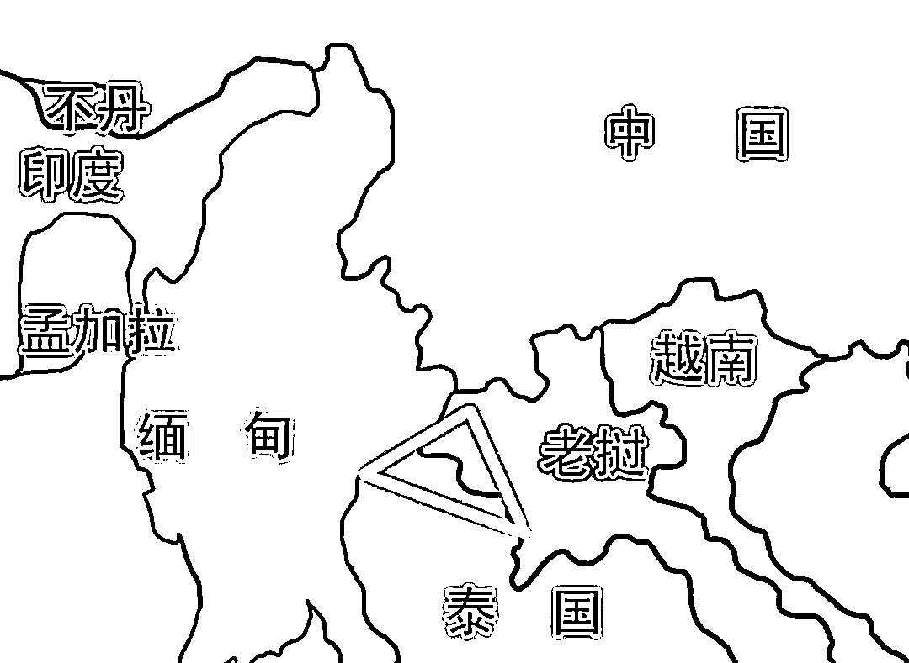
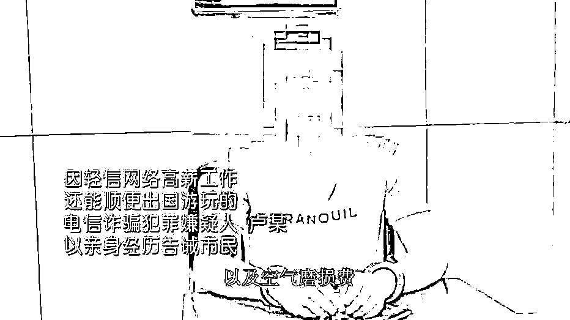
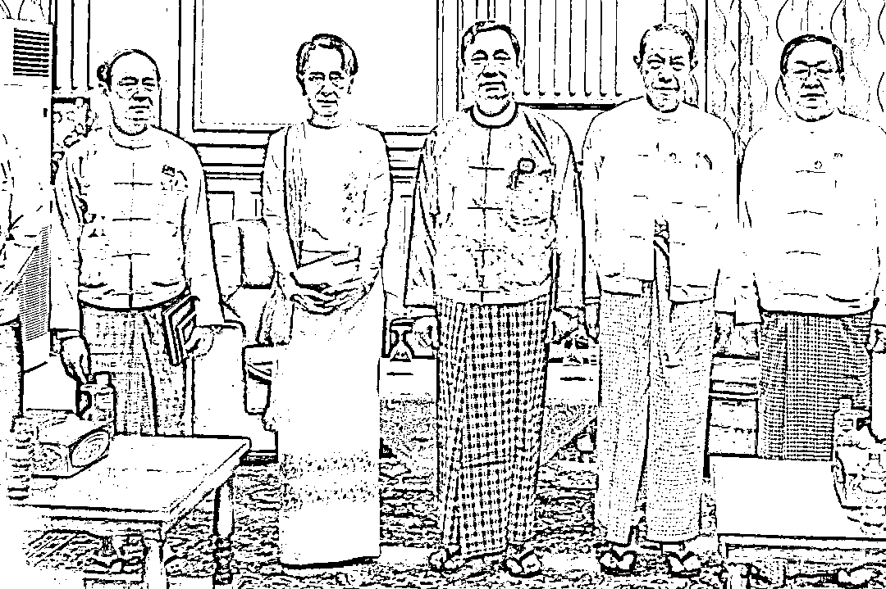
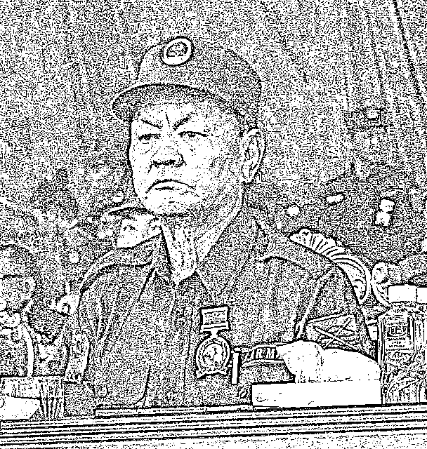
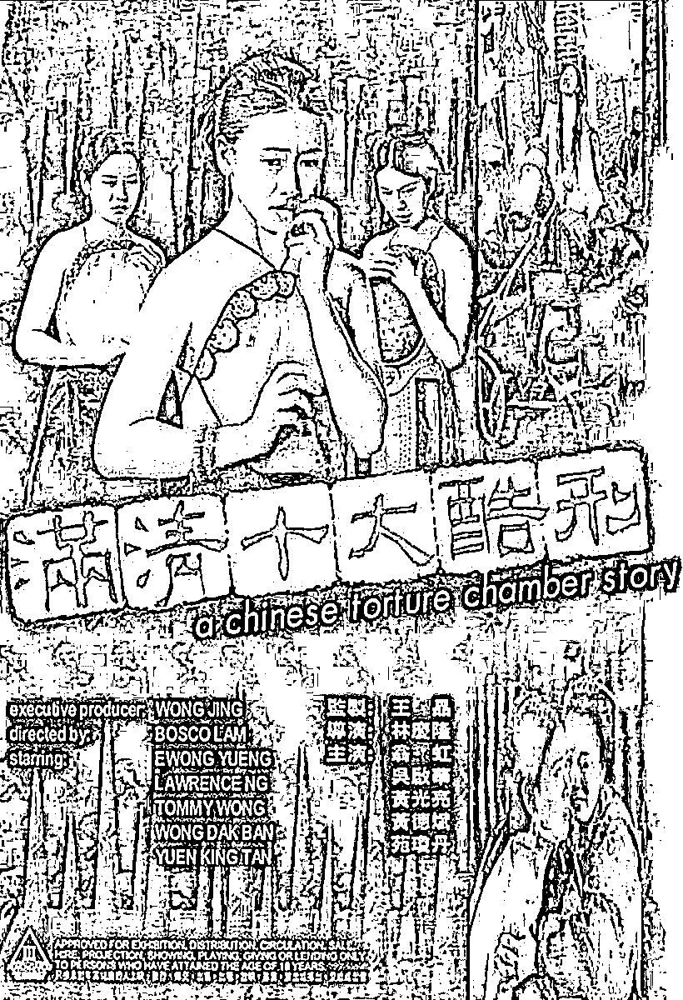
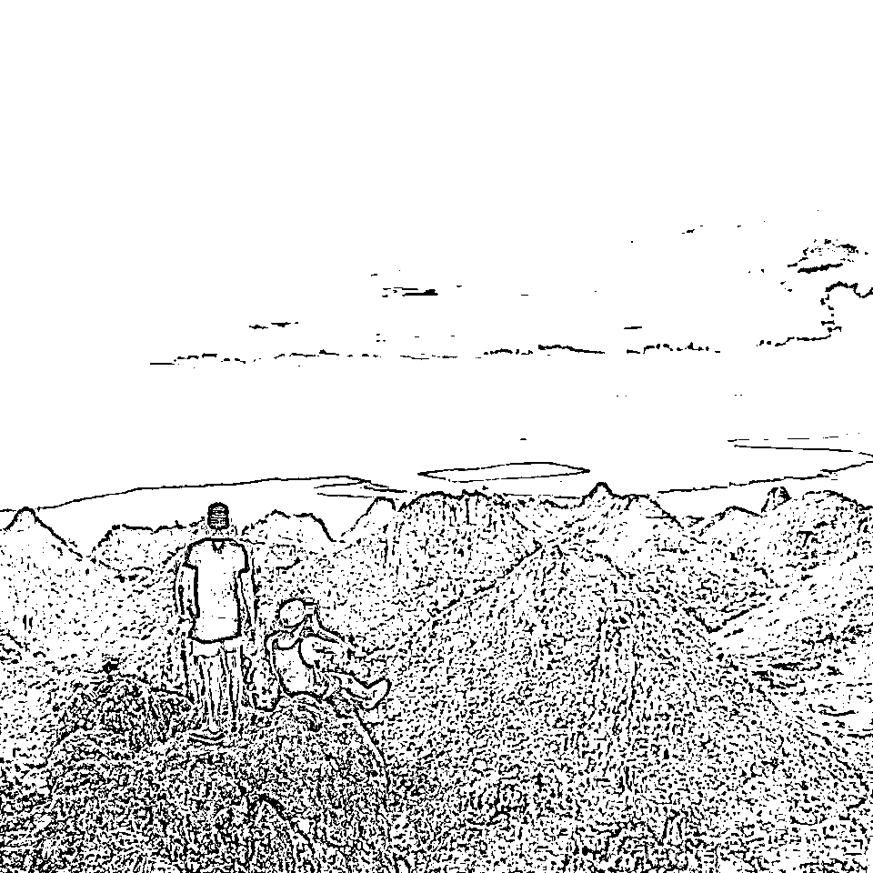

# 新世纪十大酷刑——与缅北相比绑架案频发的菲律宾就是天堂！

> 原文：[`mp.weixin.qq.com/s?__biz=MzIyMDYwMTk0Mw==&mid=2247544279&idx=4&sn=e65e08833c9e9fefa2c34f9f9bc4d644&chksm=97cbe6efa0bc6ff93dbd82351526db475243e094a0f06224673762173488aa2e168e87458f2a&scene=27#wechat_redirect`](http://mp.weixin.qq.com/s?__biz=MzIyMDYwMTk0Mw==&mid=2247544279&idx=4&sn=e65e08833c9e9fefa2c34f9f9bc4d644&chksm=97cbe6efa0bc6ff93dbd82351526db475243e094a0f06224673762173488aa2e168e87458f2a&scene=27#wechat_redirect)

缅北金三角区域，相关视频请添加小编微信索取。‍

‍

今天下午，小编在某群看见了一段时长四分四十六秒的短视频，是的又 TM 涨姿势了。视频应该是有心人特意剪辑合成了，标题是大大的四个字——“真实缅北”。

小编自认属于心肠比较硬的那一类人。6 年多前小编一意孤行、一往无前、意气用事地辞职前往菲律宾时，家里人什么招都用上了，就是无法改变小编的心意已决。几天前，菲律宾绑架团伙使用斩指刺股、老虎凳炮制等方式虐待人质榨油的视频，也没有让小编有倒吸一口凉气和心惊肉跳的感觉。可是这四分四十六名的视频，真的就把小编震撼到了。

思来想去，感觉上菲律宾绑架团伙成员与“真实缅北”视频中的施虐者相比，缺少的是“肆无忌惮”四个字。虽然，前文中小编也曾用过这句成语；但“真实缅北”视频中的肆无忌惮是真正的无所顾忌。与他们在菲律宾同类最大的不同之处在于，施虐者们完全不惧怕镜头，完全不介意出现在镜头中。

缅北呼吸空气都要交钱！！！

这体现出，在菲律宾，毕竟国家机器还在正常运转，不管是多么大胆妄为的绑匪、劫匪和麻匪，对警察、检察官、法官等为代表的国家强力部门还是有畏惧之心。

而在小军阀林立的缅北，缅甸中央政府本来就没有丝毫权威。自去年 2 月 1 日，缅甸军方对“人权和民主斗士”昂山素季领导的政府反动军事政变以来，本来就与缅甸中央政府同床异梦的地方军阀和割据武装与军方的冲突就更加如火如荼了。

克钦邦、克耶邦、克伦邦、若开邦、掸邦等缅甸少数民族实力雄厚的邦国和代表主体民族——缅族的军方，热战不断。另外，还有支持昂山素季的人权民主势力给军方“添乱”。所以说，现在的缅甸早就乱成了一锅八宝粥。

小伙伴们耳熟能详的缅北，主要指的是禅邦，尤其是禅邦中受中国文化影响最深远的两个特区：果敢和佤邦，以及周边汉化程度比较深的区域。小编以前有位名叫固老果的微信好友是果敢边防军的上尉连长。据他说，在佤邦和果敢及周边地区，人民币是通用货币，汉语是通用语言，汽油来自中石油中石化，吃的都是地地道道的中餐，就连士兵领工资也是一半缅币一半人民币… …

彭家声

今年 2 月份刚刚去世的前“果敢王”彭家声，源自缅共游击队（你懂的）。现在果敢的实际统治者白所成，本来是彭家声的助手。2009 年白所成与缅甸军方合力将彭家声的势力逐出果敢，成了新一代的果敢王。固老果曾对小编说，果敢也是有民主选举的，不过大家都知道只能把票投给巩发党（党主席白应能是白所成的儿子）。

佤邦的鲍有祥就更不用说了。他爹鲍兴嘎 1950 年代曾被毛泽东接见。后来鲍家在国民党缅北残军的逼迫下，曾举家流亡至云南，甚至连“有祥”这个名字都是云南小学老师给起的。他也曾是缅共游击队领导成员，还是最死硬的那一个。换句话说，你可以把他老看成是我党的亲儿子。因为鲍有祥老病，现在的佤邦实际统治者其实是知青出身的肖明亮。

白所成（中）与昂山素季

在缅北这样中央政府丧失权威与地方割据势力冲突不断的区域，正应了那句话——“有枪就是草头王”。而辗转来到缅北的华人灰黑产犯罪集团，只要给小军阀交足了保护费，那时什么都可以干滴，当然也是什么都敢干滴。

于是就有了这部堪称“新世纪十大酷刑”的《真实缅北》短片。因为视频肯定无法在任何公开平台上发布，照旧小编继续解说一二。

第一片段看起来像是活埋现场。两名被扒光了衣服 20 至 30 岁左右反剪着手被绑在一起的男性口里流着血，在不住哀求，听起来像是四川话。最后，听见有钝器砸在人体上的声响。

第二片段是花式电击现场。各式各样的青年男女，有绑着的、有瘫倒在地的、有蒙眼被锁住床头的、有扒光被铐住的、有被逼到墙角的，在电火花和电击枪噼里啪啦的声响中呻吟和求饶。还有一个男人被用皮带抽肿脊背后，又遭遇了电击折磨；这人像砧板上的鱼一样随着电击枪在地板上扭动，最后还迎来了拳打脚踢。

鲍有祥

第三片段是锤子砸手指。一男子被捆住手足、塞住了嘴巴趴在地上。施虐者用一块织物盖住被捆者的手，然后举起锤子一下、两下、三下、四下… …连续不断地砸着男子的手。沉闷的锤子砸手声，和被堵住口舌男子的呜咽声让人心害。

第四段是缅北的笼中人生。比菲律宾的笼子夸张多了，看守看起来像是军人。

第五段是电击手心。普通话口音的施虐者对绑在高低床上的人质说，“那你说吧”。人质好像在说，“我有一千块转给你…”施虐者当然不能满意，一句我 CNM。就让人电击人质被绑着的手心。

第六段是传统的监狱手艺叫“小平看报”。就是让人质靠着墙以坐姿蹲着，如果不能保持这个姿势就会打人。

第七段是光膀子上扇板子，这个和小伙伴们上小学时被老师打手板有一拼。啪啪啪的板子声，打着确实挺疼，但这个伤不了筋骨。人质哀嚎着，“别打了，别打了，我找钱… …”接下来是用类似钢管敲打胫骨（小腿骨），这个力道控制不好就会把胫骨打断了。

肖明亮

第八段是电击加体罚，看起来电击枪会贯穿短片始终。电击枪这种能够最大限度引起肉体疼痛的新式刑具，在菲律宾和缅北都是榨油的主流。

第九段看起来像是类似打手的人在用一把没有开刃的刀体罚诈骗韭菜。没有开刃的刀虽然看起来没有见血，从韭菜的叫声看，还是挺狠的… …

最后一段是绑匪们拍摄人质请求家人支付赎金的视频，也许是视频电话。人质说，“妈，着真的不是假的，这里是柬埔寨，不是国内！妈，求求你了！”大概绑匪并不满意人质在镜头前的求救力度，过来又是一阵拳打脚踢，尤其是一膝盖把人质的鼻血打了出来。这时，留着鼻血的人质对着镜头哀求道，“妈，你明天把钱打过来吧！我知道你已经把钱凑好了。你让表弟还有表哥他们给我筹一点。我知道今天早上的时候，妈已经把钱凑齐了。”这次的表现，绑匪大概还算满意，没有再打说，“瞧瞧你那样，欠扁！”

电影《满清十大酷刑》海报

28 年前，香港导演王晶的古装情色电影《满清十大酷刑》，让小编第一次知道杖击、夹棍、骑木驴、拔乳等等的酷刑。

宿务奥斯梅尼亚峰清晨的霞光

而现在，短短四分钟的视频，让小伙伴了解到了缅北究竟是何种人间地狱。如果说被菲律宾中国籍绑匪绑架就像是走进了地狱。那么缅北的种种，就是 TMD 十八层炼狱。而像小编这样出入不用带口罩、也不必担心什么隔离生活在菲律宾外岛的华人，除了稍微担心绑匪会从马尼拉流窜而来外，简直就是在天堂。

来源：宿务情报站

欢迎关注灰产圈社群服务号

