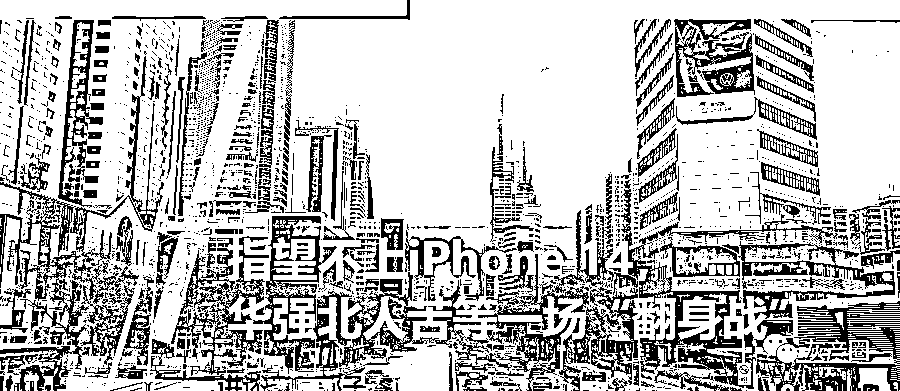
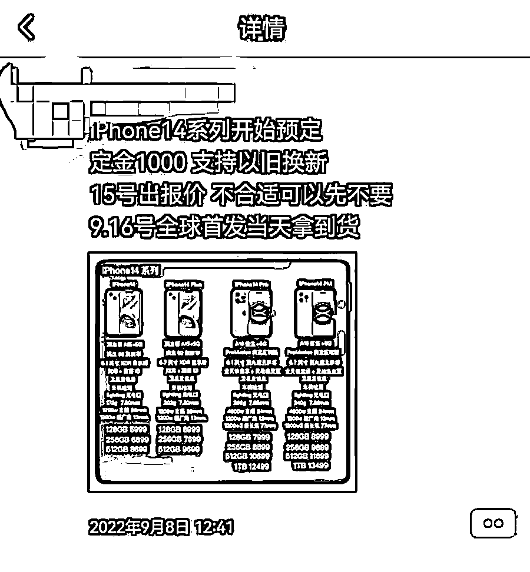
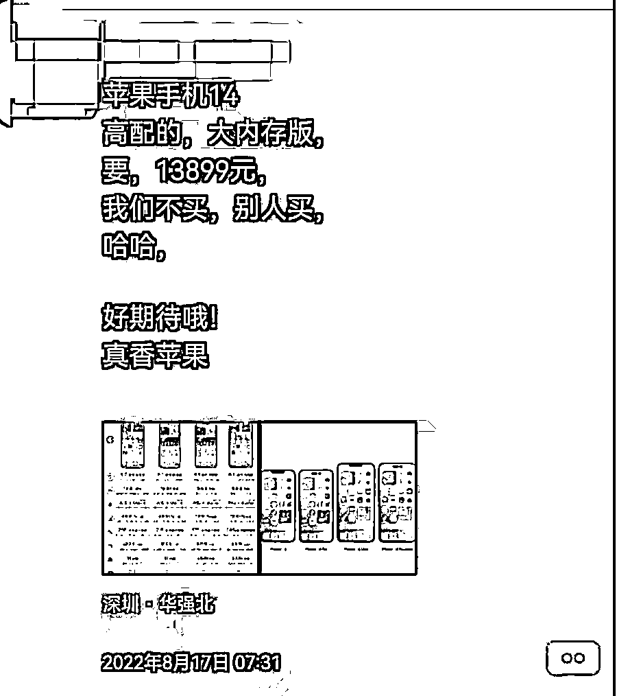
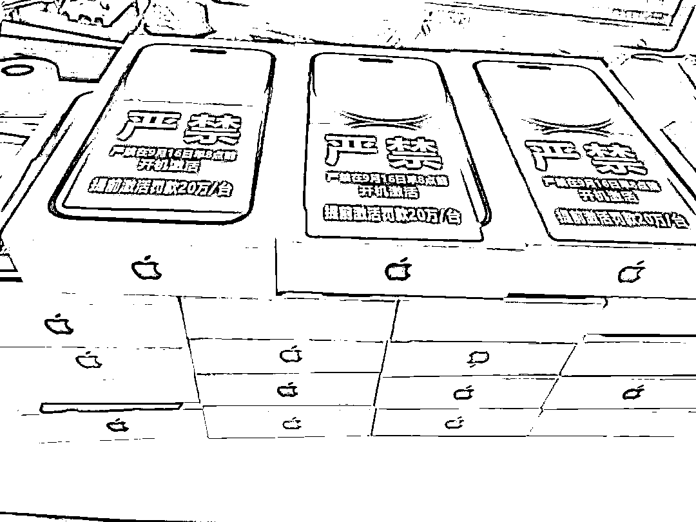
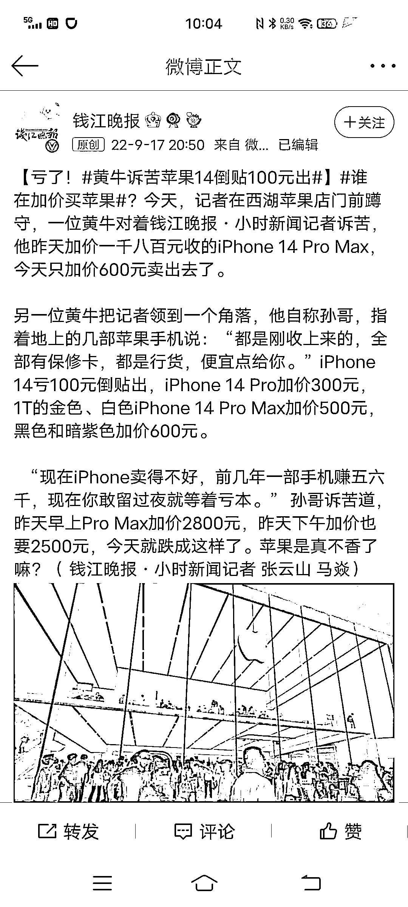
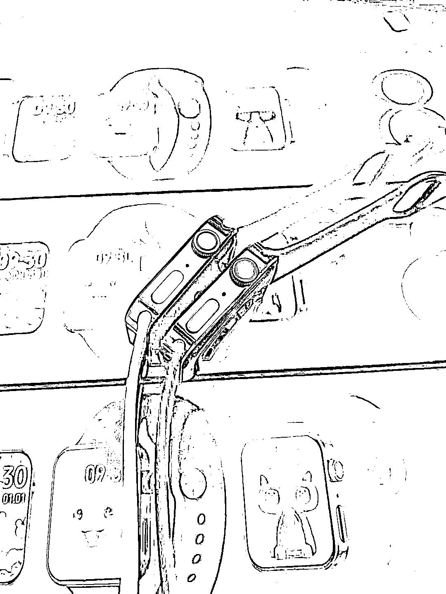
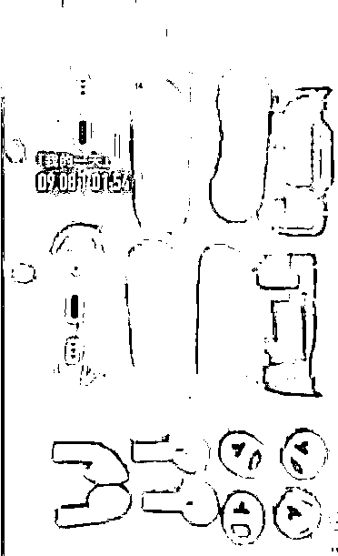

# 指望不上 iPhone 14，华强北人苦等一场“翻身战”

> 原文：[`mp.weixin.qq.com/s?__biz=MzIyMDYwMTk0Mw==&mid=2247544279&idx=5&sn=24c2ec98a141b46897093a460ba306ec&chksm=97cbe6efa0bc6ff97740a20e28093fc3afd6620800c114f49d9cd15744d4f6eb30f0736d7dc6&scene=27#wechat_redirect`](http://mp.weixin.qq.com/s?__biz=MzIyMDYwMTk0Mw==&mid=2247544279&idx=5&sn=24c2ec98a141b46897093a460ba306ec&chksm=97cbe6efa0bc6ff97740a20e28093fc3afd6620800c114f49d9cd15744d4f6eb30f0736d7dc6&scene=27#wechat_redirect)

随着苹果发布会召开、首发日到来，华强北又“活”过来了。

此前因市场稽查、二手市场停摆、疫情管控、市面货物短缺，叠加高昂的租金，华强北进入了闭店、关门潮流。

有商人说，“华强北到了最危险的时刻”。因此当苹果开售后，不少华强北商人将此当作翻身契机。

本次显微故事就将从苹果第二天的华强北讲起，我们采访了不少在华强北工作的人：

他们中有做仿制系列的商人，从 8 月开始就盯着工厂出货，并扬言“没有华强北做不出的东西”，却成了高仿产品的接盘侠；

有人原本做国产机和二手，但因为半年生意不好，联系了黄牛党和买家，打算在苹果上市时“搏一搏”，却面临货物砸在手里的危险；有人是背包客，一度失业，现在终于等到了发朋友圈的机会，却没有等到以往的“爆单”。

……

在这背后引人深思：为什么国产手机这么多，偏偏只有苹果能如此火爆？又为什么今年火爆密码开始失效？

以下是关于华强北的真实故事：

文 | 杨佳

编辑 | 卓然

# 01

苹果发布会结束的当天，华强北的商人已经在行动了。

沉寂了许久的店铺再度开业，迎来了不少操着外地口音看货的老板；路边小推车在狭长的走廊和道路里穿梭，多了许多苹果的包装盒子；许久未开张的背包客们和二手主播们也拎起包流连于柜台边，向老板们打听，“有没有 14 货源？什么价？最快什么时候到？”

有实力的渠道商，在拿到货物之后，晒出图片。

图 | 9 月 15 日，商家展示“到货情况” 

许多游离在华强北外围的黄牛，也闻到了商机，不管自己手里有没有货，均在朋友圈打出了“可预定”的广告，许诺“首发当天即可拿到”，并承接下订。

图 | 发布会举办前许多人声称可以保证首发日拿到货

卖配件的店里，老板举着电话问工厂，“配件什么时候可以到货”，并回过头嘱咐店里的员工在电商平台上更新工厂发来的式样图，还不忘提醒说，“发货期限选长点。"

整个华强北，都因为苹果新品发布而热络了起来。

就连最近一直在朋友圈发布华强北萧条景象的石哥，也打起了精神在朋友圈满信心地说，**“放心，华强北的精英已经在行动了，机器到手 2 天就能破译，1：1 的机器四天就能出样，半个月就量产。”**

石哥的信心并不是空穴来风。他在华强北做 Apple 产品相关的生意多年，在华强北最著名的飞扬大厦有一节柜台，见证了 2007 年苹果进入中国以来备受追捧的局面。

早在 8 月，苹果还没宣布将在 9 月 8 日日举行新产品发布会时，石哥就忙碌了起来，他得到消息称，**“已经有华强北的工厂从富士康弄到了苹果新品的外壳，开始批量生产外包装了”，**于是紧盯着工厂，也做好了随时去拉货、抢占市场的准备。

甚至，早在苹果召开发布会之前，石哥已经在朋友圈发布了新机外形、参数和售价。

石哥也做了第二手准备。

他联系了几个渠道商，高价预定了一批 iPhone 14，准备赶在发售后两周高价倒卖，那段时间是黄金出手期，“只要不太贪，总是能赚的”。至于货的来源，石哥语焉不详。

**“这可是华强北“，石哥指了指地面，“有什么做不到的？”**

iPhone 二手卖家王玲也一直盯着市场，从 9 月 9 日晚上 8 点 iPhone 14 预售开始，王玲以“收家”的身份联系着各个渠道的“抢手”，通过高于苹果定价的方式来收购专业抢手刷到 9 月内可提货的 iPhone 14，其中越靠近发售日的越受欢迎，定价越高。

做“收家”赚取中间费需要巨大的现金流，为此王玲以低价卖了一批自己高价进来的国货手机，打算靠倒腾苹果赚一点中间费用。

与此同时，市场上也有其他声音传来，比如有经销商违规提前放货激活手机、店铺卷款逃跑、有电商平台和 Apple 达成了协议将垄断大批货源，许多原本做二手 iPhone 的店铺转型做新品……

**“大家都知道 iPhone 好卖，要是能抓住新上市的这波红利，就能活下去了”，王玲说，“总之，整个华强北都在各显神通卖 iPhone。”**

# 02

不少华强北商人都将 Apple 发售视为一场翻身仗，包括石哥。

石哥翻出手机，翻到 7 月、8 月他拍摄的视频。视频里拍摄的是著名的飞扬大厦，也是华强北租金最高的档口，主营二手 iPhone，因生意火爆，一节柜台一度炒至 30 万，但视频里的飞扬大厦冷冷清清，许多档口已清空。

石哥解释，深圳反复受境外输入疫情影响，于是严打走私和偷渡，华强北因靠近福田口岸，一度是“水货”的重要集散地，因此迎来了史上最严的稽查，加上时不时冒出的疫情，大厦里生意惨淡。

其中二手市场受影响最大，需要提供货物来源证明才能经营，“不然就是一锅端”，**因此大量拿不出证明的店铺关门、退租，部分如石哥一样选择观望的店家则跑出去旅游了。**

二手的萧条也传递到直播行业，和石哥交好的一名二手主播甚至改行卖了一段时间衣服，最近才逐渐回归，**“但坚决不碰 iPhone，改做其他外国品牌手机了。”**

“行业不好做，可房租并没有减少”，石哥拍了拍自己的“一米柜台”，伸出 1 根指头示意，“我一个月资金十多万，那不抓住新品上市的机会回本，怎么能活得下去呢？”

可下半年面市的高端机如此多，但什么偏偏是苹果的产品如此火爆？

图 | 渠道商 9 月 15 报价，价格高 2000 元左右

对此石哥给出的结论是，“有市场”，对此王玲给出答案，“有赚头”。

石哥从手机柜台里拿出一台华强北制造的苹果耳机，这台搭载了苹果最新系统的“华强北苹果”售价仅 200 多元，“去年苹果才出货 6000 台，华强北出了 8 亿台，越南、非洲老板一箱箱进货，不少主播也来这里进货“，石哥顿了顿，“还有哪个牌子的东西能这么好卖？”

王玲则直言，“国产机没办法赚钱”。

王玲介绍，国产手机按照价格分类，1500 元以内为低端机，1500-3000 元为中端机，3000 元以上为高端机，5000 以上为高端旗舰机。

**“其中低端机新机价格便宜，利润微薄，完全挤压了二手市场；而中端机是市场主力，更新换代快，以走量为主，需要很强的销货渠道，不然很容易砸在手上。”**

至于国产高端机，“新品价格不稳定，二手没利润”。王玲说，去年小米 MIX 4 上市时，顶配价格逼近晚一个月上市的 iPhone13 256G 版，可到年底时候，**iPhone13 依旧是 6799 元，仅在不同的渠道几百元的波动，但小米这款手机跌到 5000 元以下，甚至在一些大平台来到了 4500 元左右，让许多卖家措手不及（一般卖家从渠道商订购手机，价格便宜 300-500 元左右）**，最后只能高进低卖出货，有些卖家一度将价格降到了 4000 以下谋求回本，更加剧了价格的不稳定。

国产新机的价格不稳定，也会传递到二手市场，降价意味着买人少，“加上高端机二手定价也不会便宜，再加点钱，都可以买一个不错的新手机了。”

王玲说做卖手机是一门生意，“总是要赚钱的”，自己作为商人自然要趋利避害，“流通才是第一要义。”

# 03

大家都参与的另一面，意味着竞争激烈。不仅是同行之间竞争，也是线上和线下竞争，更是品牌和下游卖家的竞争。

图 | 防止竞争的一些举措

**“做 iPhone 最好的时代已经过去了”，**阿飞说。

他曾是一名“水客”，现在空闲了会在华强北做背包客，通过网上接单帮忙买家订购手机。据他介绍，2020 年以前是做这行的黄金年代，一台港版或美版手机（俗称水货）比国内便宜千余元，加上自由行高度发达，于是华强北产生了一条产业链：和旅行社合作，让自由行客人帮忙订购手机后，再雇人带回来售卖。

但这些年因为疫情和严查走私的关系，“水货”难以进入华强北，因此华强北的货源比之前减少，大部分卖家大家只能盯着国行版下手，或者冒险运输进关。

同时，卖家的出货空间也在变小。这些年苹果除了在自己的官网和线下授权店，也开始和诸如淘宝、京东、拼多多等平台进行合作，这些平台不仅可以直接从官方备货，有正品保证，还因财大气粗，进行补贴、提供分期服务、价格直击华强北小卖家的进货价，还提供官方渠道以旧换新补贴及售后服务等 ，直接抢走了华强北大部分客户。

另一方因市场行情的低迷，“消费者们也更理性了”，王玲说，**“大家摸清楚了手机上市的，也知道 2 周之后价格必然回落，所以热情没有那么大了”，**加上苹果在中国经营多年，备货也不像以前那么保守，因此黄牛的生意持续不了多久。

像在杭州，已经有黄牛的手机“砸"在手里，得低于收购价出售，在王玲看来，“这以往是不可能的”。 

至于仿制，面临的挑战更大了。

在华强北做修理的吴川解释，“手机仿制一般改版或者组装而来，周边产品则高仿为主，随着 iPhone 技术投入越来越多，如序列码、全局密钥等，虽然技术能破解，但是落在制作成本上贵了不少”。

叠加上原材料涨价等因素，这也是许多苹果精品高仿系列产品，比普通国产产品贵的原因。

“此外 iPhone 已经有品牌效应，只要稍加变动，下游的形式就极其容易发生变化”，让不少华强北打算“捞一笔”的商人反而成了接盘之人。

“我们在 iWatch  S8 和 Airpod Pro 2 上就遇到了这样的情况”，石哥说。iWatch  S8 也是 9 月苹果发布的新产品，但石哥在 9 月 8 日发布会前的早晨就开始售卖了——**此前不少做仿制品的厂家得到消息，S8 会是直角边设计，功能上和 S7 差异不大，于是不少厂家将 S7 改装成 S8（即俗称的改版）后售卖。**

图 | 华强北 8 月出的 S8 外观，即为直角设计 

石哥也跟风拿了不少。但临近新品发布才发现 S8 依旧没有采用直角设计，石哥拿下的那批 S8 砸在了手里，在朋友圈吆喝“见钱就买"也没销出去多少，于是联系工厂换壳、打磨，以免砸在手里。

而 Airpod Pro 2 的外观生产没错，可苹果系统对原版进行了写码加密，仿制的没序列码，自然也只能低价售卖，并通过各自渠道进行销货。

图 | 商家视频截图，9 月 8 日就已经有外壳

一时间市场哀鸿遍野，华强北就像是一场大型鱿鱼游戏现场，大家都等着对方先被淘汰、也等着转机。

# 04

但转型比大家想得困难得多。

当被问及如今在华强北做生意如此困难，大家需要扼腕求生，那有获利的一方时。

几乎所有的答案都指向了收租一方，“他们只要每个月按时收房租就好”，石哥摆摆手，似乎不愿意多提及，**“你看我们不能开业时候，非但没有免租，有些退租的还不知道能不能要回押金呢。”**

舒红却不认为房东是受惠的一方，她在华强北某数码广场做招商，华强北大多是自持物业，由专门的运营团队，“收入来自于大厦租金，出租率和租金同大厦生意息息相关，如果生意不好，商家可以走，但物业运营方走不了”。

但华强北 900 米的街道上有数十个不同数码城、上万个档口，空置率一度高达 30%，换句话说，物业甚至比商人们最迫切希望华强北转型，改变现状。

数码广场也确实成了转型的主力，并决定摆脱对电子行业的依赖。

2017 年，华强北的明通电子大厦转型做美妆。2020 年疫情原因，代购行业几乎全军覆没，明通迎来了巨大客流，许多无法出境的代购纷纷前来拿货，接着直播、一件代发如火如荼开展。

紧接着，华强北的一平米的档口租金被炒到 20 万，还要另外缴纳入场费、押金等等，短短 3 年就复刻了电子行业 30 年的辉煌，这也被视为成为华强北转型成功的标志。

随后，远望、曼哈顿广场等数码商城也宣布转型做美妆广场。许多做水货的手机厂商窥见商机后，纷纷利用渠道优势进行转型，甚至利用供应链的优势，将价格做到了市面产品的一半，各地商人都涌入华强北，打算拿店、也有不少人在这里开设了品牌形象店。

**就在大家觉得华强北要迎来新生时，没成想美妆行业失控，爆出涉嫌走私、造假，甚至停业整顿。**重蹈电子产品覆辙的的华强北美妆口碑急转直下，疯狂的华强北美妆行业被按下暂停键。华强北的老板们又开始找寻新的行业。

对此王玲见怪不怪，**“华强北总是这样，来一个行业，烂一个行业，滞后又重生”。**

但舒红很焦虑。她听到相关业务的团队裁员，从业者都岌岌可危，“说到底，大家都是一条船上的蚂蚱。”

因此 7 月华强北的市场进入阵痛期，舒红见到空旷的华强北时，焦虑达到极致，她看着那些闭店退租的人，总觉得下一秒自己会工作不保。

直到苹果发布者之后，华强北部分商铺迎来了客流，舒红才舒一口气。

“只能说这个阶段的华强北，暂时离不开苹果。”至于华强北的未来，没人能给出答案。

来源：显微故事

欢迎关注灰产圈社群服务号

