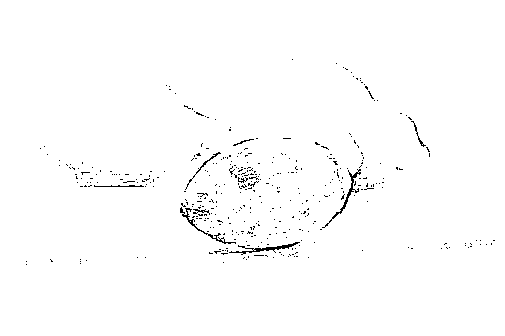

# 七地槟榔遭下架，靠“无害化”广告扩张的槟榔终反噬

> 原文：[`mp.weixin.qq.com/s?__biz=MzIyMDYwMTk0Mw==&mid=2247544279&idx=6&sn=30f01329f6604dde1881aa8d64d14259&chksm=97cbe6efa0bc6ff916381dabbf1ddf37f76483fae7bba7bd3744988d48403cf81f0454505f69&scene=27#wechat_redirect`](http://mp.weixin.qq.com/s?__biz=MzIyMDYwMTk0Mw==&mid=2247544279&idx=6&sn=30f01329f6604dde1881aa8d64d14259&chksm=97cbe6efa0bc6ff916381dabbf1ddf37f76483fae7bba7bd3744988d48403cf81f0454505f69&scene=27#wechat_redirect)

厦门市、遵义市习水县、南充市南部县……据红星资本局不完全统计，至少已有 7 地的市场监管部门要求商家下架在售槟榔及槟榔制品。

红星资本局注意到，此前槟榔企业在品牌宣传上不仅从未把“有害健康”打在外包装上，更是有企业在广告中宣称可以“养生”。

槟榔 资料配图 图据视觉中国

**多地下架槟榔** 

**规定最早颁布于 1996 年**

早在 1996 年 9 月，厦门市人民政府便颁布了《厦门市禁止生产、销售和食用槟榔规定》。

今年 5 月，贵州省遵义市习水县市场监督管理局已在“习水市场监管”公众号上发布了槟榔致癌相关文章，并表示：“请广大经营户自觉下架处理，我局将按照相关法律和政策要求，近期内开展专项清理行动，对相关违法行为坚决予以查处。”

9 月 7 日至 9 日，四川省凉山彝族自治州会东县市场监管局食品监管股、综合执法大队、各市场监管所也开展了对槟榔及槟榔制品专项整治，要求商家下架在售槟榔及槟榔制品。

9 月 13 日，四川省南充市南部县建兴镇发布通知称，依据市场监管总局办公厅《关于槟榔制品监管有关事项的通知》（市监食生函[2021]1582 号）、四川省市场监督管理局办公室《关于加强槟榔制品销售监管的通知》等文件要求，即日起，各食品经营者要及时下架，并不得销售食品包装和标签标识的槟榔及槟榔制品。

9 月 16 日，成都市新津区市场监管局微信公号消息提到，为进一步加强槟榔制品销售监管，近日，花桥所开展槟榔制品专项清查行动。此次行动，将校园周边、超市、便利店、小型商场等作为重点检查区域，深入排查违规销售槟榔行为，同时利用线上外卖平台检索违规销售槟榔商家，再进行线下检查，做到精准打击。目前共检查便利店、超市等食品经营单位 10 家，发现有 6 家食品经营户销售槟榔的情况，已责令其立即下架。

9 月 19 日，四川省南充市营山县市场监督管理局微信公众号发布消息称，各经营户不得销售食品包装和标签标识的槟榔及槟榔制品；对食品经营场所销售槟榔及槟榔制品的，立即联系食品经营单位下架，如有违法行为，将依法查处。

****被“无害化”处理的广告****

****湖南省行业协会：停止国内广告宣传****

**红星资本局查阅资料发现，最早可查的槟榔广告出现在 1997 年，湖南经视的幸运系列娱乐节目播出“皇爷槟榔”的广告。到 2004 年，主持人汪涵在节目《超级女声》口播“友文槟榔”的广告词，“你的味道，我知道”。**

**可以从中看出，槟榔早期的广告宣传都是以地方媒介为阵地进行推广。**

**学者曹雨在《一嚼两千年：从药品到瘾品，槟榔在中国的流行史》中表示，**湖南湘潭的槟榔能走出湘潭，其中一个前提就是“湖湘媒介文化在全国的传播”。****

**红星资本局注意到，湘潭市人民政府 2017 年曾在官网发文称，湘潭市槟榔产量占全省生产总量的 80%以上，年销售收入超过 80 亿元，税收过亿元，近 15 万人从事与槟榔相关的工作。**

**从 2017 年到 2019 年，槟榔品牌“口味王”连续 3 年登上湖南卫视春节联欢晚会，如贾玲的“相亲就好比嚼槟榔，你得一颗一颗地咀嚼，才知道哪种是最符合你的口味王”，再到汪涵的“湖南人过年就吃口味王”。**

**从广告词来看，**这一阶段的宣传重点多落在“味道”上，非“味道”的宣传点还曾引起轩然大波。****

**比如，在湖南卫视 2018 年元宵喜乐会上，主持人沈梦辰口播广告词时称“（口味王）一下子就让你精神抖擞、返老还童”，后也因此被质疑涉嫌虚假宣传。**

****

**↑图据中国消费者报** 

**到 2019 年 3 月，**湖南省槟榔食品行业协会下发通知，要求湖南所有槟榔生产企业即日起停止国内全部广告宣传，且此项工作必须在当年 3 月 15 日前全部完成。****

****槟榔广告走向全国****

****宣传重点变为“提神”“养生”****

**但湖南省行业协会的这一纸禁令，未能完全约束槟榔企业。**此后槟榔广告选择了走出地方媒介，槟榔的宣传重点也有了变化，从“味道”转向了功能性的“健康”“提神”“养生”等。****

**2020 年，槟榔品牌“湘潭铺子”赞助综艺节目《德云斗笑社》，打出来的广告宣传语为“有枸杞更好一点，听相声更乐一点”。**

**天眼查 APP 显示，这一品牌背后的主体运营公司为湖南伍子醉实业集团有限公司（下称“伍子醉实业”），其注册地址即为湖南省湘潭市。也就是说，其在上述禁令发布后仍在打广告。**

**值得一提的是，据潇湘晨报报道，此次合作使伍子醉实业获得了“中国国际广告节广告主奖·2020 年度品牌塑造金奖”。**

**某广告行业的从业人士告诉红星资本局，**早几年前，公众已经逐渐认识到槟榔的危害性，而槟榔企业用主打“健康”“养生”的营销思路来对冲是有针对性的。****

**不仅仅是“湘潭铺子”，红星资本局发现，品牌“问道食品”曾推出一款石斛槟榔，号称将中药石斛融入槟榔中，使消费者在享用槟榔口感的同时，还能够起到保证身体健康的作用。**

****

**↑截图自微信公众号“问道食品”** 

**在长期“无害化”的广告宣传中，槟榔的市场不断扩大。**

**《中国食品工业》杂志曾发布一组数据称，2019 年中国槟榔市场需求量 101733.39 吨，2020 年中国槟榔市场需求量 103378.2 吨，同比增长 1.62%。**

**直到 2021 年 9 月 17 日，国家广播电视总局发通知称，**自即日起，停止利用广播电视和网络视听节目宣传推销槟榔及其制品。****

**红星资本局注意到，曹雨认为，如果槟榔企业的利润上升速度过快，经济影响力过大，那么，除了限制广告投放外，**政府有可能对其征收惩罚性的成瘾品税收，或者开列专项征收渠道，还有可能被纳入国家控制的成瘾品管理范畴，甚至由国家专营（参照对烟草企业的控制方法管理）。****

**来源：红星资本局**

****

**欢迎关注灰产圈社群服务号**

****

****