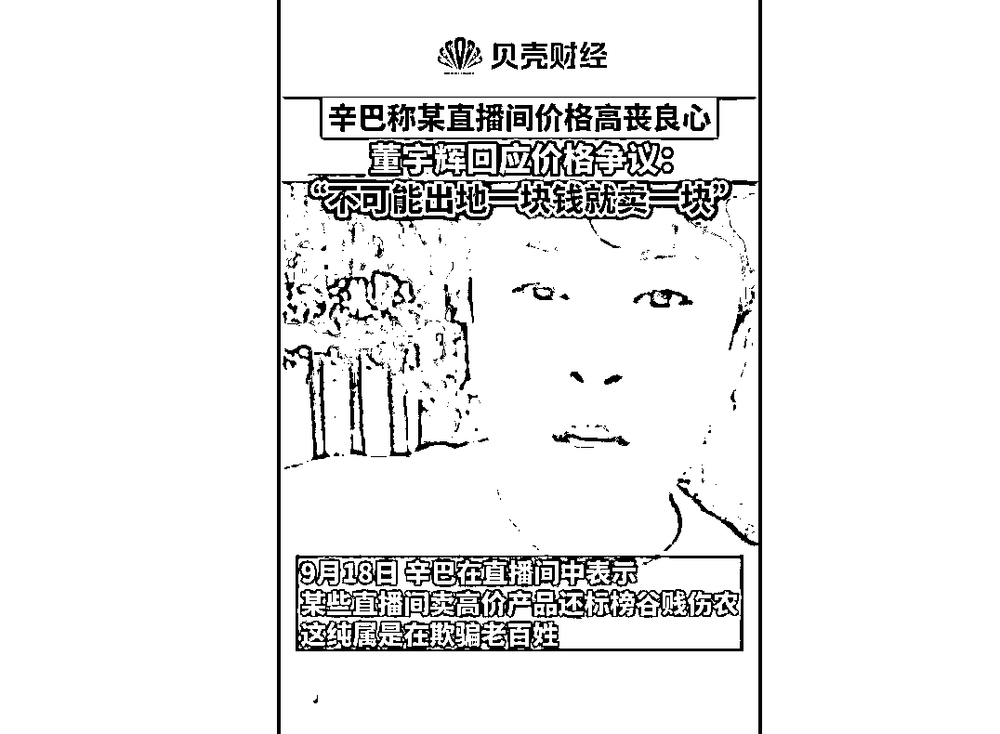
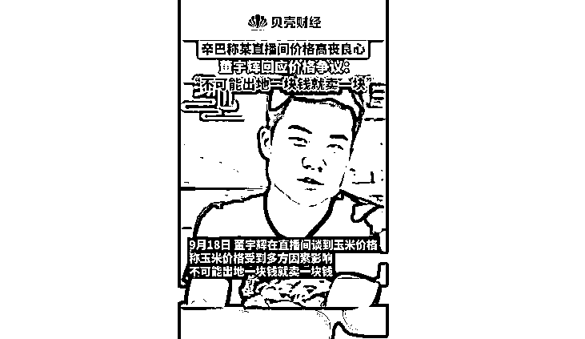
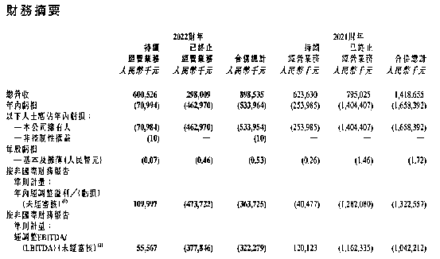
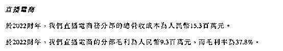

# 一根玉米卖 6 元，网红炮轰东方甄选“丧良心”！“董宇辉解释玉米贵”登上微博热搜

> 原文：[`mp.weixin.qq.com/s?__biz=MzIyMDYwMTk0Mw==&mid=2247544279&idx=7&sn=4dd73ffde074a36d74c2126e23eb94b8&chksm=97cbe6efa0bc6ff908d7df263186263c2b41b3f32c7cb2da34ed89ae92047c2a314375200893&scene=27#wechat_redirect`](http://mp.weixin.qq.com/s?__biz=MzIyMDYwMTk0Mw==&mid=2247544279&idx=7&sn=4dd73ffde074a36d74c2126e23eb94b8&chksm=97cbe6efa0bc6ff908d7df263186263c2b41b3f32c7cb2da34ed89ae92047c2a314375200893&scene=27#wechat_redirect)

人红是非多，9 月 20 日话题#董宇辉解释玉米贵#登上微博热搜，引发关注。

事件起因是，近日，网红主播辛巴称玉米在地里，农民批发卖也就七毛钱一穗，到某直播间价格加到六块钱，疑似暗指东方甄选卖贵玉米。

据新京报贝壳财经，9 月 18 日，董宇辉在直播间谈到玉米价格，称玉米受到多方因素影响，不能说出地的玉米一根一块钱，最后就只能卖一块钱，不现实。 

**遭网红炮轰**

****#董宇辉解释玉米贵#登上微博热搜****

****据财经天下周刊，近日，辛巴在直播中表示，一盒 8 穗的玉米卖 50 块钱“丧良心”，地里出来的玉米就七毛钱一穗，最后加价到六块钱一穗。****

****视频资料显示，辛巴还称，“讲故事讲得好就好，产品一样，你讲故事你的东西就得贵，我怎么不明白这个道理呢？”****

****9 月 20 日，话题#董宇辉解释玉米贵#登上微博热搜。****

****董宇辉表示，很多人就说，玉米不是农村卖才五毛钱多一个吗？那为什么有的玉米能卖两三块，甚至五六块，还有十几块的玉米？玉米从五毛钱一根到十几块钱一根的都有，不同产地不同品种的玉米，它本来的成本就不一样。****

****董宇辉称，我们家种那个玉米，其实卖出来一根也就是那几毛钱，因为那些玉米最后大量的就是收回来做了饲料，就是去养猪养牛养羊。****

****董宇辉进一步表示，现在市场上大面积流通的基本上都是东北产地的玉米，东北因为黑土层比较厚，玉米本身品质好，然后再加上如果有特殊品种，它的成本本来就高。如果这个玉米你想吃了健康，比如说不让喷农药，那一亩地的产量本身就是有限的。****

****董宇辉最后称，还有那中间供应链上的人不是人吗？那工厂的人不是人吗？快递小哥不是人吗？所以你不能说出地的玉米一根一块钱，最后就只能卖一块钱，不现实啊！****

****每经小编（微信号：nbdnews）注意到，早在今年 6 月，东方甄选 6 元 1 根的鲜食玉米便引发讨论。****

****据中新财经当时报道，所谓鲜食玉米，即速冻保鲜或真空包装的水果玉米。对比不同渠道售卖的鲜食玉米，东方甄选平均售价 6 元/根的鲜食玉米虽算不上昂贵，但也称不上便宜。****

****在某电商平台上，一些大品牌的鲜食玉米平均售价在 6-10 元/根之间，当地特产店或农户直销的鲜食玉米平均售价则在 4-5 元/根左右。****

****生鲜电商 APP 上的鲜食玉米价格也不相同。其中，美团买菜上的两款鲜食玉米价格分别为一根 7.5 元、8.8 元，盒马上两款鲜食玉米平均价格则分别约为一根 5 元、6 元。****

****而在抖音其他助农直播间，鲜食玉米的价格则更为便宜。一名消费者就告诉中新财经，她在某主播助农直播间下单的鲜食玉米平均价格为 2.99 元/根。“直播间卖的一般比较便宜，正常鲜食玉米价格都在 3 元以上。”****

******东方甄选首度发布成绩单******

******直播电商营收 2460 万元******

****据证券时报报道，由于“农民的孩子”董宇辉的出圈，新东方直播间一度爆火。****

****相关数据显示，东方甄选 7 月累计销售额突破 6 亿。7 月东方甄选共开播 31 场，观看人次突破 7 亿，场均观看人次突破 2000 万。今年 6 月，东方甄选销售额 6.81 亿，涨粉近 2000 万。东方甄选其他细分账号方面，东方甄选之图书场均销售额达到 93.65 万元，东方甄选美丽生活场均销售额达到 119.82 万元，东方甄选自营产品场均销售额达到 11.37 万元，相比成立初期，均出现大幅增长。**** 

****8 月 26 日，新东方在线公布截至 2022 年 5 月 31 日的 2022 财年业绩，财报显示，2022 财年新东方在线总营收为 8.99 亿元，同比下滑 36.67%；经调整后净亏损 3.64 亿元，同比收窄 72%。****

********

****值得注意的是，东方甄选直播业务自去年 12 月创立以来，首次正式对外披露具体营收情况。报告期内，截至 5 月 31 日，新东方直播电商营收为 2460 万元，毛利为 930 万元，毛利率为 37.8%。实际上，这还是在东方甄选董宇辉出圈、一夜爆红之前的成绩。****

********

****受直播带货成绩的提振，港股新东方在线股价迎来大涨。总体来看，新东方在线今年从低位已经涨了超过 800%。****

****来源：每日经济新闻综合证券时报、财经天下周刊、新京报****

********

****欢迎关注灰产圈社群服务号****

********

********