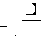
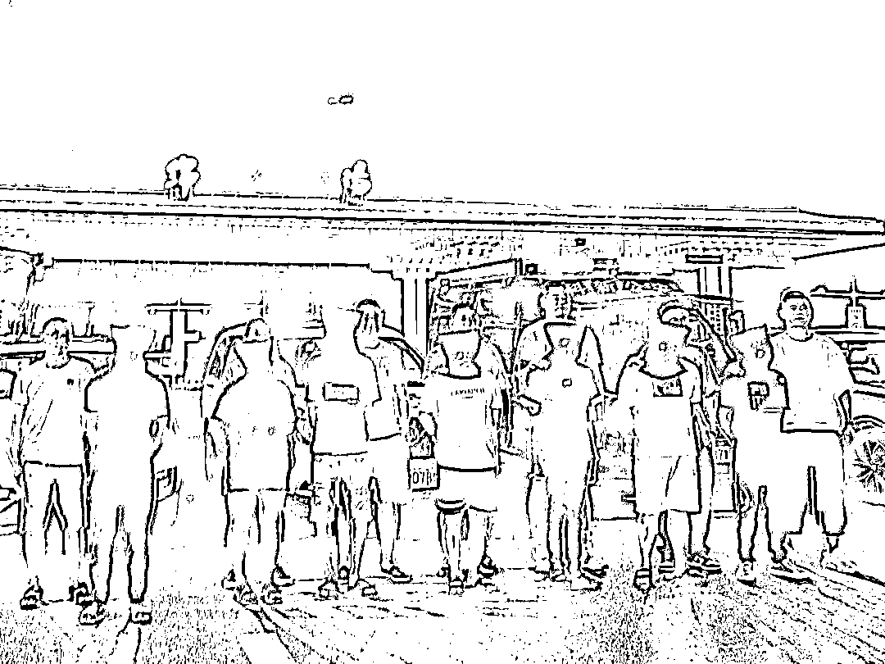
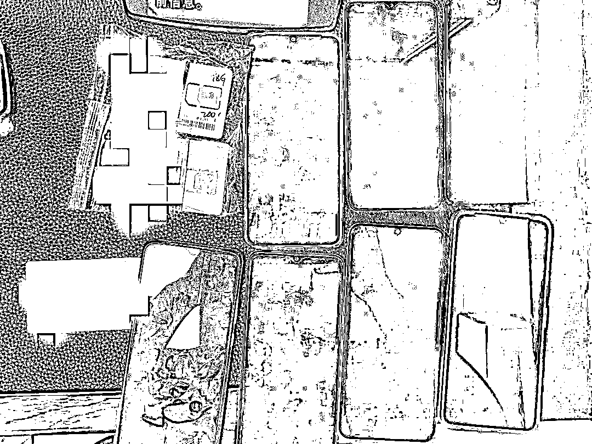
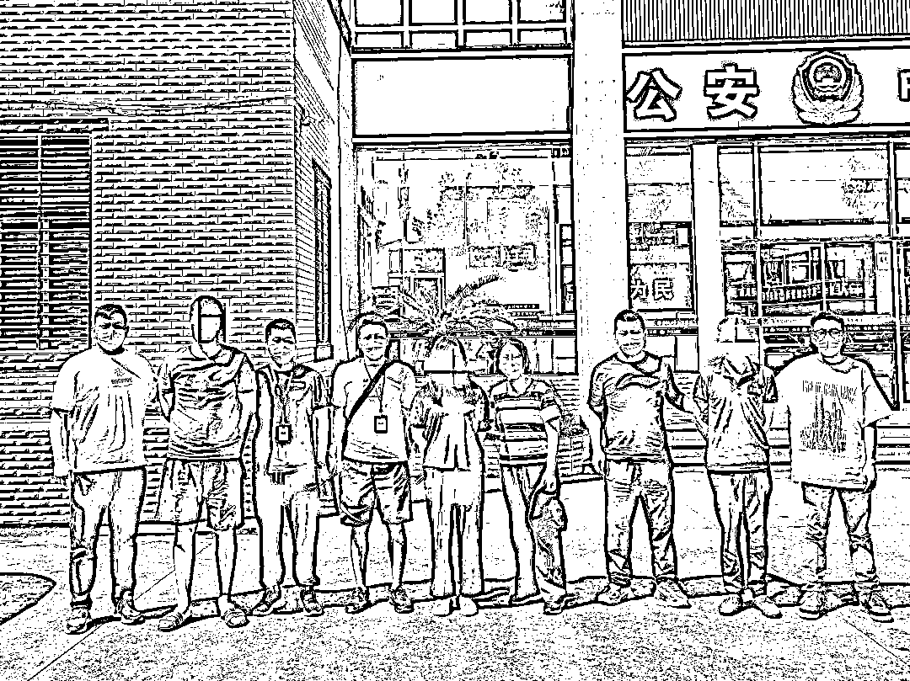

# 父子同挖“爱情陷阱”敛财，绵阳警方摧毁“杀猪盘”电诈团伙

> 原文：[`mp.weixin.qq.com/s?__biz=MzIyMDYwMTk0Mw==&mid=2247544279&idx=8&sn=84512f2ab4317fc4990199f9f9413130&chksm=97cbe6efa0bc6ff929efef3aa5a0c8765a4b0cf379f5aa0015d18a47744aab55d04d1ae223f5&scene=27#wechat_redirect`](http://mp.weixin.qq.com/s?__biz=MzIyMDYwMTk0Mw==&mid=2247544279&idx=8&sn=84512f2ab4317fc4990199f9f9413130&chksm=97cbe6efa0bc6ff929efef3aa5a0c8765a4b0cf379f5aa0015d18a47744aab55d04d1ae223f5&scene=27#wechat_redirect)

[`mp.weixin.qq.com/mp/readtemplate?t=pages/video_player_tmpl&action=mpvideo&auto=0&vid=wxv_2583101100766330883`](https://mp.weixin.qq.com/mp/readtemplate?t=pages/video_player_tmpl&action=mpvideo&auto=0&vid=wxv_2583101100766330883)

中年男子王某波为牟取暴利，出资组建专门以婚恋交友为诱饵的“杀猪盘”跨省电信网络诈骗团伙，并带着亲生儿子疯狂实施作案。日前，四川省绵阳市、科技城新区两级公安机关组织警力辗转川、渝、闽多地，一举摧毁王某波跨省犯罪团伙，铲除电诈黑窝点 2 处，扣押冻结涉案资金 100 余万元，查封房产一处，抓获诈骗团伙成员 16 名。

**微信被“男友”拉黑**

**骗子卷走网恋女士 46 万巨款**

“警察同志，我被男朋友骗走了 46 万元……”今年 3 月 11 日 21 时许，一名中年女士匆匆来到科技城新区元通派出所报警。据 45 岁的卢女士反映，她在 20 多天前通过一个婚恋网站 APP 认识了一名自称是移动公司管理人员的男子，对方主动添加了她为微信好友，聊天过程不停嘘寒问暖，关心备至。时间不久，能言会道的男子取得了卢女士信任，双方建立了“恋爱”关系。一天，“男友”说他有“公司内部渠道”，可以通过购入充值卡刷单获取可观收益，稳赚不赔。“热恋”中的卢女士经不住洗脑，决定和“男友”共同投资赚钱。她多次通过银行卡，向“男友”提供的刷单平台账户转账共计 46 万元人民币。后来，“男友”将卢女士微信拉黑，消声觅迹。

8 月 4 日，在重庆落网的团伙成员被民警押解回绵

该案系典型的“杀猪盘”案件，民警立即对涉案资金流、信息流开展调查研判，发现收钱的银行卡户主是一名 35 岁的成都女子刘某，该卡近期过账资金多达 190 万元。

科技城新区公安分局立即将线索上报绵阳市公安局，成立由市、区两级公安机关刑侦部门组成的联合专案组，对“3.11”电信诈骗案开展专案侦查。

专案组首先在成都找到刘某进行询问，对方称她也是通过这个婚恋交友 APP，与一名男子建立“网恋”关系。后来，该男子以“收工程外水”为由向“女友”借用银行卡，刘某则分两次向对方邮寄了银行卡、网银卡和一部旧手机，收件地址均为四川广安邻水县。

民警顺线追踪，赶赴邻水县，通过查看监控视频等工作，对使用虚假身份的收件人进行调查，发现收件人的真实姓名叫王某波。

今年 43 岁的王某波，重庆市长寿区人，此人经常往返于重庆和福建省安溪县，并且在安溪有多次通过 ATM 机存入大额现金的异常行为……种种迹象表明，王某波很有可能在诈骗团伙中扮演重要角色。

**收网行动提前开展**

**专案组及时制止诈骗团伙“收割”**

为进一步查清案情，专案组派出两组侦查员分赴重庆、福建，对浮出水面的嫌疑人展开侦查，深挖王某波团伙组织构架及黑灰产业链。经过近两个月秘密侦查，摸清了犯罪团伙成员信息，并锁定隐藏在重庆长寿区的两处电诈黑窝点

该电诈团伙组织构架清晰、分工明确，王某波系“老板”，主要负责提供启动资金、作案窝点、作案工具和后勤保障，林某辉负责提供技术服务，搭建可以刷单的某通讯公司“山寨”网络平台，陈某彬负责“演员”的招募、培训和管理工作。

7 月中旬，王某波、林某辉等人从福建安溪来到重庆长寿区某小区黑窝点聚集，准备实施新一轮“杀猪盘”诈骗活动。专案组立即对他们进行监控，制定抓捕计划，做好随时收网准备。

经专案组侦查发现，王某波一伙人此轮诈骗“养猪”已多日，许多跌入“爱情陷阱”的女士都被蒙在鼓里，骗子计划在 8 月 3 日晚开始“收割”，一但受害人受损资金进入洗钱“水房”，追赃难度将会是巨大的。

警方查获的作案手机

为避免群众财产再次遭受重大损失，专案组果断决定提前收网。8 月 3 日中午，在重庆警方的大力协助下，参战民警趁王某波、林某辉外出返回电诈窝点途中，将两人迅速控制，随后将两处黑窝点一举捣毁，正在作案的陈某彬、王某、倪某德等 6 名犯罪嫌疑人落入法网，现场查获涉案笔记本电脑一台，涉案手机 23 部，冻结涉案资金 100 余万。

在警方固定证据过程中，发现该团伙“工作机”中潜在受害人竟有 75 人，团伙成员对这些“网恋”对象发送信息多达 2.1 万余条。正是民警及时采取抓捕行动，让很多人免受巨额财产损失。

**父亲带着儿子作案**

**骗子专门寻找中年女性下手**

经审讯，王某波的前妻系福建省安溪县人，他在安溪务工期间结识了一些不法人员，于 2021 年 9 月开始从事“杀猪盘”电诈活动。后来，王某波又认识了安溪县男子林某辉、陈某彬，几人密谋多找一些人充当“演员”，到重庆长寿区开设地下窝点，扩大“杀猪盘”生意的规模。

9 月 15 日，民警在福建安溪抓获三名在逃团伙成员

2022 年 5 月，王某波、林某辉、陈某彬带着“演员”从安溪来到重庆长寿区，租用两处居民小区作为黑窝点，由王某波出资购买电脑、手机等设备，林某辉作为“技术员”调试设备，建立“山寨”网络刷单平台，陈某彬负责联系招募和管理“演员”。

王某波带着同伙通过婚恋网站，冒充“移动公司”管理者专门寻找中年女性作为侵害对象，每次作案从“引猪”“养猪”再到 “杀猪”，周期约 20 天左右，实施“收割”获得赃款就立即转款到“水房”洗钱，并拉黑受害人，所得赃款除去本钱，按事先约定比例分发给团伙成员。短短数月时间，王某波犯罪团伙便成功作案 15 起，骗得现金 400 多万元。

在被抓获人员中，22 岁的王某是王某波的亲生儿子，其在同伙协助下充当“演员”，先后骗取 5 名中年女性信任，通过“充值卡刷单”骗得这些受害人现金 110 余万元。

据王某波交代，他在几个月前想到自己的儿子快要结婚了，但还没有钱买新房，便叫来他加入犯罪团伙，充当“演员”，物色有一定经济基础的离异或单身中年女士，以“网恋”方式骗取她们的信任，达到“挣快钱”目的。王某波说，他安排儿子等人与女子聊天都是按照事先准备好的“剧本”展开，“猪儿”上钩就会有多个“演员”通过一个微信号轮番与对方聊天，千方百计骗取受害人的现金。 

参战民警发扬连续作战精神，又先后在重庆、四川绵阳、福建安溪等地抓获 5 名涉案人员。9 月 15 日，民警再赴福建，将诈骗团伙的 3 名漏网之鱼抓获。目前，案件审查和追赃挽损工作仍在进一步开展之中。

来源：平安绵阳，巴蜀反诈

欢迎关注灰产圈社群服务号

