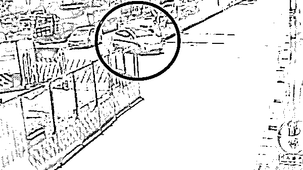
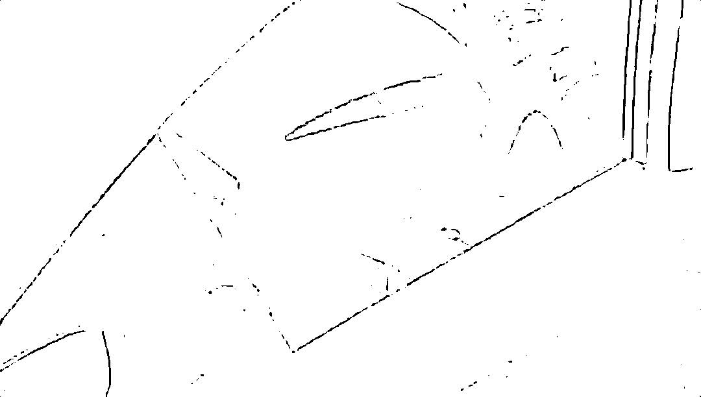

# 上海一特斯拉车主遭林志颖相似车祸，径直冲向隔离墩... 幸好人没事！

> 原文：[`mp.weixin.qq.com/s?__biz=MzIyMDYwMTk0Mw==&mid=2247544328&idx=1&sn=bfaf0fe2be904893f8d90ef6031c9715&chksm=97cbe530a0bc6c26a913fe7b392c7bf395e041ee7f349396b059deaeb634659df7b0460f27eb&scene=27#wechat_redirect`](http://mp.weixin.qq.com/s?__biz=MzIyMDYwMTk0Mw==&mid=2247544328&idx=1&sn=bfaf0fe2be904893f8d90ef6031c9715&chksm=97cbe530a0bc6c26a913fe7b392c7bf395e041ee7f349396b059deaeb634659df7b0460f27eb&scene=27#wechat_redirect)

点击下方关注小号，内容更精彩！

上个周末的时候，脊梁看到

群里在传

9 月 16 日中环近罗山路高架的一起事故 

大家都感觉是**“林志颖同款车祸”**

这画面...

**确实和林志颖出事时如出一辙** 

这辆车在中环路的一个出口处

先是违规压着导流线了

这个时候，司机非但没有纠正方向

居然也没有减速，因为刹车灯都没亮起

**这辆车就径直冲向了隔离墩**

发生撞击之后，整辆车都“弹”了起来

真的和林志颖出事的时候

几乎完全一样。。。

△ 林志颖车祸发生时的监控画面

而且，出事的车子刚巧也是特斯拉

不过幸好！

9 月 16 日发生在中环近罗山路高架的这起事故

**司机人没事，车子也没有发生燃烧**

但是从路过的车子拍到的画面来看

**车头部分变形严重**

简直就是

**“这车已经没法要了”**的程度

但真的是**幸好人没事！**

不过不知道这起事故的原因是什么？

车子能够这样径直冲向隔离墩

司机没看路是肯定的了

就是不知道

**是因为看手机或者犯困开小差？**

**还是因为开了自动驾驶就完全不看路了？**

有不少网友还猜测说

**可能是**司机以为自己开了 AP 自动驾驶

但其实只开了 ACC 辅助驾驶

然后车子偏航之后

车子没有作出反应，司机也没看到 

* 网络配图

怎么说呢

电动车车主太依赖自动驾驶还是不行的

毕竟这类技术在国内道路上还不够成熟吧

9 月 18 日，在浙江台州

司机自己转头看地图，没有看路

车子开着自动辅助驾驶

结果因为车子无法识别路障

就突然闯入封闭的施工区域

险些就要撞到作业的工人

所以开电动车的朋友们

就算有自动驾驶/自动辅助驾驶这些科技

开车还是看着点路吧！安全第一！

来源：脊梁 in 上海 SH

欢迎关注灰产圈社群服务号

