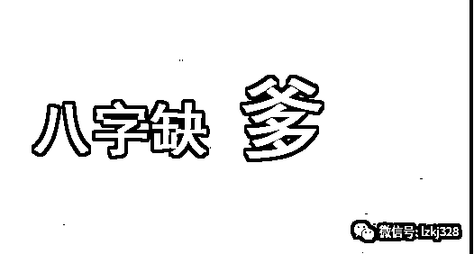
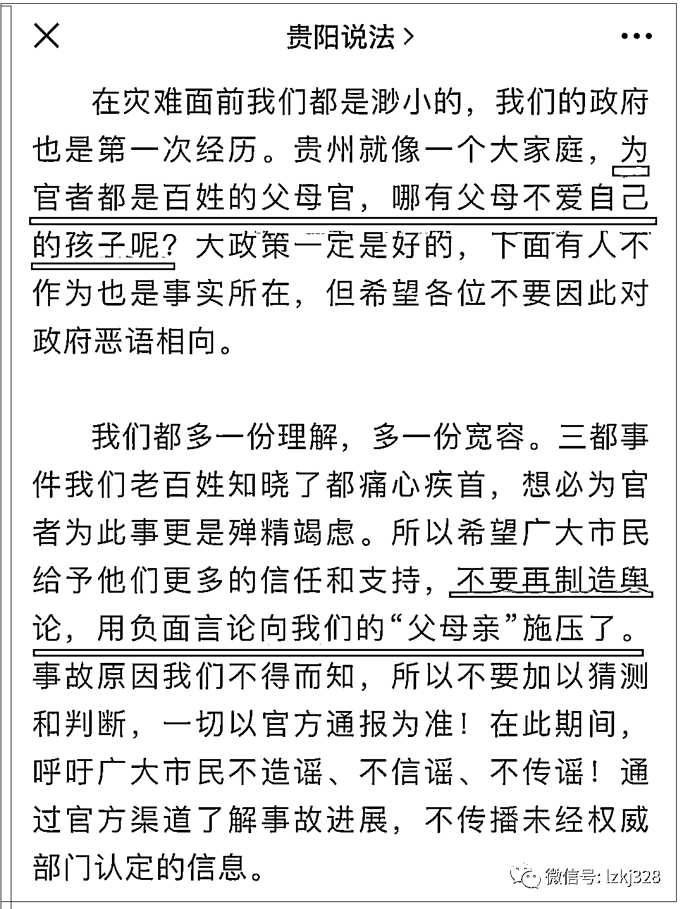
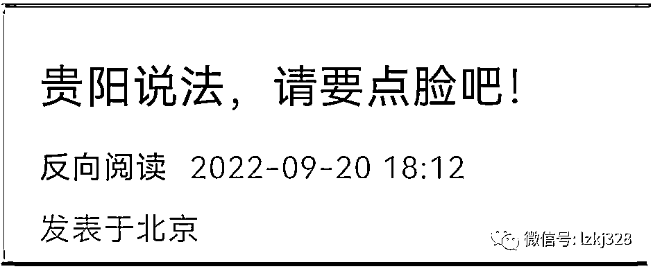
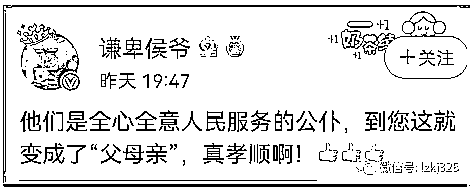
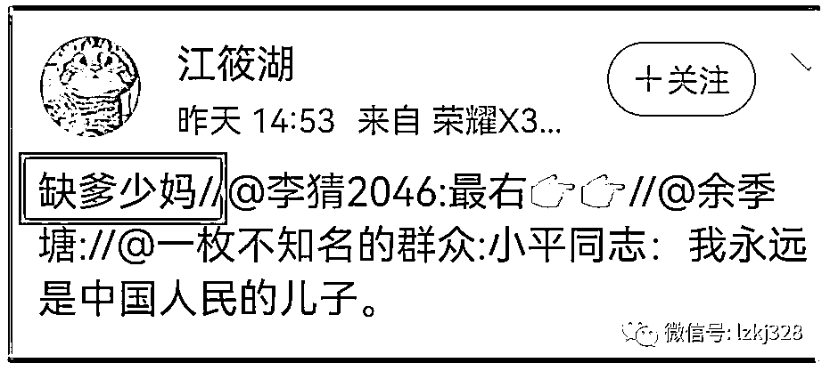
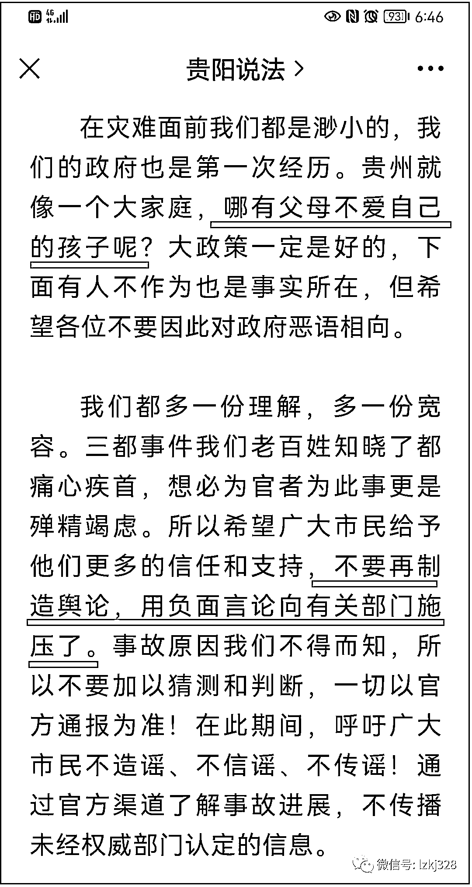
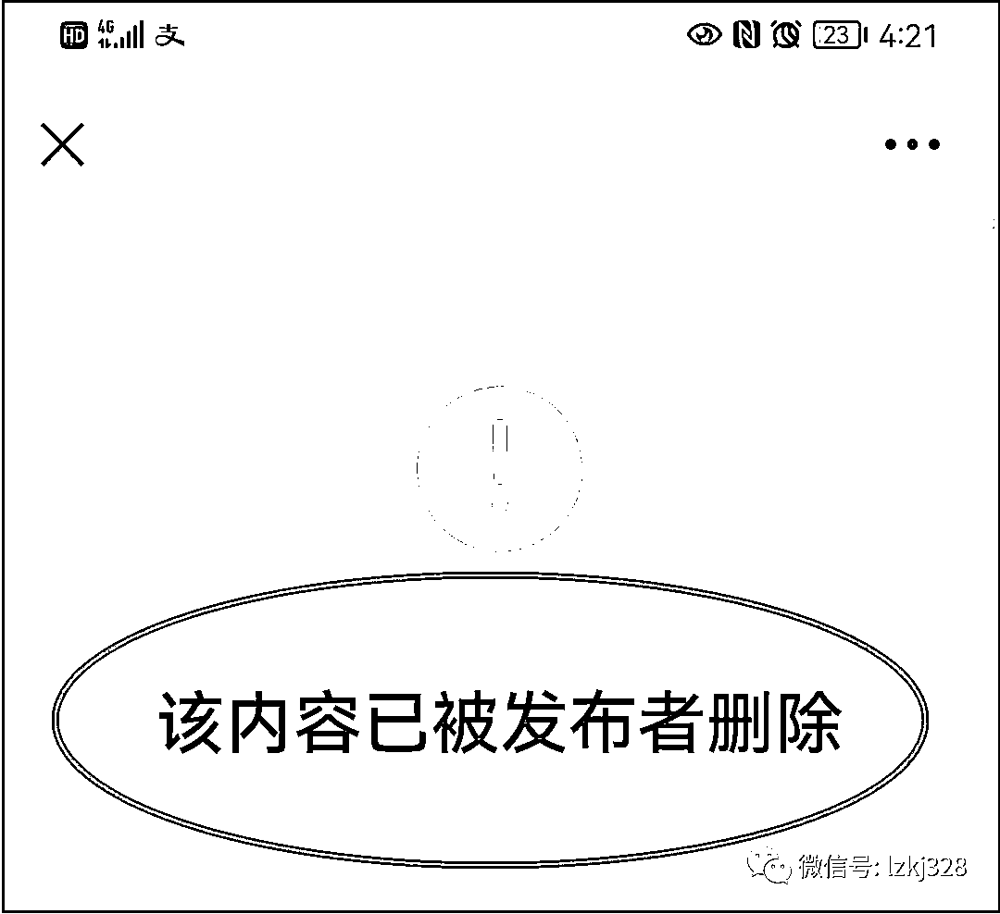
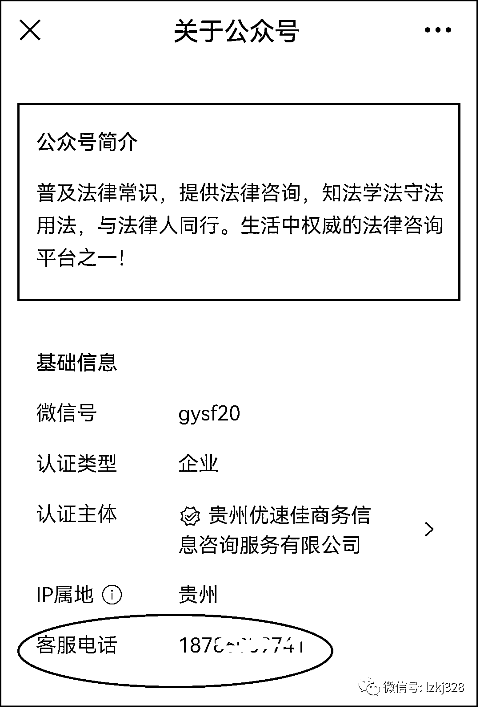
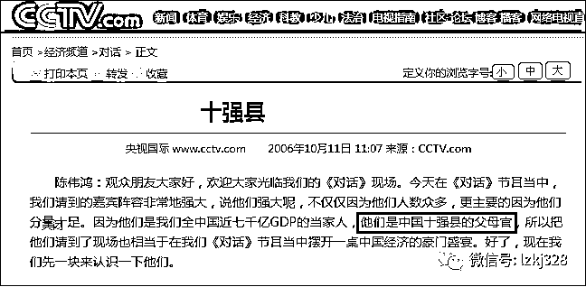

# “贵阳说法”，你八字缺爹啊！

> 原文：[`mp.weixin.qq.com/s?__biz=MzIyMDYwMTk0Mw==&mid=2247544328&idx=4&sn=c005c598b958f35bded881207824d16c&chksm=97cbe530a0bc6c26096bbe4d5a3787888d2d7ad46578902f76f014f97c91d272fb62a91a13a6&scene=27#wechat_redirect`](http://mp.weixin.qq.com/s?__biz=MzIyMDYwMTk0Mw==&mid=2247544328&idx=4&sn=c005c598b958f35bded881207824d16c&chksm=97cbe530a0bc6c26096bbe4d5a3787888d2d7ad46578902f76f014f97c91d272fb62a91a13a6&scene=27#wechat_redirect)

点击下方关注小号，内容更精彩！

“贵阳说法”前天发了篇《交通事故偶然发生，就“不敢”防疫了吗？》的歪嘴文章。文章针对公众的诸多质疑，不顾法律、道德、人性，昧着良心当起了打手。

文章最后是这样总结的：

> 
> 
> **为官者都是百姓的父母官，哪有父母不爱自己的孩子呢？**
> 
> 三都事件我们老百姓知晓了都痛心疾首，**想必为官者为此事更是殚精竭虑。**所以希望广大市民给予他们更多的信任和支持，**不要再制造舆论，用负面言论向我们的“父母官”施压了。**

文章一出，招来一片骂声。

> 
> 
> 谦卑侯爷：他们是全心全意（为）人民服务的公仆，到您这就变成了“父母亲”，真孝顺啊！
> 
> 
> 
> 江筱湖：缺爹少妈 
> 
> 

虽然网上骂声一片，“贵阳说法”还是舍不得删除已经 10 万+的文章，只是做了修改，把“为官者都是百姓的父母官，”12 个字删除，将【我们的“父母官”】8 个字改成了“有关部门”。

由于微信公号文章只能修改 20 个字，“哪有父母不爱自己的孩子呢？”这句还是无法删除。于是，修改后的文章成了这样子：

> 

看来，“贵阳说法”真的是八字缺爹啊！

在公众的持续谴责下，贵阳说法不情愿地删除了这篇能舔出屎来的无底线文章。

原本我还以为这是个官方账号，查询才知道，这是家认证主体为信息咨询服务的有限公司。就是这样一家信息咨询服务有限公司，公众号简介居然写着“普及法律常识，提供法律咨询，知法学法守法用法，与法律人同行。生活中权威的法律咨询平台之一！”

再一搜索，《交通事故偶然发生，就“不敢”防疫了吗？》这篇歪嘴文章，在另一个号发的时间更早，因为没有被关注，现在还在网上挂着。

曾经应邀参加了某县在省城的一个同乡酒会，参加酒会的大多是该县在省城混得还说得过去的场面人物。既然是酒会，肯定是要喝酒的。酒杯一端，话题无边，来自家乡的年轻县长春风得意，红光满面，一口一个“我们作为家乡的父母官”，和大家频频举杯，而省城的这些“子民”们虽然降了辈分，热情却是高涨，轮番给“父母官”敬着酒。    

口口声声称自己“父母官”的县长也就 40 来岁，不知是老酒喝高了，还是古装戏看多了，亦或他身上原本就有浓重的“父母官”情结，不然怎么老想着给百姓当父母呢？

“父母官”一说，出自明·冯梦龙《醒世恒言》第 29 卷《卢太学诗酒傲公侯》：汪知县在轿上听见，自觉没趣，怒恼愈加，想道：“他纵然才高，也是我的治下，曾请过数遍，不肯来见；情愿就见，又馈送银酒，我亦可为折节敬贤之至矣。他却如此无理，将我侮慢。且莫说我是父母官，即使平交，也不该如此。”到了县里，怒气不息。汪知县怒气不息，是他觉得自己是百姓父母，卢太学慢待他，就是对父母的不尊重。    

但那时是皇权时代，皇上贵为“天子”，普天之下皆为皇土，全国人民都是他的子民。州、县官叫什么？“父母官”！官大一级，如同民之父母。那个时候，“父母官”属于“治人”阶层，“子民”属于“治于人”阶层，这种“治”与“被治”、支配与被支配的关系决定了他们社会地位、政治权利乃至人格上的不平等。

如今是人民当家做主的年代了，依然有人在做着“父母官”的梦。       

前些年，央视《对话》栏目做过一期“央视《对话》中国经济十强县拷问幸福 GDP”，主持人陈伟鸿在开场白里直接称十强县的当家人为“父母官”。    

十强县的官员们坦然接受央视对他们“父母官”的敬谓。    

这些年，我经常在调研中遇到市级、县级的官员，经常碰到这些官员称自己“我作为父母官，要造福一方百姓什么的”。我经常当面纠正“你是百姓的儿子官”。虽说这些被纠正称谓的官员心里很不舒服，但总比乱了辈分的好。    

不光是官员，一些在衙门内执事的小衙役，也做着百姓父母的混张梦。    

补下课吧！

1944 年 9 月 5 日，中央警备团战士张思德在烧炭时因炭窑崩塌而牺牲，9 月 8 日，毛泽东在张思德的追悼会上发表了著名的演讲《为人民服务》，第一次从理论上深刻阐明了为人民服务的思想。 

其后不久，“为人民服务”演变为“全心全意为人民服务”：1944 年 10 月毛泽东在接见新闻工作者时指出：“三心二意不行，半心半意也不行，一定要全心全意为人民服务”。在七大政治报告《论联合政府》中，毛主席强调：“全心全意地为人民服务，一刻也不脱离群众；一切从人民的利益出发，而不是从个人或小集团的利益出发；向人民负责和向党的领导机关负责的一致性；这些就是我们的出发点。”党的七大把“中国共产党人必须具有全心全意为中国人民服务的精神”写入了党章。

毛泽东之后的我党历届领导人也都坚持并不断发展“全心全意为人民服务”的思想。可以说，高层领导希望每一层的官员都能够做好人民的公仆，去服务好人民。

小平同志曾说过一句著名的话：“我是中国人民的儿子,我深情地爱着我的祖国和人民”,这饱含浓厚情感的一句话,深深地打动了每一个中国人。

焦裕禄也把自己定位为人民的“儿子”：一个滴水成冰的寒夜，县委开会的第一项内容是集体到火车站看望即将背井离乡逃荒远去的群众，这景象在每一个县委成员心中掀起了愧疚的波澜。焦裕禄用这种方式，激发县委一班人的责任感；大雪封行，焦裕禄忍着急剧的肝痛，走村串户，访贫问苦，面对病倒在床的老人家“你是谁”的问询，焦裕禄言出肺腑：“我是您的儿子......”   

焦裕禄、孔繁森，他们是当代公仆的代表，是人民心中的丰碑。 

把自己定位于人民的儿子，就要把人民的冷暖疾苦时刻放在心上，把为人民谋幸福作为自己一切行动的出发点和归宿点，在为人民服务的实践中奉献自己的一切乃至生命，树立共产党人的形象。唯如此，才算得上一个真正的共产党员。

“为人民服务”不仅被确定为中国共产党及其党员必须奉行的“宗旨”，而且写入了宪法，成为国家机关及其工作人员的法定义务。 

然而，“为人民服务”我们已经讲了 70 多年了，有些官员不知道抽了哪根筋，“县太爷情结”仍然深深地影响着他们，对于群众的冷暖三心二意，漫不经心，辫子戏里那些接状子、打板子的官老爷形象无时不在“教育”着他们。这些人不喜欢把人民当父母来孝敬，觉得那样太低自己身份，他们喜欢当“父母官”，给老百姓当父母。 更有一些人，为官一任，祸害一方，直到坐上了被告席，才想起自己“辜负了党的培养和人民的信任” 。要是这些地方官员能把百姓当成自己的父母来善待，这些事情也许就不会发生了。当然，也有对自己父母不孝的，那就另当别论了。

“贵阳说法”如果命里缺父母，可以自己伸长舌头使劲舔，哪怕一天喊上八百遍“父母官”，那是你自己的事，只是，不要拿“我们”说事，因为，你八字缺爹啊。

宾曰语云（Lzkj328）｜出品　 宾语｜文

欢迎关注灰产圈社群服务号

