# 短视频上的赌石翡翠，估计能买下整个中国

> 原文：[`mp.weixin.qq.com/s?__biz=MzIyMDYwMTk0Mw==&mid=2247544328&idx=5&sn=152845eef7115897c8be7dde794f0b7e&chksm=97cbe530a0bc6c26a0be2a30198290c49c9ae61725ef4200503c9b5995e7f5fab1a4f06a2c58&scene=27#wechat_redirect`](http://mp.weixin.qq.com/s?__biz=MzIyMDYwMTk0Mw==&mid=2247544328&idx=5&sn=152845eef7115897c8be7dde794f0b7e&chksm=97cbe530a0bc6c26a0be2a30198290c49c9ae61725ef4200503c9b5995e7f5fab1a4f06a2c58&scene=27#wechat_redirect)

**点击下方关注小号，内容更精彩！**

**01** 

除了彩票以外，还有很多看似容易暴富，实则很难赚钱的活动。

比如赌石。 

这是一种翡翠原石交易方式，流行在滇缅边境一带，顾名思义带有赌博性质。

> 翡翠在开采出来时，有一层风化皮包裹着，无法知道其内的好坏，须切割后才能知道翡翠的质量。

而如今，短视频上的赌石赌翡翠，已经往无厘头的方向发展。

先看一个画面。

这位大哥把石头浸水桶，水溢了出来。

当他拎出石头后，桶里的水少了，于是他说石头吸水，世间少有。

[`mp.weixin.qq.com/mp/readtemplate?t=pages/video_player_tmpl&action=mpvideo&auto=0&vid=wxv_2578733049551732736`](https://mp.weixin.qq.com/mp/readtemplate?t=pages/video_player_tmpl&action=mpvideo&auto=0&vid=wxv_2578733049551732736)

自来水溢出塑料桶了，我的老伙计啊，难道不知道初中就教的阿基米德浮体原理吗？

他口口声声说不卖，但你懂的，要拿下这块奇石，得加钱。

也许他是在玩梗讽刺赌石，也许他确实在进行奇石买卖，不论如何，都向我们还原出了赌石的奇葩特性。

实际上，互联网的出现，不仅仅没有让神神叨叨的赌石场景停止，反而继续在制造新的泡沫。

**毕竟赌石生意，一个愿意卖，一个愿意买。**

有的主播夸大其词说自己的原石加工后成为万年帝王绿。 

然而绿成玻璃酒瓶颜色的制品，怎么看都离温润有些距离。

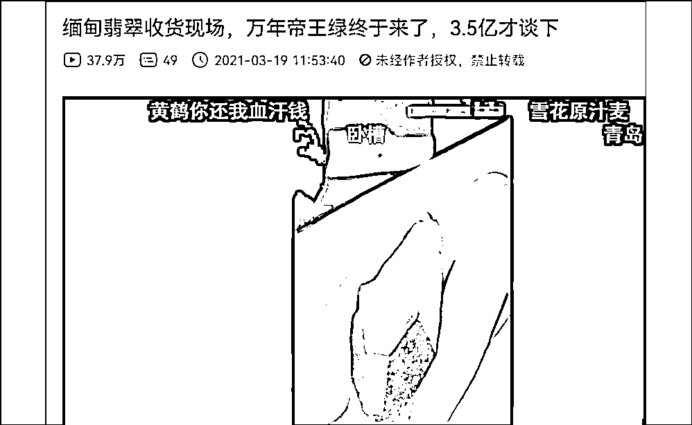

随便一查就知道，翡翠形成大约需要一亿年。

那么，万年帝王绿是不是再放上 9999 万年后出售才算保真呢？

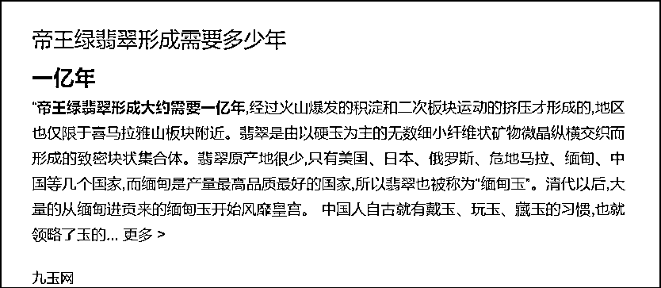

有的主播谎称刚切出来了原石。 

切面却比镜子还光滑，估计他光打磨就用了一下午。

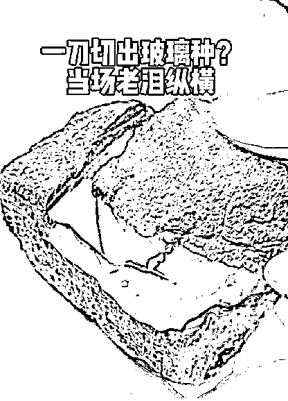

偷懒点的主播，直接给视频加了鲜绿滤镜。 

老板头发紫得发亮，佩戴的玉坠则绿得发荧光。

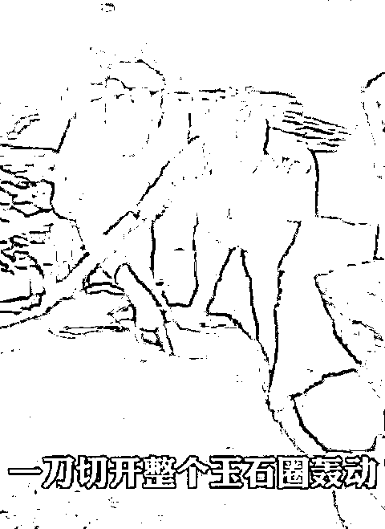

**我都想给我“相信光”的小侄子买一个。** 

直播特效越来越强，切开的玉石就更像现代工业残次品。

可是这么一来，毫无质感。

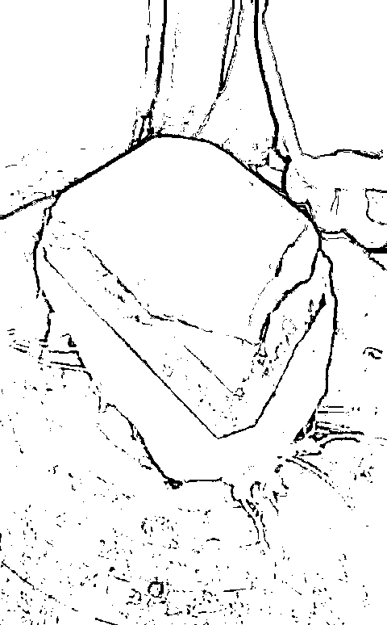

有时还像是切了个三黄蛋。

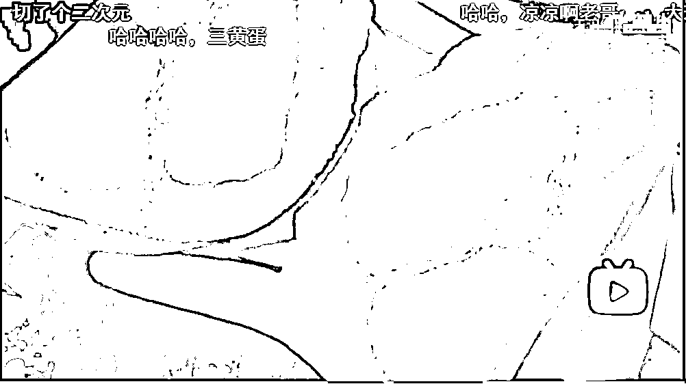

或是像捏了捏塑料软胶。

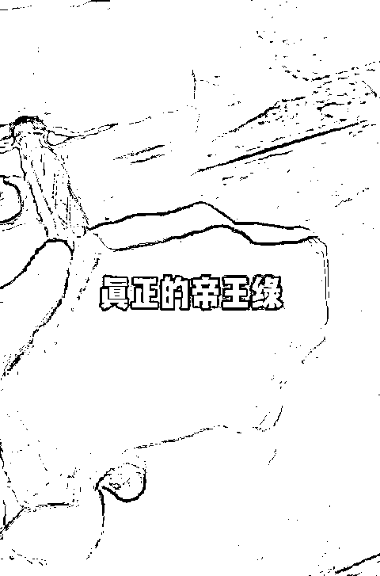

能把观众的质疑搪塞过去的关键在于，打光和主播滔滔不绝的话术。 

只要主播信心够强大，挂羊头卖狗肉的情况还可以有很多。

比如拍视频的时候是一个料子，切出时用另一个料子，都不是同一个。

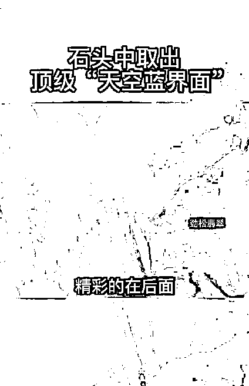

或者开窗时，提前镶嵌了一块色正的翡翠，原石的主体还是残次品。 

（原石上开一口，行话叫“开窗”） 

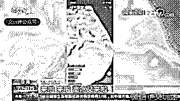

由于这一行竞争太过激烈，意识到自己的局限后，主播们主动从技术流开始转向了演技流。

可以找缅甸人当托儿，用感情牌诱导玩家。 

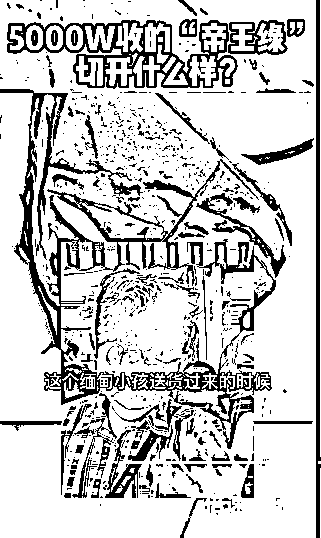

可以选择直播时与助手撕破脸，口口声声说用最低价回馈家人们： 

**“你疯了吗？100 万的翡翠，6688 就能拿！”** 

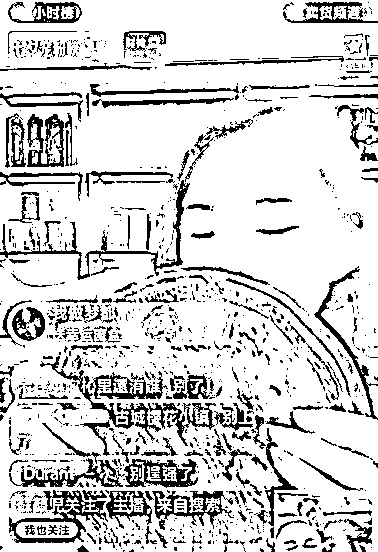

“我说一个数，只要 68.8！”

最后，玩家们当然为他们的逢场作戏埋单。

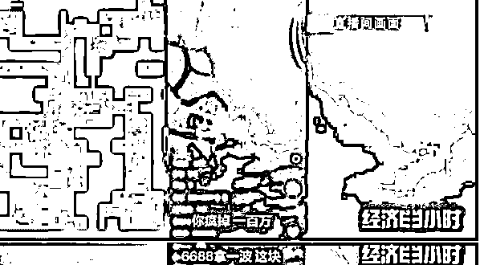

他们的忽悠戏份不止如此。

有的主播先表示对瑕疵原石的遗憾，同时又说可以拿它做小手镯，诱导付加工费。 

事实上你是在拿钱买了一堆工业品，不是在赌石。

演技通透点的主播会现砸原石，说本人与残次品不共戴天，转头用话语让你买他家的假货。

欧亨利都写不出这样的剧情起伏。

**一句话，赌石行业太卷，主播们能出圈，更靠演技，而不是产品。** 

**02**

这些演技，并非是娱乐性质的，它们目的性很强——

自始至终为了烘托出最后的天价。

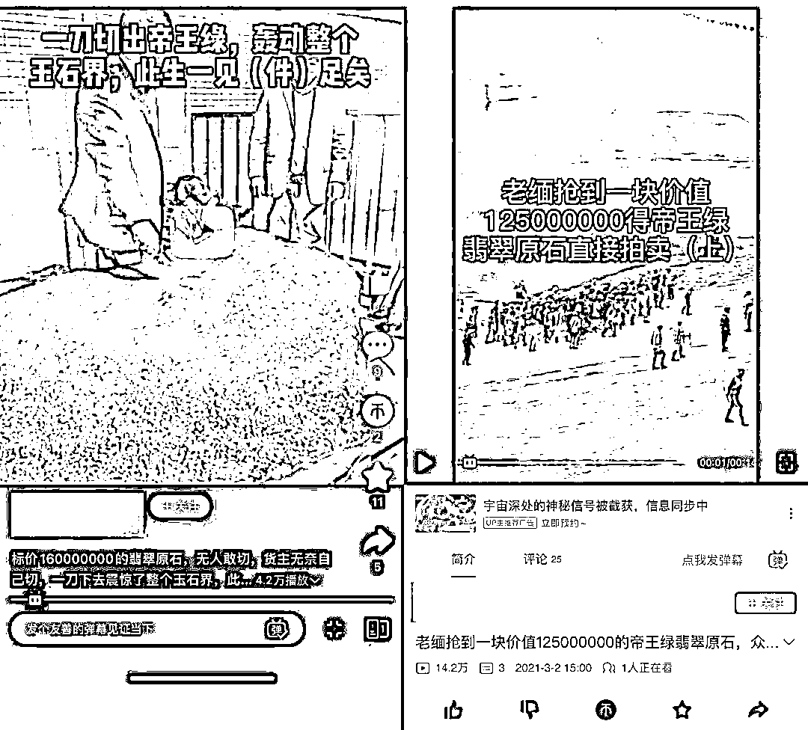

简单的做法是把翡翠价格写得很长很长，后面带多个零。 

不过，数学好的中国人有时间把数字数清楚。

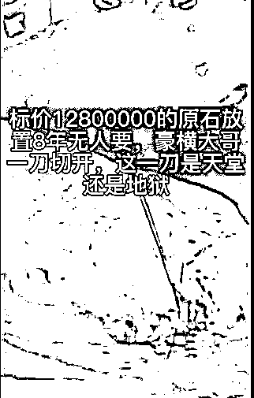

很多直播视频和文章内容都不标明货币单位，大概是为了混淆缅甸币和人民币。 

不过这个小插曲并不妨碍赌石游戏的价格一个比一个喊的威猛。

**“一刀擦开暴涨 10 亿！”**（人民币）

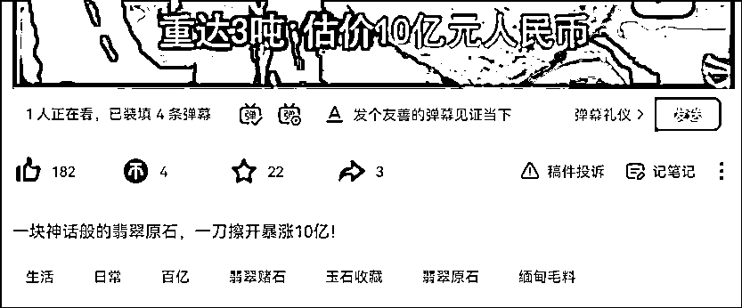

**“4000 万入手 1188 公斤的石头，一刀切开 20 亿！”**（人民币） 

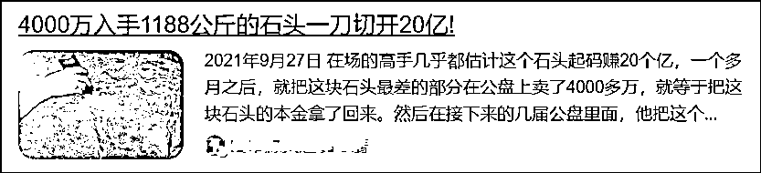

一个比一个离谱。

还有这样的：

**“价值 4000 万的翡翠原石，一刀切开暴涨 50 亿”**（人民币）

按这个价格来算，足以打造 1.25 个南京牛首山景区。

但你觉得真有人要一个大石头，而不是一座南京牛首山吗？

接着看，主播们用中国话解说：

**“大哥卖掉一条街，买下 0.68 吨翡翠原石，一刀切开百亿”**

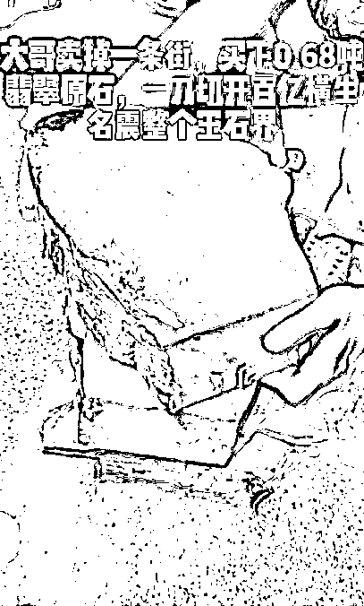

没人知道一条街的楼房价值，但大家知道，霸道总裁小说的一个现实原型就是这些吹牛不交税的老戏骨。 

更何况，像赌石圣地瑞丽市这样的地方，一年 GDP 在 100 亿至 200 亿之间。

一块百亿的石头，能帮助解决多少就业经济问题啊。 

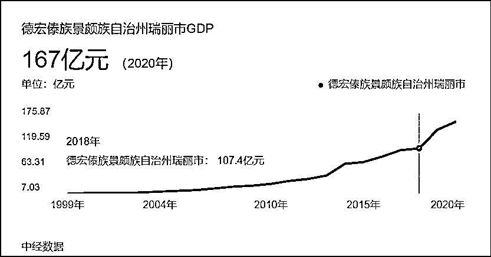

实际上，这些“有价无市”的石头解决不了什么。 

只是让赌石主播们觉得，切割机一开动，财富似黄河之水滚滚而来。 

还有以缅甸币结算的原石，也是价值不菲。

“老板当场开价 13 亿”（相当 436 万人民币）

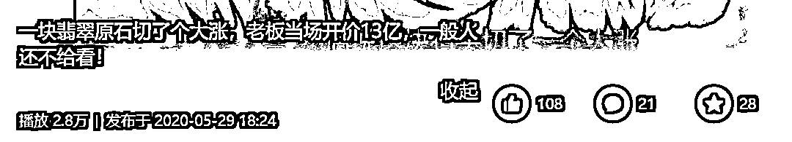

“80 亿拿走这块大玉王”（相当于 2680 万人民币） 

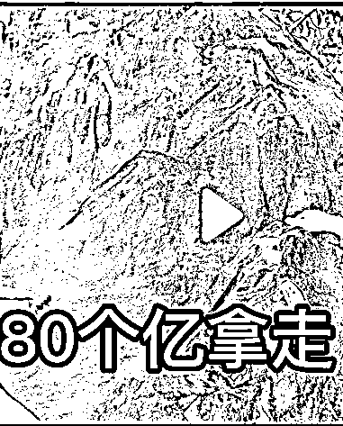

无论是以人民币结算还是缅甸币结算，最后谁也数不清价格了。

但很明显，总的售价早就突破万万亿人民币了。

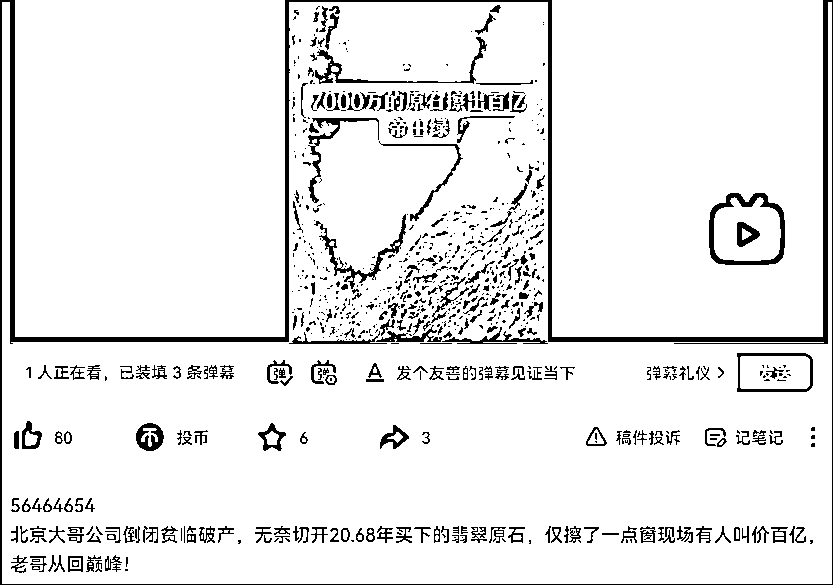

相比之下，2021 年我国 GDP 是 114.37 万亿元。 

**这么算来，短视频里销售的玉石，足以买下整个中国。**

别看这些东西价值好几亿，但主播们对它们并不上心。

拿着切割机，径直划开原石，让翡翠的碎屑肆意地喷洒。 

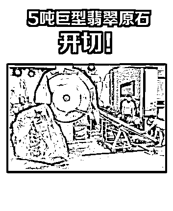

除此之外，也用锥子凿开，一层又一层剥落外表皮。 

这么一次大锤，估计不是 80，而是 8000 了吧。

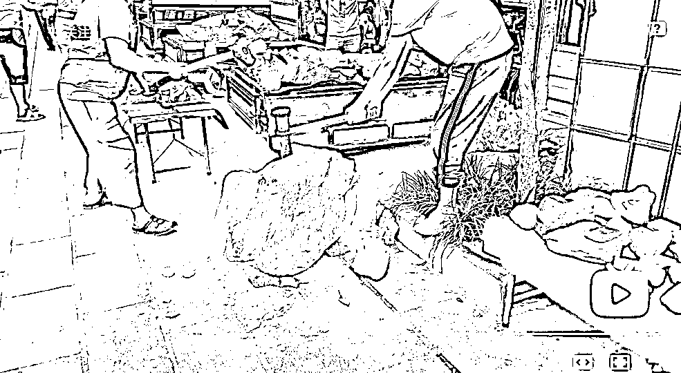

他们甚至连工作环境的仪式感也一点不在乎，任凭切割机下面扔满了烟蒂。 

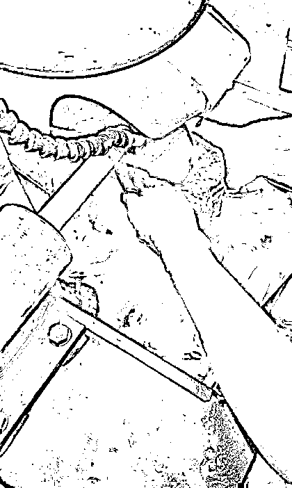

也许他们知道自己这一次错过了几十亿，下一次将马上弥补上。 

有钱人就是这么不把玉石当回事的，他们质朴的心态可见一斑。

**03** 

看到这里，你肯定会想赌石真的赚钱吗，几亿几十亿的价格真能兑现吗？

这个问题需要通过回顾玉石的产销过程来说明。

简单点说过程是这样的：

**缅甸矿主→国内大商家→国内小商家→直播主播→赌石玩家。**

可想而知，一颗原石经过那么多道关口过来，它还能够物有所值，甚至一夜暴富吗？

用报纸的说法是这样的：

> （缅甸）矿山上的相玉师傅天天在和石头打交道，有品质的石头几乎不可能逃过他们的眼睛，所以在腾冲等边境或者说在缅甸以外的地区，要找到廉价而高品质的翡翠原石机率很小。

玉石行业从来就是这么残酷，有能力有信誉的商家吃肉，能力小的喝汤，没能力的做局骗人。 

而真正可怜的只有这两类。

一类是每日为生计忧愁的缅甸人，被称为“也木西”，是缅甸翡翠生态链里最低层的群体，他们浩浩荡荡进矿，构成了著名的“全球上班最积极的地方”的景象。

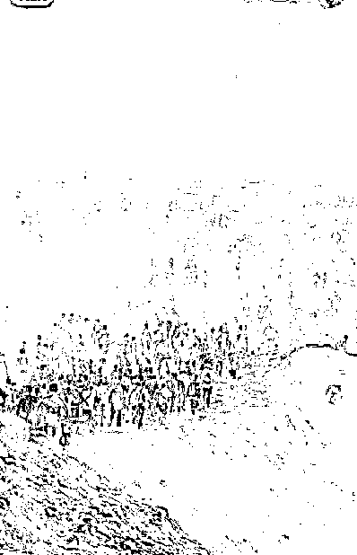

他们也许有所斩获，只不过能捡到的真玉少得可怜。

这样一来恰恰构成了“气氛组”，让我们国内玩家充分感受原石来之不易。

另一类就是国内看赌石直播的玩家。

我想说到这个份上了，大多数网友也明白赌石到底赚不赚钱的道理。

赚不钱钱的问题完全可以反过来问：

**既然普通玩家能捡大漏，为什么商家自己不先捡漏赚钱呢？**

**天天直播有大漏，大漏越来越多，会不会造成“多者为贱”的经济学现象？**

**就算玉石开出天价来，会不会出现有价无市，没人愿买的结局呢？**

这些疑问放到任何标榜一夜暴富的行业里都适用。

换句话说：

**人人都能成为富豪，也就意味着人人都不是真的有钱。**

**04**

十五年前，赌石主要集中在线下市场和电视节目，那时候乱象也不少。

当时三联生活周刊发问：

**“赌石”会终结吗？**

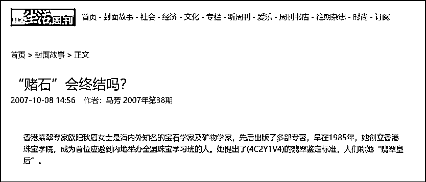

三联生活周刊文章里的一个核心问题就是，为什么我们的玉石不能拥有像国外宝石的 4C 标准一样所谓标准呢？ 

有了标准是不是更容易制定价格？翡翠交易是不是就能像钻石一样规范化了？

可说起来，制定标准确实不易。

光是《和田玉-鉴定与分类》标准草案已经做过几次的修订后才出台，想必这其中利益平衡的问题实在令人头疼。

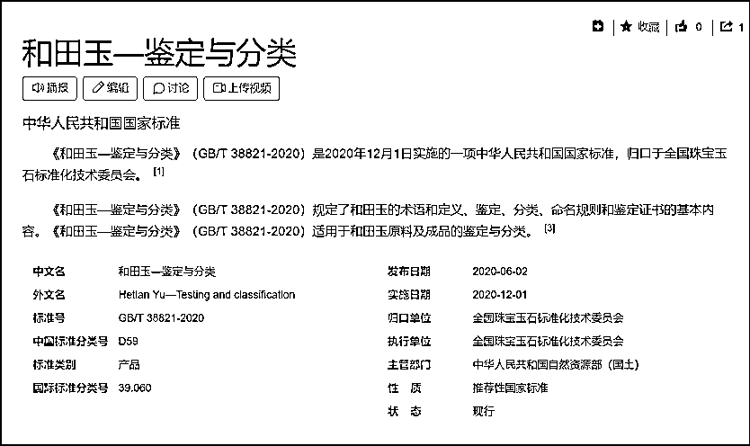

再者，标准的推广也不容易。 

2009 年国家质检总局和标准委就已经颁布了一个翡翠的分级标准，2012 年云南也发布过一个翡翠饰品的质量等级评价标准。

按说这两个标准都够专业够细致了，但它们都并没有掀起什么风浪，甚至很多行业内的朋友都没听说过。

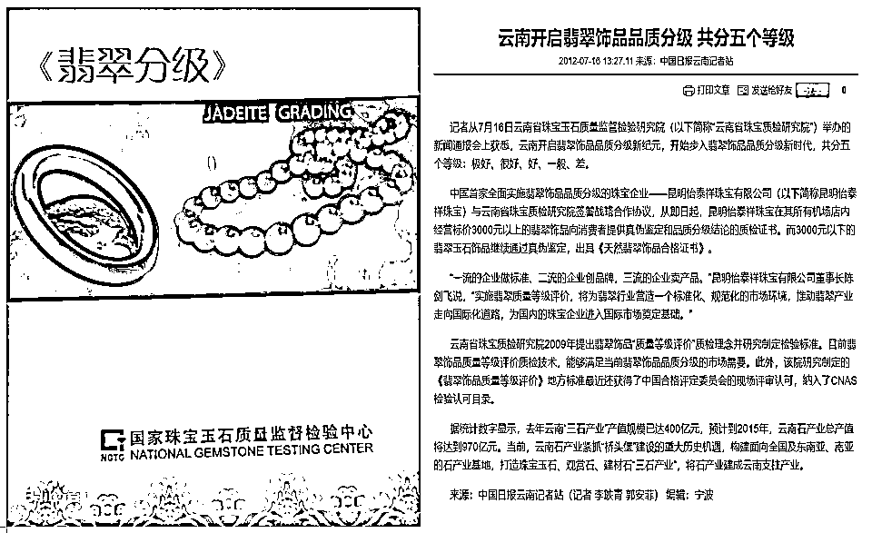

为此，有人给出了理由，说这些标准在我们日常的交易过程中难量化，也就是难以在交易中操作。 

究其原因在于，一千个玉石玩家能解读出一千种玉石。

> 对于羊脂玉的理解也是众说纷纭，有的人说只要白度够就是羊脂玉，有的说要像羊油那种，不光是白度还得是油润度够，才是羊脂玉；
> 
> 还有更文艺的说法：羊脂玉在心中！

**于是，在泡沫里的人沉醉不能自拔，泡沫外的人苦口婆心劝说也无济于事。**

当然，更多人是看不下去的。

因为大家反感赌石直播里的浮夸风格了，也对“一夜暴富”的神话有所忌惮。

为此，网友做了相关的吐槽恶搞。

[`mp.weixin.qq.com/mp/readtemplate?t=pages/video_player_tmpl&action=mpvideo&auto=0&vid=wxv_2578785304455888898`](https://mp.weixin.qq.com/mp/readtemplate?t=pages/video_player_tmpl&action=mpvideo&auto=0&vid=wxv_2578785304455888898)

像这样的视频里，首席鉴定师正在用同样专业的手法对 WATER MELON 进行鉴定，包括识别包浆、水头、大小裂、开窗等等程序。

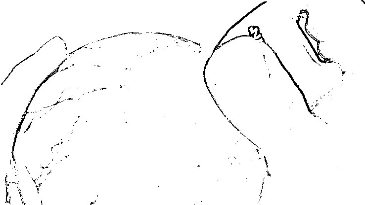

经过一通折腾后，他用味觉发现“红翡”材质的西瓜，明显没有“黄翡”的哈密瓜味道甜。

幽默之余，是希望网友擦亮眼睛，正视赌石。

**毕竟要是吃到自己亏本的瓜，怎么都不是滋味。**

来源：雷叔说事

欢迎关注灰产圈社群服务号

