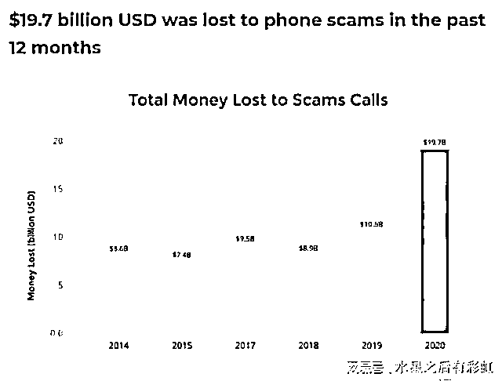
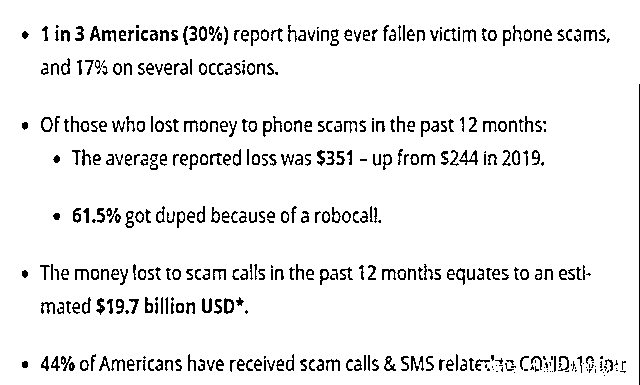
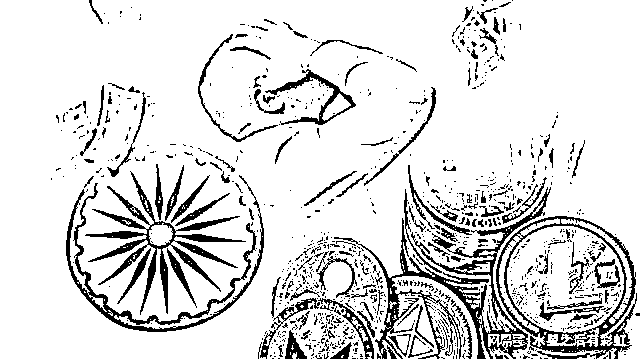
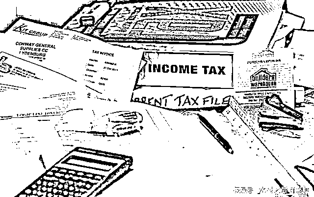
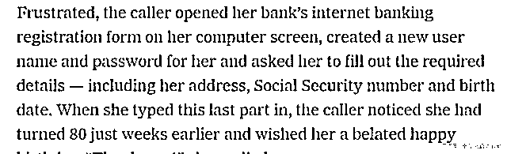
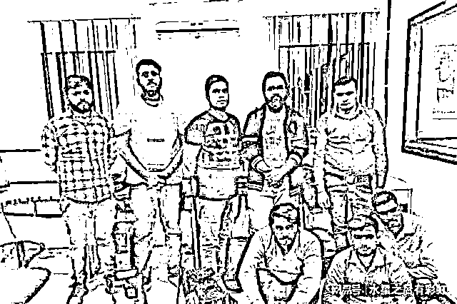

# 印度才是全球电信诈骗中心？每年至少骗美国人 1400 亿，搞得 FBI 都头大！

> 原文：[`mp.weixin.qq.com/s?__biz=MzIyMDYwMTk0Mw==&mid=2247544328&idx=8&sn=4e1b0b8e8e0a1c5d26c023aa7c16dbd8&chksm=97cbe530a0bc6c26de5f2a4896a7ad65d98ad81ea3578abb915ef9684253aaa7839785fed826&scene=27#wechat_redirect`](http://mp.weixin.qq.com/s?__biz=MzIyMDYwMTk0Mw==&mid=2247544328&idx=8&sn=4e1b0b8e8e0a1c5d26c023aa7c16dbd8&chksm=97cbe530a0bc6c26de5f2a4896a7ad65d98ad81ea3578abb915ef9684253aaa7839785fed826&scene=27#wechat_redirect)

**点击下方关注小号，内容更精彩！**

****你知道印度最赚钱的业务是什么吗？**** 

**2021 年，美国在发布了一份针对印度诈骗的报告中强调，印度在 2020 年一年的时间里，**通过电信诈骗的方式，从美英等欧美国家窃取了 197.8 亿美元**，相当于美军 2020 年三分之一的军费支出。**

**电信诈骗也成为了印度最赚钱的“支柱产业”，更有趣的是，印度的诈骗和我们常规认知的，针对国内老年人群体的诈骗还不太一样，他不仅是针对欧美等西方国家，而且诈骗的对象还是全年龄，童叟皆欺。甚至，为了更好地诈骗美国人，印度的电信诈骗组织还专门为美国人量身定制了一套“诈骗体系”。**

****那么印度诈骗是如何发展****壮大****，又是如何从美国人民身上骗钱的呢？****

****

**今天我们就来好好聊聊，印度诈骗那些事儿。提起印度，大家的第一反应可能往往都是脏乱差，落后等印象，但其实，印度的第三产业也就是服务业，是排世界前列的。许多印度人最大的梦想就是学英语，然后去西方国家当客服。**

**以美国为例，美国因为一些国家层面的原因，经常性的会有保险社保金之类的东西需要通过电话进行确认，原本这个电话确认的过程是由美国人自己来做的，但随着美国的人工成本不断提升，这样专门的呼叫中心就被外包了出去。**

**包给谁了呢？包给了印度。**

**外包到印度去以后，自然就需要培训，但培训并非所有人都一定会上岗，上岗的人自然是负责正常的客服工作，但那些没有上岗的人这么办呢？**

**只能进行不正常的工作了呗。**

****

**而且对他们这些人而言，**诈骗的速度其实是要比合法工作要快的。**根据美国发布的这报告显示，被诈骗的金额最高在 500-600 美元，平均诈骗金额约为 315 美元，而被捕获的印度诈骗人员透露，他们每骗成一笔生意，就能获得三分之一的抽成，如果一个月完成四笔生意，那么抽成就能提升到二分之一，这样算下来，一个印度诈骗犯一个月轻轻松松就能赚到就达到了 1600 美元左右的工资，这对于那些生活在北方邦的印度平民而言·已经是巨额收入了。而且这几乎没有什么成本可言，充其量就是支付一些电费和租赁网站的费用。**

****

**根据 FBI 的分析报告，他们认为印度诈骗的方式一共分为三个步骤**，第一种被称为“出版者”，**就是负责在网上发布大闪着“FBIWARNING！”的广告并强制锁死他人的浏览器页面，要求对方带电话或者汇款到某账号上，想要关闭网页，只能通过任务管理器强制关闭，但对于电脑知识相对匮乏的人，很容易就误以为自己是被政府锁死了，然后上当受骗。**

****

****紧接着就轮到了“呼叫中心”**，他们的任务就是忽悠受骗者，让他们把钱带到一个名叫“钱骡子”的人手上，这些人是一些在美国的印度人，他们的任务就是肉身依靠偷渡和坐飞机等方式，把钱带回印度去。**

****

**不难看出，这是一套非常完善的体系化诈骗流程，上手难度低，运营简单，收益还高。**因为这些诈骗集团成员，都收到过欧美国家的专业培训，他们的语气，语速，说话的风格，都非常的专业，完全符合美国人对客服专员的印**象，因此极其难被发现。**

****

**当然，除了团伙作案，有的时候能力较强的个人，也可以一个人轻轻松松完成诈骗，前两年被美国《纽约日报》报道的微软客服诈骗案就是一个典型，这位名叫桑杜格的印度裔的微软客服专员，在缺钱的时候就会动歪心思，他会对打电话投诉的用户说：先生，您的电脑被植入了某种病毒，然后要求对方允许他远程操控电脑，眼睁睁的看着对方取走他的安全信息。除此以外，他还会主动出击，拨通某个人的电话，告诉对方：“先生，你被 FBI 挂了一个逮捕令，你要先汇一笔款，才能取消这个逮捕令。”靠着这样的手段，桑杜格前前后后一共诈骗了至少 3 万美元。**

****

**此时或许会有人提出质疑，**美国人都是傻子吗？这么轻而易举的就被骗了？****

**事实上，美国之所以被骗并不是因为他们人傻钱多，关键在于美国生活的落后和印度诈骗集团的“私人订制”。**

****美国作为世界第一大国，时至今日仍然没有普及移动支付，无论到哪儿都是 Cashiisking（现金为王），无论买什么东西都是要么现金，要么信用卡**，这就导致美国人民在支付问题上，经常出现许多漏洞，很多东西也不能像我们一样，拿着手机划两下就能解决，只能不断打电话、回复电子邮件进行处理，给了那些诈骗集团巨大的操作空间。**

****

**其次，为了更好从美国人手上骗钱，**印度的诈骗组织会高薪聘请一些在美国大学读过书的留学生，或者是一些对美国金融体系有经验的人，请他们做“参谋”，定制一套能让美国人信服的诈骗话术，**并且还能根据美国政策上的一些变化进行“版本更新”。比如针对老年人群体，他们会嘘寒问暖甚至对他们送上所谓“迟来的生日祝福”；而针对那些年轻人、学生，他们则会以“FBI”或者“烟酒管理局”的名义，威胁对方已经因为犯了某些罪而被挂上逮捕令，以此来勒索所谓的“证明费”。至于那些中产阶级就更简单了，一句“先生，你好，我们是美联储的，根据我们的调查，我们怀疑你的账单存在问题。”轻轻松松让对方上钩。**

**在这样一套“贴心”的定制服务下，很少会有美国人很难分辨，对方到底是骗子还是真的公职人员，不仅让印度诈骗集团屡战屡胜，也让老百姓对美国公职人员的公信力产生了怀疑。**

**既然印度诈骗这么严重，美国政府难道不打算管管吗？了，但并没有什么用。**

****

**事实上，早在六年前，美国就曾派 FBI 和 CIA 进行调查，希望联合印度政府铲除诈骗集团，但收效甚微，导致这一情况出现的主要有两个原因。**

**首先，就是诈骗集团极其团结而且人数众多，在我们的常态认知中，诈骗犯都是自私自利的，为了自己赚取甚至可以出卖别人，但实际上，印度的诈骗集团非常团结，他们往往以一个村为据点，在村外设立了大量的眼哨负责盯梢，一但发现什么风吹草动立即上报，然后负责人直接断网断电，进入静默模式。FBI 找都找不到人，也查不到任何信息。**

****

**其次，就算是实施抓捕难度太大了。**因为印度的诈骗是在本土进行的，而受害者往往是在美国或英国本土，按照法律，这种情况必须是抓到欺骗受害者的那个骗子本人，**并且是在有确凿证据的情况下才能实施抓捕，这就导致想要抓人必须通过两国合作，美国提交受害者信息，印度提供嫌疑人名单，然后两国进行逐一筛选。** 

**但哪个国家又愿意交出本国的国家信息呢？**

****况且印度人这么多，你想把这些诈骗团伙里面骗的那个人揪出来，而且证明他是那个骗子、骗了多少钱、什么时候骗的、怎么骗的、这个钱又到哪儿去了、然后完完整整拉一个账单出来，你才能让印度法院去判罚，所以根本没有人愿意去抓，这也就导致了印度诈骗越来越泛滥。****

****

**当然，**在这里也希望大家吃瓜看戏的同时，能够关注我国的电信诈骗问题，在我国，这样的问题也同样严峻，每年都有新闻媒体报道我国中老年甚至年轻人群体，遭到电信诈骗被骗走数万甚至上百万存款的信息，面对陌生电话，或者陌生号码发来的短信一定要谨慎，谨慎再谨慎，不要让你辛辛苦苦攒的老婆本，变成别人纸醉金迷的工具**。**

**来源：网易号“水星之后有彩虹”，天下有诈，人间法则**

****

**欢迎关注灰产圈社群服务号**

****

****