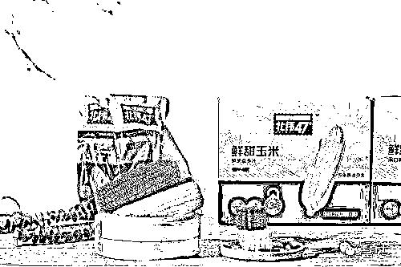
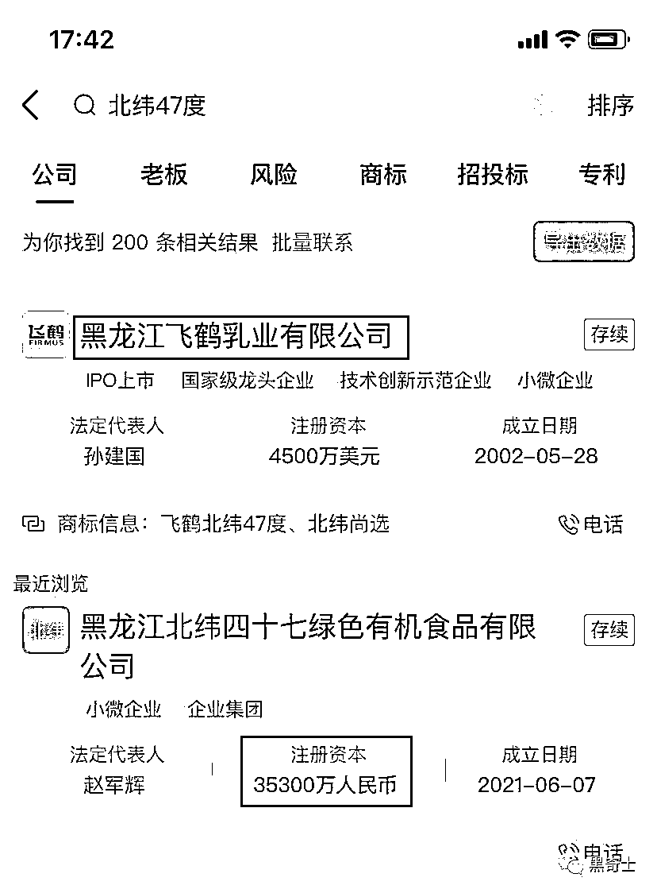

# 新东方卖的玉米刺客，背后有何门道，便宜了就是谷贱伤农吗？

> 原文：[`mp.weixin.qq.com/s?__biz=MzIyMDYwMTk0Mw==&mid=2247544362&idx=3&sn=2ddac0a478498627224b14646ca6e5ba&chksm=97cbe512a0bc6c0427d1333589070ee0f07dd523ccf716558a641ec13097e2ca9757e33aeade&scene=27#wechat_redirect`](http://mp.weixin.qq.com/s?__biz=MzIyMDYwMTk0Mw==&mid=2247544362&idx=3&sn=2ddac0a478498627224b14646ca6e5ba&chksm=97cbe512a0bc6c0427d1333589070ee0f07dd523ccf716558a641ec13097e2ca9757e33aeade&scene=27#wechat_redirect)

这两天，东方甄选出售的“鲜食玉米”成为大众关注的焦点。 

起因是，知名带货达人辛巴爆料说，东方甄选出售的“北纬 47 度鲜食玉米”，每根 200g，售价为 6 元左右。东方甄选的抽成高达销售额的 40%，也就是，每根玉米，东方甄选可以拿到 2.4 元佣金。 

这种高额的抽成，以及玉米本身的高售价，引起了众多网民的不满。 

针对这种不满，东方甄选的董宇辉回应说，“玉米不能卖太便宜，谷贱伤农”，“如果中间商不赚钱，农民的玉米就更卖不掉，会更便宜”。 

在黑奇士（id hqssima）看来，鲜食玉米的售价，并不是一个简单的价格高低问题，也不是简单的“谷贱伤农”问题。

下面，我就来仔细讲讲，这场 6 元玉米之争的本质是什么？

**第一，多产地鲜食玉米，最终销售成本为 1-2 元**

我先后询问了多个地方的鲜食玉米的内部人士，包含了黑龙江依安（北纬 47 度产地）、湖南渌口、云南某地，他们的鲜食玉米的最终销售成本不超过 2 元。最终销售成本，就是包含了物流、包装、营销等各个环节，最终送到用户家里的成本。 

而辛巴更在直播里直接指出，其家乡（黑龙江通河）生产的鲜食玉米的地头价格为 0.7 元每穗。 

但是，成本这个概念很难界定。比如北纬 47 度的创始团队曾经向媒体表示，其进口的玉米采收设备价格高达近千万元。如果算上类似的成本和场地，东方甄选出售的鲜食玉米的成本可能要远超竞争对手。（地头价格就达到了 2 元每穗）

某从事鲜食玉米的的内部人士 M 先生向黑奇士表示，目前业界的鲜食玉米定价更多的是拍脑袋定价，有些中小品牌商会随意压低价格，但低价产品的可持续性不强，也许明年就不做了。

像北纬 47 度这种产品走的是高端路线，他们就是要定高价，通过价格剔除掉价格敏感的用户，所以在京东、天猫旗舰店等地方，每穗玉米的价格甚至高达 12 元，即使是 10 根一箱的，价格也在 60 多元。相对于这些平台，东方甄选的价格不算高（10 根，50 元）。

“辛巴计算的是物料硬成本，东方甄选更多的是营销品牌投入，所以两家说的本质不是一回事”，M 先生表示。“就像狗不理包子、全聚德烤鸭，好不好吃放一边，人家就是蒙有钱人的玩意，四个包子 118 元，你算一斤面粉多少钱、猪肉一斤多少钱有意义吗？”

**第二，高价玉米出自资本大鳄之手，谷贵谷贱都跟“农”没关系**

在回复媒体询问时，董宇辉、东方甄选的口径是“玉米就是不能太便宜，便宜玉米是给牲口吃的”、“谷贱伤农”。 

在经过多方求证之后，**黑奇士认为，这些话纯属胡说八道**。 

北纬 47 度玉米是农民种出来的吗？咱们来看天眼查： 

6 元天价玉米的生产商，是黑龙江北纬四十七绿色有机食品公司，他的注册资本是 3.53 亿元。 

该公司和飞鹤旗下的一系列公司，都属于友鹏投资成员企业。 

根据媒体报道，“北纬 47°依托黑龙江省委“百大项目”建设要求，与齐齐哈尔市政府签订“千亿级生态特色产业集群战略合作”项目，以依安万亩公关试验区为样板，在中国科学院的支持下，建设绿色有机农田创研基地，培育天然有机食材”

万亩试验区、与市政府签订协议、千亿级………这些词哪个也跟“谷贱伤农”没关系。（这是万亩自有农场，使用几百万、上千万元设备的现代农业，跟你想象的农民根本不是一回事）

无非是玉米卖的贵了他们多赚点，卖的便宜了他们少赚点。谷价再贱，也伤不到他们半根毫毛。

一边卖着高价玉米，一边喊着不能“谷贱伤农”，新东方的各位同仁，咱们挣钱能不能要点脸？

**第三，****各类“刺客”频繁出现，反映的是民生焦虑** 

往年，大家讲的是哪又出了个什么网红食品、网红零食、网红景点，咱们去打卡。今年，因为种种原因，各种行业都寒意逼人，裁员、紧缩层出不穷。 

在这种情况下，运用手段让人多掏钱、花冤枉钱的就被人戏称为“刺客”：雪糕刺客、文具刺客等等不一而足。

这其实反映了人们生计艰难背后的“民生焦虑”，以前我们品牌货去京东，不挑品牌去淘宝。现在连淘宝不敢去了，硬着头皮去没事就砍一刀的拼多多。 

为啥，还不是拼多多价钱便宜？

在这种情况下，你把一个走高端路线的东西打扮成“民生必需品”，再高喊“谷贱伤农”搞道德绑架，总是显得那么格格不入。 

有人说，6 元的玉米不贵，我很喜欢吃。

我说，那是因为你年轻，你自己挣钱自己花，上不养父母下不养孩子，当然可以肆意潇洒。 

总理曾经饱含深情地说，中国有 6 亿人，每个月人均收入不足 1000 元。这些人有很大一部分是离开故乡，无地可种、打工为生的农民。

6 元一根的玉米，对这 6 亿人来说，实在是可望不可及的高级食物。

**最后，奉劝某些人，不要没吃几天饱饭就撑的胡说八道**

前一阵子，《隐入尘烟》爆火。人们在为主人公的爱情感动的同时，也为他艰难的生活处境掬一把同情之泪。

于是就有不少不食人间烟火的网民质疑，“这么穷的地方，是不是中国的？导演是不是故意丑化中国”

这种质疑引起了大量网友的反弹，包括陕西、甘肃、山西等地的网友都晒出了近几年自己身边的农民是怎么种地、怎么生活的场景，电影的场景跟网友们晒出来的没什么差别。（电影表现的是是 2011 年，网友们晒出来的有近几年用毛驴拉麦子、用简陋的农具扬场的画面）

再看到董宇辉言之凿凿地说，“中国的便宜玉米都是喂牲口的”，心里真是觉得特别堵。

特别的堵。

想问问俞敏洪老师，他从什么时候开始不吃“牲口吃的玉米”的？ 

是成立新东方、成为百亿富翁之后吗？

看这篇文章的你，上一顿吃“牲口吃的玉米”是什么时候，可以在评论里告诉我

（凡是你吃的玉米制品，都是颗粒玉米、也就是董老师所说的牲口吃的玉米制作而成的。除非爆米花、青储玉米或煮玉米，这三类之外的，都是他所说的牲口吃的）

来源：黑奇士

欢迎关注灰产圈社群服务号

