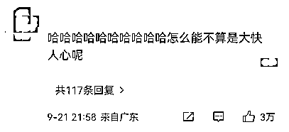
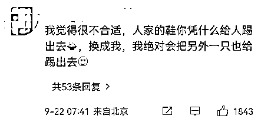
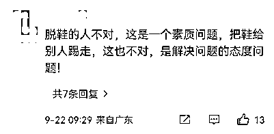

# 脱鞋占座，结果鞋子被踢走了

> 原文：[`mp.weixin.qq.com/s?__biz=MzIyMDYwMTk0Mw==&mid=2247544362&idx=5&sn=49b9f3ad1689635294b1385f62597f11&chksm=97cbe512a0bc6c044024983dc27df2edc5c1ecc09754052201cdb1f83bc288864f290748318e&scene=27#wechat_redirect`](http://mp.weixin.qq.com/s?__biz=MzIyMDYwMTk0Mw==&mid=2247544362&idx=5&sn=49b9f3ad1689635294b1385f62597f11&chksm=97cbe512a0bc6c044024983dc27df2edc5c1ecc09754052201cdb1f83bc288864f290748318e&scene=27#wechat_redirect)

**别在车上脱了鞋，** 

**还脱了社会公德心。**

9 月 21 日，网传沈阳一女子坐地铁时脱鞋占座，

同车另一女乘客气愤之余，

将女子一只鞋踢下了车。

[`mp.weixin.qq.com/mp/readtemplate?t=pages/video_player_tmpl&action=mpvideo&auto=0&vid=wxv_2587689009947230210`](https://mp.weixin.qq.com/mp/readtemplate?t=pages/video_player_tmpl&action=mpvideo&auto=0&vid=wxv_2587689009947230210)

网友普遍认为脱鞋女子的占座行为不对，

**但对同车乘客踢鞋下车的行为褒贬不一**。

**  解气！但小心行政处罚  **

网传视频显示，

在一处地铁车厢内，

**一女子脱了鞋躺在座椅上，**

**随后该女子起身发现地上只剩下一只鞋，**

她低头找鞋时说道：

“鞋呢？没有啊，谁这么损呢？完了！”

另外两段视频显示， 

一女子站在于洪广场地铁站的候车大厅，

边走边往前踢一只粉色的女鞋。

“看看，这就是坐地铁脱鞋占座的，

一个人占两个座，满车厢臭味。

**我把鞋给扔出去踢走，**

让你光脚走，让你长点记性。”

对此，9 月 22 日沈阳地铁客服表示，

正在介入调查，

**假如有这种不文明行为发现会制止，**

地铁广播有提醒文明乘车，

也会加强这方面管理，

为乘客营造好的乘车环境和体验。

有律师指出， 

**同车厢乘客扔鞋的行为，**

**虽然看着很解气，**

但如果因此引发争端，

扰乱了公共秩序，

**当事人双方可能会因违反治安管理被行政处罚。**

**  频频出现的“自由之脚”   **

尽管网友们对乘车不文明行为怨声载道，

但“自由之脚”仍在频频伸出。

近来，

在公共交通上脱鞋的事件屡上热搜。

9 月 17 日，在湖南怀化的公交车上，

一男乘客把双脚搭在前排座椅上，

前排旁边的男子先是提示该乘客多次，

后用手锤打其脚背， 

该乘客经过一番理论后，

才将脚放下。

[`mp.weixin.qq.com/mp/readtemplate?t=pages/video_player_tmpl&action=mpvideo&auto=0&vid=wxv_2587703231959678978`](https://mp.weixin.qq.com/mp/readtemplate?t=pages/video_player_tmpl&action=mpvideo&auto=0&vid=wxv_2587703231959678978)

“沟通无效”的情况时有发生。 

9 月 1 日，河北保定。

两男子在乘坐高铁时，

脱鞋并将脚搭在小桌板上。

前座乘客提醒并称被踢到了，

但两男子并未收敛。

[`mp.weixin.qq.com/mp/readtemplate?t=pages/video_player_tmpl&action=mpvideo&auto=0&vid=wxv_2587706077945937921`](https://mp.weixin.qq.com/mp/readtemplate?t=pages/video_player_tmpl&action=mpvideo&auto=0&vid=wxv_2587706077945937921)

9 月 15 日，浙江温州。

一女子乘坐高铁时

脱鞋将双脚搭在前排座椅靠背上，

还不停地摇晃。

前排旁边的乘客表示，

女子的脚搭得比头还高，

一直在头边晃来晃去，

感觉非常难受。

而且该女子坐在过道的位置，

乘客往来都需要从她脚边走。

[`mp.weixin.qq.com/mp/readtemplate?t=pages/video_player_tmpl&action=mpvideo&auto=0&vid=wxv_2587710979963240453`](https://mp.weixin.qq.com/mp/readtemplate?t=pages/video_player_tmpl&action=mpvideo&auto=0&vid=wxv_2587710979963240453)

**脱的不只是鞋**

有一双“不羁放纵爱自由”的脚， 

本无可厚非。

但公交、地铁、火车都是公共交通， 

**身处公共场所**

**就需要遵守相关规范和社会公德。**

在公共交通上脱鞋，

**脱的不只是鞋，**

**更是社会公德心。**

除了脱鞋、横躺占座，

在公共交通上大声喧哗、电子设备外放、

霸占扶手杆、踩踏座椅等

都是乘车不文明行为。

**不仅给其他乘客造成不便**

**同时也严重影响了城市文明形象。**

交通运输部表示，

如果乘客遇到

在火车上大声喧哗、强行换座，

在地铁上手机大声外放等不文明行为 

**可以向列车的运营管理人员进行反映，**

**并且要求制止。**

不听劝阻的，

由公安机关给予警告罚款。

**造成严重社会不良影响的**

**会纳入到铁路旅客信用信息记录。**

你遇见过哪些乘车不文明行为？ 

评论区说说↓↓ 

来源：央视网综合九派新闻，四川观察，环球时报，中国交通，中国青年网微信

欢迎关注灰产圈社群服务号

