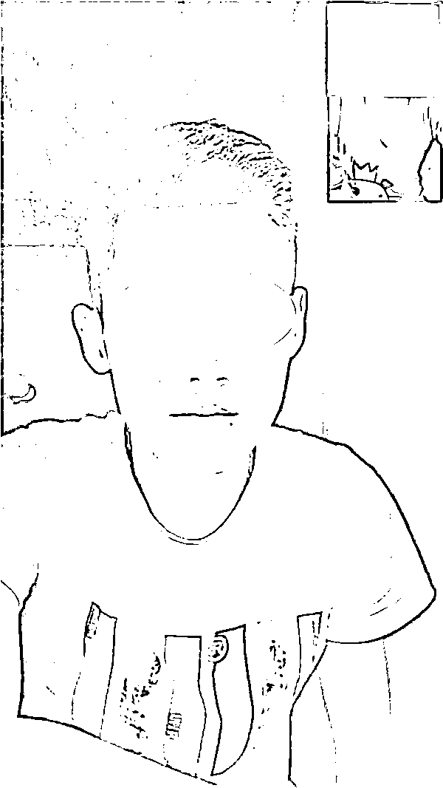
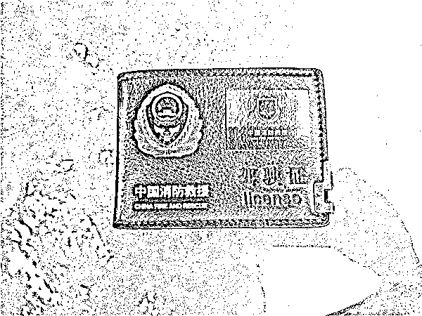
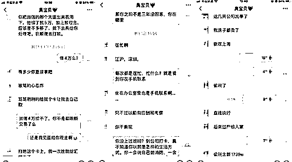
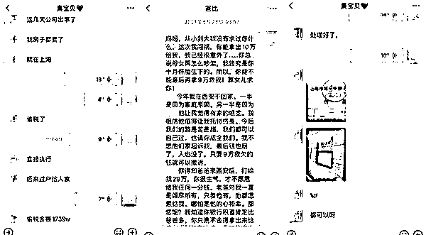
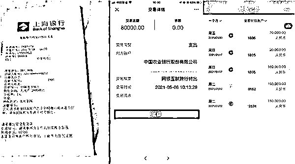
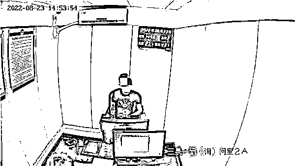

# 和“部队狙击手”“闪婚”后，她被 PUA 十九个月，骗走 150 万元

> 原文：[`mp.weixin.qq.com/s?__biz=MzIyMDYwMTk0Mw==&mid=2247544362&idx=8&sn=ec56270f928f5ddc85f0f305e9c7d89e&chksm=97cbe512a0bc6c04932ef383c907d514ead7c9fe9982a5893b4c41a2245fdccc6e51c10be95d&scene=27#wechat_redirect`](http://mp.weixin.qq.com/s?__biz=MzIyMDYwMTk0Mw==&mid=2247544362&idx=8&sn=ec56270f928f5ddc85f0f305e9c7d89e&chksm=97cbe512a0bc6c04932ef383c907d514ead7c9fe9982a5893b4c41a2245fdccc6e51c10be95d&scene=27#wechat_redirect)

从 2020 年 12 月到 2022 年 8 月，从在网游里相识相恋，到前往“丈夫”生活的城市、“领证”结婚步入“婚姻”殿堂，整整一年半的时间，竟是一场漫长的骗局。

近日，家住上海静安区的王女士在父母陪同下，向静安警方报案：结婚一年多的“军官丈夫”李某，竟是处心积虑的骗子。

图说：犯罪嫌疑人李某 警方供图（下同）

网游结“姻缘”

2020 年 12 月，王女士在网络游戏中结识自称正在休假中的部队“狙击手”军官李某，双方很快确认恋爱关系。

感情迅速升温后，李某以自己年龄大，家中父母催婚为由，向王女士提出“先结婚，后恋爱”的想法，并邀请王女士到他所住的城市登记“闪婚”。这恰好击中了王女士的心坎——大龄未婚的焦虑和突如其来的爱情，冲昏了王女士的头脑，她瞒着家人朋友，独自前往“男友”所在的城市“登记结婚”。

见面后，李某在当地民政局领了一张结婚登记单后，谎称已经完成登记结婚手续，只需补拍照片即可领证。后又以租来的民宿冒充婚房，和王女士开始了“婚后”生活。同居期间，李某特意在“婚房”内放了一些部队使用服装、配件，让王女士“无意中”发现，打消疑虑。

图说：伪造证件

婚后“PUA”

2021 年 1 月底，刚“结婚”尚处在蜜月期的王女士，突然收到“丈夫”李某的求救：部队有规定，要对军官家属进行审查，但自己两年前就被部队配了“军婚”，现在与王女士“登记领证”违反部队规定，轻则丢官追责，重则“夫妇”俩都要坐牢，这让王女士非常害怕。

眼看王女士“上钩”，李某话锋一转，表示自己认识负责审查的上级领导，可以花钱摆平此事，又以自己置办“婚房”手头没有积蓄为由，向王女士索要 15 万处理“军婚”事宜，王女士很快筹足钱款交于李某。

图说：聊天记录

同年 3 月，李某又谎称自己购买的一批价值 80 万元珠宝被海关查扣，急需花钱清关，并拿出一张仿制的某地法院裁决书，诱导王女士向家中父母借钱，最终骗取 47 万元。同月，李某又称自己参股的多家娱乐公司出现税务问题，多次问王女士要钱周转，为了维持“甜蜜婚姻”，王女士甚至在李某的教唆下通过各种网络平台贷款 30 余万，用于帮助“丈夫”开展“业务”，以致自己负债累累，连“结婚”大事都不敢跟家里人说。

惨痛的教训

独自在异乡生活了大半年，王女士心力憔悴，萌生结束“婚姻”的念头，没想到这也早被李某料到。

2021 年 9 月，李某用从王女士手中骗来的钱款，在老家为二人举办了“结婚典礼”，还主动将两人“结婚”的事透露给王女士父母，表示要在上海也办一场风光的“婚礼”，挽回了王女士的感情，为进一步榨干王女士一家财产埋下伏笔。

接下来近一年时间里，李某又以上海房产拍卖需要提交保证金、公司资金周转、打点生意伙伴等为由，陆续骗取王女士及其家人近 50 万元。

图说：转账记录

2022 年 8 月，王女士因急用钱给家中老人看病，希望李某出钱出力时，却被李某以各种理由推托，甚至以“部队任务”为由，跟“妻子”玩起了失踪，双方因此矛盾不断。

在家属朋友的反复提醒下，王女士终于冷静下来，通过多次试探，她发现“军官丈夫”所谓的参股公司都是空壳公司，所参与的业务也查无实据，连民政部门都查不到自己的“已婚”信息，王女士意识到自己被骗了。

8 月 22 日，王女士以给老人“探病”为由，将李某从苏州约至上海并报警，静安公安分局三泉路派出所接到王女士报案后，当场将嫌疑人李某抓获。此时，李某已累计骗取钱财 150 余万元用于还债和个人挥霍。

图说：犯罪嫌疑人李某已被警方依法刑事拘留

对于整整一年半与王女士的“婚姻生活”，李某坦言这些都是早已写好的“诈骗”剧本，此次答应王女士来沪探望老人，也是希望博得王女士一家好感，继续实施诈骗，直至掏空王女士一家财产。

目前，犯罪嫌疑人李某因涉嫌诈骗罪已被静安警方依法刑事拘留，案件正在进一步调查之中。

来源：九三反诈先锋，邯郸市反诈中心

欢迎关注灰产圈社群服务号

