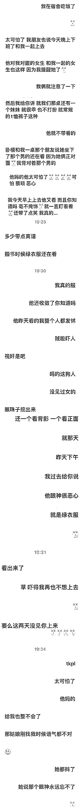
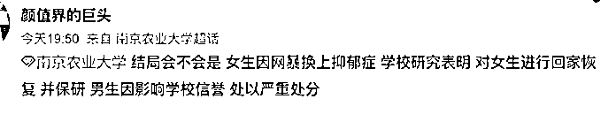

# 南农大图书馆“视奸”事件

> 原文：[`mp.weixin.qq.com/s?__biz=MzIyMDYwMTk0Mw==&mid=2247544477&idx=1&sn=021cc201ba5c229e50968691d4034f31&chksm=97cbe5a5a0bc6cb30269959df1abb8a496ee6814417cb0979336d7881d85af43590f5578a31c&scene=27#wechat_redirect`](http://mp.weixin.qq.com/s?__biz=MzIyMDYwMTk0Mw==&mid=2247544477&idx=1&sn=021cc201ba5c229e50968691d4034f31&chksm=97cbe5a5a0bc6cb30269959df1abb8a496ee6814417cb0979336d7881d85af43590f5578a31c&scene=27#wechat_redirect)

**#南京农业大学图书馆事件#**

最近这个话题在微博上引发了“性别对立”异议，导致网友们发生了激烈的对骂。

事情是这样的，一个女孩称，自己在图书馆里学习的时候，

**对面的男孩经常盯着自己的身体看，还带有不怀好意的奇怪表情。**

这让自己感觉到了强烈的不适和被骚扰感，

于是把他挂在了表白墙上，称要提醒众人小心这个人。

以下是具体内容： 

之后 9 号，女孩又写了一篇长作文详细描绘了这件事，发在了校园表白墙上。

后来 10 号，男生也写了长文回应该女生的所谓眼神骚扰事件，

并用华丽的词藻，解释了这件事顺便把女生揶揄了一番。

看完男生的长文回应，**微博上分成了很明显的两方：**

一方觉得男生的回应文采斐然，支持男生的回应，谴责两女生过度敏感；

另一部分人则认为男生的回应矫揉造作，阴阳怪气。

**“就算你被污蔑了，你道个歉不就完了么？”**

“正常人被误会不该觉得不好意思么？”

“退一万步说，你的视线经过了别人你自己难道不尴尬么？”

“退一万步讲，你道个歉又怎么了？”

关于此事的后续发展，网友也展开了猜想

大家整体看下来，有什么想法？

这件事儿尸哥就不说谁对谁错了，看看网友们的说法：

**@汪海林：**我知道的一位摄影师朋友，在酒吧玩，有个女孩迟到了，一进门，这个摄影师把她看了一眼，就那么一眼，女孩觉得已经被他猥亵侮辱完了。女孩心神不宁。一晚没说话。一年后，在大理，二人邂逅了，干柴烈火当晚就上床了。我说的是真事。

**@GigiBron：**我擦，这女孩和这男生真的是一个学校的吗？怎么感觉逻辑水平，文化素养不在一个水平。

**@非非有非非无 9：**男生文笔很好很有才华，至于女生如果觉得委屈可以调下监控看看，有些人确实很敏感，像我这种近视眼永远都不会发现有人盯我和我在无意识盯人，因为盯也看不清什么

无独有偶，

就在昨日，又一个类似的事情在某大学上演了。 

**起因是男生捡到了女生的校园卡想要归还，女孩却以为男生想要追她，并要求男生道歉......**

下面大家就一起看**地球公主 地球丫鬟 地球驸马爷，**这个老哥真的好会骂。

开头看着是个好人好事

男生捡到了那女孩子的学生卡

加了四遍还给人家

结果女生开头第一句话

**“烦不烦，我有男朋友了”**

说完不好意思，就把人家拉黑了

不懂就问 这是什么操作？？

而且这事儿还没完，公主的男朋友也找来了。

**“我女朋友因为你哭了，我希望你能给她道个歉”**

这？我已经傻了，看着像编的

但生活是最大的剧本？？

我怕误会这男的特意去看了第二遍，

但 感觉他就是认同捡饭卡的男生有错。

即使他知道自己女朋友四次没看加好友的消息，

他还硬说**“你能不能给她道个歉”**

她心情不好是你影响的，

所以你应该给她道歉，6 啊

这对情侣就真有挺有意思，以后估计还有大把机会上热搜。

哈哈哈哈哈哈

《不如买箱六个核桃吧》

能不能出点怼人教程

这两口子没一个正常的，麻了

本来以为到这已经很诡异了

新角色出场——

女生的室友也来了！

我想到有个网友说

她坐高铁，小孩子特别吵

怎么说都不听

她就骂了小孩子

结果小孩子奶奶过来骂她，她又把奶奶骂了

结果一会爷爷过来了

网友说她只好也把爷爷也骂了

不理解，这点屁事真的闹大了

这是什么玻璃心小公举？

之后有网友说是疑似珠海某大学

还有人说学校疑似让这男孩子道歉

不过疑本人出来认领

学校并没有让自己道歉

大家看个乐呵就好

之后就有更多网友

质疑这件事的真实性

这个帖一开始发在豆瓣，当时就被质疑 p 图

后来发帖人发现网友有眼睛删帖跑路

但很多微博 yxh 已经转发了…

就这个事情

如果是假的，那编帖子的人 

也是蛮无聊…

不过也有网友说，就算是假的 

也希望这男孩子可以开个课

教教大家《如何不带脏字的怼人》

但我寻思，可能不应该开班教骂人

应该在知乎开班教编故事…

来源：不惑先生

欢迎关注灰产圈社群服务号

