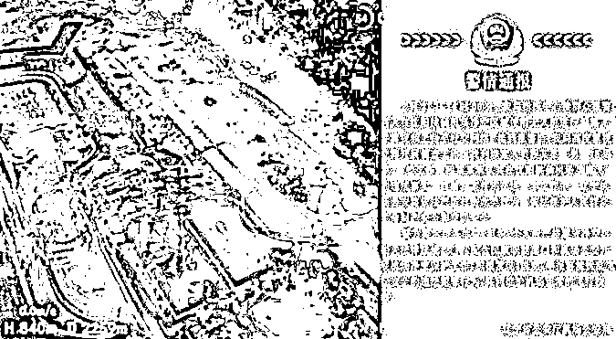

# 初中生迷晕侵犯女老师？聊天记录曝光犯罪计划，他们比你想象坏得多...

> 原文：[`mp.weixin.qq.com/s?__biz=MzIyMDYwMTk0Mw==&mid=2247544477&idx=2&sn=28b7cac6ca3371ce26755e3c2dd91385&chksm=97cbe5a5a0bc6cb3a78eeea4777d51c71f6f8734fbf8a9543edf64157fd7ffdfc98aa7aafee4&scene=27#wechat_redirect`](http://mp.weixin.qq.com/s?__biz=MzIyMDYwMTk0Mw==&mid=2247544477&idx=2&sn=28b7cac6ca3371ce26755e3c2dd91385&chksm=97cbe5a5a0bc6cb3a78eeea4777d51c71f6f8734fbf8a9543edf64157fd7ffdfc98aa7aafee4&scene=27#wechat_redirect)

# 

前几天，一个初中群的聊天记录火了。

光看聊天记录，就让人毛骨悚然。

几个男孩在群中明目张胆的讨论着一个惊人的计划：

“迷奸计划进行到哪一步了？”

迷奸女性，是非常恶劣违法犯罪行为。

**而说出这些话的，是几个十几岁的初中生，而他们口中实施的对象，是一位 30 多岁的女老师。**

是不是有点吓人？

但很多人看到这样的事情，不会觉得有多严重，而是会轻描淡写的说一句：

“初中生，也才十几岁，他们可能就是说着玩的，没必要放在心上。”

也是，都说童言无忌，这样可怕的事情几个孩子应该做不出来？

**但是，他们，真的只是说着玩吗？**

2 月 20 日，发生了一则新闻。

沈阳机场，一无人机进行黑飞，飞行高度 840m，最后被击落。

这件事后随后也被官方证实和通报。

黑飞，指的是没有飞行驾照、飞机没有合法身份、或者经未登记的飞行。

如此高的高度和复杂的环境，这种行为有多危险，可想而知。

**但更吓人的是，该事件的当事人，竟然只有 15 岁。**

该当事人为某视频平台用户，ID“飞行老行家”，15 岁，辍学在家，拥有粉丝 10 多万，长期黑飞无人机。

早在去年 7 月，他就遭到了批评告诫。

但他发布视频称“我太想出名了”，随后依旧我行我素。 

此次事件过后，引起众多讨论。

而男孩的回应是：

**“我现在小，未满 16 岁，只要不犯重罪，就进不去。** 

**我过两个月就满 16 岁了，看趁这个机会赶紧作，如果我满了 16 岁就不能黑飞和作死了。”**

因为未满 16 岁，所以不怕“进去”。

现在再不做，以后就没“机会”了。

孩子还小，所以真的什么都不懂吗？

并不是。

他们有些人是懂的，而且真的敢做。

又有多少未成年人抱着这样的想法呢？

最近有一段视频特别火。

视频的内容是一部电视剧。

某小区的楼顶，发现一具碎尸。

死者是一个 8 岁的小学生，被肢解后弃尸。

案发 8 小时后，13 岁的小白来到警局自首。

小白是单亲家庭，经常辍学，还患有精神分裂。

据他交代，案发当天被害的小学生向小白借手机，小白以手机需要充电为由把他带回了家。

在勒死小学生后，小白用登山斧肢解了尸体，丢弃在了小区的天台之上。

此案件一出，震惊社会。

**因为按照法律，未满 14 岁，凶手不需要负刑事责任。**

**就连老法官也说，最多只是让他在少年院里呆两年……**

更可怕的事，小白在法庭上面对法官的询问，也毫无丝毫的敬畏。

他一边复述着残忍的作案过程，一边哈哈大笑。

最后还补了一句：

**“我听说未满 14 岁的话，就算杀了人也不用入狱，那是真的吗？”**

**说完笑出了声，摸着头说“太爽了！”**

……

以上剧情，出自于最近热播的电视剧《少年法庭》。

故事看上去很猎奇，但回顾我们的新闻，却是现实中真实会发生的。

从湖南少年弑母，到 13 岁少年杀害 6 岁男童......

这样的新闻，时不时的就会出现。

**去年 3 月，我国就正式施行《刑法修正案（十一）》，把未成年人个别犯罪的刑事责任年龄降到了 12 岁。**

面对这样的调整，网络中不乏反对的声音。

而最多的，还是说他们都是孩子。

但孩子，真的都是“天真无邪”的吗？

但谁都是从小孩过来的，你仔细想想，儿时真的一点歪心思都没有？

早在国家施行《刑法修正案（十一）》前，罗翔就曾呼吁下调未成年人犯罪的刑事责任年龄：

随着社会的发展，以往的“14 岁未成年”和如今的早已经不同。

当我们界定“成年”的旧标准已经跟不上孩子成长的速度时，或许是该及时做出调整。

**那些隐藏在未成年人中潜在的犯罪因子，应该得到及时的遏制。**

**因为法律是用来保护未成年人的，而不保护罪犯。**

来源：吃瓜小正妹

欢迎关注灰产圈社群服务号

