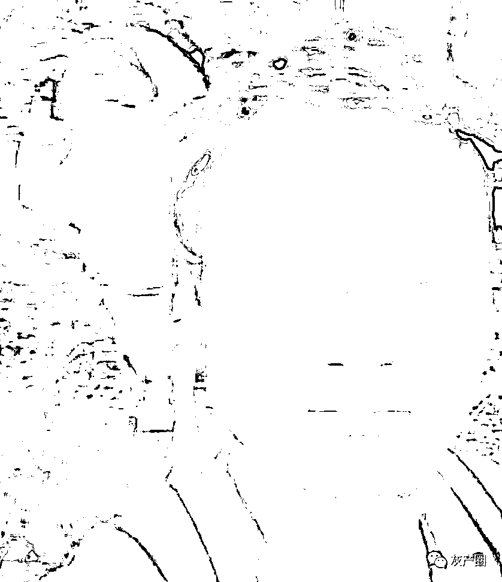
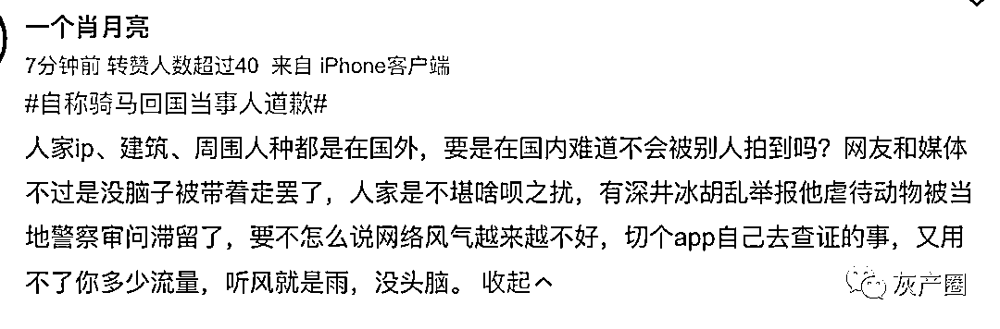
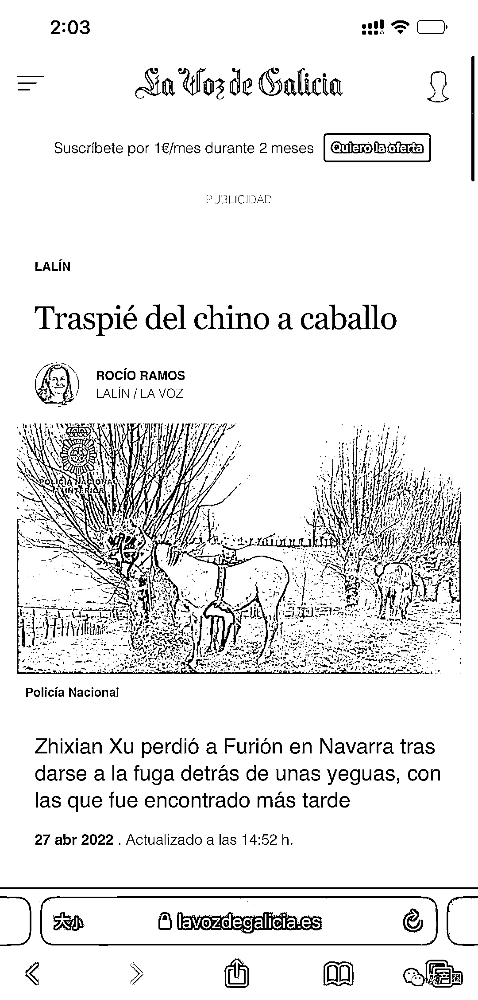
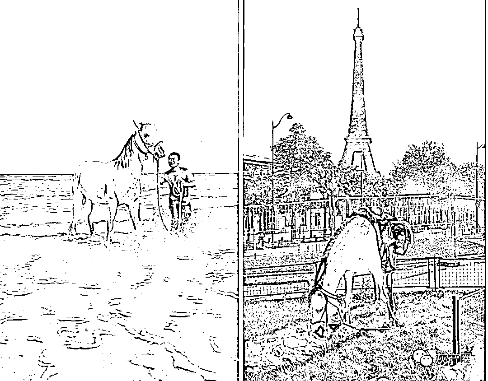
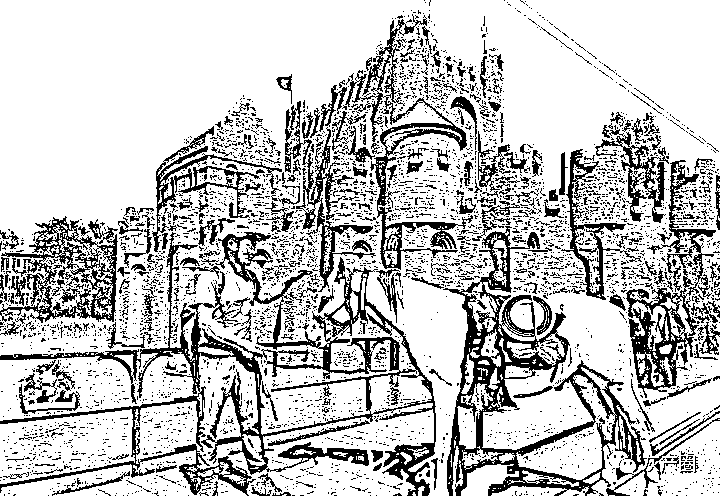
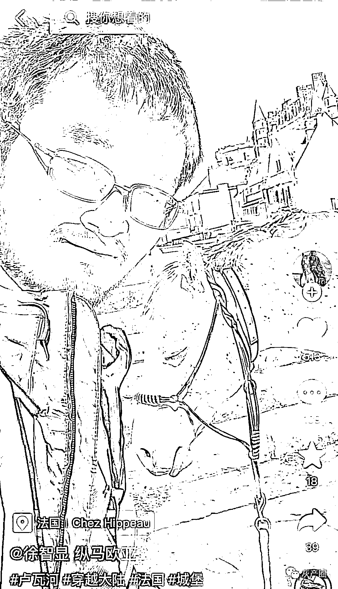
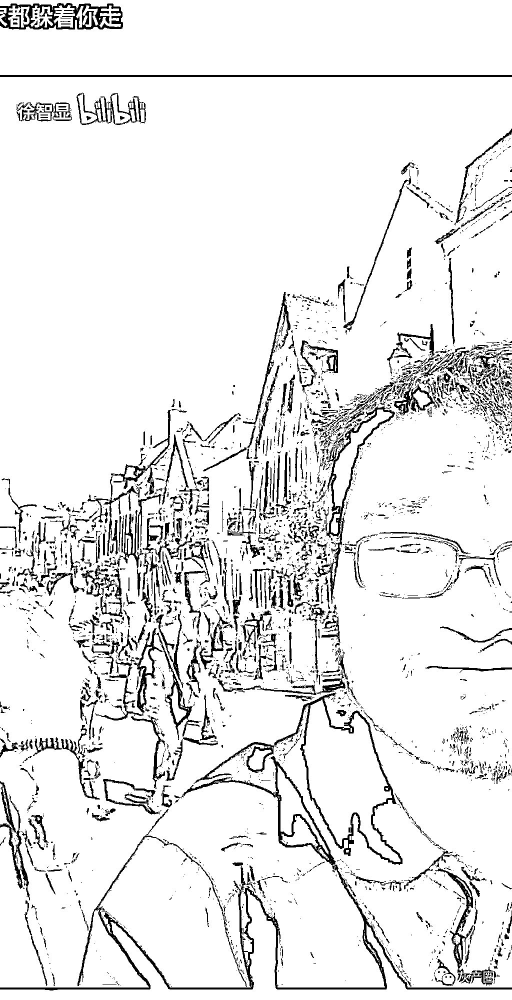
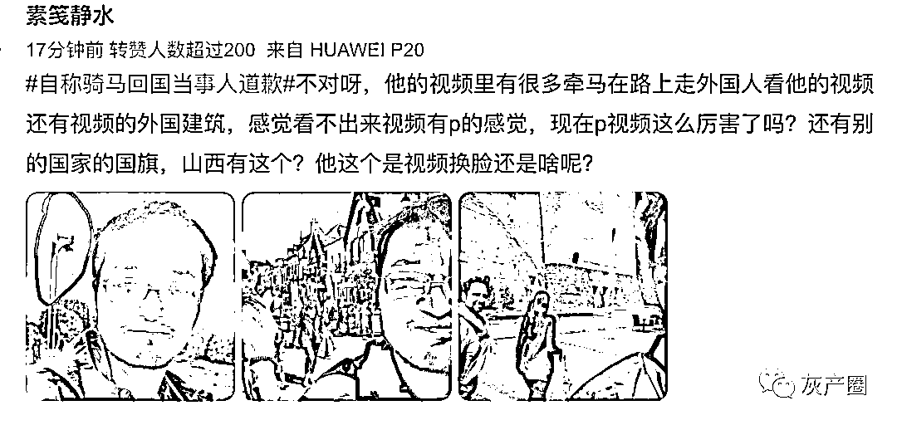
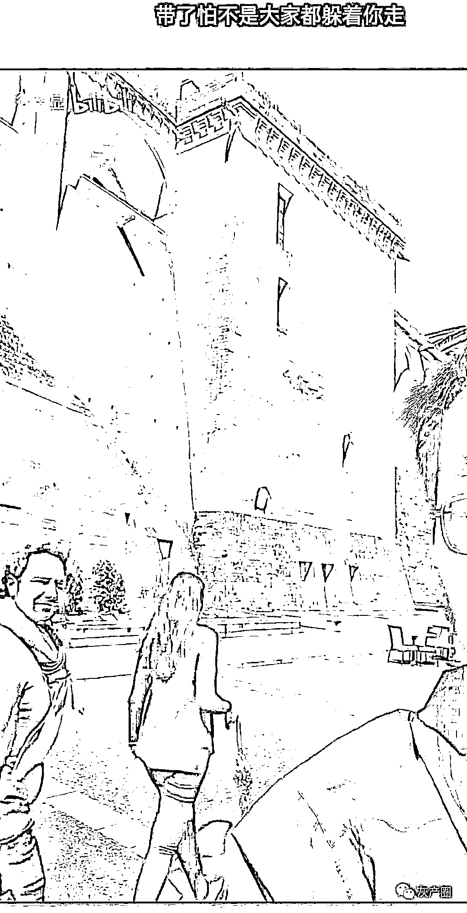
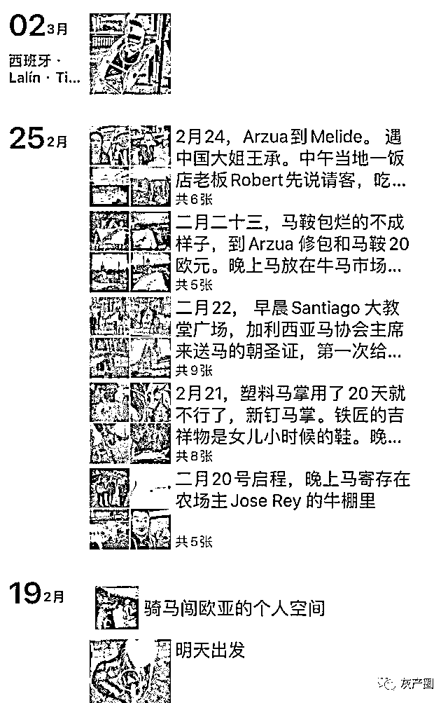

# 菏泽男子自称骑马从西班牙回国，自曝造假，网友怀疑：IP 确实在国外呀

> 原文：[`mp.weixin.qq.com/s?__biz=MzIyMDYwMTk0Mw==&mid=2247544477&idx=3&sn=3184f9ae5f7d340979e6f2832f01fbf9&chksm=97cbe5a5a0bc6cb3d8f242a2053521b357acc1530abaf45dbe7a83cb07efb1bcc160f8b5d5b6&scene=27#wechat_redirect`](http://mp.weixin.qq.com/s?__biz=MzIyMDYwMTk0Mw==&mid=2247544477&idx=3&sn=3184f9ae5f7d340979e6f2832f01fbf9&chksm=97cbe5a5a0bc6cb3d8f242a2053521b357acc1530abaf45dbe7a83cb07efb1bcc160f8b5d5b6&scene=27#wechat_redirect)

9 月，32 岁男子徐智显自称骑马从西班牙回国，在荷兰遭多人举报“虐待动物”，引发关注。

[`v.qq.com/iframe/preview.html?width=500&height=375&auto=0&vid=v3357doef91`](https://v.qq.com/iframe/preview.html?width=500&height=375&auto=0&vid=v3357doef91)

9 月 23 日，徐智显致电封面新闻记者，“我现在人在山西，没有在荷兰，从欧洲骑马回国是假的，我要道歉！”徐智显拒不透露具体在山西何处，称怕被网暴。但记者找到了疑似徐智显的个人小号，从 2018 年 1 月便开始分享在欧洲的生活，其中不乏自己出镜的照片。

[`v.qq.com/iframe/preview.html?width=500&height=375&auto=0&vid=s3357s2kcvg`](https://v.qq.com/iframe/preview.html?width=500&height=375&auto=0&vid=s3357s2kcvg)

如今当事人承认造假并道歉，让人大跌眼镜。短短几个月，这个小伙子吸引了 10 多万粉丝围观，现在突然宣告道歉，并称自己并没有从中收取大家的任何钱财，只是玩大了有点收不了场。私下朋友说说可以当玩笑，可发到网上就是愚弄公众，不能说开玩笑了。虽然当事人“辟谣了”，但是有些网友觉得，当事人的“辟谣”是假的 西班牙当地报纸还对他进行了报道网友从他之前所发的内容中，发现他确实是在国外 到底是小伙的造假手法太专业？ 

还是小伙又骗了媒体一次？

来源:微博那些事儿

欢迎关注灰产圈社群服务号

