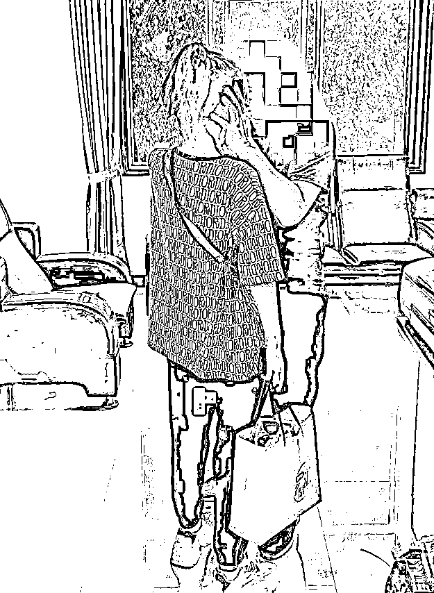

# 采访：身陷缅甸诈骗组织获救后的女孩

> 原文：[`mp.weixin.qq.com/s?__biz=MzIyMDYwMTk0Mw==&mid=2247544477&idx=5&sn=c333567fd0b49febb1f24b5b8760b34e&chksm=97cbe5a5a0bc6cb3830ea814d8e95bb7aa79271a5bcd5379c86dbcc0ad88c04f6fb468de440a&scene=27#wechat_redirect`](http://mp.weixin.qq.com/s?__biz=MzIyMDYwMTk0Mw==&mid=2247544477&idx=5&sn=c333567fd0b49febb1f24b5b8760b34e&chksm=97cbe5a5a0bc6cb3830ea814d8e95bb7aa79271a5bcd5379c86dbcc0ad88c04f6fb468de440a&scene=27#wechat_redirect)

橙橙获救后与爸爸在一起（资料图片）

呼和浩特市警方在得知土左旗一女孩身陷缅甸诈骗组织无法脱身的情况后，迅速联合缅甸警方展开了一场惊心动魄的跨国营救行动，最终将女孩成功解救回国。那么，这名女孩是如何被骗到了缅甸？身陷诈骗组织期间遭遇了什么？整个营救过程又经历了哪些惊险的场面？9 月 17 日，记者带着诸多疑问，对获救女孩橙橙（化名）进行了一次独家专访。

**被“恋人”骗到缅甸**

**记者：你今年多大？家住哪里？**

**橙橙：**我今年二十多岁，家住呼和浩特市土左旗白庙子镇。

**记者：你是怎么被骗到缅甸的？**

**橙橙：**很早之前，我认识了一个男的，具体怎么认识的也记不清了。2021 年春节前，这个男的突然联系我，后来约我去 KTV 唱歌，还领来张五（化名）等多个朋友。一个多月后，我和张五就确定了恋爱关系。接下来，张五等人就陆续去了云南。在云南期间，张五等人不断给我发来视频和图片，还邀请我过去玩几天。2021 年春节过后，我就去了云南。

**记者：到了云南之后呢？**

**橙橙：**在云南玩了几天后，和张五等人在一起的一个福建人声称他朋友在云南承包了一家大型 KTV，正好缺个管理人员，月薪一万五千元，还有提成，我就动了心。过了一段时间，我跟随张五和那个福建人去了临沧市的一处小山村。在村里吃完饭，张五和福建人说，还得在半夜的时候走十几分钟的山路，然后就有车来接了。

**记者：你当时没有想到这是要偷渡吗？**

**橙橙：**我当时还没想那么多。当天夜里，有一辆车来到村子里，车上已经坐了十多个陌生人。这辆车开到深山里，就让我们下了车。下车后，张五就拉着我跟着那伙人一路狂奔。奔跑了不一会儿，我就崴了脚。可他们不管这些，继续拉着我狂奔。这时候，我就感觉有点不对劲儿了，当我提出质疑时，张五和福建人立马变了脸，还威胁说要把我一个人扔在山里。就这样，我们深夜在山里从 2 点走到早上 9 点，才到了一个他们叫“老垓”的地方。

**记者：这时候你们应该是已经偷渡到缅甸境内了吧？**

**橙橙：**是的。但当时我还不敢确定。在老垓，司机拉着我们到处转，最初就住在车里，后来又在村民家租住了七八天。接下来，我们就被拉到了一家公司，张五和福建人声称 KTV 至少也要十天半个月才能装修完，让我必须先在这家公司干几天。

**身陷诈骗组织 危机四伏**

**记者：这家公司具体做一些什么业务？**

**橙橙：**就是搞电信诈骗的，我们上班就是刷单打电话。我在这家公司干了两个多月，又跟着张五他们去了第二家公司，这家公司是在一个很大的园区里。

**记者：第二家公司也是搞电信诈骗吗？**

**橙橙：**一样的。又过了一段时间，我跟张五大吵了一架，再也不去上班。后来，公司老板说，你在公司吃住好几个月了，啥业绩也没做出来，吃喝住宿、路费什么的都是公司花的钱。现在要想回家，就先拿 20 多万元给公司。有一天下午，我正在宿舍里躺着，公司突然来人，声称我被检测出了双阳性，需要隔离。可一走进隔离的宿舍就发现，有个女人被手铐铐在床上，我一下子就懵了。那个女的问我犯了什么错，我告知被检测出了双阳性，那女的冷笑着说‘你还信他们啊’，这里的人都是犯了事儿进来被关禁闭的。这时候，我才注意到这栋楼门口还站着三个持枪的缅甸大汉。

**记者：你没有被铐起来吗？**

**橙橙：**倒是没有给我戴手铐。被关了几天之后，福建人就把我叫到办公室骂我，还威胁说要把我给卖了。我也怕他们真把我给卖了，因为在这里有很多女的已经被卖了。后来，我自己冷静下来，只好答应他们继续上班好好干。

**营救过程险象环生**

**记者：这时候，一定很绝望吧？**

**橙橙：**是的，特别绝望。那段时间，我每天都是第一个去上班，然后晚上最晚一个回来。每隔一段时间，公司都会把手机拿过来，让我们在他们的监视下给家里打个电话。大概是在 2021 年 11 月底的时候，我和爸爸通话时，趁着他们不注意，就告诉爸爸说我被骗了，他们这些人都是诈骗犯，家里得赶快想办法救我回家。接下来，我又好好工作了 20 多天，又找机会用微信给爸爸发文字，大概说了一下我是被谁骗过来的，现在缅甸，然后又给他发了个位置。第二天，我爸爸就去土左旗公安局报了案。

**记者：接下来的等待过程肯定特别煎熬，是吧？**

**橙橙：**知道爸爸报警之后，我每天心惊胆战的。这时候，我感觉到自己必须弄个手机，否则家里根本没办法救我。又过了一段时间，在我即将过生日的时候，我说服张五，让他帮我从外面偷偷买来了一部手机。宿舍里的 5 个姐妹也都偷着用这个手机，所以她们也都帮我保守这个秘密。

**记者：是在什么时候你就知道呼和浩特这边的警方已经开始采取行动了呢？**

**橙橙：**大概是今年六月底的时候吧，爸爸给我发来语音说‘呼和浩特这边的警察到云南了。’可过了一段时间，爸爸又发来信息说‘警察又回去了’。这时候，我感觉自己一辈子都回不去了，特别绝望。

**记者：毕竟是跨国营救，警方也需要一个过程。**

**橙橙：**后来又听爸爸说，呼和浩特警方联系了云南那边的警方，云南警方又去找缅甸那边的警察。然后，缅甸的警察就去公司指名道姓要我这个人了。警察走后，张五把我领到了老板办公室，老板就直接问我犯什么事儿了，我说不出来，老板就拿出了我给爸爸拍的照片。这时候我就知道露馅了，就一直哭不说话。老板就问我，咋这么想不开了，为啥要报警。

**记者：这时候，你肯定是特别害怕？**

**橙橙：**当时想万一他们把我就地杀了怎么办？接下来，老板就让我用手机打开免提给爸爸打电话，让我爸撤案。爸爸当时没反应过来就答应撤案了，可当天晚上就反应过来了。后来，他们又让我给爸爸打电话时，爸爸说案子可以撤，但我女儿本人必须回来签个字。

**记者：那最终你又是怎么被接出来的呢？**

**橙橙：**又过了一段时间，张五突然对我说，明天就有人来接你回家了。我不敢相信他的话，就哭着说既然要回家了，我连个手机也没有，怎么和家里人联系，怎么订飞机票。张五就给我买了个旧手机。第二天，确实有人来接我了，可跟着那个人坐车出去之后，在外面转了半天又把我送回公司了。我在宿舍里又等了三天，终于又有人来接我了。这次，在缅甸这边把我隔离了几天后，又被送到了中国境内，又做核酸隔离了 10 天之后，我就和爸爸以及呼和浩特这边的警察见面了。8 月 5 日，我和爸爸坐飞机从云南飞回了呼和浩特。直到现在，我都感觉像是在做梦一样。如果呼和浩特警方和云南警方不去解救，我估计这辈子也回不来了。

来源：博度内比都

欢迎关注灰产圈社群服务号

