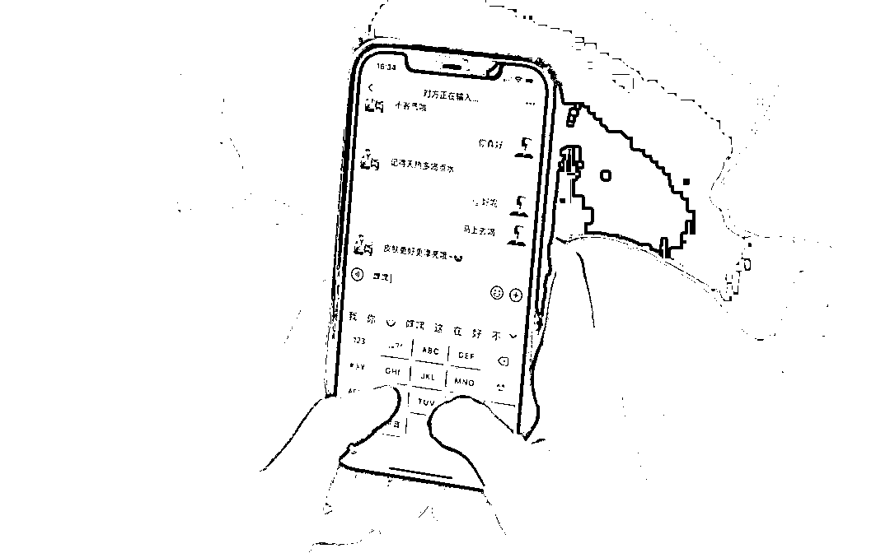
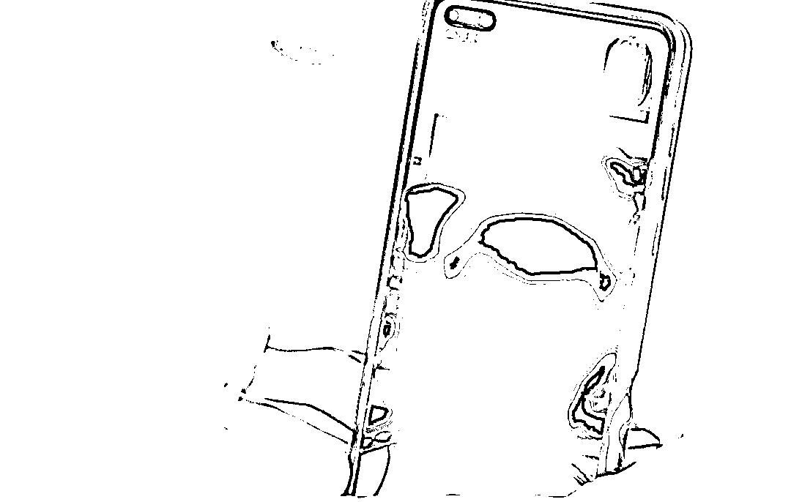
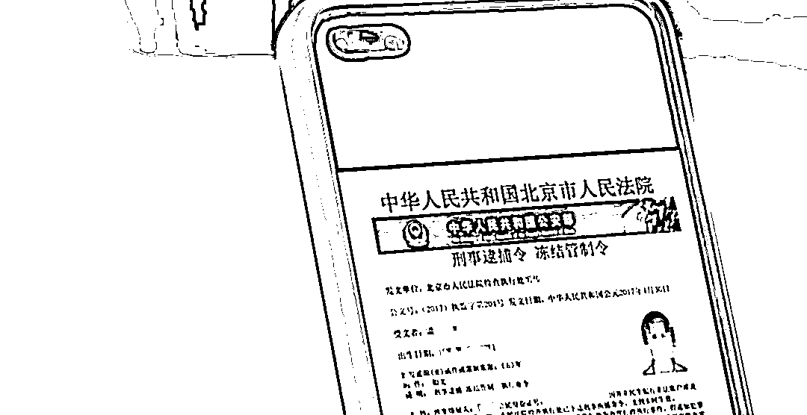
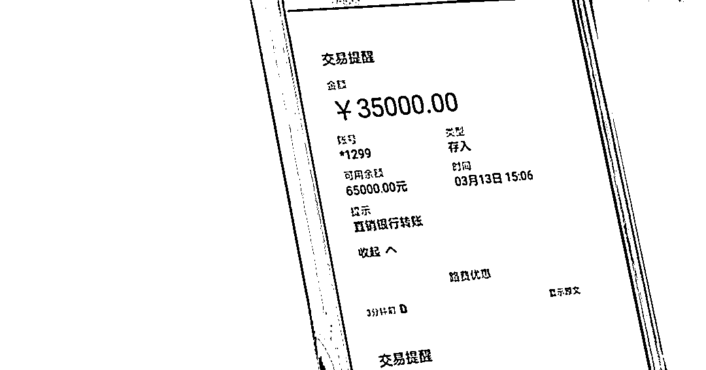
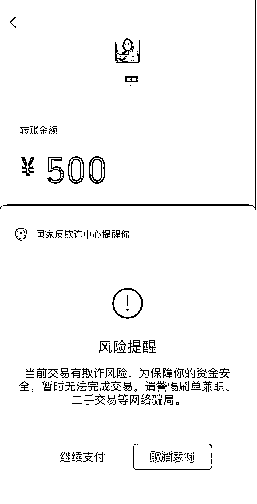
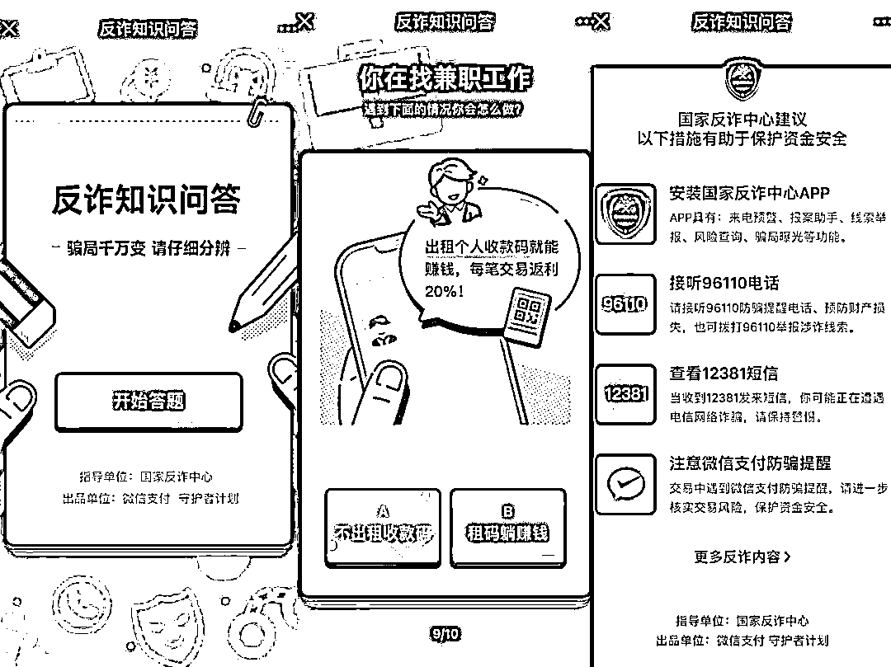

# 诈骗局中局：被骗几十万，他们为何成为局中人？小编：全民反诈，没你还真的不行！

> 原文：[`mp.weixin.qq.com/s?__biz=MzIyMDYwMTk0Mw==&mid=2247544477&idx=6&sn=d4ab7cfe62ff2a212ebc949f1e269239&chksm=97cbe5a5a0bc6cb3af90067bb5fb0343ca98d758dfca7cca88a9b855f98e9ee3063fd880654b&scene=27#wechat_redirect`](http://mp.weixin.qq.com/s?__biz=MzIyMDYwMTk0Mw==&mid=2247544477&idx=6&sn=d4ab7cfe62ff2a212ebc949f1e269239&chksm=97cbe5a5a0bc6cb3af90067bb5fb0343ca98d758dfca7cca88a9b855f98e9ee3063fd880654b&scene=27#wechat_redirect)

“他每天嘘寒问暖，问我有没有吃东西、饿不饿，天气冷了让我多穿衣服，下雨了有没有带伞，特别贴心。”倩倩说，从来没有一个人像他这样关心我。
遗憾的是，这并不是倩倩对甜蜜恋人的回忆，而是一个被诈骗 80 多万人民币的受害者对犯罪分子的控诉。**没有结果的等待**男子叫陈辉，是倩倩在网上认识的。在疫情阻隔的生活状态里，陈辉的“暖男”人设让倩倩迅速“上头” ，两人隔着网线聊得火热。对着屏幕，倩倩向对面那个人敞开心扉，陷入热恋。

如果是正常恋爱，这个故事可能会有一个不错的结局。可惜，这名男子的出现以及刻意交往只是一场针对倩倩精心设计的骗局，所有的嘘寒问暖只为获取她的信任感，以便实施下一步计划。一次，陈辉很兴奋地对倩倩说，领导给了他一个投资增值名额，收益很可观，但属于违规操作，本来想用自己舅舅的名义申请，但觉得亲属关系太近可能被查到，所以想借用倩倩的名义来申请。陷入热恋的倩倩二话没说就把自己的身份证照片发过去，帮陈辉完成了注册。经陈辉怂恿，倩倩认为投资机会难得，就先试着投了 1 万美元（平台以美元计算），又帮陈辉凑了 4 万美元作为本金。当账户收益增长到 200 多万时，倩倩觉得应该“见好就收”，跟陈辉商量先收回本金，陈辉表示赞成。只是，诈骗团伙又怎么会放过倩倩？在事情败露前，他们还要薅一把羊毛。平台客服对倩倩说，抽回本金需要先缴纳 9.3%的税金。倩倩很奇怪，直接从盈利部分扣除不就行了吗？对方回复，必须先缴纳税金。

当时，倩倩满脑子想的是怎么拿回这 200 多万的收益。9.3%相当于 19 万美金，她实在拿不出来。陈辉看倩倩犯难，生怕她放弃，假意关心说，朋友过两天能借他 5 万美元，他在郑州还有一套房产，拿去抵押给高利贷，可以凑差不多 6 万美元。这样就把倩倩的“压力”减轻到 8 万美元。于是，倩倩抓住“机会”，找朋友和闺蜜帮忙套现信用卡，又去银行借了短期贷款，终于凑齐了剩下的 8 万美元。准备汇款时，倩倩接到了银行工作人员的电话，表示她的账户最近和香港有交易往来，需要出示证明是用来干什么的。可惜的是，倩倩没有抓住这棵最后的“救命稻草”。她拿不出证明，又想办法通过其他办法把钱汇了过去。当倩倩满心欢喜等着拿到可观收益时，陈辉突然打来电话，说他被同事出卖了，必须接受调查，让倩倩删掉两人之前所有的聊天记录，并让倩倩等他回来，回来之后就和她结婚。民警陈奕华分析，删除聊天记录其实是为了毁灭证据。倩倩说，“我以为他真是被调查，就一直傻傻等着他。”只是，这场等待，注定是一个苦涩的结果，陈辉再也没出现。前前后后，倩倩在这场以恋爱为名的骗局里共投入了 13 万美元，折合 80 多万人民币。除了资金受损，倩倩渴望爱情的一颗心也变得支离破碎。“不仅骗钱，还骗感情，杀人诛心就是‘杀猪盘’的可怕之处。” 陈奕华表示，“杀猪盘”就是利用人们对情感的需求，让受害者产生情感依赖。事实上，和受害者的聊天就是一套培养感情的剧本，由诈骗团伙十几个人来操盘，以包装出“完美恋人”的人设。通过聊天，诈骗分子不停收集受害者的个人信息和爱好，为“定制化”诈骗做准备。“所谓定制化诈骗，骗子所谋求的自然要比其他的爱情骗局要多，他们一般都会把受害者骗的倾家荡产。这个骗局之所以叫‘杀猪盘’，也是因为它比其他的骗局时间要长得多，短则几个月，长则几年。” 陈奕华说，骗子把受害者称为“猪”，整个诈骗过程就会像养猪一样，先养肥，让你相信他，然后再‘杀掉’，也就是骗走你的钱。”根据各地警方披露的情况以及媒体公开报道，“杀猪盘”诈骗金额数以亿计，受害者众多。在社交平台和媒体披露的信息中，受害者被自己的“爱人”算计，在蒙受巨额财产损失之余，他们的人生也就此改写。“早晚的嘘寒问暖其实就只为了你的巨款，凡是网络交友让你投资或转账汇款的，其实都是诈骗。” 陈奕华郑重提醒到，不听、不信、不转账，有事就找警察帮忙。**屏幕对面的“高端”骗局**据公安部通报，2021 年全国共破获电信网络诈骗案件 39.4 万起，抓获犯罪嫌疑人 63.4 万名，同比分别上升 28.5%和 76.6%。目前，电信诈骗犯罪手法已超 48 类 300 种，贷款、刷单、杀猪盘、冒充客服四类高发网络诈骗案件发案占 70％以上。随着新技术、新应用和新业态的出现，新的诈骗手法也应运而生。并且不断演变升级，小婷近日就不幸经历了一个“高端”骗局：仿冒公检法。当时，小婷接到了一个自称是深圳公安机关的电话，“我没做过违法的事情，第一反应是骗子，就挂了。”没想到，对方不停拨过来，不胜其烦的小婷接听后，话筒里是一个严厉的声音，“你知不知道刚才挂断公安机关的电话是阻碍司法程序，会承担相应的法律责任的。”一个大帽子扣下来把小婷整“懵”了，“我就有点害怕，说会配合调查。”对方和小婷核对了姓名、身份证号、家庭住址等信息后，询问小婷是否从越南乘机抵达过南京，护照有被人冒用的嫌疑，需要配合警方协助调查。在一连串信息的连番“轰炸”下，小婷内心已经认定，对方是正在执行公务的公安机关。“这其实是一个冒充公检法比较传统的套路。骗子一般会先说，你的身份信息涉嫌违法犯罪，然后再利用公安机关或者检察院这种国家权力机关来对你形成威慑，让你产生恐慌，从而让你相信他说的这个信息。” 深圳市公安局民警朱启亮说。一位自称姓张的民警接待了小婷，还报出了自己的警号，指示小婷在一个安静的地方配合他办案和问询，并开启视频通话。隔着屏幕，小婷看到对面是公安局的办公场景，还有其他警察在后面走来走去。“所以我当时就完全相信了，他肯定就是公安。”小婷回忆。

朱启亮分析，其实受害人看到的这些都是骗子为了让她完全相信而布置的场景。实际上她看到的那个办公场所肯定是假的，是他们通过搭建的方式，带上“公安”的字样，还有那几个穿着警服的人员，实际上都是群演。”不得不说，诈骗团伙十分“敬业”，为了实施这场骗局下了血本。只是，屏幕对面的“民警”那边网络状况不太好，几秒钟后就有些卡。对方向小婷解释，公安的办公网不是特别稳定，就先把摄像头关了，但小婷还得全程开启摄像头，配合做笔录。事后分析，这完全是诈骗分子怕视频里耽搁时间太久露出马脚，所以借口关掉视频。基于小婷先入为主的判断，她积极配合“民警”问询，一张大网悄然向她罩来。对方表示，查到她名下有一张银行卡涉嫌帮犯罪集团洗钱，并发来一个显示为“最高人民检察院”的网站，让小婷在网页搜索框里查询自己的姓名和身份证号。

“我一输入之后，就看到一张‘逮捕令’，那上面就是我的姓名、身份证号、犯罪行为什么的，当时我真的慌了。”看到眼前的一幕，小婷方寸大乱，“我问怎么样才能取消这个‘逮捕令’，‘张警官’说我受过高等教育，肯定不会知法犯法的，配合他做一些调查，证明我名下所有的资产是正规、清白的，就可以洗清嫌疑了。”“一旦你心里慌了，你就没有心思去辨别他说的话是不是真的，而且你还会把希望寄托在这个假公安上，让他去帮你证明你的清白。”朱启亮指出，那个检察院的网址实际上是骗子专门制作的假网站，在上面查的任何信息实际上都是提前设置好的。接着，对方指示小婷把名下的存款、理财都打到一张银行卡里，并表示这个过程需要打开共享屏幕，在他的“监督”下完成。小婷如实操作，把近 15 万元转入银行卡，并根据提示填写资金清查申请。

操作结束，对方向小婷表示，银监会将在 3 个小时之内清查资产，如果没有问题，小婷就是清白的。至此，“问询”结束，一张大网也就此收尾。当小婷心神不宁地等了一个多小时后登陆网银查看时，才发现账户里的钱已被一卷而空，然而为时已晚。事实上，当小婷开启共享屏幕操作网银时，银行卡的账号密码就已经落入诈骗分子之手。

在这场冒充公检法的骗局里，诈骗团伙使用心理震慑、网页制作和互联网相关技术手段，借助公检法部门的权威性，完成了对受害人的”致命一击”。朱启亮提示，公安机关针对犯罪嫌疑人，不会通过电话或者网络的方式来办案。陌生人发送的任何链接和网页，都不应该去点击。当然，最关键的还是保持镇定，遇到诈骗时及时联系公安机关，毕竟，诈骗类型和作案手法层出不穷，我们必须提高警惕。**愿天下无“诈”**从 2002 年前后流行的 “脑溢血”、“车祸”骗术，到 2010 年前随处可见的“重金求子”街头广告，再到以“杀猪盘”、冒充公检法、虚假投资理财等为代表的定制化骗局大行其道，打击电信诈骗、网络诈骗已经成为一个综合性的社会治理难题。这其中，网络诈骗占到电信诈骗的 80%以上，网络成为反诈宣传的主战场。此前，国家反诈中心负责人曾举例称，银行账户和手机卡实名不实人是滋生电信网络诈骗犯罪的根源性问题；一些企业的风控不到位，重经济利益轻社会责任，网络空间乱象丛生，成为滋生犯罪分子的温床。如今，“人手一款”的国家反诈中心 APP 被不同年龄和职业的用户所熟知。据悉，国家反诈中心平均每天会发布 11 万条预警指令，2021 年成功避免了 2891.5 万名群众上当受骗。除了国家反诈中心 APP，部分企业和平台相关的反诈工具也一并树起了全民反诈的“防火墙”，如云闪付 APP“一键查卡”、“微信支付风险预警”等利器，如今都活跃在发诈一线。

其中，“微信支付风险预警”涵盖高风险交易拦截、防骗客服提醒功能、转账冷静期等功能，后台风控如果发现用户在支付过程中遇到风险交易，支付界面便会弹出“接听提醒”按钮，同时提供实时在线客服，协助用户判断当前交易风险并进行预警，进而保护用户财产安全。

此外，一些办案民警称，针对受害者的宣传劝阻比打击犯罪还要难。因此，除了打击和防范诈骗团伙做案，针对公众“未雨绸缪”式的普法教育也必不可少，全民反诈势在必行。在国家反诈中心的指导下，包括微信支付、腾讯守护者计划、微信安全中心、QQ、腾讯手机管家等在内的腾讯多个部门联合开展了“反诈在行动”系列宣传活动。

活动以互动答题、创意展览、公益海报等多重形式，“寓教于乐”地提醒民众关注身边的风险，强化用户自身的安全防范素养，希望通过不断的科普和警示，唤起并提升全民反诈的意识。这是一场持久战，需要全民参与。倩倩、小婷，以及无数诈骗受害者，都在期待天下无“诈”。（应受访者要求，文中均为化名）

来源：大 R 说安全

欢迎关注灰产圈社群服务号

