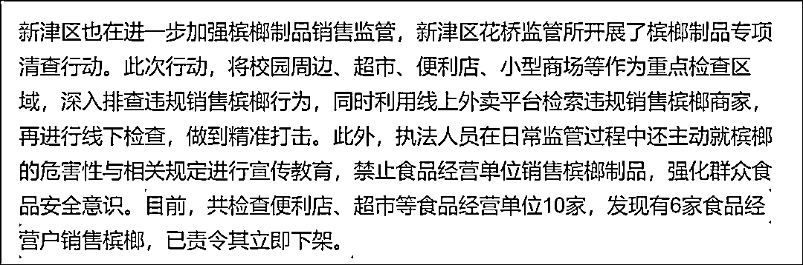

# 槟榔早就该管了

> 原文：[`mp.weixin.qq.com/s?__biz=MzIyMDYwMTk0Mw==&mid=2247544477&idx=7&sn=ad0dba320eec38281f0ac1d1954ca38a&chksm=97cbe5a5a0bc6cb3d34bb27399d7cb93ca1d3eb75c8c8d9a377e7221aa0b05f1e086c825bf27&scene=27#wechat_redirect`](http://mp.weixin.qq.com/s?__biz=MzIyMDYwMTk0Mw==&mid=2247544477&idx=7&sn=ad0dba320eec38281f0ac1d1954ca38a&chksm=97cbe5a5a0bc6cb3d34bb27399d7cb93ca1d3eb75c8c8d9a377e7221aa0b05f1e086c825bf27&scene=27#wechat_redirect)

最近，关于禁止槟榔的政策一次次登上热搜。 

“浙江义乌要求商家下架槟榔”新闻出来后，很多人喜出望外。

实际上，义乌是要求槟榔不得按照食品来销售，没有说所有商家不能卖槟榔，而是槟榔不能跟食品混一起卖。

四川营山的情况也差不多，当地没有要求永久下架槟榔，而是不能把它当食品了。

还有成都新津区的做法。

江西南昌市的做法。 

**都是指限制销售。**

**“限制销售”与“全面禁售槟榔”的意思差别蛮大的。**

除此之外，四川很多地方也注重保护未成年群体的身体健康，严禁向未成年人销售槟榔。

凡此种种，强调了一个意思：**食品店不得销售槟榔制品。**

陕西省市场监督管理局也解释过： 

虽然并不是所有商店都禁售槟榔了，但在食品店里下架槟榔，说明现在确实在管控槟榔了。

力度很明显了。

**01**

为啥要管槟榔呢？

因为它对人身体有害，还不是一般地有害。

**它致癌。**

> 一方面，槟榔纤维粗糙，长期嚼槟榔会造成口腔粘膜和牙齿的损伤。这属于物理破坏。

> 另一方面，槟榔中含有多种化合物，包括槟榔碱，是明确致癌的化合物。这属于化学破坏。

“物理破坏+化学破坏”的双重作用导致对口腔的持续摧残，使得口腔粘膜持续损伤，这是一个非常普遍的致癌风险。

这在数据上也一直得到证实。

2016 年，长沙五所医院收治了 2108 例口腔癌患者，其中 1803 例是嚼槟榔所致，占比 85.53%。

2018 年，中华口腔医学会和中国疾控中心调研发现，中南大学湘雅医院口腔颌面外科病房内，患口腔癌的 45 人中 44 人有长期大量咀嚼槟榔史。

“10 个口腔癌，9 个嚼槟榔”的俗语就是这么产生的。

**槟榔于是也被叫恶魔果实。**

当然，槟榔爱好者还会把恶魔果实玩出了可怕的花样来。

他们又抽烟又喝酒又嚼槟榔，试图从中获得多倍“快乐”，结果就是口腔癌的发病概率较普通人高 123 倍。

**数据资料还有很多，都说明长期咀嚼槟榔，非常易得口腔癌。** 

为此，国内国外专业组织多次指出槟榔的危害性。 

> 2003 年国际癌症研究机构（IARC）确定槟榔是一类致癌物。
> 
> 2013 年世界卫生组织认定槟榔为一级致癌物。
> 
> 2017 年，原国家食药监总局将槟榔果列为一级致癌物。

**而槟榔带来的口腔癌，是一种恶性肿瘤，患者的结局会像之前热议的文章《槟榔王国中的“割脸人”》描述过的：**

> **“他们被割掉舌头，他们被切去牙床，狰狞的手术伤疤撕裂了他们的脸庞，癌变的噩耗宣布着他们的死亡……**
> 
> **他们曾经都是槟榔的痴迷者，是那颗黑色的果子，将他们带入了病魔的深渊。”**

**各种凄惨无比的画面，我就不多放了。** 

****

**值得注意的是，得了口腔癌后，如果不做手术，有两种死法。** 

****一，活活疼死；****

****二，活活饿死，因为到时候喝水都没法喝，更别说吃东西。****

****02****

**虽然槟榔这么有危害，但一直没得到重视。**

**甚至它可以宣传自己很健康。**

**一个厂家往里加枸杞，另一个商家就加木糖醇，还有加益生菌的，还有加茶硒的。** 

****总之是让槟榔看着干净又卫生。**** 

****

**后来商家还开发咖啡味的口感。** 

****

**还开发电子槟榔，非常的“互联网+”。**

****

**当然，光自己喊喊还不够，更巧妙的宣传方式，是在电视上打广告。**

**赞助综艺《这就是街舞 4》，植入电视剧《扫黑风暴》。**

****

**一些电视台的知名主持人更是说吃了它能精神抖擞，返老还童。**

****

****致癌物摇身一变成了世纪神药。****

**既然如此，槟榔走向 NBA 赛场也顺理成章。**

****

**去赞助电竞比赛也没那么违和。**

****

**总之就是要迎合年轻人口味，让他们觉得槟榔是时尚的产品，并不老土和有害。**

**就算宣传效果没有那么直接，但一些年轻人开始相信槟榔类似于烟酒。**

**接着他们就会以为槟榔相当于糖，人吃多了甜食，再不健康也就是胖了点而已。**

****如此一来就模糊掉“槟榔致癌”的观念。****

****

****广告洗脑效应带来的结果是因为槟榔致癌的人越来越多。**** 

**2006 年，长沙五所医院收治了 401 例口腔癌患者，这个数字到了 2016 年就变成了 2108。**

**2017 年，湖南省肿瘤统计数据显示，当地由槟榔诱发的口腔癌患者已经高达 2.5 万例，成为了口腔癌发病的重灾区。**

**湘雅口腔医学院、湖南省肿瘤医院与美国伊利诺伊州大学牙医学院的一项联合研究预测：**

**到 2030 年，湖南与槟榔相关的口腔癌患者将累计超过 30 万，而在全国则可能超过 100 万。**

****

**并带来沉重的社会问题：**

> **槟榔相关口腔癌在全国造成的医疗负担，以每例医疗费人民币 20 万元保守估计，累计可能超过 2000 亿元人民币，足以抵消其对社会的经济贡献，并造成人民生命健康和国家资源的巨大损失。**

**20 万元的保守医疗费用，对于普通家庭来说，是一笔不菲的支出，还不一定治得好。**

**为此，公益广告不得不苦口婆心地劝说：**

****“如果人生可以重来，我绝对不吃槟榔。”****

****

****03****

**案例很惨痛，数据很惊悚了，但槟榔的生意并没有变差。**

****除了爱好者难以割舍以外，也说明地方上、企业们很难抛弃它。****

**继续看几个数据：**

> **2011 年至 2018 年，中国槟榔产业产值从 558 亿元上涨至 781 亿元。**
> 
> **全球约有 6 亿多人嚼槟榔，我国约有 6000 万人在吃槟榔，其中超过 2000 万的湖南人。**

**由于消费者数量庞大，也就给湖南、海南带来了特有的槟榔经济，两地每年的营收起码是 200 亿元，从业人员数量也达到了百万级。**

**海南曾经还要把槟榔当做金果，进行全产业链发展。**

****

**因为他们看到了槟榔火热的上涨趋势。**

****观研天下整理的数据资料预测，产值规模在 2025 年将达到千亿元的水准。**** 

****

**这是什么概念呢？**

****槟榔行业比车厘子行业还大，如今大，未来也大。****

****

**如今要忍一忍槟榔屑的人，未来可能还得忍一忍槟榔屑。**

****很多研究指出，它的销量以每年平均 20%至 30%的速度增长着。****

**可见所谓的“火热”已经不是一般的火热了。**

**由于市场庞大，随之而来的诡异现象也多了起来。**

**你能想象湖南某槟榔企业被评为国家高新技术企业、省级企业技术中心吗？**

**** 

**不可否认它在就业等方面的贡献，但怎么看槟榔企业都与高新技术无关。**

**也许是我见的世面太少。**

**然而这样的槟榔企业还挺多，因为槟榔企业的数量总体上非常可观了。**

> **据企查查数据显示（按经营范围查询），我国现存槟榔相关企业约 2.1 万家。**
> 
> **从区域分布来看，湖南以 13246 家槟榔相关企业排名第一。**
> 
> **从城市分布来看，长沙有 4181 家排名第一，其次是益阳、湘潭等城市。**

**地方上槟榔难禁的阻力就在这里。**

**蛋糕实在太大了，涉及到方方面面，一纸文书下去，不一定会被立刻执行，反倒可能遇到阻碍。**

**曾经出现了槟榔“越禁越大”的问题就是这么个逻辑。**

****04****

**最后我们还是要呼吁一下，为了长久的经济效益，该“断腕”的也一定要“断腕”。**

**如果槟榔的强监管时代能够到来，那么我们可以看到一些人留住了健康，一些家庭保住了财富，一些企业也能从事真正高科技的产业。**

**总比现在绿色和有益吧。** 

**否则就像这张图里说的。** 

****

****槟榔伴侣是什么东西？****

****答案是花圈、纸钱、寿衣寿服。****

****槟榔行业的繁荣，如果是建立在牺牲普通人生命的代价之上的话，那么根本不值得夸耀。**** 

**所以，还是尽量少一些槟榔产品，多一些健康生活。** 

**惟愿如此。**

**来源：雷叔说事**

****

**欢迎关注灰产圈社群服务号**

****

****