# 山艺这事已经开始调查了!

> 原文：[`mp.weixin.qq.com/s?__biz=MzIyMDYwMTk0Mw==&mid=2247544478&idx=1&sn=5fa3bc99e8675730f91df7cf73d70a1f&chksm=97cbe5a6a0bc6cb0423b287c97e0125316990b63d495059f5651c9f412f1db2c5bfee2756def&scene=27#wechat_redirect`](http://mp.weixin.qq.com/s?__biz=MzIyMDYwMTk0Mw==&mid=2247544478&idx=1&sn=5fa3bc99e8675730f91df7cf73d70a1f&chksm=97cbe5a6a0bc6cb0423b287c97e0125316990b63d495059f5651c9f412f1db2c5bfee2756def&scene=27#wechat_redirect)

据媒体新黄河今日报道，山艺这件悲剧，已经着手调查了。上面说，教育，公安等部门组成的联合调查组，已经进驻山东艺术学院开展调查！

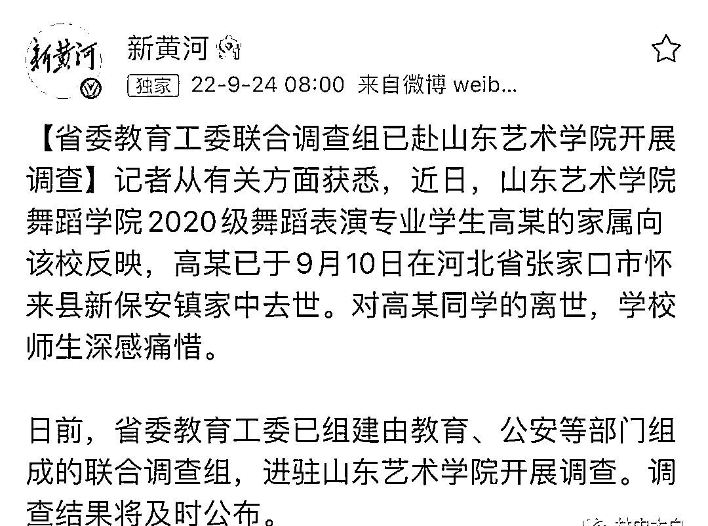

这起悲剧，其实已经在网上发酵好几天了，事件的脉络并不复杂!在网友的帖子上可以看到！

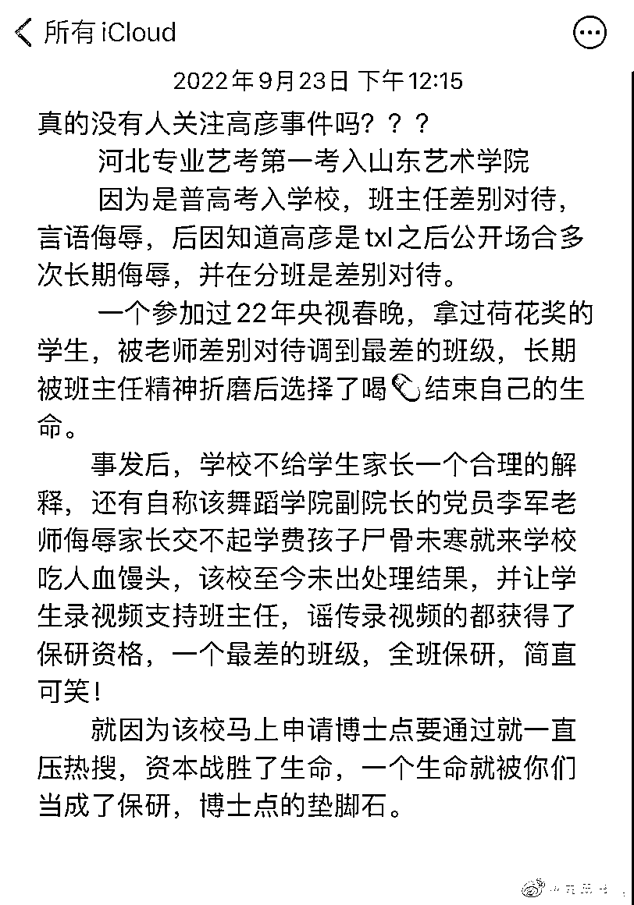

网贴上介绍说，这位高学生是河北省舞蹈考试第一，但只是因为是统招生，便遭到老师歧视，长期被打压谩骂，而后不堪重负选择自杀！

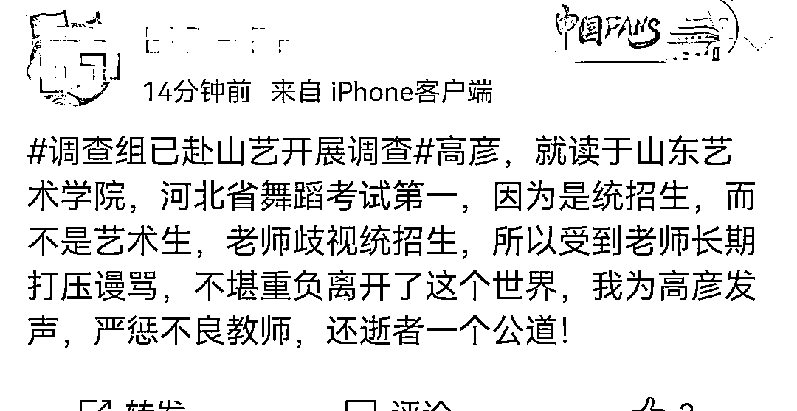

在高同学的好友为其发声的帖子上，着重提到了一位张姓老师，对待这个学生的一些细节！

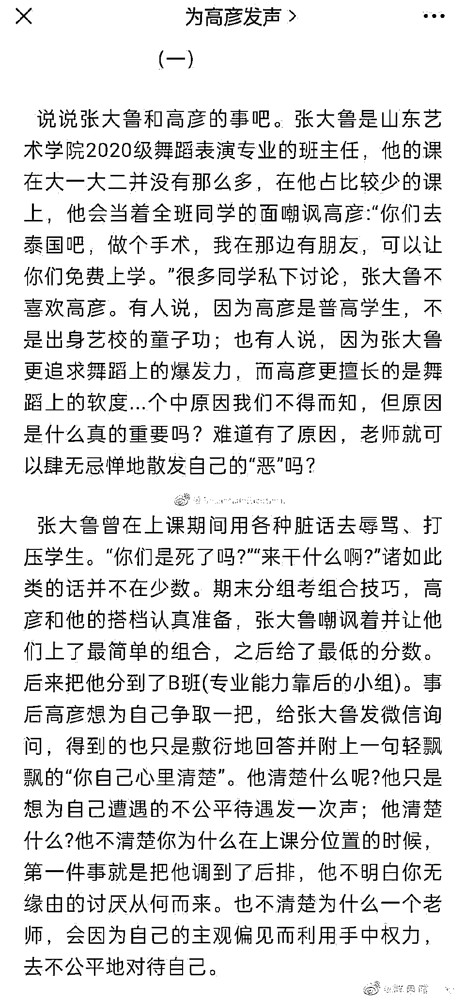

高姓同学的父母，也在网上录视频，要求学校能给出一个合理的说法！

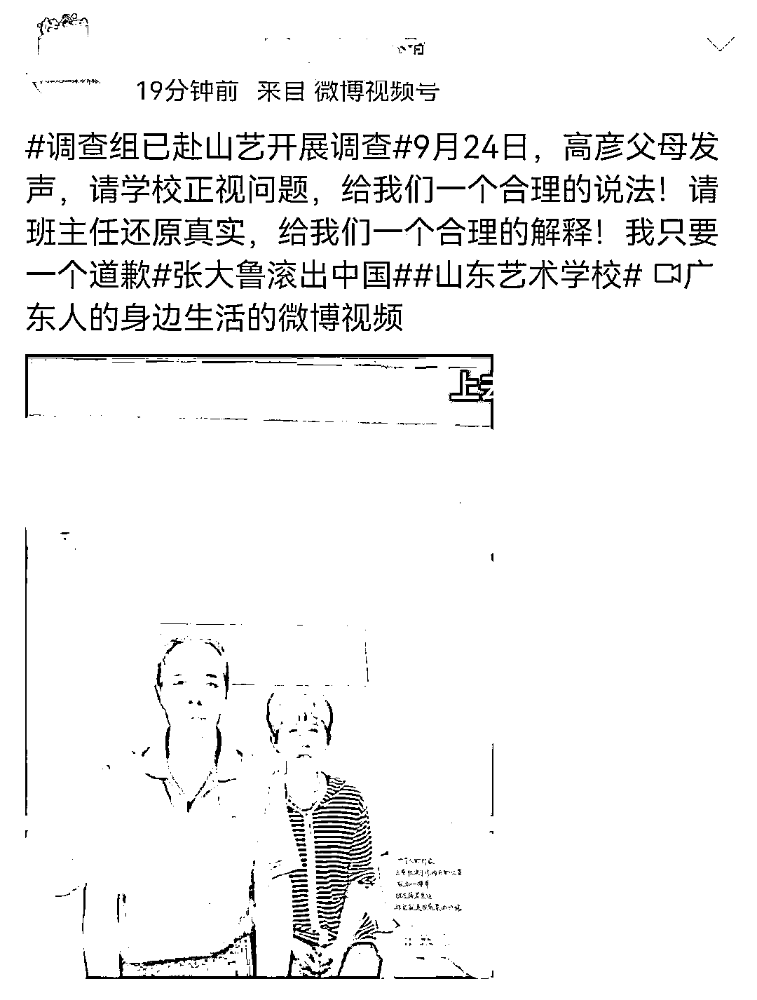

这件事的关注程度有多高！现在的网上呢，基本是每一分钟都能看到为这位学生发声的帖子！

从这起事件，矛头也对准了山艺这所学校，有毕业生罗列了很多这个学校的细节！基本都不是正面的！

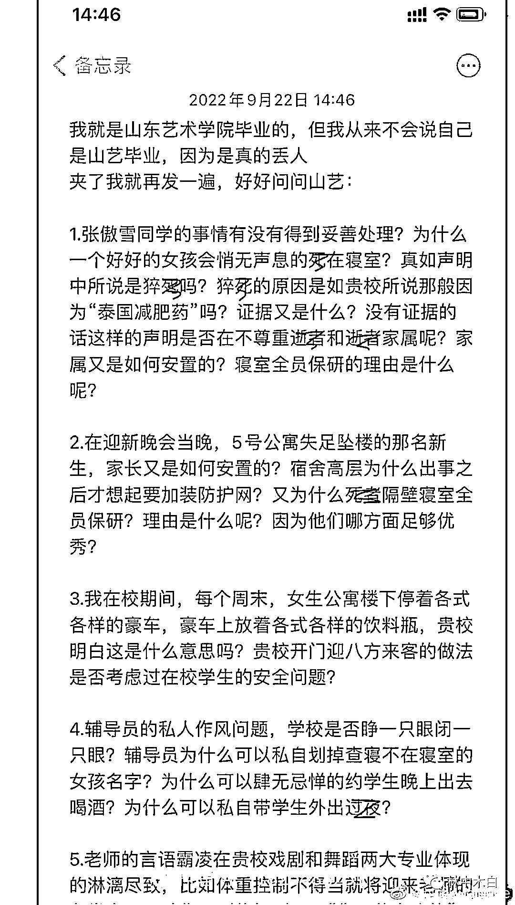

可以看到，在爆料中，这个学校的一些内部行为，的确并不像单纯的象牙塔！ 

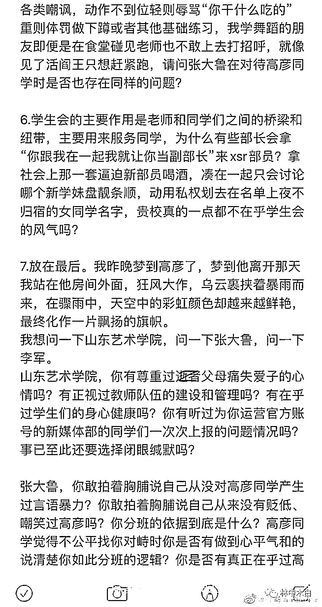

单纯的这个高同学事件的诉求，矛头也从那位老师身上，牵扯除了另一位李姓副院长！ 

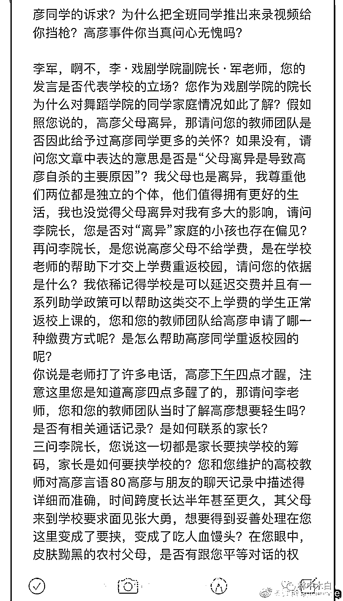

可以看到，他们要的不过是一个真相！

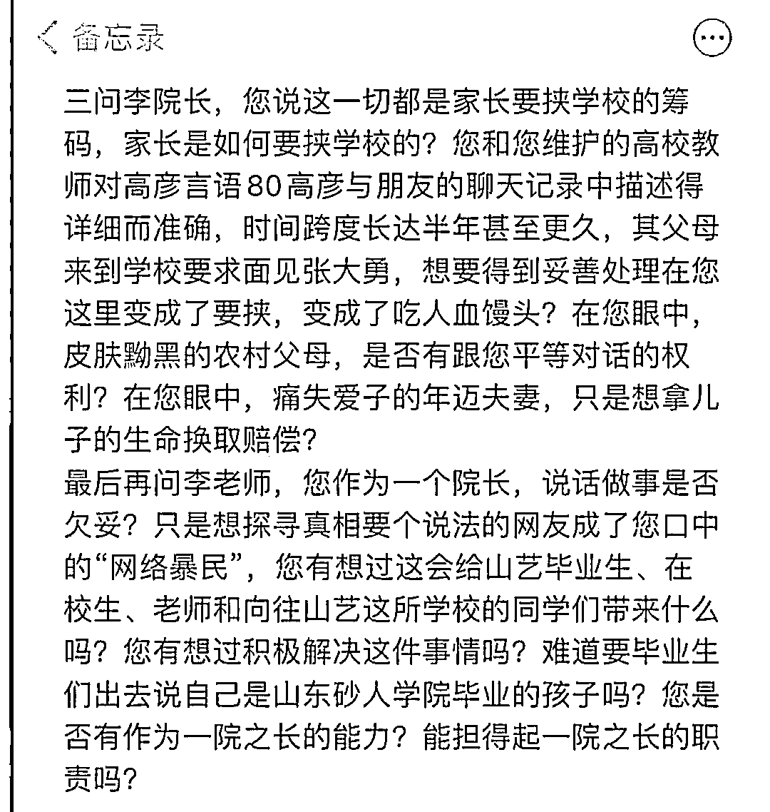

事件脉络的中间也发生了很多事，对于网上一些认为父母讨钱的质疑，其实自始至终人家家长都没有要过一分钱！

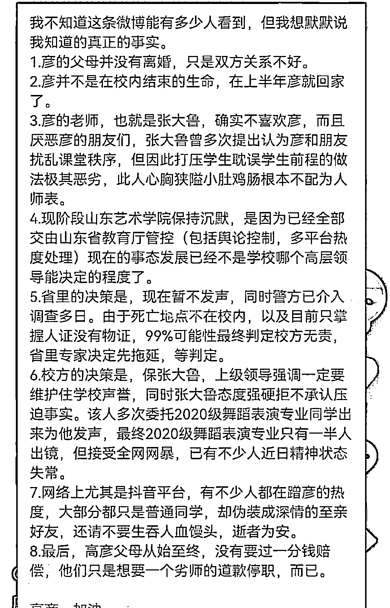

事件的大体过程与发展基本就是这样，在事件的结果没有出来之前，我们不做评论！

而就调查这件事，网上其实看法还是很多的！

多数的希望调查是公平公正的，查明真相，给高同学一个交代！

也有希望调查一下涉事老师后援会，用悲剧学生遗像和父母照片做表情包的事情！

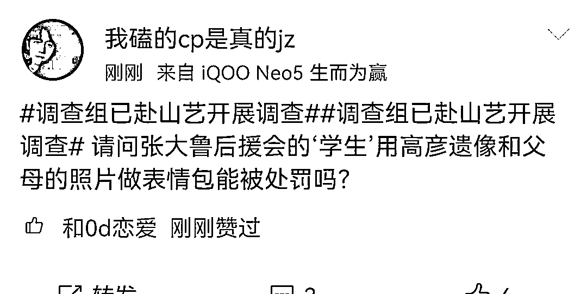

还有的质疑，晚了十四天才开始调查，这种舆论下才督促的调查，最终能将真相查出来吗？

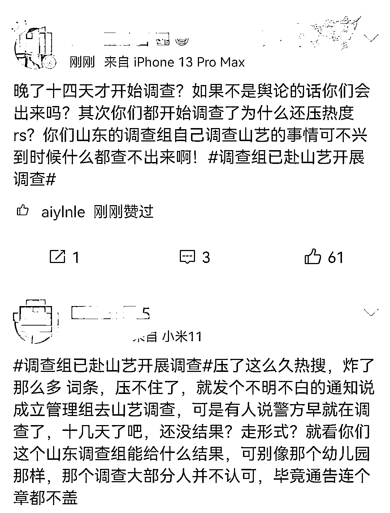

事件基本就是这样，对此我们说点题外话，讲几个不入流的道理：

一是语言暴力就是一种行凶！甚至比身体上的伤害还要严重！

二是尊重每一个人的人格，校园是教书育人的地方，不该出现地域气息较重的那份官本位！

三是近期的校园事件很多，梅先生曾说过，师者，授业，德行第一，但从近期看到的一些现象，比如，建湖那个老师，把家长送钱的记录误发到群里，还没教育局证实了，确有此事!

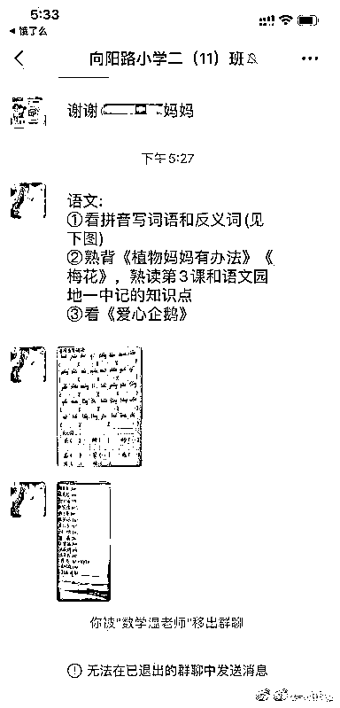

就是校园出现这种没有德行的老师，其实是一大灾害，影响的是好的老师也会被质疑，而贪腐的现象我们近期看到了，公安部门的底层刑警兢兢业业，但上层却已经布满了老虎，这种标签的影响，对一个群体的危害太大了！

四是问题的本质，这种现象是怎么衍生的，值得思考！

来源： 我会永远在你身后 作者：吴秀才

欢迎关注灰产圈社群服务号

